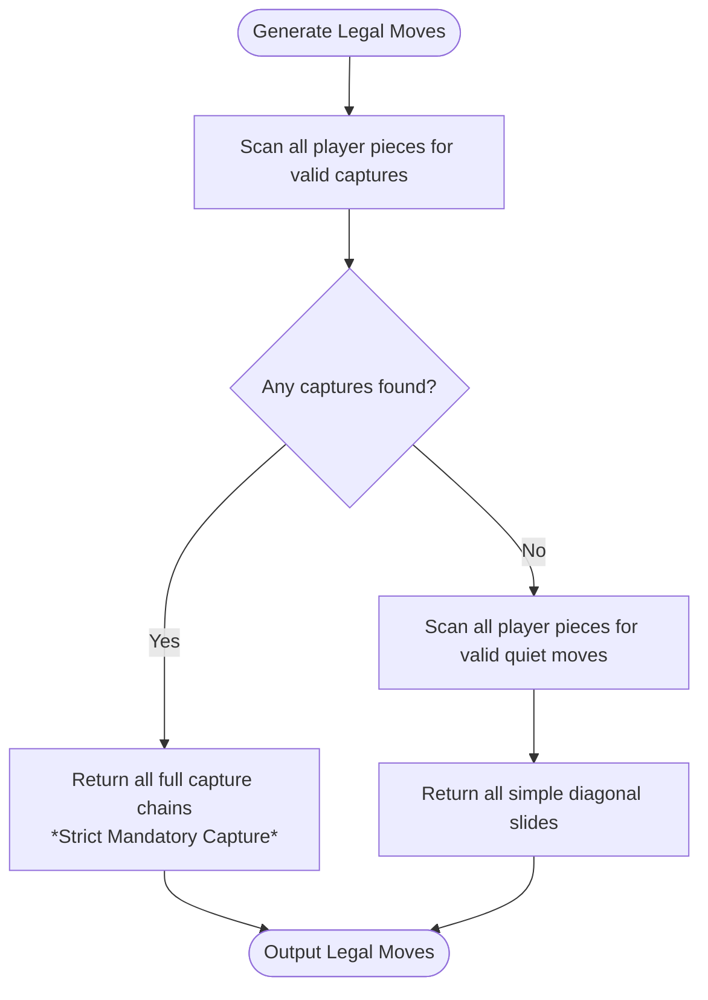

# Checkers Game - Phase 1 Technical Specification
**Module:** `Checkers.Core` & `Checkers.Core.Tests`  
**Target Framework:** .NET 10 (C# 13)  
**Status:** Approved for Implementation  

---

## 1. Executive Summary & Goals

Phase 1 focuses exclusively on building a rock-solid, high-performance, and completely UI-agnostic domain and rules engine for Checkers in `Checkers.Core`, backed by a comprehensive unit test suite in `Checkers.Core.Tests`.

### Key Objectives
1. **Zero UI Dependencies:** The core library references only standard .NET 10 base class libraries.
2. **Determinism & Purity:** Rules engine operations produce deterministic results with immutable or safely copyable state models for AI search.
3. **Exact Rule Implementation:** 8x8 draughts with:
   - English movement & short jump captures for regular men (forward only).
   - International "Flying Kings" (multi-square diagonal slide and jump).
   - Strict mandatory capture (forced jumps) with Free Choice among available capture lines.
   - Promotion immediately ends the turn.
4. **High Test Coverage:** 100% coverage on core rules, multi-jump branching, promotion edge cases, and terminal conditions.

---

## 2. Mathematical Board Model & Coordinates

### 2.1 Coordinate System
The board is an 8x8 grid indexed by row and column `(Row, Col)`:
* `Row`: `0` to `7` (`0` is Black's home rank; `7` is White's home rank).
* `Col`: `0` to `7` (`0` is File A; `7` is File H).
* **Playable (Dark) Squares:** Defined by `(Row + Col) % 2 != 0` (or `(Row + Col) % 2 == 1`).
  * Square `(0, 1)` is Dark (Playable).
  * Square `(0, 0)` is Light (Inactive).
  * White starts on rows `5, 6, 7` (12 pieces on dark squares).
  * Black starts on rows `0, 1, 2` (12 pieces on dark squares).
  * White moves "up" (decreasing row index: towards row `0`).
  * Black moves "down" (increasing row index: towards row `7`).

### 2.2 Standard Draughts 1–32 Numbering Mapping
The engine provides bidirectional mapping between `(Row, Col)` and the official Draughts 1–32 square numbers:

| Row | Playable Columns & Numbers (1 to 32) |
| :--- | :--- |
| **0 (Black Back Row)** | (0,1)→**1**, (0,3)→**2**, (0,5)→**3**, (0,7)→**4** |
| **1** | (1,0)→**5**, (1,2)→**6**, (1,4)→**7**, (1,6)→**8** |
| **2** | (2,1)→**9**, (2,3)→**10**, (2,5)→**11**, (2,7)→**12** |
| **3** | (3,0)→**13**, (3,2)→**14**, (3,4)→**15**, (3,6)→**16** |
| **4** | (4,1)→**17**, (4,3)→**18**, (4,5)→**19**, (4,7)→**20** |
| **5** | (5,0)→**21**, (5,2)→**22**, (5,4)→**23**, (5,6)→**24** |
| **6** | (6,1)→**25**, (6,3)→**26**, (6,5)→**27**, (6,7)→**28** |
| **7 (White Back Row)** | (7,0)→**29**, (7,2)→**30**, (7,4)→**31**, (7,6)→**32** |

---

## 3. Domain Model Architecture

### 3.1 Type Definitions

#### `PieceColor`
```csharp
public enum PieceColor : byte
{
    White = 0,
    Black = 1
}
```

#### `PieceType`
```csharp
public enum PieceType : byte
{
    Man = 0,
    King = 1
}
```

#### `Piece`
```csharp
public readonly record struct Piece(PieceColor Color, PieceType Type)
{
    public bool IsKing => Type == PieceType.King;
    public Piece Crown() => new(Color, PieceType.King);
}
```

#### `Position`
```csharp
public readonly record struct Position(int Row, int Col)
{
    public bool IsValid => Row is >= 0 and < 8 && Col is >= 0 and < 8;
    public bool IsDarkSquare => IsValid && (Row + Col) % 2 != 0;
    
    public int? ToDraughtsIndex() { /* 1..32 mapping */ }
    public static Position FromDraughtsIndex(int index) { /* reverse lookup */ }
}
```

#### `Move`
Represents an atomic, fully resolved player turn action (which may consist of a single step or a multi-jump sequence).
```csharp
public sealed record Move
{
    public required Position From { get; init; }
    public required Position To { get; init; }
    public required IReadOnlyList<Position> Path { get; init; }
    public required IReadOnlyList<Position> CapturedPositions { get; init; }
    public bool IsCapture => CapturedPositions.Count > 0;
    public bool IsPromotion { get; init; }
    
    // Human-readable notation (e.g., "11-15" or "11x18x25")
    public string Notation { get; init; } = string.Empty;
}
```

#### `BoardState`
Immutable snapshot representing the complete game state at a given turn.
```csharp
public sealed class BoardState
{
    // 8x8 board representation using nullable Piece
    private readonly Piece?[,] _grid;
    
    public PieceColor ActivePlayer { get; init; } = PieceColor.White;
    public int HalfMoveClock { get; init; } = 0; // For 40-move draw rule (resets on capture/promotion)
    public int FullMoveNumber { get; init; } = 1;
    public ulong ZobristHash { get; init; }
    
    public Piece? GetPiece(Position pos);
    public BoardState Clone();
    public static BoardState CreateInitial();
}
```

#### `GameStatus` & `GameOverReason`
```csharp
public enum GameStatus
{
    InProgress,
    WhiteWon,
    BlackWon,
    Draw
}

public enum GameOverReason
{
    None,
    OpponentPiecesEliminated,
    OpponentNoLegalMoves,
    ThreefoldRepetition,
    FortyMoveRuleWithoutCaptureOrPromotion,
    MutualAgreement
}
```

---

## 4. Rule Engine Specification (`IRuleEngine`)

### 4.1 Interface Contract
```csharp
public interface IRuleEngine
{
    /// <summary>
    /// Generates all legal moves for the current active player.
    /// Strictly enforces mandatory capture rule.
    /// </summary>
    IReadOnlyList<Move> GetLegalMoves(BoardState state);

    /// <summary>
    /// Validates if a proposed move is legal in the current state.
    /// </summary>
    bool IsLegalMove(BoardState state, Move move);

    /// <summary>
    /// Applies a move to the board state and returns the resulting new state.
    /// </summary>
    BoardState ApplyMove(BoardState state, Move move);

    /// <summary>
    /// Evaluates whether the game is over and the reason.
    /// </summary>
    (GameStatus Status, GameOverReason Reason) EvaluateGameStatus(
        BoardState state, 
        IReadOnlyList<BoardState> stateHistory);
}
```

### 4.2 Move Generation Algorithm



#### 1. Regular Man Movement:
* **Quiet Move:** Moves 1 square diagonally forward to an empty dark square.
  * White: `(Row - 1, Col - 1)` and `(Row - 1, Col + 1)`.
  * Black: `(Row + 1, Col - 1)` and `(Row + 1, Col + 1)`.
* **Short Jump Capture:**
  * Jumps over an adjacent enemy piece diagonally forward.
  * Landing square must be directly behind the enemy piece and unoccupied: `(Row + 2 * dRow, Col + 2 * dCol)`.
* **Multi-Jump Recursive Exploration:**
  * From the landing square, check if additional jumps are possible.
  * While exploring the jump chain, enemy pieces already jumped within the *same* move cannot be jumped again.
* **Promotion Rule:**
  * If a regular man reaches the opponent's back rank (`Row == 0` for White, `Row == 7` for Black), it immediately promotes to a King.
  * **Turn ends immediately upon promotion.** Even if the crowned piece has captures available as a king, its turn is complete.

#### 2. Flying King Movement:
* **Quiet Move (Flying Slide):**
  * Slides along any of the 4 diagonal directions `(-1,-1), (-1,+1), (+1,-1), (+1,+1)` across any number of empty squares.
  * Stops before the edge of the board or when an occupied square is encountered.
* **Flying King Capture:**
  * Moves along a diagonal line over any number of empty squares, jumps over a single enemy piece, and can land on **any** empty square along the same diagonal beyond that enemy piece.
  * Cannot jump over two consecutive pieces or friendly pieces.
* **Flying King Multi-Jump:**
  * From each valid landing square, check for further captures in all 4 diagonal directions.
  * Each distinct branch forms a legal move sequence.

#### 3. Mandatory Captures & Free Choice:
* If at least one capture sequence exists for the active player, **all quiet moves are discarded**.
* The player has **Free Choice** to initiate any valid capture sequence, regardless of how many pieces are captured.
* Once a capture sequence is chosen, it must be executed to completion (all hops in the chain).

---

## 5. Game Session Controller (`GameSession`)

The `GameSession` coordinates gameplay, turn transitions, undo/redo stacks, and state history for draw detection.

### Public API:
```csharp
public class GameSession
{
    public BoardState CurrentState { get; }
    public GameStatus Status { get; }
    public GameOverReason GameOverReason { get; }
    public IReadOnlyList<Move> LegalMoves { get; }
    public IReadOnlyList<Move> MoveHistory { get; }
    
    public event EventHandler<MoveExecutedEventArgs>? MoveExecuted;
    public event EventHandler<GameOverEventArgs>? GameOver;

    public void StartNewGame();
    public bool TryMakeMove(Move move);
    public bool CanUndo { get; }
    public bool CanRedo { get; }
    public bool Undo();
    public bool Redo();
}
```

---

## 6. Comprehensive Verification & Test Suite (`Checkers.Core.Tests`)

Unit tests will be structured with **xUnit** and **FluentAssertions** covering:

### Test Suite Categories

| Category | Test Case Description | Expected Result |
| :--- | :--- | :--- |
| **Initialization** | Verify starting 8x8 board layout | Exactly 12 White & 12 Black pieces on dark rows 0–2 & 5–7. |
| **Regular Moves** | White and Black forward quiet moves | Moves allowed only diagonally forward into empty dark squares; backward moves rejected. |
| **Mandatory Capture** | Board with 1 capture move and 3 quiet moves | `GetLegalMoves()` returns only the 1 capture move. |
| **Free Choice Captures**| Two pieces have captures: piece A captures 1, piece B captures 2 | Both capture lines returned as legal options; quiet moves excluded. |
| **Multi-Jump Chains** | Piece executes a 3-jump zigzag capture | Complete path recorded; all 3 opponent pieces removed; landing position correct. |
| **Promotion on Step** | Regular man reaches back row on quiet move | Piece promoted to King; turn switches to opponent. |
| **Mid-Jump Promotion**| Regular man reaches back row during capture step | Piece crowned; turn finishes immediately without further jumps. |
| **Flying King Slide** | King on (3, 2) with clear diagonals | Can move to any open square across all 4 diagonals (1 to 4 steps away). |
| **Flying King Capture**| King separated from enemy by 2 empty squares | Jumps enemy and can land on any empty square behind it along the diagonal. |
| **Terminal: Win** | All enemy pieces captured | `GameStatus` transitions to `WhiteWon` or `BlackWon`. |
| **Terminal: Blocked**| Player has pieces left, but none have legal moves | Current player loses; opponent is declared winner. |
| **Draw: 40-Move Rule**| 40 full moves executed without capture or promotion | `GameStatus` transitions to `Draw` (`FortyMoveRule`). |
| **Draw: Repetition** | Identical board position repeated 3 times | `GameStatus` transitions to `Draw` (`ThreefoldRepetition`). |
| **Undo / Redo** | Make move, undo move, redo move | Board states, active player, and piece counts restore identically. |

