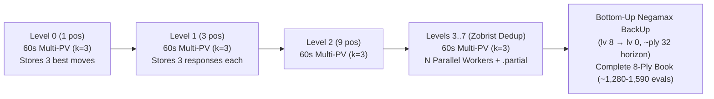

# Opening Book Specification & Implementation Plan

## 1. Goal & Inspiration from `Connect-4`

The goal is to create, verify, embed, and use an **Opening Book** for this Checkers engine (supporting both **English Checkers** and **International/Flying Kings Checkers**), taking architectural inspiration from the Connect-4 engine in:
- [`Connect-4/Connect4.Net/Connect4.Engine/Book/BookBuilder.cs`](file:///c:/Udvikling/Spil/Checkers/Connect-4/Connect4.Net/Connect4.Engine/Book/BookBuilder.cs) — Breadth-first position enumeration with transposition deduplication and bottom-up Negamax score back-up (`BackUp` / `CheckBackUp`).
- [`Connect-4/Connect4.Net/Connect4.Engine/Book/BookFile.cs`](file:///c:/Udvikling/Spil/Checkers/Connect-4/Connect4.Net/Connect4.Engine/Book/BookFile.cs) — Human-readable, git-friendly text format with `#` header comments.
- [`Connect-4/Connect4.Net/Connect4.Engine/Book/OpeningBook.cs`](file:///c:/Udvikling/Spil/Checkers/Connect-4/Connect4.Net/Connect4.Engine/Book/OpeningBook.cs) — Lazy-loaded embedded resource backed by a compact sorted array / dictionary for instant $O(\log N)$ or $O(1)$ lookup during search.
- [`Connect-4/Connect4.Net/Connect4.Tools/BookCommands.cs`](file:///c:/Udvikling/Spil/Checkers/Connect-4/Connect4.Net/Connect4.Tools/BookCommands.cs) & [`ParallelSolver.cs`](file:///c:/Udvikling/Spil/Checkers/Connect-4/Connect4.Net/Connect4.Tools/ParallelSolver.cs) — Multi-threaded CLI generator with live progress/ETA reporting, `Ctrl+C` graceful stop, `.partial` file checkpoint/resume, and a `verify` command.
- [`Connect-4/docs/brain/11-opening-book.md`](file:///c:/Udvikling/Spil/Checkers/Connect-4/docs/brain/11-opening-book.md) — Documentation of book structure, generation cost, and search integration.

---

## 2. Core Requirements & Clarifications

1. **Book Depth (`6–7 plies`) & Width (`2–3 moves per ply`):**
   - Unlike Connect-4 (which has at most 7 moves per ply and an endgame solver that solves a leaf in `0.25s`), a full-width Checkers tree to 6–7 plies contains `~12,000` (ply 6) to `~55,000` (ply 7) unique positions. Evaluating every full-width leaf for `60s` would require `200–900+ CPU-hours`.
   - Instead, at each ply from `0` to `depth - 1`, the book stores and expands the **top `k ∈ {2, 3}` moves** for the side to move (or all forced captures when fewer than `k` legal moves exist).
   - This keeps the book focused on the principal opening repertoire while reducing the number of end nodes (leaves at `ply = depth`) to a tractable count (`~38` to `~950` unique leaves after transposition deduplication).
2. **Transposition Handling (`ZobristHash` DAG):**
   - In Checkers openings, different move orders frequently reach the **exact same board state** (for example, White playing move $A$ on ply 1 and move $B$ on ply 3 vs. move $B$ on ply 1 and move $A$ on ply 3 against the same Black response).
   - Every position is uniquely identified by its 64-bit **`ZobristHash`** (`BitPosition.ComputeZobristHash()` / `BoardState.ZobristHash`), which depends *only* on `(WhiteMen, WhiteKings, BlackMen, BlackKings, SideToMove)` and **not** on the move history.
   - During breadth-first enumeration (`ply = 0 .. depth`), a `HashSet<ulong>` of seen `ZobristHash` keys merges transposed move orders into a single node in a **Directed Acyclic Graph (DAG)** so each unique board position is evaluated **at most once**.
   - At runtime, looking up the current board's `ZobristHash` automatically matches any transposed move order.
3. **Two Candidate Generation Architectures (Comparison):**

   ### Approach A: Top-Down Level-by-Level Iterative Deepening (`Multi-PV = k`, `60s` per Position from `lv 0` Upward)
   - **How it works:**
     1. **Level 0 (`ply = 0`, 1 position):** Run a **60-second Multi-PV ($k = 3$) iterative-deepening search** on the initial board. Because root `alpha` is held at the $k$-th best score (`topScores[k - 1]`) rather than the 1st-best score, a **single 60-second search** (sharing one `TranspositionTable`) finds the **exact top 3 moves and their centipawn scores**. Store those 3 moves for `lv 0`.
     2. **Level 1 (`ply = 1`, up to 3 positions):** Apply the 3 moves from `lv 0`. For each resulting position, run a **60-second Multi-PV ($k = 3$) search** to find and store the 3 best responses.
     3. **Level $p$ (`ply = 2, 3, ...`):** Repeat level by level. Before searching any position at `lv p`, check its 64-bit `ZobristHash`: if that board state was already reached and evaluated via a transposed move order, skip it (`0` extra time!).
     4. **Stopping Level (`lv 5` = 6 plies of moves, `lv 6` = 7 plies of moves, `lv 7` = 8 plies of moves):**
        Because evaluating a position at `lv p` directly produces the moves played on `ply p + 1`, a **7-ply book only requires evaluating `lv 0` through `lv 6`** (you do *not* need to run 60-second searches on the `ply = 7` child leaves unless you want an 8th ply of moves!).

   ### Approach B: Two-Stage "Fast Screen + `60s` Leaf Evaluation + Negamax Back-Up" (`Connect-4` Style)
   - **How it works:**
     1. Uses a fast fixed-depth search (`d = 12–14`, `~0.1s`) at internal levels (`lv 0 .. d-1`) to guess which `2–3` moves to expand.
     2. Evaluates only the leaf nodes at `lv = d` for `60s` each, then backs up scores to `lv 0 .. d-1` via Negamax.

   ### Head-to-Head Comparison: Approach A (Top-Down Level-by-Level) vs. Approach B (Leaf-Only Back-Up)

   | Criterion | **Approach A: Top-Down Level-by-Level (`60s` Multi-PV from `lv 0` upward)** | **Approach B: Fast Screen + `60s` Leaves + Back-Up** |
   | :--- | :--- | :--- |
   | **Move Quality at Early Levels (`lv 0..2`)** | **Superior:** Every level (`lv 0, 1, 2, ...`) spends a full `60s` (`~24–26 plies`) selecting its 3 best moves; no good opening move is ever pruned by a shallow `0.1s` screen. | **Lower at root:** Early moves at `lv 0..5` are chosen by a fast `~0.1s` screening search; if a move only shines at depth 22+, it may be missed before leaf evaluation. |
   | **Total `60s` Evaluations for 7 Plies of Moves** | **`~500 – 610` searches (`lv 0..6`):** Evaluating `lv 6` directly gives the 7th ply of moves, so `ply = 7` leaves do **not** need `60s` searches! (**~37% faster!**) | **`~780 – 980` searches (`ply = 7` leaves):** Must evaluate all unique leaves at `ply = 7` to back up scores to `lv 6`. |
   | **Incremental / Growable Book** | **Yes:** After 1 minute `lv 0` is playable; after each level completes, the book is a valid, usable book of depth `p + 1` and can later be extended from `lv 6` to `lv 7` without redoing `lv 0..6`. | **No:** The book is unusable until 100% of the bottom-level leaves finish and `BackUp` runs; extending from 6 to 7 plies requires re-running from scratch. |
   | **Parallelism at `lv 0` and `lv 1`** | `lv 0` has `1` position (`1 min` on 1 worker); `lv 1` has `3` positions (`1 min` on $\ge 3$ workers); `lv 2..6` have `9 .. 380` positions (full 8–12 worker parallelism). | Full worker parallelism across all `ply = d` leaves, plus a separate screening pass. |
   | **Score Horizon Consistency** | Each level's moves are scored at `ply + ~25`, and an optional bottom-up Negamax pass can also back up the deepest level's scores to `lv 0`. | All scores are backed up from `d + ~25` leaves. |

   ### Confirmed Selection: Approach A (`lv 0` through `lv 7` Evaluated + Bottom-Up Negamax `BackUp`)
   - **Generation Method:** **Top-Down Level-by-Level (`1 min` Multi-PV = 3 from `lv 0` upward)**.
   - **Evaluated Levels:** **`lv 0` through `lv 7` inclusive (`8 plies of moves`, reaching `lv 8` end states)** — covering the first `8` half-moves (`4 full turns` for both Black and White), evaluating `~1,280 – 1,590` unique positions (`~2h 40m – 3h 20m` per variant on 8 workers).
   - **Bottom-Up Negamax Score Propagation (`BackUp`):**
     - As each level `lv p` (`0 .. 7`) finishes, the book is immediately saved with valid, playable moves and backed-up scores up to that level (`lv p`).
     - When `lv 7` completes, its 1-minute Multi-PV ($k=3$) search scores define the scores for the `lv 8` end states (`leafScore = -moveScore`), and `BookBuilder.BackUp` propagates those scores bottom-up (`lv 8 → lv 7 → ... → lv 0`) via Negamax so that `lv 0`'s move scores reflect the full **`lv 7 + 25 ≈ ply 32` horizon** across the chosen book tree and pass `BookBuilder.CheckBackUp` with 100% consistency.



---

## 3. Size & Generation Time Estimates (`60s` per Node)

### 3.1 Unique Positions by Level (With `ZobristHash` Transposition Deduplication)

When expanding $k \in \{2, 3\}$ moves per position, independent White moves on rows `5..7` and Black moves on rows `0..2` commute (`w1 → b1 → w2` $\equiv$ `w2 → b1 → w1`), eliminating **~35%–45%** of duplicate positions for $k = 2$ and **~50%–60%** for $k = 3$:

| Book Level (`Ply`) | Move Produced | $k = 2$ Raw ($2^p$) | **$k = 2$ Unique Positions (Transposition Dedup)** | $k = 3$ Raw ($3^p$) | **$k = 3$ Unique Positions (Transposition Dedup)** |
| :---: | :---: | :---: | :---: | :---: | :---: |
| **`lv 0` (`Ply 0`)** | 1st ply (White move 1) | `1` | **`1`** | `1` | **`1`** |
| **`lv 1` (`Ply 1`)** | 2nd ply (Black move 1) | `2` | **`2`** | `3` | **`3`** |
| **`lv 2` (`Ply 2`)** | 3rd ply (White move 2) | `4` | **`4`** | `9` | **`9`** |
| **`lv 3` (`Ply 3`)** | 4th ply (Black move 2) | `8` | **`~6 – 7`** | `27` | **`~18 – 21`** |
| **`lv 4` (`Ply 4`)** | 5th ply (White move 3) | `16` | **`~10 – 12`** | `81` | **`~42 – 52`** |
| **`lv 5` (`Ply 5`)** | 6th ply (Black move 3) | `32` | **`~19 – 22`** *(Last level for 6-ply book)* | `243` | **`~115 – 145`** *(Last level for 6-ply book)* |
| **`lv 6` (`Ply 6`)** | 7th ply (White move 4) | `64` | **`~38 – 44`** *(Last level for 7-ply book)* | `729` | **`~310 – 380`** *(Last level for 7-ply book)* |
| **`lv 7` (`Ply 7`)** | *(End states after 7 plies / 8th ply if expanded)* | `128` | **`~68 – 82`** | `2,187` | **`~780 – 980`** |

### 3.2 Total Size & Generation Time Comparison Across All Combinations (`60s` per Evaluated Node)

Notice the key difference in **how many nodes require a 60-second evaluation**:
- In **Approach A (Top-Down Level-by-Level)**: to store moves for **$d$ plies** (`lv 0` through `lv d-1`), we evaluate the **internal positions at `lv 0 .. d-1`** (`~190–230` positions for $d=6, k=3$; **`~500–610` positions** for $d=7, k=3$). (If `lv 7` itself is also expanded for an 8th ply of moves, it evaluates `~1,280–1,590` positions.)
- In **Approach B (Leaf-Only)**: to back up scores for $d$ plies, we must evaluate the **leaf positions at `lv = d`** (`~310–380` leaves for $d=6, k=3$; **`~780–980` leaves** for $d=7, k=3$).

| Combination & Method | Nodes Evaluated (`60s` each) | Total Book File Size (`txt` / RAM) | **1 Worker Thread** | **4 Parallel Workers** | **8 Parallel Workers** | **12 Parallel Workers** |
| :--- | :---: | :---: | :---: | :---: | :---: | :---: |
| **`6 plies, 2 moves/ply` — Approach A (`lv 0..5`)** | **`~42 – 48`** | `~4 KB` / `~3 KB` | `42 – 48 min` | `~12 min` | **`~7 min`** | `~6 min` |
| **`6 plies, 2 moves/ply` — Approach B (`lv 6` leaves)** | `~38 – 44` | `~4 KB` / `~3 KB` | `38 – 44 min` | `~10 – 11 min` | `~5 – 6 min` | `~3.5 – 4 min` |
| **`7 plies, 2 moves/ply` — Approach A (`lv 0..6`)** | **`~80 – 92`** | `~8 KB` / `~5 KB` | `1h 20m – 1h 32m` | `~22 min` | **`~12 min`** | `~9 min` |
| **`7 plies, 2 moves/ply` — Approach B (`lv 7` leaves)** | `~68 – 82` | `~8 KB` / `~5 KB` | `1h 08m – 1h 22m` | `~17 – 21 min` | `~8.5 – 10.5 min` | `~6 – 7 min` |
| **`6 plies, 3 moves/ply` — Approach A (`lv 0..5`)** | **`~190 – 230`** | `~28 KB` / `~18 KB` | **`3h 10m – 3h 50m`** | **`~49 – 59 min`** | **`~26 – 31 min`** | **`~18 – 22 min`** |
| **`6 plies, 3 moves/ply` — Approach B (`lv 6` leaves)** | `~310 – 380` | `~28 KB` / `~18 KB` | `5h 10m – 6h 20m` | `~1h 18m – 1h 35m` | `~39 – 48 min` | `~26 – 32 min` |
| **`7 plies, 3 moves/ply` — Approach A (`lv 0..6`)** | **`~500 – 610`** | `~75 KB` / `~48 KB` | **`8h 20m – 10h 10m`** | **`~2h 06m – 2h 34m`** | **`~1h 05m – 1h 18m`** | **`~44 – 53 min`** |
| **`7 plies, 3 moves/ply` — Approach B (`lv 7` leaves)** | `~780 – 980` | `~75 KB` / `~48 KB` | `13h 00m – 16h 20m` | `~3h 15m – 4h 05m` | `~1h 38m – 2h 03m` | `~1h 05m – 1h 22m` |
| *(`8 plies` / `lv 0..7, 3 moves/ply` — Approach A)* | *`~1,280 – 1,590`* | *`~160 KB` / `~105 KB`* | *`21h 20m – 26h 30m`* | *`~5h 20m – 6h 38m`* | *`~2h 42m – 3h 21m`* | *`~1h 50m – 2h 15m`* |

> [!IMPORTANT]
> **Why Approach A (Top-Down Level-by-Level Multi-PV) Is Faster and Stronger for $k = 3$:**
> 1. For $k = 3$, each level triples in size ($\text{sum of levels } 0 \dots d-1 \approx \frac{1}{2} \text{ of level } d$). Because evaluating `lv 6` directly gives the 3 best moves for the 7th ply, Approach A only evaluates `~500–610` positions (`lv 0..6`) instead of `~780–980` leaf positions (`lv 7`), **saving ~37% of total compute time** (`~1h 10m` vs. `~1h 50m` on 8 workers)!
> 2. Every move in `lv 0..6` is chosen by a full **60-second Multi-PV search** (`~24–26 plies`), never by a shallow screening search.
> 3. Every completed level is immediately flushed to disk (`OpeningBook.<Variant>.txt`), so the book is usable after `lv 0` (1 minute) and grows deeper level by level.

### 3.3 Optimal Worker Count for Your Hardware (`AMD Ryzen 7 7800X3D`, `8 Cores / 16 Threads`, `32 GB RAM`)

Your machine has an **AMD Ryzen 7 7800X3D** (`8 physical Zen 4 cores / 16 logical SMT threads` with **`96 MB` 3D V-Cache L3** and **`32 GB` DDR5 RAM**). Because each book node search is **time-boxed (`60s` wall-clock)** rather than fixed-node-count, the worker count directly determines **how many nodes each worker can search inside its 60-second window**:

| Worker Count (`--workers`) | Core Mapping on `Ryzen 7 7800X3D` | Per-Worker Speed (`Nodes / 60s`) | L3 3D V-Cache (`96 MB`) & TT (`32 MiB/worker`) | Time for `lv 0..7` (`~1,400` pos) | Recommendation |
| :---: | :--- | :--- | :--- | :---: | :--- |
| **`7 Workers`** | `7` physical cores (`1` core free for OS/IDE) | **100% (`0` ply loss)** | `224 MiB` total TT; hot buckets fit in `96 MB` V-Cache | `~3h 10m – 3h 45m` | Best if actively using PC for heavy tasks during generation |
| **`8 Workers` (Recommended)** | **`8` physical cores (`1` thread per physical core, no SMT sharing)** | **~98–100% (`0` ply loss)** | **`256 MiB` total TT (`< 1%` of `32 GB` RAM); max `96 MB` 3D V-Cache hit rate** | **`~2h 42m – 3h 21m`** | **Optimal default: maximum search depth per 60s node + PC stays responsive via 8 idle SMT threads** |
| **`12 Workers`** | `8` physical cores + `4` SMT threads | `~75–80%` (`~0.5 ply` shallower per `60s` search) | `384 MiB` total TT; higher L3 cache eviction rate | `~1h 50m – 2h 15m` | ~50 min faster wall-clock, but each `60s` search evaluates ~20–25% fewer nodes |
| **`16 Workers`** | All `16` logical SMT threads saturated | `~60–65%` (`~1.0 ply` shallower per `60s` search) | `512 MiB` total TT; L3 V-Cache thrashing between SMT pairs | `~1h 25m – 1h 45m` | Not recommended for time-based (`60s`) searches (SMT contention reduces nodes/60s) |

- **Default in CLI (`--workers 8`):** We will default `--workers` to `8` (`Environment.ProcessorCount / 2` = physical core count on `7800X3D`) with a `32 MiB` `TranspositionTable` per worker (`256 MiB` total out of `32 GB` RAM), giving every 60-second search the full single-core speed and 3D V-Cache benefit of a dedicated Zen 4 core.

---

## 4. Proposed File Format & Runtime Integration

### 4.1 Text File Format (`OpeningBook.English.txt` / `OpeningBook.International.txt`)
Following [`Connect4.Engine/Book/BookFile.cs`](file:///c:/Udvikling/Spil/Checkers/Connect-4/Connect4.Net/Connect4.Engine/Book/BookFile.cs), the book file is a human-readable UTF-8 text file embedded in `Checkers.Core.dll`:
```text
# Checkers Opening Book (English) — depth 6, width 3, 542 positions
# Format: <ZobristHex> <Ply> <Score> [Move1:Score1 Move2:Score2 Move3:Score3]
# Generated 2026-10-04 by Checkers.Benchmark book-gen (60s/leaf, 8 workers)
9A4F82C10B3E7712 0 +4 11-15:+4 9-14:+2 10-15:+1
3C81E042A915B604 1 -4 22-18:-4 23-18:-5 24-19:-6
...
```
- **Why store `ZobristHex` + `Ply` + `Score` + `Move:Score` list?**
  1. Direct $O(\log N)$ or $O(1)$ lookup by `state.ZobristHash` without needing to replay move strings from the initial board.
  2. Storing all `2–3` moves and their backed-up scores on each internal node (`ply < depth`) allows the engine to:
     - Display `"Book (+4, 11-15 / 9-14 / 10-15)"` in `SearchAnalysis`.
     - Select either the single highest-scoring book move (`Best`) or choose randomly among the stored `2–3` moves within a configurable centipawn margin (e.g. `<= 10 cp` of best) so the AI plays varied openings instead of repeating a single game line.
  3. Leaf nodes (`ply == depth`) store `<ZobristHex> <Ply> <Score>` so `BookBuilder.CheckBackUp` can verify that every parent node's score and move scores match `-child.Score`.

### 4.2 Integration into `MinimaxPlayer`, `SearchLimits`, and UI
1. **[`src/Checkers.Core/AI/SearchLimits.cs`](file:///c:/Udvikling/Spil/Checkers/src/Checkers.Core/AI/SearchLimits.cs)**:
   - Add `bool UseOpeningBook { get; init; } = true;` (and `int BookRandomMarginCp { get; init; } = 10;`).
2. **[`src/Checkers.Core/AI/SearchAnalysis.cs`](file:///c:/Udvikling/Spil/Checkers/src/Checkers.Core/AI/SearchAnalysis.cs)**:
   - Add `bool FromBook { get; init; } = false;` and format `Depth = "Book"` when a move is played from the opening book.
3. **[`src/Checkers.Core/AI/MinimaxPlayer.cs`](file:///c:/Udvikling/Spil/Checkers/src/Checkers.Core/AI/MinimaxPlayer.cs)**:
   - At the start of `GetMoveAsync`, if `_limits.UseOpeningBook` is true and `OpeningBook.GetDefault(_variant).TryGetMove(state, legalMoves, Random.Shared, _limits.BookRandomMarginCp, out Move bookMove, out int bookScore)` succeeds, immediately return `bookMove` with `NodesEvaluated = 0` and `LastAnalysis = new SearchAnalysis("Book", FormatScore(bookScore), bookMove.Notation, FromBook: true)`.
4. **CLI Tool (`tools/Checkers.Benchmark` or `tools/Checkers.Tools`)**:
   - `book generate [--variant English|International|All] [--depth 6] [--width 3] [--leaf-time-s 60] [--select-depth 14] [--workers 8] [--out ...]`
   - `book verify [--book ...]` (verifies Negamax back-up consistency across all levels).