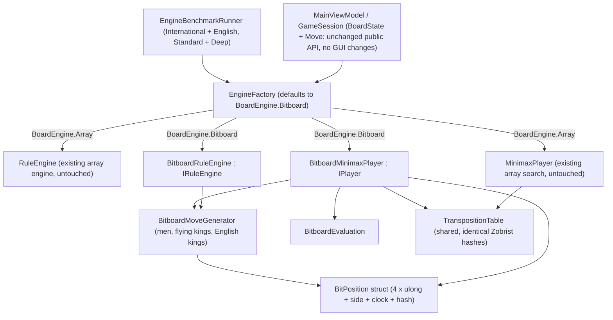

# Bitboard Engine for Checkers (International + English)

Implements the specification in [Implement bitboards.md](file:///c:/Udvikling/Spil/Checkers/Implement%20bitboards.md), incorporating all design decisions:

| Decision | Choice |
| :--- | :--- |
| **Refactor depth** | Bitboard position + move generation + evaluation + incremental Zobrist **plus** compact move struct (`BitMove`) and allocation-free search (`BitboardMinimaxPlayer`) |
| **Layout** | **64-bit 8×8** like Stermere's engine: 4 × `ulong` (`WhiteMen`, `BlackMen`, `WhiteKings`, `BlackKings`) |
| **Comparison** | **Both engines (`Array` and `Bitboard`) live in production code**, selectable in code and the benchmark |
| **GUI / Default Engine** | **Bitboard is the default engine for the GUI** (`GameSession` / `MainViewModel`). **No GUI or PDN changes.** |
| **Benchmark Variants** | **Both `International` (Flying Kings) and `English` (1-Step Kings)** tested on the shared 40-position suite |
| **Benchmark Suite** | All 40 positions in `BenchmarkSuite` verified to have $\ge 2$ legal moves and non-trivial branching under **both** `International` and `English` rules |
| **Benchmark Depth & Columns** | **Both Standard (7–9 plies) and Deep (~5s/pos baseline)** runs, comparing **No-TT baseline** and **Default TT ($1,048,576$ entries)** for each engine and variant |

---

## Guiding Principle: Same Results, Only Faster

The bitboard engine must play **exactly the same game** as the array engine under both `International` and `English` rules. For the same position, variant, and depth it must produce:
- identical legal-move lists (in the exact same order),
- identical static evaluations,
- identical `NodesEvaluated` and `LeafEvaluations`,
- the exact same best move and search score.

That gives us an ironclad correctness check: the 40-position benchmark verifies all 40 positions node-for-node across both variants and both TT modes, and any divergence is flagged immediately.

> [!NOTE]
> [Zobrist.cs](file:///c:/Udvikling/Spil/Checkers/src/Checkers.Core/Engine/Zobrist.cs) already indexes squares as `row * 8 + col`, which matches the 64-bit bitboard square index (`0..63`). Both engines therefore produce **identical 64-bit Zobrist hashes** and share the exact same `TranspositionTable`.

> [!NOTE]
> **Out of scope:** Stermere's NNUE, LMR, futility pruning, killer/history heuristics, endgame DB, and opening book are **not** copied over, as they would alter node counts and break the node-for-node equivalence guarantee. We adopt its 64-bit bitboard representation (`4 x ulong`) and bitwise shift/mask move generation techniques.

---

## Architecture



- `BoardState`, `Move`, `GameSession`, the WPF/Blazor UI, `GameSettings`, and PDN files keep their exact existing API and UI layout.
- The existing array `RuleEngine` and `MinimaxPlayer` remain **untouched**, guaranteeing a fair baseline comparison.
- The bitboard engine converts `BoardState` $\rightarrow$ `BitPosition` once at the search root, searches purely with value-type `BitPosition` and `BitMove` structs on preallocated per-ply buffers, and maps the winning root move back to the corresponding `Move` object.

---

## Proposed Changes

### 1. Bitboard Core (`src/Checkers.Core/Bitboards/`)

#### [NEW] `BitboardMasks.cs`
Bit index `sq = row * 8 + col` (`row = 0` is Black's home rank; White moves toward `row = 0`).

```csharp
public static class BitboardMasks
{
    public const ulong DarkSquares = 0xAA55AA55AA55AA55UL; // (row + col) odd
    public const ulong NotColA  = 0xFEFEFEFEFEFEFEFEUL;    // col >= 1 (one step left allowed)
    public const ulong NotColH  = 0x7F7F7F7F7F7F7F7FUL;    // col <= 6 (one step right allowed)
    public const ulong NotColAB = 0xFCFCFCFCFCFCFCFCUL;    // col >= 2 (jump left allowed)
    public const ulong NotColGH = 0x3F3F3F3F3F3F3F3FUL;    // col <= 5 (jump right allowed)
    public const ulong Row0 = 0x00000000000000FFUL;        // White crown row (row 0)
    public const ulong Row7 = 0xFF00000000000000UL;        // Black crown row (row 7)
    public static readonly ulong[] Rows;                    // Rows[0..7]
    public static readonly ulong CenterMask;                // rows 3-4, cols 2-5 (squares #14, #15, #18, #19)
    public static readonly ulong KingCenterMask;            // rows 2-5, cols 2-5 (English king centralization)
    public static readonly ulong[,] Rays;                   // Rays[dir, sq]: all dark squares along diagonal dir from sq
}
```

Direction table (matching `RuleEngine.AllDiagonals` order so generated move lists have identical ordering):

| Dir | `(dRow, dCol)` | Bit Delta | Bitwise Shift from Square `sq` |
| :-: | :-: | :-: | :--- |
| `0` | `(-1, -1)` up-left | `-9` | `(b & NotColA) >> 9` |
| `1` | `(-1, +1)` up-right | `-7` | `(b & NotColH) >> 7` |
| `2` | `(+1, -1)` down-left | `+7` | `(b & NotColA) << 7` |
| `3` | `(+1, +1)` down-right | `+9` | `(b & NotColH) << 9` |

#### [NEW] `BitPosition.cs`
A compact value type copied by value on every move (copy-make: zero heap allocations, no undo logic required).

```csharp
public struct BitPosition
{
    public ulong WhiteMen;
    public ulong BlackMen;
    public ulong WhiteKings;
    public ulong BlackKings;
    public ulong Hash;               // identical to BoardState.ZobristHash
    public int HalfMoveClock;
    public PieceColor SideToMove;

    public readonly ulong White => WhiteMen | WhiteKings;
    public readonly ulong Black => BlackMen | BlackKings;
    public readonly ulong Occupied => White | Black;
    public readonly ulong Empty => BitboardMasks.DarkSquares & ~Occupied;

    public static BitPosition FromBoardState(BoardState state);
    public readonly BoardState ToBoardState(int fullMoveNumber);
    public readonly BitPosition Apply(in BitMove move); // incremental Zobrist, clock, promotion
}
```

`Apply` updates `Hash` incrementally by XORing only the origin square, the destination square (as a King if promoted), each captured square in `move.Captured` via `BitOperations.TrailingZeroCount`, and `Zobrist.BlackToMoveKey`—replacing the 64-square loop in `BoardState.RecalculateHash()`.

#### [NEW] `BitMove.cs`
```csharp
public readonly struct BitMove
{
    public readonly ulong Captured;   // bitmask of captured squares (0 for quiet moves)
    public readonly byte From;        // 0..63
    public readonly byte To;          // 0..63
    public readonly bool IsPromotion;

    public bool IsCapture => Captured != 0;
    public int CaptureCount => BitOperations.PopCount(Captured);
}
```
During tree search, `BitMove` avoids allocating `List<Position>` or formatting notation strings. Full `Move` records (with `Path` and `Notation`) are only constructed when `IRuleEngine.GetLegalMoves(BoardState)` is called (root/UI/tests).

#### [NEW] `BitboardMoveGenerator.cs`
Supports both `CheckersVariant.International` and `CheckersVariant.English`:
- **Fast capture detection (`HasAnyCapture`):** Uses bitwise shifts and masks (inspired by Stermere's `has_any_jump`) to check in $O(1)$ bitwise operations whether any man or king has a legal jump before iterating individual pieces.
- **Men & English Kings (1-step moves and jumps):**
  - Quiet moves: 1-step shifts (`>> 9`, `>> 7` for White men; `<< 7`, `<< 9` for Black men; all 4 directions for English Kings) masked with `Empty`.
  - Captures: 2-step jumps (`>> 18`, `>> 14`, `<< 14`, `<< 18`) using `NotColAB` and `NotColGH` column masks, recursing for multi-jump sequences. Men reaching `Row0` (White) or `Row7` (Black) promote and terminate the jump sequence immediately.
- **International Flying Kings (ray scanning with hardware intrinsics):**
  - Quiet moves: along each of the 4 diagonal rays `Rays[dir, sq]`, finds the first blocking piece on `ray & Occupied` using `BitOperations.TrailingZeroCount` (for positive directions `+7`, `+9`) or `63 - BitOperations.LeadingZeroCount` (for negative directions `-9`, `-7`). Every empty square before the first blocker is emitted in step order.
  - Captures: finds the first blocker along the ray. If it is an uncaptured enemy piece (`(enemy & ~capturedSoFar) != 0`), finds the next blocker beyond it (`occupiedExceptInitialFrom`) to isolate all consecutive empty landing squares. Evaluates recursive continuation from each landing square and enforces the mandatory continuation rule per ray, matching `RuleEngine.FindFlyingKingCaptures` Move-for-Move.
- **Two output entry points:**
  - `int Generate(in BitPosition pos, CheckersVariant variant, Span<BitMove> buffer)` — zero-allocation move generation for `BitboardMinimaxPlayer`.
  - `IReadOnlyList<Move> GenerateMoves(in BitPosition pos, CheckersVariant variant)` — builds full `Move` objects (with `Path` and `Notation`) in identical order to `RuleEngine.GetLegalMoves`.

#### [NEW] `BitboardEvaluation.cs`
Implements `IEvaluationFunction` (and a direct `Evaluate(in BitPosition pos)` overload for the bitboard search) using `BitOperations.PopCount` and bitmasks:
- Material: `PopCount(WhiteMen) * ManValue + PopCount(WhiteKings) * kingVal` (and Black equivalent).
- Center Control: `PopCount(White & CenterMask) * CenterControlBonus`.
- English King Centralization: `PopCount(WhiteKings & KingCenterMask) * KingCentralizationBonus`.
- Back Rank Defense: `PopCount(WhiteMen & Row7) * BackRankDefenseBonus` and `PopCount(BlackMen & Row0) * BackRankDefenseBonus`.
- Advancement: row-masked `PopCount(WhiteMen & Rows[r]) * (7 - r) * advanceStep` and `PopCount(BlackMen & Rows[r]) * r * advanceStep`.
Produces the exact same integer score as `EvaluationFunction.Evaluate(BoardState)` for every board state.

---

### 2. Engines & Factory (`src/Checkers.Core/Engine/` & `src/Checkers.Core/AI/`)

#### [NEW] `BoardEngine.cs` (`src/Checkers.Core/Models/BoardEngine.cs`)
```csharp
namespace Checkers.Core.Models;

public enum BoardEngine
{
    Bitboard,
    Array
}
```

#### [NEW] `BitboardRuleEngine.cs` (`src/Checkers.Core/Engine/BitboardRuleEngine.cs`)
Implements `IRuleEngine` (`Variant`, `GetLegalMoves`, `IsLegalMove`, `ApplyMove`, `EvaluateGameStatus`) backed by `BitPosition` and `BitboardMoveGenerator`.

#### [NEW] `BitboardMinimaxPlayer.cs` (`src/Checkers.Core/AI/BitboardMinimaxPlayer.cs`)
Implements `IPlayer` with the exact same search algorithm, parameters, and live telemetry as `MinimaxPlayer`:
- Iterative deepening, root PV ordering, TT probe/store (`TranspositionTable`), quiescence search (ply cap 24), soft/hard time limits, 1024-node interrupt checks, and `IProgress<SearchAnalysis>` reporting.
- Uses `BitPosition` value-type copy-make and preallocated per-ply `BitMove[]` scratch buffers (eliminating per-node `BoardState.Clone()`, `List<Move>` allocations, LINQ sorting, and string formatting).
- Generates legal moves **once per node** (instead of twice in `EvaluateGameStatus` + `NegaMax`).
- Uses a stable in-place sort by `CaptureCount` descending then `IsPromotion` descending, plus TT best-move fronting, matching `MinimaxPlayer.OrderMoves` order identically.

#### [NEW] `EngineFactory.cs` (`src/Checkers.Core/Engine/EngineFactory.cs`)
```csharp
public static class EngineFactory
{
    public static IRuleEngine CreateRuleEngine(
        CheckersVariant variant = CheckersVariant.International,
        BoardEngine engine = BoardEngine.Bitboard);

    public static IPlayer CreatePlayer(
        SearchLimits limits,
        CheckersVariant variant = CheckersVariant.International,
        BoardEngine engine = BoardEngine.Bitboard,
        TranspositionTable? transpositionTable = null,
        bool useTranspositionTable = true,
        bool useQuiescence = true);
}
```

#### [MODIFY] `Zobrist.cs`
Expose `GetPieceKey(int squareIndex, int pieceIndex)` (`squareIndex = row * 8 + col`) and `BlackToMoveKey` so `BitPosition.Apply` can XOR piece keys directly by bit index `0..63`.

#### [MODIFY] `GameSession.cs` & `MainViewModel.cs`
- Default `GameSession` and `MainViewModel` to use `EngineFactory.CreateRuleEngine(variant, BoardEngine.Bitboard)` and `EngineFactory.CreatePlayer(..., BoardEngine.Bitboard)`.
- **No changes** to `SettingsWindow.xaml`, `DialogHost.razor`, `GameSettings`, `SettingsViewModel`, or `GameRecordFormat` PDN tags.

---

### 3. Benchmark Suite & Engine Benchmark Runner (`src/Checkers.Core/AI/Benchmark/` & `tools/Checkers.Benchmark`)

#### [MODIFY] `BenchmarkSuite.cs`
Ensure `FindPositionMatching` validates that each candidate position has $\ge 2$ legal moves and non-trivial 5-ply branching under **both** `CheckersVariant.International` and `CheckersVariant.English`. That guarantees all 40 positions are non-forced and meaningful when benchmarked in both variants.

#### [NEW] `EngineBenchmarkResult.cs` & `EngineBenchmarkRunner.cs`
Runs the 40-position benchmark for **both `CheckersVariant.International` and `CheckersVariant.English`**, supporting both **Standard** (7–9 plies) and **Deep** (`--deep`, ~5s/pos baseline) calibration:
1. For each position $P_i$ ($1 \dots 40$) and variant (`International`, `English`), calibrates search depth using Array No-TT.
2. Runs four configurations at that calibrated depth:
   - **Array (No-TT)**
   - **Bitboard (No-TT)**
   - **Array + Default TT ($1,048,576$ entries)**
   - **Bitboard + Default TT ($1,048,576$ entries)**
3. Verifies `NodesEvaluated`, `BestMove`, and `Score` match 100% between Array and Bitboard in both No-TT and Default TT modes.
4. Outputs Markdown comparison tables (No-TT table and Default TT table for International and for English) and saves JSON results (`docs/brain/bitboard_benchmark_results.json` and `docs/brain/bitboard_deep_benchmark_results.json`).

#### [MODIFY] `tools/Checkers.Benchmark/Program.cs`
Add `--engines` CLI flag (combinable with `--deep`) to run the Array vs. Bitboard benchmark across both variants.

---

### 4. Automated Unit & Equivalence Tests (`tests/Checkers.Core.Tests/`)

| Test File | What It Verifies |
| :--- | :--- |
| `BitboardMaskTests.cs` (new) | Bit index mapping `row * 8 + col`, dark square mask, column masks, `BitPosition` $\leftrightarrow$ `BoardState` round-trip, incremental Zobrist hash equality |
| `EngineEquivalenceTests.cs` (new) | 50 seeded random self-play games in **International** and 50 in **English**: at every ply asserts `RuleEngine` and `BitboardRuleEngine` produce identical legal moves (same order, `From`, `To`, `Path`, `CapturedPositions`, `IsPromotion`, `Notation`), identical `ApplyMove` states/hashes, identical `EvaluateGameStatus`, and identical static evaluations |
| `PerftTests.cs` (new) | Perft move-tree leaf counts from initial board and tactical midgame positions for depths 1–6 in both **International** and **English** variants, asserting Array == Bitboard |
| `SearchEquivalenceTests.cs` (new) | Runs `MinimaxPlayer` (Array) and `BitboardMinimaxPlayer` (Bitboard) on sample positions in both variants (with and without TT) and asserts identical `NodesEvaluated`, `LeafEvaluations`, best move, and score |
| Existing Rule Test Suites | Run existing rule test suites (`FlyingKingTests`, `EnglishCheckersTests`, `MandatoryCaptureTests`, `MultiJumpTests`, `PromotionTests`, `RegularMoveTests`, `TerminalConditionTests`) against both `RuleEngine` and `BitboardRuleEngine` |

---

### 5. Documentation Updates

- **[NEW]** `docs/brain/15-bitboards.md`: Comprehensive chapter covering the 64-bit `4 x ulong` bitboard layout, bitwise shift/mask tables, $O(1)$ capture detection, hardware-intrinsic flying-king ray scanning (`TrailingZeroCount` / `LeadingZeroCount`), copy-make `BitPosition`, compact `BitMove`, incremental Zobrist hashing, and the full empirical benchmark tables (Standard & Deep, International & English, No-TT & Default TT).
- **[MODIFY]** `docs/brain/README.md`, `01-overview.md`, `02-board-and-coordinates.md`, `07-search.md`, `08-transposition-table.md` (if 40-position seeds shift slightly for dual-variant compatibility), and `Create a checkers game.md`.

---

## Verification Plan

1. **Build & Unit Tests:**
   ```powershell
   dotnet build Checkers.slnx -c Release
   dotnet test Checkers.slnx -c Release --no-build
   ```
   Verify 0 compiler warnings and 100% pass rate across all unit, perft, and equivalence tests.
2. **Standard & Deep Engine Benchmarks (International + English):**
   ```powershell
   dotnet run --project tools/Checkers.Benchmark -c Release -- --engines
   dotnet run --project tools/Checkers.Benchmark -c Release -- --engines --deep
   ```
   Verify 100% node-count, best-move, and score equivalence between Array and Bitboard across all 40 positions in both variants, and record all empirical tables in `docs/brain/15-bitboards.md` and `Create a checkers game.md`.
