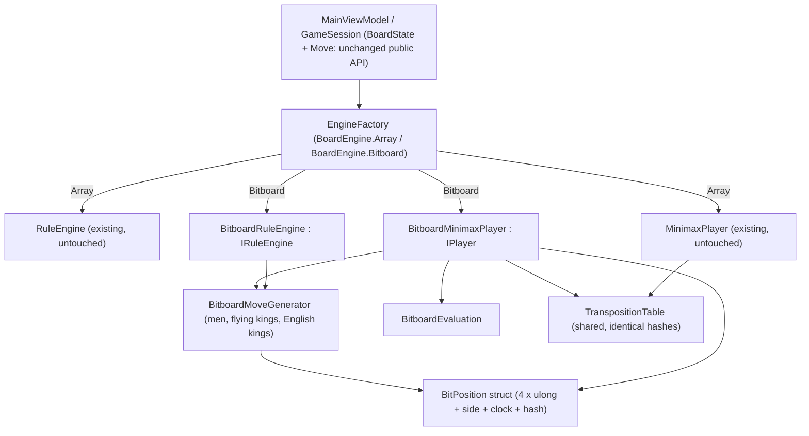

# Bitboard Engine for Checkers (International + English)

Implements the specification in [Implement bitboards.md](file:///c:/Udvikling/Spil/Checkers/Implement%20bitboards.md), using the answers to the clarifying questions:

| Decision | Choice |
| :--- | :--- |
| Refactor depth | Bitboard position + move generation + evaluation + incremental Zobrist **plus** compact move struct and allocation-free search |
| Layout | **64-bit 8×8** like Stermere's engine: 4 × `ulong` (`WhiteMen`, `BlackMen`, `WhiteKings`, `BlackKings`) |
| Comparison | **Both engines live in production code**, selectable, compared in **one benchmark run** |
| Benchmark columns | **No-TT baseline** and **Default TT (1,048,576)** for each engine |

## Guiding principle: same results, only faster

The bitboard engine must play **exactly the same game** as the array engine. For the same position and depth it must produce identical legal-move lists (same order), identical evaluations, identical `NodesEvaluated` / `LeafEvaluations`, the same best move and the same score. That gives us a strong correctness check: the benchmark itself verifies all 40 positions node for node, and any difference is a bug.

> [!NOTE]
> A useful fact for this: [Zobrist.cs](file:///c:/Udvikling/Spil/Checkers/src/Checkers.Core/Engine/Zobrist.cs) already indexes squares as `row * 8 + col`, which is exactly the 64-bit bit index. Both engines therefore produce **identical hashes** and can share the same `TranspositionTable`.

---

## Open Questions

> [!IMPORTANT]
> **1. Engine choice in the Settings dialog?** The plan adds a "Board engine" radio group (**Bitboard** (default) / **Array (classic)**) to WPF `SettingsWindow.xaml` and Blazor `DialogHost.razor`, saves it as a `[Engine "..."]` PDN tag, and applies it to the next computer move. This should only selectable in code and the benchmark. The new bitboard should be the default implementation for the GUT. There should not be any changes in the GUI.

> [!IMPORTANT]
> **2. Benchmark depth.** You picked the No-TT and Default TT columns but did not tick Standard or Deep. The plan supports both (`--engines` and `--engines --deep`) and documents **both**. Deep takes about 4–5 minutes in total, mostly the array No-TT run. OK?

> [!NOTE]
> **3. Variants in the benchmark.** You did not select the extra English suite, so performance numbers use the existing 40 International positions. English correctness is fully covered by the equivalence, perft, and rule tests, which run on both engines. The tests should run for both variants English and international, but the current positons can be used for both tests.

> [!NOTE]
> **4. Out of scope.** Stermere's NNUE, LMR, futility pruning, killer/history heuristics, endgame DB and opening book are **not** copied over. They would change node counts and break the "same results" guarantee. We only use its bitboard layout and shift/mask techniques.

---

## Architecture



- `BoardState`, `Move`, `GameSession`, the UI and PDN files keep the same API. The array engine stays **byte-for-byte unchanged**, so the comparison is fair.
- The bitboard engine converts `BoardState` → `BitPosition` once at the root, searches with value-type positions and moves only, and maps the result back to one of the `Move` objects it received.

---

## Proposed Changes

### 1. Bitboard core (`Checkers.Core/Bitboards/`)

#### [NEW] BitboardMasks.cs
Bit index `sq = row * 8 + col` (row 0 = Black's home rank, White moves toward row 0).

```csharp
public static class BitboardMasks
{
    public const ulong DarkSquares = 0x55AA55AA55AA55AAUL; // (row + col) odd
    public const ulong NotColA  = 0xFEFEFEFEFEFEFEFEUL;    // one step left allowed
    public const ulong NotColH  = 0x7F7F7F7F7F7F7F7FUL;    // one step right allowed
    public const ulong NotColAB = 0xFCFCFCFCFCFCFCFCUL;    // jump left allowed
    public const ulong NotColGH = 0x3F3F3F3F3F3F3F3FUL;    // jump right allowed
    public const ulong Row0 = 0x00000000000000FFUL;        // White crown row
    public const ulong Row7 = 0xFF00000000000000UL;        // Black crown row
    public static readonly ulong[] Rows;                    // Rows[r]
    public static readonly ulong CenterMask;                // rows 3-4, cols 2-5 (squares 14,15,18,19)
    public static readonly ulong KingCenterMask;            // rows 2-5, cols 2-5 (English king centralization)
    public static readonly ulong[,] Rays;                   // Rays[dir, sq]: all squares along a diagonal
}
```

Direction table (same order as `RuleEngine.AllDiagonals`, so move order is the same):

| Dir | (dRow,dCol) | Bit delta | Set shift |
| :-: | :-: | :-: | :--- |
| 0 | (-1,-1) up-left | −9 | `(S & NotColA) >> 9` |
| 1 | (-1,+1) up-right | −7 | `(S & NotColH) >> 7` |
| 2 | (+1,-1) down-left | +7 | `(S & NotColA) << 7` |
| 3 | (+1,+1) down-right | +9 | `(S & NotColH) << 9` |

#### [NEW] BitPosition.cs
A small value type, copied on every move (copy-make, no heap allocation, nothing to undo).

```csharp
public struct BitPosition
{
    public ulong WhiteMen, BlackMen, WhiteKings, BlackKings;
    public ulong Hash;               // identical to BoardState.ZobristHash
    public int HalfMoveClock;
    public PieceColor SideToMove;

    public readonly ulong White => WhiteMen | WhiteKings;
    public readonly ulong Black => BlackMen | BlackKings;
    public readonly ulong Occupied => White | Black;
    public readonly ulong Empty => BitboardMasks.DarkSquares & ~Occupied;

    public static BitPosition FromBoardState(BoardState s);
    public readonly BoardState ToBoardState(int fullMoveNumber);
    public readonly BitPosition Apply(in BitMove m);  // incremental Zobrist, clocks, promotion
}
```

`Apply` XORs only the changed squares into the hash: origin, destination (as a king if promoted), each captured square, and the side-to-move key. That replaces today's 64-square `RecalculateHash()` per move.

#### [NEW] BitMove.cs
```csharp
public readonly struct BitMove
{
    public readonly ulong Captured;   // bitmask of captured squares
    public readonly byte From, To;
    public readonly bool IsPromotion;
    public int CaptureCount => BitOperations.PopCount(Captured);
}
```
No `List<Position>` and no notation string. `Path` and `Notation` are only built when a `Move` is needed (UI, root, PDN).

#### [NEW] BitboardMoveGenerator.cs
- **Fast capture check** (Stermere's `has_any_jump`): a few shifts and ANDs decide whether the node is a capture node before any per-piece work. Men use forward directions only, kings use all four.
- **Men / English kings**: one-hop jumps with `NotColAB` / `NotColGH` masks, recursing for multi-jumps. A man reaching the crown row ends the move (promotion), as today.
- **Flying kings (International)**: ray scanning with first-blocker lookup. On rays toward higher bits the nearest blocker is `TrailingZeroCount(ray & occ)`; toward lower bits it is `63 - LeadingZeroCount(ray & occ)`. Landing squares are walked nearest-first.
- **Exact replication of current rule details**, so the move lists match:
  - pieces captured earlier in the sequence stay on the board and block the ray;
  - the king's starting square counts as occupied **before** reaching the enemy piece but as free **for landing** (the `landingPos != initialFrom` rule);
  - the flying-king "must continue if any landing square continues" rule, applied per ray;
  - captures for all pieces are collected first, quiet moves only when no capture exists;
  - pieces are processed in ascending square order with the same direction order.
- Two output modes:
  - `Generate(in BitPosition, Span/buffer<BitMove>)` for search;
  - `GenerateMoves(in BitPosition)` builds full `Move` records **with `Path`** for the UI and `IRuleEngine`. Paths come from a small square stack kept during the capture recursion.

#### [NEW] BitboardEvaluation.cs
The same formula as [EvaluationFunction.cs](file:///c:/Udvikling/Spil/Checkers/src/Checkers.Core/AI/EvaluationFunction.cs), computed with popcounts:

```csharp
int white = PopCount(WhiteMen) * ManValue + PopCount(WhiteKings) * kingVal
          + PopCount(White & CenterMask) * CenterControlBonus
          + PopCount(WhiteMen & Row7) * BackRankDefenseBonus
          + advanceStep * Σr (7 - r) * PopCount(WhiteMen & Rows[r]);
if (English) white += PopCount(WhiteKings & KingCenterMask) * KingCentralizationBonus;
// Black mirrored (r instead of 7 - r, Row0 for back rank)
```
Returns the score from the side to move's point of view, exactly like today.

---

### 2. Engines (`Checkers.Core/Engine/` and `Checkers.Core/AI/`)

#### [NEW] BoardEngine.cs (`Models/`)
```csharp
public enum BoardEngine { Array, Bitboard }
```

#### [NEW] BitboardRuleEngine.cs
Implements `IRuleEngine` (`Variant`, `GetLegalMoves`, `IsLegalMove`, `ApplyMove`, `EvaluateGameStatus`) on top of the generator. Its `ApplyMove` returns a `BoardState` identical to `RuleEngine.ApplyMove`, including `FullMoveNumber`, `HalfMoveClock` and hash.

#### [NEW] BitboardMinimaxPlayer.cs
Implements `IPlayer` with the **same algorithm and reporting** as `MinimaxPlayer`: iterative deepening, root PV ordering, TT probe/store, quiescence (ply cap 24), soft/hard time limits, 1024-node abort checks, live `IProgress<SearchAnalysis>` heartbeats and Blazor `Task.Delay(1)` yields.

What changes internally:
- `BitPosition` copy-make instead of `BoardState.Clone()` + 64-square rehash.
- **Per-ply preallocated `BitMove[]` buffers**, so there are no `List<Move>`, LINQ or string allocations in the tree.
- Moves are generated **once per node** (today `EvaluateGameStatus` and the search each generate them, so twice). The status checks keep the same order: no pieces → loss, no moves → loss, `HalfMoveClock >= 80` → draw.
- Ordering uses a stable insertion sort on `CaptureCount desc, IsPromotion desc`, then moves the first TT from/to match to the front. That reproduces `OrderMoves` exactly.
- At the root, the received `IReadOnlyList<Move>` is converted to `BitMove`s in the same order, and the chosen index returns the original `Move`.

> [!NOTE]
> The array `MinimaxPlayer` is left untouched. The search driver (about 250 lines) is therefore deliberately duplicated in `BitboardMinimaxPlayer`, so the baseline engine stays exactly as it is today.

#### [NEW] EngineFactory.cs
```csharp
public static class EngineFactory
{
    public static IRuleEngine CreateRuleEngine(BoardEngine engine, CheckersVariant variant);
    public static IPlayer CreatePlayer(BoardEngine engine, SearchLimits limits, CheckersVariant variant,
                                       TranspositionTable? tt, bool useTranspositionTable = true, bool useQuiescence = true);
}
```

#### [MODIFY] Zobrist.cs
Add `GetPieceKey(int square, int pieceIndex)` and `BlackToMove` accessors for incremental hashing. Existing keys and seed stay the same.

#### [MODIFY] GameRecordFormat.cs
Parse an optional `[Engine "Bitboard|Array"]` tag. The session rule engine is created through `EngineFactory`.

---

### 3. Application & UI (only if Open Question 1 is "yes")

#### [MODIFY] GameSettings.cs / SettingsViewModel.cs
Add `BoardEngine Engine = BoardEngine.Bitboard`, `IsBitboardEngine` / `IsArrayEngine` radio properties, and `EngineBadgeText`.

#### [MODIFY] MainViewModel.cs
Create the session rule engine and the AI player through `EngineFactory` with `Settings.Engine`. Switching engines mid-game does **not** need a new game, because both engines follow the same rules. The AI uses the new engine from its next move. Write the `[Engine]` PDN tag.

#### [MODIFY] SettingsWindow.xaml (WPF) / DialogHost.razor (Blazor)
Add a "Board engine" radio group: **Bitboard (fast, default)** / **Array (classic)**.

---

### 4. Engine benchmark (`Checkers.Core/AI/Benchmark/` + `tools/Checkers.Benchmark`)

#### [NEW] EngineBenchmarkRunner.cs and EngineBenchmarkResult.cs
For each of the 40 positions in `BenchmarkSuite` (unchanged):
1. Calibrate the depth exactly as today (standard 7–9 plies, or `--deep` 7–14 plies), using the array engine without TT.
2. Run four searches at that depth: **Array No-TT**, **Bitboard No-TT**, **Array + TT 1M**, **Bitboard + TT 1M**. Each TT run gets a freshly cleared 1,048,576-entry table.
3. Record nodes, leaf evaluations, time, nodes/sec, best move and score, and **flag any mismatch** between the engines.

Output:
- **Table A – No TT:** Array nodes/time vs Bitboard nodes/time, identical ✓, speedup, Mnodes/s.
- **Table B – Default TT (1M):** same columns.
- JSON files `docs/brain/bitboard_benchmark_results.json` (and `bitboard_deep_benchmark_results.json`).

#### [MODIFY] Program.cs
Add an `--engines` flag (works together with `--deep`). The existing TT benchmark is unchanged when the flag is absent.

---

### 5. Tests

| Test | Purpose |
| :--- | :--- |
| `BitboardMaskTests` (new) | Square mapping, masks, direction shifts at board edges, `BitPosition` ↔ `BoardState` round trip, identical hash |
| `EngineEquivalenceTests` (new) | Seeded random self-play games in **both variants**. At every ply compare both engines on: legal moves (From, To, Path, Captured, IsPromotion, Notation, **order**), `ApplyMove` result, `EvaluateGameStatus`, and evaluation score |
| `PerftTests` (new) | Leaf counts from the initial position at depth 1–6, both variants, identical for both engines |
| `SearchEquivalenceTests` (new) | Several benchmark positions at depth 5, TT on and off: `NodesEvaluated`, `LeafEvaluations`, best move and score identical |
| Existing rule tests | `FlyingKingTests`, `MandatoryCaptureTests`, `MultiJumpTests`, `PromotionTests`, `RegularMoveTests`, `TerminalConditionTests`, `EnglishCheckersTests` move to an abstract base with **Array** and **Bitboard** subclasses, so every rule test runs on both engines |
| App tests | Engine setting default/normalize, factory selection, `[Engine]` PDN round trip |

---

### 6. Documentation
- **[NEW]** `docs/brain/15-bitboards.md`: layout diagram, shift/mask table, capture detection, flying-king first-blocker technique, copy-make, `BitMove`, equivalence strategy, and the benchmark tables with analysis.
- **[MODIFY]** `docs/brain/README.md` (chapter table and summary), `01-overview.md`, `02-board-and-coordinates.md` (bit index next to 1–32 notation), `07-search.md`, `12-app-integration.md`.
- **[MODIFY]** [Create a checkers game.md](file:///c:/Udvikling/Spil/Checkers/Create%20a%20checkers%20game.md): new **Phase 7 – Bitboard Engine**, the engine setting in 4.1, project tree, and test metrics.
- `walkthrough.md` updated when done. Docs reach `Checkers.Web` through the normal build sync.

---

## Verification Plan

### Automated Tests
```powershell
dotnet build Checkers.slnx -c Release      # 0 warnings
dotnet test Checkers.slnx -c Release --no-build
```
All existing 118 tests plus the new equivalence/perft/search tests must pass. The rule tests now also run against the bitboard engine.

### Benchmark
```powershell
dotnet run --project tools/Checkers.Benchmark -c Release -- --engines
dotnet run --project tools/Checkers.Benchmark -c Release -- --engines --deep
```
Pass criteria:
- **identical nodes, best moves and scores for all 40 positions** in both No-TT and TT runs;
- the speedup (time and Mnodes/s) is recorded in `15-bitboards.md` and the spec.

### Manual Verification
- WPF and Blazor: switch Settings → Board engine between Bitboard and Array. Play both variants: flying-king multi-jumps, English king jumps, and promotions behave the same. The analysis pane updates live and shows much higher node rates with Bitboard.
- Save and load a game: the `[Engine]` and `[Variant]` tags are restored.
