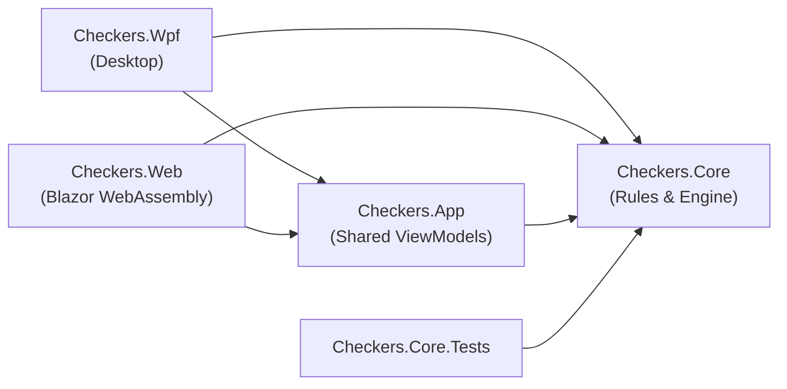
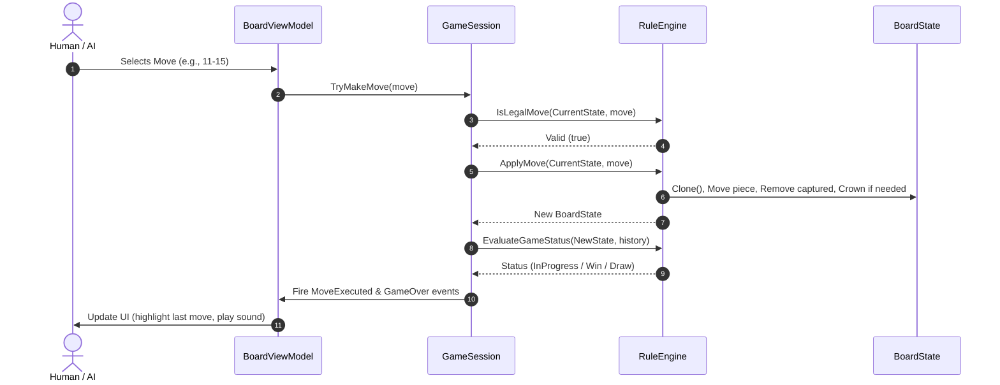

# 01 – Overview

[Back to the index](README.md)

## In short

The solution [Checkers.slnx](../../Checkers.slnx) is designed with **Clean Architecture** to ensure that the core game rules, piece movement, and state logic are 100% independent of any visual presentation layer.

The core library is `Checkers.Core`: it has zero UI dependencies, produces deterministic state transitions, and targets **.NET 10**. Presentation layers (`Checkers.Wpf` and `Checkers.Web`) consume the shared application layer `Checkers.App`, which coordinates the game loop, asynchronous AI dispatching, and view models.

---

## Projects

| Project | Type | Role & Contents |
|---|---|---|
| `Checkers.Core` | Class library (`net10.0`) | Board representation, rules engine, move generator, flying kings, Zobrist hashing, and game session. |
| `Checkers.App` | Class library (`net10.0`) | *(Phase 2)* Shared ViewModels (`CommunityToolkit.Mvvm`), game loop coordinator, audio service, and Markdig documentation parser. |
| `Checkers.Wpf` | WPF Application (`net10.0-windows`) | *(Phase 2)* Desktop presentation layer: 60 FPS board rendering, click-to-move, animations, and Undo/Redo. |
| `Checkers.Web` | Blazor WebAssembly (`net10.0`) | *(Phase 5)* Web presentation layer: Ahead-Of-Time (AOT) compiled client with responsive board UI and Markdig `/docs` viewer. |
| `Checkers.Core.Tests` | xUnit + FluentAssertions (`net10.0`) | Full unit test suite validating all rule edge cases, captures, flying kings, promotions, and terminal conditions. |
| `Checkers.App.Tests` | xUnit (`net10.0`) | *(Phase 2)* Unit tests for ViewModels, session flow, and chapter documentation loader. |

---

## Main types of the engine

| Type | Namespace | Purpose |
|---|---|---|
| `Position` | `Checkers.Core.Models` | 8x8 row/col coordinates (0-indexed) with bidirectional mapping to Draughts 1–32 notation. |
| `Piece` | `Checkers.Core.Models` | Immutable record struct representing a piece (`Color`, `Type`: Man or King). |
| `Move` | `Checkers.Core.Models` | Atomic move record with `From`, `To`, full `Path`, `CapturedPositions`, `IsPromotion`, and `Notation`. |
| `BoardState` | `Checkers.Core.Models` | Snapshot of the 8x8 board: piece grid, active turn, move clocks, piece counts, and Zobrist hash. |
| `CheckersVariant` | `Checkers.Core.Models` | Rule variant enum: `International` (Flying Kings) or `English` (1-step Kings). |
| `GameStatus` & `GameOverReason` | `Checkers.Core.Models` | Enums representing terminal states (`WhiteWon`, `BlackWon`, `Draw`) and exact reasons. |
| `IRuleEngine` & `RuleEngine` | `Checkers.Core.Engine` | Pure rule engine: legal move generation, variant-specific king behaviors, mandatory captures, and terminal evaluation. |
| `Zobrist` | `Checkers.Core.Engine` | Deterministic 64-bit Zobrist hashing for rapid state identification, threefold repetition detection, and transposition caching. |
| `GameRecordFormat` | `Checkers.Core.Engine` | PDN (Portable Draughts Notation) serializer and parser with metadata tags (`[Variant ...]`, `[TimeControlMode ...]`). |
| `GameSession` | `Checkers.Core.Engine` | High-level coordinator managing current board state, move history, Undo/Redo stacks, and lifecycle events. |
| `IEvaluationFunction` & `EvaluationFunction` | `Checkers.Core.AI` | Heuristic evaluation functions tailored per variant: material weights, advancement, center control, and king centralization. |
| `SearchLimits` | `Checkers.Core.AI` | Value object encapsulating time control and depth bounds (`FixedDepth`, `TimePerMove`, `TimePerGame`). |
| `MinimaxPlayer` | `Checkers.Core.AI` | High-performance Negamax $\alpha$-$\beta$ engine with iterative deepening, transposition table, quiescence search, and live search telemetry. |
| `TranspositionTable` | `Checkers.Core.AI` | High-speed power-of-two 64-bit Zobrist cache storing bounds (`Exact`, `LowerBound`, `UpperBound`), scores, depths, and hash moves. |

---

## Where the rules come from

Checkers variants have evolved distinct traditions across different countries:
- **English Checkers (American Draughts / Straight Checkers):** Standard 8x8 board with 12 pieces per player, where regular men move and jump forward diagonally, and Kings move and jump strictly 1 square in all 4 diagonal directions.
- **International Draughts (Flying Kings):** 8x8 or 10x10 board, featuring **Flying Kings** (kings fly along any open diagonal distance and jump from afar) and **Free Choice** (player can choose any valid capture line, but must finish the chosen sequence).
- **Russian / Brazilian Draughts:** 8x8 board with flying kings and backward captures for men.

This project implements two selectable **8x8 Draughts variants**, configurable via the Settings dialog:
1. **International Draughts (Flying Kings - Default):**
   - Standard 8x8 board with 12 pieces per player.
   - Regular men move and jump diagonally forward.
   - Kings are **Flying Kings** (can slide and jump across arbitrary open diagonal spans).
   - Captures are strictly mandatory with **Free Choice** among available capture branches.
   - Reaching the crown row immediately crowns the piece and **ends the turn**.
2. **English Checkers (American Draughts):**
   - Standard 8x8 board with 12 pieces per player.
   - Regular men move and jump diagonally forward.
   - Kings move **strictly 1 square** diagonally in all 4 directions and capture adjacent opponent pieces landing on the immediate square behind.
   - Strict mandatory captures with **Free Choice** among capture branches and multi-jump continuation.
   - Reaching the crown row crowns the piece and ends the turn.

---

## The life of one move

Here is how a turn executes within the game system:

1. **Move Submission:** A human player clicks an interactive square or the AI selects a move.
2. **Validation:** `GameSession.TryMakeMove(move)` invokes `IRuleEngine.IsLegalMove(state, move)`.
3. **Immutability & Mutation:** The engine creates an independent clone of the state, clears the source square, removes all jumped pieces, applies king promotion if applicable, toggles the active turn, updates the 40-move half-move clock, and recalculates the Zobrist hash.
4. **Terminal Evaluation:** `EvaluateGameStatus` checks whether the opposing player has pieces or legal moves left, or if a draw condition (40-move rule, threefold repetition) is met.
5. **Event Dispatch:** `GameSession` records the move into `MoveHistory`, clears the Redo stack, and fires `MoveExecuted` (and `GameOver` if terminal).

---

## Design principles

1. **Zero UI Coupling:** `Checkers.Core` has no dependencies on WPF, Blazor, HTML, or GUI libraries. It can run in any environment (desktop, server, web worker, CLI).
2. **Deterministic & Testable:** Rules and state generation are purely deterministic with no hidden random behavior or side effects.
3. **Safety for Search Algorithms:** Board states are lightweight and safely cloneable, making them ideal for recursive Minimax trees and alpha-beta pruning.
4. **Consistent Notation:** Bidirectional conversion between internal coordinates `(Row, Col)` and official Draughts 1–32 square numbers enables standard PDN (Portable Draughts Notation) compatibility.
