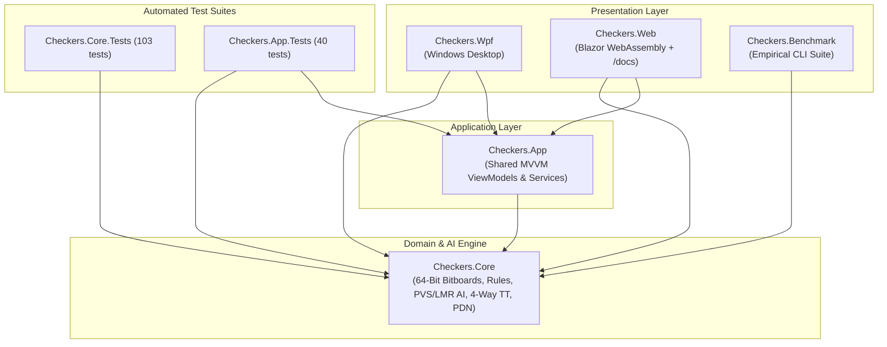

# 01 – Overview

[Back to the index](README.md)

## In short

The solution [Checkers.slnx](../../Checkers.slnx) is built with **Clean Architecture** so that the core game rules, bitboard state representation, move generation, and AI search engine are 100% independent of any visual presentation framework.

The domain library `Checkers.Core` has zero UI dependencies, produces deterministic state transitions, and targets **.NET 10**. Two presentation clients (`Checkers.Wpf` for Windows desktop and `Checkers.Web` for Blazor WebAssembly) consume the shared application layer `Checkers.App`, which coordinates the game loop, asynchronous AI dispatching, chess clocks, and MVVM view models.

---

## Projects

| Project | Type | Role & Contents |
|---|---|---|
| `Checkers.Core` | Class library (`net10.0`) | 64-bit bitboards (`BitPosition`, `BitMove`), rules engine, move generator, Zobrist hashing, Negamax $\alpha$-$\beta$ AI (PVS, LMR, RFP, FP, Killer/History heuristics, `DrawTable`), 4-way bucket transposition table, PDN serializer, and benchmark runners. |
| `Checkers.App` | Class library (`net10.0`) | Shared MVVM ViewModels (`CommunityToolkit.Mvvm`), game loop coordinator, chess clock management, and platform service abstractions (`ISoundService`, `IDialogService`, `IGameFileService`). |
| `Checkers.Wpf` | WPF Application (`net10.0-windows`) | Desktop presentation client: 60 FPS board rendering, click-to-move, drag-and-drop, sound effects, Settings dialog, and live search telemetry pane. |
| `Checkers.Web` | Blazor WebAssembly (`net10.0`) | Web presentation client: Ahead-Of-Time (AOT) compiled WebAssembly app with responsive board UI, cooperative AI search yielding, and integrated Markdig/KaTeX/Mermaid `/docs` viewer. |
| `Checkers.Benchmark` | Console CLI (`net10.0`) | Automated 40-position and 5-position empirical benchmark runner measuring search depth, node reductions, transposition table sizing ($1\text{M}$ vs. $16\text{M}$), and throughput across development phases. |
| `Checkers.Core.Tests` | xUnit + FluentAssertions (`net10.0`) | 103 unit tests validating bitboard masks, move generation, mandatory captures, flying kings, English kings, promotions, Zobrist hashing, `DrawTable` repetitions, PVS/LMR search, and PDN persistence. |
| `Checkers.App.Tests` | xUnit (`net10.0`) | 40 unit tests covering `MainViewModel`, `SettingsViewModel`, variant switching, clock refunds, and UI command workflows. |



---

## Main types of the engine

| Type | Namespace | Purpose |
|---|---|---|
| `Position` | `Checkers.Core.Models` | $8 \times 8$ `(Row, Col)` coordinates (0-indexed) with $O(1)$ bidirectional mapping to Draughts $1\text{–}32$ notation. |
| `Piece` | `Checkers.Core.Models` | Immutable `readonly record struct` representing a piece (`Color`: White/Black, `Type`: Man/King). |
| `Move` | `Checkers.Core.Models` | Atomic move record with `From`, `To`, full `Path`, `CapturedPositions`, `IsPromotion`, and Draughts `Notation`. |
| `BoardState` | `Checkers.Core.Models` | Snapshot of the $8 \times 8$ board backed directly by a 64-bit `BitPosition` (`4 × ulong`), active turn, move clocks, hardware `PopCount` piece totals, and Zobrist hash. |
| `CheckersVariant` | `Checkers.Core.Models` | Rule variant enum: `International` (Flying Kings) or `English` (1-Step Kings). |
| `GameStatus` & `GameOverReason` | `Checkers.Core.Models` | Enums representing terminal states (`InProgress`, `WhiteWon`, `BlackWon`, `Draw`) and exact win/draw causes. |
| `BitPosition`, `BitMove`, `BitboardMoveGenerator`, `BitboardMasks` | `Checkers.Core.Bitboards` | 48-byte value-type bitboard state (`4 × ulong`), 16-byte value-type move (`PackedMove`), parallel shift/mask & ray-scan move generator with $O(1)$ `HasAnyCapture`, and precomputed diagonal masks ([Chapter 10](10-bitboards.md)). |
| `IRuleEngine` & `RuleEngine` | `Checkers.Core.Engine` | Pure rule engine backed by 64-bit bitboards: legal move generation, variant-specific king behaviors, mandatory captures, and terminal evaluation. |
| `Zobrist` | `Checkers.Core.Engine` | Deterministic 64-bit Zobrist XOR hashing for rapid state identification, threefold repetition detection, and transposition table indexing. |
| `GameRecordFormat` | `Checkers.Core.Engine` | PDN (Portable Draughts Notation) serializer and parser with metadata tags (`[Variant ...]`, `[TimeControlMode ...]`). |
| `GameSession` | `Checkers.Core.Engine` | High-level coordinator managing current board state, move history, Undo/Redo stacks, and lifecycle events. |
| `IEvaluationFunction` & `EvaluationFunction` | `Checkers.Core.AI` | Hardware `BitOperations.PopCount`-accelerated bitboard evaluation tailored per variant: material weights, advancement, center control, king centralization, and back-rank defense. |
| `SearchLimits` | `Checkers.Core.AI` | Value object encapsulating time control and depth bounds (`FixedDepth`, `TimePerMove`, `TimePerGame`). |
| `DrawTable` | `Checkers.Core.AI` | In-search repetition detector tracking active search-path Zobrist hashes (`_pathHashes[ply]`) and pre-root game history (`_twoFoldHashes`, `_oneFoldHashes`). |
| `MinimaxPlayer` | `Checkers.Core.AI` | Allocation-free 64-bit bitboard Negamax $\alpha$-$\beta$ engine with Principal Variation Search (PVS), Killer/History move ordering, Reverse Futility Pruning (RFP), Futility Pruning (FP), Verified Late Move Reductions (LMR), Quiescence search, and live telemetry ([Chapter 07](07-search.md)). |
| `TranspositionTable` | `Checkers.Core.AI` | 4-way set-associative 64-byte cache-line Zobrist table ($1\text{M}\text{–}16\text{M}$ entries on the Pinned Object Heap) with `Sse.Prefetch0` hardware prefetching, caching `Score`, `StaticEval`, `BestMove`, `Depth`, `Age`, and `Bound` ([Chapter 08](08-transposition-table.md)). |

---

## Where the rules come from

Checkers variants have evolved distinct competitive traditions across different regions:

| Rule Feature | **International Draughts (8×8 Flying Kings)** | **English Checkers (American Draughts)** |
|---|---|---|
| **Board & Initial Pieces** | $8 \times 8$ dark squares (32 active squares), 12 men per side | $8 \times 8$ dark squares (32 active squares), 12 men per side |
| **Regular Man Quiet Move** | 1 square diagonally forward | 1 square diagonally forward |
| **Regular Man Capture** | Short 2-square jump diagonally forward | Short 2-square jump diagonally forward |
| **Crowned King Quiet Move** | **Flying King:** slides any open distance along 4 diagonals | **1-Step King:** moves strictly 1 square along 4 diagonals |
| **Crowned King Capture** | **Flying Jump:** jumps distant enemy along open diagonal, lands on any empty square beyond | **Short Jump:** jumps adjacent enemy onto immediate vacant square behind |
| **Multi-Jump Continuation** | Mandatory continuation along any landing square offering a follow-up jump | Mandatory continuation from landing square in all 4 diagonal directions |
| **Capture Priority** | Strictly mandatory; **Free Choice** among valid capture sequences | Strictly mandatory; **Free Choice** among valid capture sequences |
| **Crown-Row Promotion** | Reaching the back rank crowns the piece and **immediately ends the turn** | Reaching the back rank crowns the piece and **immediately ends the turn** |

Both variants are selectable at any time via the **Game -> Settings...** dialog.

---

## The life of one move

Here is how a single turn executes from user click or AI decision through validation, bitboard state transition, and UI notification:

```mermaid
sequenceDiagram
    autonumber
    actor Player as Human / AI
    participant VM as MainViewModel
    participant Session as GameSession
    participant Engine as RuleEngine
    participant State as BoardState / BitPosition

    Player->>VM: Selects Move (e.g., 11-15 or 29x18x4)
    VM->>Session: TryMakeMove(move)
    Session->>Engine: IsLegalMove(CurrentState, move)
    Engine-->>Session: Valid (true)
    Session->>Engine: ApplyMove(CurrentState, move)
    Engine->>State: BitPosition.Apply(in bitMove)<br/>(Toggle bits, clear captured, crown, XOR Zobrist hash)
    State-->>Engine: New BoardState
    Engine-->>Session: New BoardState
    Session->>Engine: EvaluateGameStatus(NewState, stateHashHistory)
    Engine-->>Session: Status (InProgress / Win / Draw)
    Session->>VM: Fire MoveExecuted &amp; GameOver events
    VM->>Player: Update 8x8 SquareViewModels, play sound, trigger AI if next turn
```

1. **Move Submission:** A human player clicks/drags a piece to a highlighted destination square, or `MinimaxPlayer.GetMoveAsync` completes its search and returns a `Move`.
2. **Validation:** `GameSession.TryMakeMove(move)` verifies legality via `IRuleEngine.IsLegalMove(state, move)`.
3. **Bitboard Copy-Make Transition:** `RuleEngine.ApplyMove` converts the move to a 16-byte `BitMove` and invokes `BitPosition.Apply(in bitMove)`, which updates the four 64-bit bitboards (`WhiteMen`, `BlackMen`, `WhiteKings`, `BlackKings`), clears all jumped pieces via `& ~move.Captured`, crowns the piece if it reached the promotion rank, increments or resets `HalfMoveClock`, flips `SideToMove`, and incrementally XOR-updates the 64-bit Zobrist hash.
4. **Terminal Evaluation:** `EvaluateGameStatus` checks whether the new active player has zero pieces (`OpponentPiecesEliminated`), zero legal moves via $O(1)$ bitwise mobility detection (`OpponentNoLegalMoves`), `HalfMoveClock >= 80` (`FortyMoveRuleWithoutCaptureOrPromotion`), or a Zobrist hash appearing 3 times (`ThreefoldRepetition`).
5. **Event Dispatch:** `GameSession` appends the new state and move to history, clears the Redo stack, and raises `MoveExecuted` (and `GameOver` if terminal).

---

## Design principles

1. **Zero UI Coupling:** `Checkers.Core` has no dependencies on WPF, Blazor, HTML, or GUI libraries. It runs identically on desktop, web browser (WASM AOT), test runners, and CLI benchmarks.
2. **Deterministic & Testable:** Rules, Zobrist hashes, and fixed-depth search trees are 100% deterministic with no hidden side effects.
3. **Zero-Allocation Hot Path:** By representing board states as 48-byte `BitPosition` structs and moves as 16-byte `BitMove` structs in preallocated per-ply buffers, the search engine evaluates **32–37 million nodes per second** with zero garbage collection pressure ([Chapter 10 – Bitboards](10-bitboards.md), [Chapter 11 – Engine improvements during development](11-engine-improvements.md)).
4. **Standard Notation Compatibility:** Bidirectional $O(1)$ conversion between `(Row, Col)`, bit indices `0..63`, and official Draughts $1\text{–}32$ square numbers enables full Portable Draughts Notation (PDN) interoperability.
