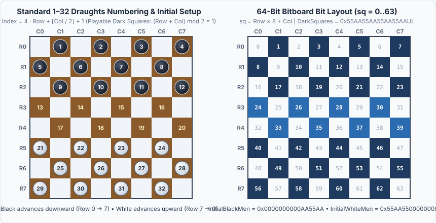
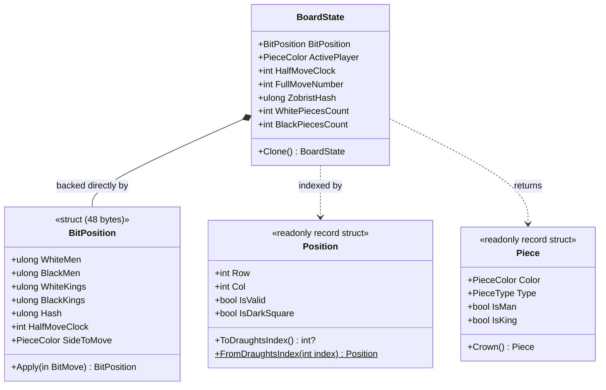

# 02 – Board and coordinates

[Back to the index](README.md)

## In short

In Checkers, pieces only occupy, move, and capture on the **dark squares** of an $8 \times 8$ board. Exactly 32 of the 64 squares are active playable squares, while the remaining 32 light squares are permanently empty.

This chapter explains the three coordinate systems used by `Checkers.Core`, how they map to each other in $O(1)$ time, and how deterministic 64-bit Zobrist XOR hashing uniquely identifies every board state:
1. **2D Grid Coordinates `(Row, Col)` (`0..7`, `0..7`):** Used by UI view models and board rendering.
2. **Standard Draughts Notation (`1..32`):** Used by move history, human-readable notation (`11-15`), and PDN files.
3. **64-Bit Bitboard Index (`sq = 0..63`):** Used by `BitPosition`, `BitboardMoveGenerator`, `EvaluationFunction`, and `Zobrist` for single-instruction bitwise operations.

---

## Coordinate system and dark-square parity

Internally, a 2D square is addressed by a zero-indexed `Position(Row, Col)`:
* `Row` ranges from `0` to `7` (`0` is Black's home rank at the top; `7` is White's home rank at the bottom).
* `Col` ranges from `0` to `7` (`0` is the leftmost file A; `7` is the rightmost file H).

A square `(Row, Col)` is an active **playable dark square** if and only if the sum of its row and column is odd:

$$(\text{Row} + \text{Col}) \bmod 2 = 1$$

* **White pieces** start on rows `5, 6, 7` and advance **upward** (decreasing `Row` toward crown row `0`, $\Delta_{\text{row}} = -1$).
* **Black pieces** start on rows `0, 1, 2` and advance **downward** (increasing `Row` toward crown row `7`, $\Delta_{\text{row}} = +1$).

---

## Standard Draughts 1–32 Numbering

Official Draughts literature, tournament records, and Portable Draughts Notation (PDN) number only the 32 playable dark squares from **1 to 32**, reading left-to-right, top-to-bottom starting from Black's back rank:

| Row | Col 0 | Col 1 | Col 2 | Col 3 | Col 4 | Col 5 | Col 6 | Col 7 | Bitboard Row Mask |
|:---:|:---:|:---:|:---:|:---:|:---:|:---:|:---:|:---:|:---:|
| **0** | — | **1** (`sq 1`) | — | **2** (`sq 3`) | — | **3** (`sq 5`) | — | **4** (`sq 7`) | `0x00000000000000FF` |
| **1** | **5** (`sq 8`) | — | **6** (`sq 10`) | — | **7** (`sq 12`) | — | **8** (`sq 14`) | — | `0x000000000000FF00` |
| **2** | — | **9** (`sq 17`) | — | **10** (`sq 19`) | — | **11** (`sq 21`) | — | **12** (`sq 23`) | `0x0000000000FF0000` |
| **3** | **13** (`sq 24`) | — | **14** (`sq 26`) | — | **15** (`sq 28`) | — | **16** (`sq 30`) | — | `0x00000000FF000000` |
| **4** | — | **17** (`sq 33`) | — | **18** (`sq 35`) | — | **19** (`sq 37`) | — | **20** (`sq 39`) | `0x000000FF00000000` |
| **5** | **21** (`sq 40`) | — | **22** (`sq 42`) | — | **23** (`sq 44`) | — | **24** (`sq 46`) | — | `0x0000FF0000000000` |
| **6** | — | **25** (`sq 49`) | — | **26** (`sq 51`) | — | **27** (`sq 53`) | — | **28** (`sq 55`) | `0x00FF000000000000` |
| **7** | **29** (`sq 56`) | — | **30** (`sq 58`) | — | **31** (`sq 60`) | — | **32** (`sq 62`) | — | `0xFF00000000000000` |

### Mathematical Mapping Formulas

[Position.cs](../../src/Checkers.Core/Models/Position.cs) and [BitboardMasks.cs](../../src/Checkers.Core/Bitboards/BitboardMasks.cs) convert between all three coordinate systems in $O(1)$ constant time:

#### 1. Between `(Row, Col)` and 64-Bit Bitboard Index (`sq = 0..63`):

$$\text{sq} = 8 \cdot \text{Row} + \text{Col} = (\text{Row} \ll 3) \mid \text{Col}$$

$$\text{Row} = \lfloor \text{sq} / 8 \rfloor = \text{sq} \gg 3, \qquad \text{Col} = \text{sq} \bmod 8 = \text{sq} \land 7$$

#### 2. From `(Row, Col)` to Draughts Index ($1\dots 32$):
Because every row contains exactly 4 dark squares:

$$\text{Index} = 4 \cdot \text{Row} + \left\lfloor \frac{\text{Col}}{2} \right\rfloor + 1$$

#### 3. From Draughts Index ($1\dots 32$) to `(Row, Col)`:
Let $Z = \text{Index} - 1 \in \{0, 1, \dots, 31\}$:

$$\text{Row} = \left\lfloor \frac{Z}{4} \right\rfloor, \qquad \text{ColInRow} = Z \bmod 4$$

$$\text{Col} = 2 \cdot \text{ColInRow} + \bigl((\text{Row} + 1) \bmod 2\bigr) = \begin{cases} 2 \cdot \text{ColInRow} + 1 & \text{if Row is even} \\ 2 \cdot \text{ColInRow} & \text{if Row is odd} \end{cases}$$

---

## Core data structures

### `Position` & `Piece`
Both `Position` and `Piece` are immutable value types (`readonly record struct`), ensuring value semantics (`==`) and zero heap allocation overhead.

### `BoardState` & `BitPosition`
[BoardState.cs](../../src/Checkers.Core/Models/BoardState.cs) is backed directly by a value-type [`BitPosition`](../../src/Checkers.Core/Bitboards/BitPosition.cs) (`4 × ulong` bitboards + `ulong Hash`) without allocating any 2D array:
* `ulong WhiteMen`, `BlackMen`, `WhiteKings`, `BlackKings`: Four 64-bit integers where bit `sq` is `1` if a piece of that color and type occupies square `sq`.
* `PieceColor ActivePlayer`: Player whose turn it is (`White` moves first).
* `int HalfMoveClock`: Plies elapsed since the last capture or promotion (triggers a draw at `80` half-moves = 40 full moves).
* `int FullMoveNumber`: Incremented after each move completed by Black.
* `int WhitePiecesCount`, `BlackPiecesCount`, `WhiteKingsCount`, `BlackKingsCount`: Computed in a single CPU instruction via `BitOperations.PopCount`.
* `ulong ZobristHash`: Incrementally maintained 64-bit Zobrist key.

See [Chapter 11 – Bitboards](11-bitboards.md) for a deep dive into the bitboard operations and benchmarks.

---

## Initial setup

`BoardState.CreateInitial()` initializes a standard game in $O(1)$ using compile-time bitboard constants:
- **Black (`InitialBlackMen = 0x0000000000AA55AAUL`):** 12 men on Draughts squares **1–12** (dark squares of rows 0, 1, 2).
- **Empty (`13–20`):** Rows 3 and 4 are vacant.
- **White (`InitialWhiteMen = 0x55AA550000000000UL`):** 12 men on Draughts squares **21–32** (dark squares of rows 5, 6, 7).
- **Turn:** `White` to move (`HalfMoveClock = 0`, `FullMoveNumber = 1`).

---

## 64-bit Zobrist hashing

Zobrist hashing maps any board configuration and side-to-move to a deterministic 64-bit fingerprint (`ulong`). It powers:
1. **Threefold Repetition Detection** ([Chapter 04](04-game-record.md)): Detecting in $O(1)$ per historical state whether the current position has occurred 3 times.
2. **Transposition Table Caching** ([Chapter 08](08-transposition-table.md)): Indexing millions of evaluated search subtrees in $O(1)$ time.

### Key Generation and Incremental XOR Math

At static initialization, [Zobrist.cs](../../src/Checkers.Core/Engine/Zobrist.cs) populates a table of 64-bit pseudo-random numbers using a fixed seed (`0x5A0B_7157_C0DE_2026`):
* `PieceTable[64, 4]`: One 64-bit key $K_{\text{piece}}(\text{sq}, p)$ for each of the 64 squares and 4 piece types ($p \in \{0:\text{WhiteMan},\, 1:\text{WhiteKing},\, 2:\text{BlackMan},\, 3:\text{BlackKing}\}$).
* `BlackToMoveKey` ($K_{\text{turn}}$): XORed into the hash whenever `ActivePlayer == PieceColor.Black`.

The full state hash $H(s)$ is defined as:

$$H(s) = \bigl(\mathbb{I}[\text{Black to move}] \cdot K_{\text{turn}}\bigr) \;\oplus\; \bigoplus_{\text{sq} \in \text{Occupied}(s)} K_{\text{piece}}\bigl(\text{sq}, \text{PieceAt}(\text{sq})\bigr)$$

Because bitwise XOR ($\oplus$) is commutative, associative, and self-inverting ($x \oplus y \oplus y = x$), `BitPosition.Apply(in BitMove move)` updates the hash **incrementally** without rescanning the board:

$$H_{\text{next}} = H_{\text{prev}} \;\oplus\; K_{\text{turn}} \;\oplus\; K_{\text{piece}}(\text{from}, p_{\text{start}}) \;\oplus\; K_{\text{piece}}(\text{to}, p_{\text{end}}) \;\oplus\; \bigoplus_{c \in \text{Captured}(m)} K_{\text{piece}}(c, p_c)$$
