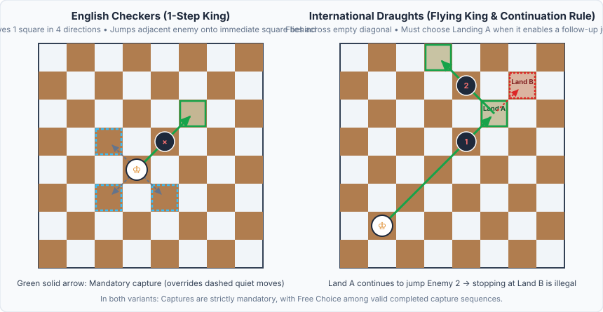
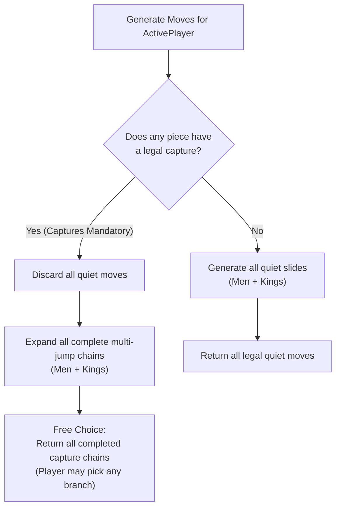

# 03 – Rules and move generation

[Back to the index](README.md)

## In short

Legal move generation in `Checkers.Core` is governed by [`IRuleEngine`](../../src/Checkers.Core/Engine/IRuleEngine.cs), implemented by [`RuleEngine`](../../src/Checkers.Core/Engine/RuleEngine.cs) and [`BitboardMoveGenerator`](../../src/Checkers.Core/Bitboards/BitboardMoveGenerator.cs).

The engine supports two selectable rule variants via `CheckersVariant`:
1. **International Draughts (`CheckersVariant.International` — Flying Kings):** Regular men move and jump forward; Kings slide across any number of empty diagonal squares and jump distant enemy pieces along open diagonals.
2. **English Checkers (`CheckersVariant.English` — American Draughts / 1-Step Kings):** Regular men move and jump forward; Kings move and jump strictly 1 step / 1 hop in all 4 diagonal directions.



### Core Rules Common to Both Variants
1. **Forward-Only Men:** Regular men move diagonally forward only, and capture diagonally forward only.
2. **Mandatory Captures:** If one or more captures exist anywhere on the board for the active player, all quiet (non-capturing) moves are strictly illegal.
3. **Free Choice Among Captures:** When multiple capture sequences are available, the player may freely choose any valid capture branch, provided the chosen jump sequence is completed to the end.
4. **Turn-Ending Promotion:** A regular man reaching the opponent's back rank promotes immediately to a King, and its turn ends at once.

---

## Regular men movement (both variants)

A regular man is constrained by its forward row direction $\Delta_{\text{row}}$:
* **White:** advances upward toward row `0` ($\Delta_{\text{row}} = -1$, bit shifts `-9` Up-Left and `-7` Up-Right).
* **Black:** advances downward toward row `7` ($\Delta_{\text{row}} = +1$, bit shifts `+7` Down-Left and `+9` Down-Right).

### 1. Quiet Slides
If an adjacent forward diagonal square is vacant:

$$\text{dest} = \text{from} + (\Delta_{\text{row}}, \Delta_{\text{col}}), \qquad \Delta_{\text{col}} \in \{-1, +1\}$$

the man may slide 1 square into $\text{dest}$. If $\text{dest.Row}$ is the promotion rank ($0$ for White, $7$ for Black), `IsPromotion` is set to `true`.

### 2. Short Jump Captures
If an adjacent forward diagonal square contains an opponent piece and the square immediately behind it along the same diagonal is empty:

$$\text{jumped} = \text{from} + (\Delta_{\text{row}}, \Delta_{\text{col}}), \qquad \text{landing} = \text{from} + (2\Delta_{\text{row}}, 2\Delta_{\text{col}})$$

the man jumps over $\text{jumped}$ and lands on $\text{landing}$. Men never move or capture backward in either variant.

### 3. Recursive Multi-Jump Chains
From $\text{landing}$ (unless the man just reached the crown row and promoted), the move generator recursively checks for further forward jumps:
- The jumped piece's bit is cleared from the local `enemy` bitboard and added to `capturedMask` immediately during recursion, preventing any piece from being jumped twice.
- If at least one follow-up jump exists, the man **must** continue jumping until no further captures are possible.

---

## English Checkers Kings movement (`CheckersVariant.English`)

Under English Checkers rules, a crowned King gains backward mobility while retaining 1-step range along all four diagonal vectors:

$$\mathbf{D} = \{ (-1,-1),\; (-1,+1),\; (+1,-1),\; (+1,+1) \}$$

### 1. Quiet Moves (1 Square)
An English King moves **strictly 1 square diagonally** into any adjacent vacant dark square:

$$\text{dest} = \text{from} + \mathbf{d}, \qquad \mathbf{d} \in \mathbf{D}$$

### 2. Single-Hop Captures & 4-Direction Multi-Jumps
An English King captures an adjacent opponent piece by jumping over it onto the immediate vacant square behind it:

$$\text{jumped} = \text{from} + \mathbf{d}, \qquad \text{landing} = \text{from} + 2\mathbf{d}, \qquad \mathbf{d} \in \mathbf{D}$$

From $\text{landing}$, the generator recursively expands any further 1-hop captures in all 4 diagonal directions. Because already-jumped pieces are masked out of `enemy` in registers (`enemy & ~bit`), the king cannot jump the same piece twice in a circular loop.

---

## Flying Kings movement (`CheckersVariant.International`)

When `CheckersVariant.International` is active, crowned pieces become **Flying Kings**:

### 1. Quiet Diagonal Sliding
A flying king slides across any number of consecutive unoccupied dark squares along any diagonal direction $\mathbf{d} \in \mathbf{D}$:

$$\text{dest}_k = \text{from} + k \cdot \mathbf{d}, \qquad k \in \{1, 2, \dots, k_{\max}\}$$

until it reaches the first occupied square (blocker) or the edge of the board.

### 2. Long-Distance Jump Captures
A flying king can jump an enemy piece across open diagonal space:
1. It flies over $k \ge 0$ empty dark squares along direction $\mathbf{d}$.
2. The first occupied square encountered along that ray must be an uncaptured enemy piece at $\text{enemySq}$.
3. It may land on **any** consecutive empty square $\text{land}_m = \text{enemySq} + m \cdot \mathbf{d}$ ($m \ge 1$) beyond that enemy piece up to the next occupied blocker or board edge:

```
[Flying King] ──► [Empty]* ──► [Enemy 1] ──► [Landing A] ──► [Landing B] ──► [Blocker / Edge]
```

---

## The Mandatory Continuation Requirement

A critical rule in Flying King multi-jumps is **jump continuation**:

> **Rule:** *When a flying king jumps an enemy piece and has multiple empty landing squares beyond it ($\text{Landing A}, \text{Landing B}, \dots$), if one or more of those landing squares enable a subsequent capture, the king **must** land on a square that continues the capture chain. It is illegal to stop on a dead-end landing square to evade a follow-up jump.*

Formally, let $L(\text{enemySq}, \mathbf{d})$ be the set of empty landing squares beyond $\text{enemySq}$ along ray $\mathbf{d}$, and let $\text{HasFollowUp}(\ell)$ be true if a legal capture exists from landing square $\ell \in L$. Then the set of legal landing squares $L^*$ is:

$$L^* = \begin{cases} \bigl\{\ell \in L : \text{HasFollowUp}(\ell)\bigr\} & \text{if } \exists\,\ell \in L \text{ such that } \text{HasFollowUp}(\ell) \\ L & \text{otherwise} \end{cases}$$

In [`BitboardMoveGenerator.cs`](../../src/Checkers.Core/Bitboards/BitboardMoveGenerator.cs), this is enforced during recursive ray expansion:
1. First, the generator tests every candidate landing square $\ell \in L$ for recursive follow-up jumps (`CanKingCaptureFrom`).
2. If `anyContinuation` is `true`, only the extended multi-jump chains are emitted.
3. Only if `anyContinuation` is `false` (no landing square along that ray offers another jump) are the individual squares in $L$ emitted as terminal capture destinations.

---

## Mandatory Captures and Free Choice



### Free Choice vs. Majority Capture
- In **10×10 International Draughts**, players must choose a capture sequence that takes the maximum possible quantity of pieces (*Majority Capture*).
- In **8×8 English, American, and Russian/Pool Checkers** (and in both 8×8 variants implemented here), the player has **Free Choice** among capture starts: if Piece A can capture 1 piece and Piece B can capture 2 pieces, either piece may be played, provided the chosen jump sequence is completed until no further captures remain from its landing square.

---

## Crown-row promotion rules

* **White Crown Row:** `Row == 0` (`Row0 = 0x00000000000000FFUL`, Draughts squares **1, 2, 3, 4**).
* **Black Crown Row:** `Row == 7` (`Row7 = 0xFF00000000000000UL`, Draughts squares **29, 30, 31, 32**).
* **Turn-Ending Promotion:** When a regular man reaches the opponent's crown row—whether by a quiet slide or at the end of a jump step—it is immediately crowned to a King and **its turn ends immediately**. Even if a newly crowned piece could theoretically make another jump backward as a king, it must wait until its next turn to move as a king.
