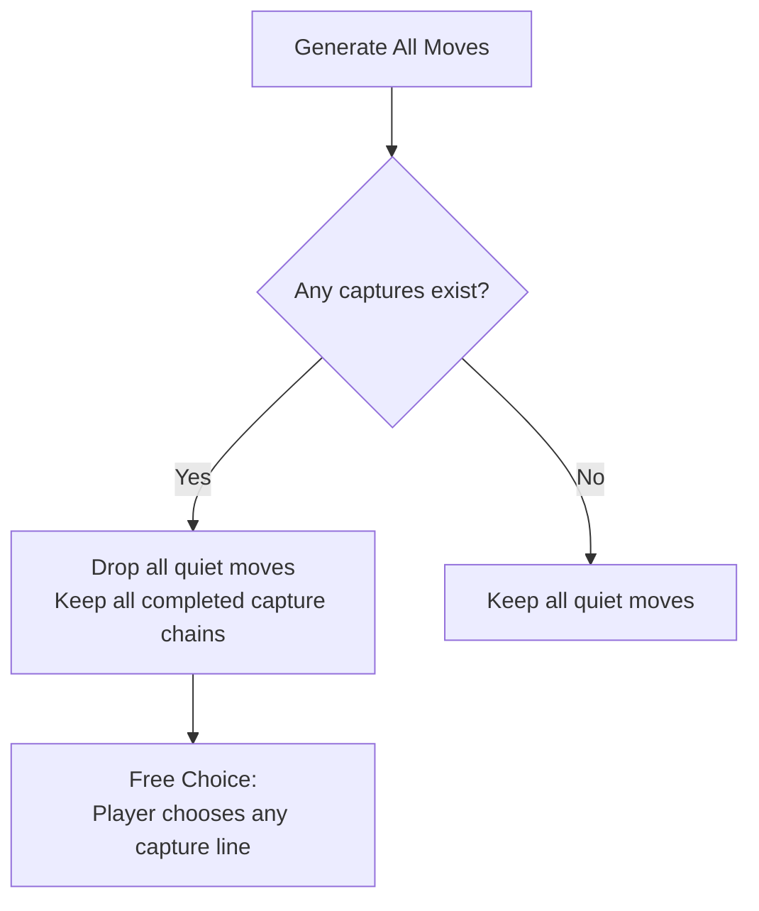

# 03 – Rules and move generation

[Back to the index](README.md)

## In short

Move generation in `Checkers.Core` is governed by `IRuleEngine` and implemented in `RuleEngine.cs`. 

The engine supports two configurable variants via `CheckersVariant`:
1. **International Draughts (Flying Kings):** Men move/jump forward; Kings slide arbitrary diagonal distances and jump across open diagonals.
2. **English Checkers (American Draughts / Straight Checkers):** Men move/jump forward; Kings move and jump strictly 1 square / 1 hop in all 4 diagonal directions.

### Core Rules Common to Both Variants
1. Regular men move diagonally forward only, and capture diagonally forward only.
2. **Mandatory Captures:** If any capture is available, non-capturing moves are strictly illegal.
3. **Free Choice:** The player may choose among any available capture branches, but once chosen, the full jump sequence must be completed.
4. **Turn-ending Promotion:** A man reaching the crown row promotes immediately and ends its turn.

---

## Regular men movement (both variants)

A regular man is constrained by its designated forward direction:
* **White:** moves toward row `0` (`dRow = -1`).
* **Black:** moves toward row `7` (`dRow = +1`).

### 1. Quiet Moves
If the square immediately forward-left or forward-right is unoccupied:
$$\text{dest} = \text{from} + (\Delta_{\text{row}}, \Delta_{\text{col}}), \quad \Delta_{\text{col}} \in \{-1, +1\}$$
The man can slide into that square. If $\text{dest.Row}$ reaches the crown row ($0$ for White, $7$ for Black), the move promotes the man to a King.

### 2. Short Jump Captures
If an adjacent forward diagonal square holds an opponent piece and the square immediately beyond it along the same diagonal is vacant:
$$\text{jumped} = \text{from} + (\Delta_{\text{row}}, \Delta_{\text{col}})$$
$$\text{landing} = \text{from} + (2\Delta_{\text{row}}, 2\Delta_{\text{col}})$$
The man jumps over the opponent piece, removes it from the board, and lands on $\text{landing}$. Men cannot move or jump backward in either variant.

### 3. Multi-Jump Chains
From the landing square, the engine recursively searches for further available jumps. If additional jumps exist, the man **must** continue jumping until no further jumps can be made. All intermediate hops and captured coordinates are recorded in the composite `Move.Path` and `Move.CapturedPositions`.

---

## English Checkers Kings movement

Under the English Checkers variant (`CheckersVariant.English`):

### 1. Quiet Moves
An English King moves **exactly 1 square diagonally** in any of the 4 diagonal directions:
$$\mathbf{D} \in \{ (-1,-1), (-1,+1), (+1,-1), (+1,+1) \}$$
$$\text{dest} = \text{from} + \mathbf{d}, \quad \mathbf{d} \in \mathbf{D}$$
The destination square must be a dark square and vacant. It cannot slide multiple squares.

### 2. Single-Hop Captures
An English King captures by jumping over an **adjacent** opponent piece and landing on the **immediate vacant square behind it** along the same diagonal:
$$\text{jumped} = \text{from} + \mathbf{d}$$
$$\text{landing} = \text{from} + 2\mathbf{d}$$

### 3. Four-Direction Multi-Jumps
If further jumps are available from the landing square in any of the 4 diagonal directions, the King must continue jumping until no further captures remain. All jumped pieces are recorded in `Move.CapturedPositions` and removed upon move execution.

---

## Flying kings movement (International variant)

When `CheckersVariant.International` is selected, crowned pieces become **Flying Kings**:

$$\mathbf{D} \in \{ (-1,-1), (-1,+1), (+1,-1), (+1,+1) \}$$

### 1. Quiet Sliding
A flying king can slide across any number of unoccupied dark squares along any diagonal direction $\mathbf{d} \in \mathbf{D}$:

$$\text{dest}_k = \text{from} + k \cdot \mathbf{d}, \quad k \in \{1, 2, \dots\}$$

The king slides until it hits the board boundary or is blocked by an occupied square.

### 2. Long-Distance Jump Captures
A flying king can jump over an enemy piece positioned at any open distance along a diagonal:
1. The king flies over zero or more empty squares along $\mathbf{d}$.
2. It encounters an opponent piece (which has not been jumped yet in this turn).
3. It can land on **any** unoccupied square along the same diagonal beyond that opponent piece, up until the next obstacle or board edge.

```
[King] -> [Empty] -> [Enemy] -> [Landing A] -> [Landing B] -> [Edge]
```
In the diagram above, the flying king can land on **Landing A** or **Landing B**.

---

## The Continuation Requirement

A critical edge case in Flying King multi-jumps is **jump continuation**:

> *If a flying king jumps an enemy and has multiple landing square choices beyond it, and one of those landing squares allows a subsequent jump, the king cannot choose an alternative landing square that terminates the jump prematurely.*

In `RuleEngine.cs`, landing squares are evaluated as follows:

```csharp
if (anyContinuation)
{
    // Must continue capture sequence: keep only extended chains
    resultMoves.AddRange(rayMoves);
}
else
{
    // No landing square allows further jumping: all landing squares are valid terminal stops
    foreach (var landingPos in landingSquares)
    {
        resultMoves.Add(Move.CreateCapture(initialFrom, landingPos, newPath, newCaptured));
    }
}
```

This ensures that players cannot "evade" completing a multi-jump by deliberately stopping on a dead-end square when a continuing jump line is open.

---

## Mandatory Captures and Free Choice

Checkers competitive play requires strict capture enforcement:



### Free Choice vs. Majority Capture
- Under **International Draughts rules**, a player is forced to choose the capture line that takes the maximum number of pieces (*Majority Capture*).
- Under **English & Russian rules** (implemented here), the player has **Free Choice**: if piece A can take 1 piece, and piece B can take 3 pieces, the player is free to move either piece A or piece B. However, whichever piece is chosen, it must finish all jumps available along its chosen branch.

---

## Crown-row promotion rules

* When a regular man reaches the opponent's back row (`Row == 0` for White; `Row == 7` for Black), it immediately promotes to a King:
```csharp
var finalPiece = (piece.Value.IsMan && move.IsPromotion) 
    ? piece.Value.Crown() 
    : piece.Value;
```
* **Promotion Ends Turn:** If a regular man reaches the crown row during a jump step, it is crowned and its turn **ends immediately** (English tournament rule). Even if the newly crowned piece could theoretically continue jumping as a king, it must wait for the next turn.
