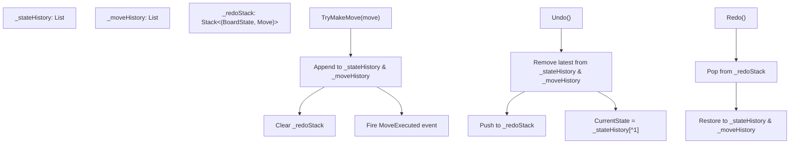

# 04 – Game record

[Back to the index](README.md)

## In short

Every checkers move played is tracked as an atomic `Move` record with complete path history and Draughts notation (`11-15`, `29x18x4`). 

The `GameSession` coordinator manages the game lifecycle, turn transitions, Undo/Redo stacks, and win/draw detection (piece elimination, blocked pieces, 40-move rule, and threefold repetition).

---

## The Move record and Draughts Notation

A move is represented by the immutable `Move` class:

```csharp
public sealed record Move
{
    public required Position From { get; init; }
    public required Position To { get; init; }
    public required IReadOnlyList<Position> Path { get; init; }
    public required IReadOnlyList<Position> CapturedPositions { get; init; }
    public bool IsPromotion { get; init; }
    public bool IsCapture => CapturedPositions.Count > 0;
    public string Notation { get; init; } = string.Empty;
}
```

### Standard Draughts Move Notation
The engine automatically formats human-readable Draughts notation using the 1–32 square numbers:
* **Quiet Move (`-`):** Formatted as `From-To` (e.g., `11-15` or `24-19`).
* **Capture Move (`x`):** Formatted as the full visited sequence of squares (e.g., `11x18` for a single jump, or `29x18x4` for a multi-jump sequence).

If a move involves non-standard coordinates outside the 1–32 dark squares, coordinate fallback `(Row, Col)` is used.

---

## GameSession coordinator

`GameSession` acts as the single source of truth for ongoing gameplay. It coordinates the `RuleEngine`, tracks state history, and emits event notifications:



### Undo and Redo Mechanics
* **`Undo()`:** Pops the latest state and move, pushes them onto `_redoStack`, and restores `CurrentState` to the previous board snapshot.
* **`Redo()`:** Re-applies the popped move from `_redoStack`, updating state history.
* **Branching Protection:** Executing a new move (`TryMakeMove`) clears the `_redoStack` to prevent non-linear history divergence.

---

## Terminal conditions and game evaluation

After every move, `RuleEngine.EvaluateGameStatus` checks the current state and history:

```csharp
public (GameStatus Status, GameOverReason Reason) EvaluateGameStatus(
    BoardState state,
    IReadOnlyList<ulong>? stateHashHistory = null);
```

### 1. Opponent Pieces Eliminated (`Win`)
If the active player has zero remaining pieces on the board:
* If it is White's turn and White has 0 pieces: **Black Wins** (`OpponentPiecesEliminated`).
* If it is Black's turn and Black has 0 pieces: **White Wins** (`OpponentPiecesEliminated`).

### 2. Blocked Legal Moves (`Win`)
If the active player still possesses pieces on the board, but `GetLegalMoves(state)` returns 0 legal moves:
* The player is completely trapped.
* The opponent is declared the winner (`OpponentNoLegalMoves`).

### 3. Forty-Move Rule (`Draw`)
The `BoardState.HalfMoveClock` increments after every quiet move and resets to `0` whenever a capture or promotion occurs:
* 40 full moves = **80 half-moves** without any capture or promotion.
* When `HalfMoveClock >= 80`, the game is drawn (`FortyMoveRuleWithoutCaptureOrPromotion`).

### 4. Threefold Repetition (`Draw`)
Each board snapshot includes a 64-bit `ZobristHash` incorporating all piece positions, kings, and the active player turn:
* The `GameSession` passes `stateHashHistory` to the rule engine.
* If the current `ZobristHash` appears 3 or more times in `stateHashHistory`, the game is declared a draw (`ThreefoldRepetition`).

---

## Event notifications

The session exposes strongly-typed .NET events that decoupled UI frontends (WPF, Blazor) subscribe to:

```csharp
// Fired when a move has been validated and applied
public event EventHandler<MoveExecutedEventArgs>? MoveExecuted;

// Fired when the game reaches a win or draw condition
public event EventHandler<GameOverEventArgs>? GameOver;
```

These events enable sound playback, board animation triggers, and game-over modals without requiring presentation layers to poll the engine.

---

## Game record persistence & Portable Draughts Notation (PDN)

[GameRecordFormat.cs](../../src/Checkers.Core/Engine/GameRecordFormat.cs) implements full serialization and parsing for games saved to disk or exported to the web.

### 1. PDN Structure & Tags
Saved game files (`.checkers` or `.pdn`) use standard tag pairs followed by numbered moves:

```pdn
[Event "Checkers Match"]
[Variant "English"]
[GameMode "HumanVsComputer"]
[TimeControlMode "TimePerGame"]
[Depth "8"]
[SecondsPerMove "5"]
[MinutesPerGame "5"]

1. 11-15 24-19 2. 9-14 22-17 3. 5-9 17x10 4. 6x15 25-22
```

Supported metadata tags include:
* `Variant`: `"International"` or `"English"`.
* `GameMode`: `"HumanVsHuman"`, `"HumanVsComputer"`, `"ComputerVsComputer"`.
* `TimeControlMode`: `"FixedDepth"`, `"TimePerMove"`, `"TimePerGame"`.
* `Depth`: Target ply depth for fixed depth mode.
* `SecondsPerMove`: Budget for time per move.
* `MinutesPerGame`: Clock allotment for time per game.

### 2. Move Formatting
Moves are serialized into standard notation:
* **Quiet moves:** `From-To` (e.g., `11-15`).
* **Captures:** `FromxLanding` (e.g., `17x10`), and multi-jumps traverse each landing square (`29x18x4`).
* Moves are grouped under full-move numbers (`1. White Black 2. White Black ...`).

### 3. Parsing & Variant Reconstruction
When `GameRecordFormat.Parse(text)` loads a game:
1. It tokenizes tags and strips bracket/brace comments (`{ ... }` and `; ...`).
2. It detects the `Variant` tag. If absent, it gracefully defaults to `CheckersVariant.International` ensuring 100% backward compatibility with legacy saves.
3. It constructs a new `GameSession` equipped with a matching `RuleEngine(variant)`.
4. It parses each move notation token (`11-15`, `17x10`), matches it against the current state's `LegalMoves`, and applies it to reproduce the exact move history and final board state.
