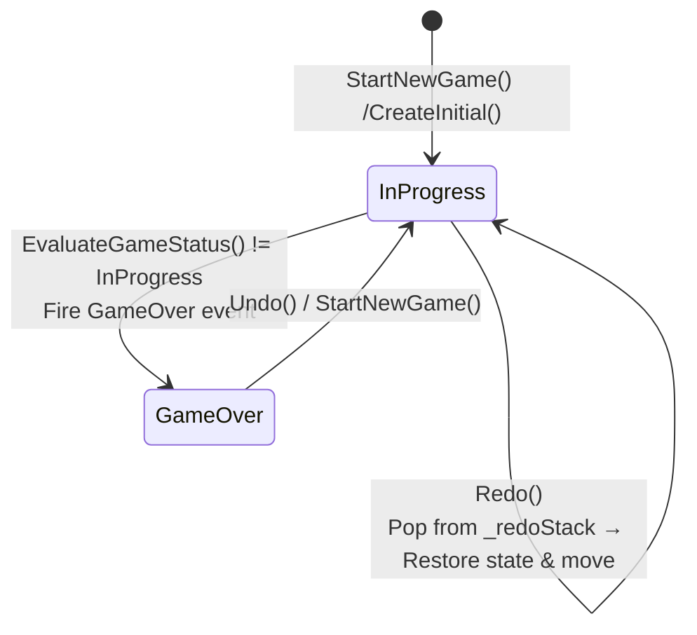
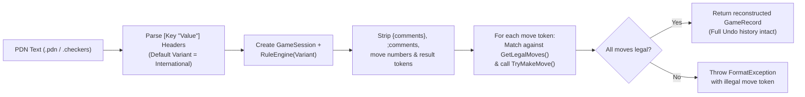

# 04 – Game record

[Back to the index](README.md)

## In short

Every move played in a match is recorded as an immutable `Move` object containing its full path, captured squares, promotion flag, and standard Draughts notation (`11-15`, `29x18x4`).

The [`GameSession`](../../src/Checkers.Core/Engine/GameSession.cs) coordinator acts as the single source of truth for an active game, managing turn transitions, linear Undo/Redo stacks, terminal win/draw evaluation, and Portable Draughts Notation (PDN) file persistence via [`GameRecordFormat`](../../src/Checkers.Core/Engine/GameRecordFormat.cs).

---

## The Move record and Draughts Notation

The domain layer uses two complementary move representations:
1. **`BitMove` (`readonly record struct`, 16 bytes):** Used inside the high-speed bitboard move generator and Negamax search tree (`ulong Captured`, `byte From`, `byte To`, `bool IsPromotion`).
2. **`Move` (`sealed record`):** Used by `GameSession`, UI view models, move history, and PDN serialization, storing the full ordered path of visited squares:

```csharp
public sealed record Move
{
    public required Position From { get; init; }
    public required Position To { get; init; }
    public required IReadOnlyList<Position> Path { get; init; }
    public required IReadOnlyList<Position> CapturedPositions { get; init; }
    public bool IsPromotion { get; init; }
    public bool IsCapture => CapturedPositions.Count > 0;
    public string Notation { get; init; } = string.Empty;
}
```

### Standard Draughts Move Notation
`Move` automatically formats standard algebraic Draughts notation using the $1\text{–}32$ dark-square numbering ([Chapter 02](02-board-and-coordinates.md)):
* **Quiet Move (`-`):** Joins start and destination with a hyphen, e.g., `11-15` or `24-19`.
* **Single Capture (`x`):** Joins start and landing square with `x`, e.g., `17x10`.
* **Multi-Jump Capture (`x`):** Joins every intermediate landing square in `Path` with `x`, e.g., `29x18x4`, unambiguously recording the exact branch taken when multiple jump paths reach the same final square.

---

## GameSession coordinator & Undo/Redo state machine

`GameSession` coordinates `IRuleEngine`, maintains synchronized state and move histories, and manages the `_redoStack`:



### Undo and Redo Invariants
Let $S = [s_0, s_1, \dots, s_k]$ be `_stateHistory` (where $s_0$ is the initial board) and $M = [m_1, \dots, m_k]$ be `_moveHistory`:
* Always $|S| = |M| + 1$, and `CurrentState` $= s_k$.
* **`Undo()`** (valid when $k \ge 1$): Pops $s_k$ and $m_k$, pushes $(s_k, m_k)$ onto `_redoStack`, and restores `CurrentState` $= s_{k-1}$.
* **`Redo()`** (valid when `_redoStack` is non-empty): Pops $(s_{k+1}, m_{k+1})$ from `_redoStack` and appends them back to $S$ and $M$.
* **Branching Guard:** Executing a new move via `TryMakeMove(m)` clears `_redoStack` so history remains strictly linear.

---

## Terminal conditions and game evaluation

After every move, `RuleEngine.EvaluateGameStatus(state, stateHashHistory)` evaluates four terminal conditions in priority order:

| Priority | Condition | Mathematical Criterion | Result (`GameStatus`) | `GameOverReason` |
|:---:|---|---|---|---|
| **1** | **Pieces Eliminated** | $\text{PopCount}(\text{OwnPieces}) = 0$ | Opponent Wins | `OpponentPiecesEliminated` |
| **2** | **No Legal Moves (Blocked)** | $\neg\text{HasAnyLegalMove}(s, \text{variant})$ | Opponent Wins | `OpponentNoLegalMoves` |
| **3** | **Forty-Move Rule** | $\text{HalfMoveClock} \ge 80$ | `Draw` | `FortyMoveRuleWithoutCaptureOrPromotion` |
| **4** | **Threefold Repetition** | $\bigl|\{i : H(s_i) = H(s_{\text{current}})\}\bigr| \ge 3$ | `Draw` | `ThreefoldRepetition` |

### 1. Opponent Pieces Eliminated (`Win`)
If the side to move has zero pieces remaining (`pos.White == 0UL` on White's turn, or `pos.Black == 0UL` on Black's turn), the opposing player wins immediately.

### 2. Blocked Legal Moves (`Win`)
In Checkers, stalemating the opponent is a **win**, not a draw. If the side to move still has pieces on the board but every piece is blocked from moving or jumping (`BitboardMoveGenerator.HasAnyLegalMove` returns `false` in $O(1)$ bitwise time), the trapped player loses.

### 3. Forty-Move Rule (`Draw`)
`HalfMoveClock` increments by $+1$ on every quiet move and resets to $0$ whenever a capture or crown-row promotion occurs:

$$\text{HalfMoveClock}_{t+1} = \begin{cases} 0 & \text{if } |\text{Captured}(m_t)| > 0 \lor \text{IsPromotion}(m_t) \\ \text{HalfMoveClock}_t + 1 & \text{otherwise} \end{cases}$$

When $\text{HalfMoveClock} \ge 80$ (40 full moves by each player without progress), the game is drawn.

### 4. Threefold Repetition (`Draw`)
Every `BoardState` carries a 64-bit `ZobristHash` encoding exact piece placements and `ActivePlayer`. `GameSession` maintains `_stateHashHistory`; if the resulting `ZobristHash` appears 3 or more times in the game's history, the game is drawn by `ThreefoldRepetition`.

---

## Game record persistence & Portable Draughts Notation (PDN)

[`GameRecordFormat.cs`](../../src/Checkers.Core/Engine/GameRecordFormat.cs) serializes and parses complete matches using the standard **Portable Draughts Notation (PDN)** format (`.pdn` / `.checkers`).

### 1. PDN File Structure & Metadata Tags
Saved files consist of seven header tag pairs followed by numbered full-move pairs:

```pdn
[Event "Checkers Match"]
[Variant "International"]
[GameMode "HumanVsComputer"]
[TimeControlMode "TimePerGame"]
[Depth "8"]
[SecondsPerMove "5"]
[MinutesPerGame "5"]

1. 21-17 11-15 2. 23-19 8-11 3. 17-14 9x18 4. 22x15 11x18
```

### 2. Parsing & Replay Verification Pipeline



Because `GameRecordFormat.Parse` replays every move through `GameSession.TryMakeMove` from the initial board, loading a file reconstructs the full `_stateHistory` and `_moveHistory`, allowing the user to immediately press **Undo** (`Ctrl+Z`) to step backward through a loaded game.
