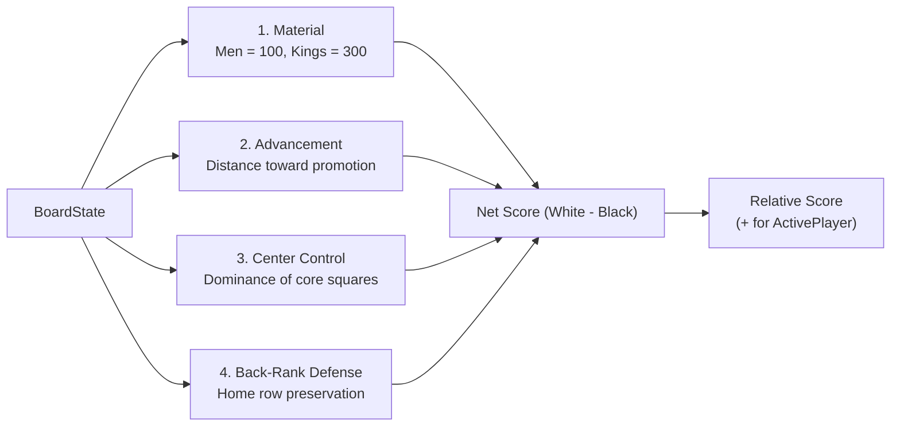

# 05 – Evaluation

[Back to the index](README.md)

## In short

When the search tree reaches a leaf node (at depth 0) or evaluates non-terminal positions, the engine cannot search further and must judge who is winning. This judgment is provided by the static evaluation function `IEvaluationFunction`, implemented in `EvaluationFunction.cs`.

The evaluation computes a heuristic score in centipawns (where 100 centipawns $\approx$ 1 regular man) relative to the **active player**:
* Positive values favor the active player.
* Negative values favor the opponent.
* Zero represents dynamic equality.

---

## Evaluation terms

The score is composed of four distinct strategic elements:

### 1. Material Balance
Material is the single most dominant factor in draughts. Kings are substantially more agile than men due to their flying ability:
* **Man:** 100 points
* **King:** 300 points (3x value of a regular man)

$$\text{MaterialScore} = 100 \cdot (\text{Men}) + 300 \cdot (\text{Kings})$$

### 2. Piece Advancement
Regular men are encouraged to march forward toward the opposing back row to achieve promotion:
* **White Advancement:** $(7 - \text{Row}) \times 5$ points. (A man on row 1 receives $+30$, just one hop away from crowning).
* **Black Advancement:** $\text{Row} \times 5$ points. (A man on row 6 receives $+30$).

### 3. Center Control
The central dark squares—specifically squares **14, 15, 18, and 19** (rows 3 and 4, columns 2 through 5)—command key diagonal crossroads across the board. Pieces occupying these central squares enjoy greater mobility and restrict opponent crossings:
* **Center Bonus:** $+12$ points per piece.

### 4. Back-Rank Defense
Leaving men on a player's home row (Row 7 for White; Row 0 for Black) serves as a fortress against early enemy kinging. Vacating home-row squares too early creates corridors for enemy men to promote.
* **Back-Rank Defense Bonus:** $+15$ points per piece stationed on its initial back rank.

---

## Negamax Formulation

Rather than alternating between a maximizing function for White and a minimizing function for Black, the engine uses the elegant **Negamax** convention:

$$\text{Evaluate}(s) = \begin{cases} \text{WhiteScore} - \text{BlackScore} & \text{if ActivePlayer is White} \\ \text{BlackScore} - \text{WhiteScore} & \text{if ActivePlayer is Black} \end{cases}$$

This ensures that regardless of who is moving, the active player always strives to maximize the returned score.
