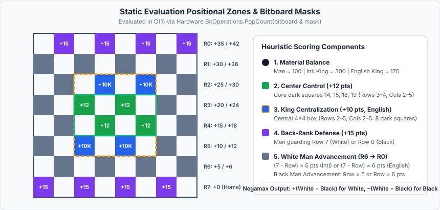

# 05 – Evaluation

[Back to the index](README.md)

## In short

When the search tree reaches its depth horizon (`depth == 0` and no further tactical captures exist in quiescence search), the engine estimates the strategic value of the quiet board position using [`EvaluationFunction.cs`](../../src/Checkers.Core/AI/EvaluationFunction.cs) (with the earlier baseline heuristic preserved in [`LegacyEvaluationFunction.cs`](../../src/Checkers.Core/AI/LegacyEvaluationFunction.cs) for A/B benchmarking and self-play matches).

The evaluation operates directly on 64-bit [`BitPosition`](11-bitboards.md) structs (`int Evaluate(in BitPosition pos, CheckersVariant variant)`) with **zero heap allocations**, returning a score in **centipawns** (where $100\text{ cp} = 1\text{ regular man}$) from the perspective of `SideToMove`:
* **Positive ($> 0$):** The active player has a material or positional advantage.
* **Zero ($0$):** Dynamic balance.
* **Negative ($< 0$):** The opponent has the advantage.

In **Phase 6** ([Chapter 12 – Milestone 8](12-engine-improvements.md#milestone-8-phase-6-static-evaluation-overhaul--200-game-bot-vs-bot-verification)), the static evaluator was upgraded with a hardware `POPCNT`-vectorized, $2\times$-scaled centipawn port of [`board_eval.c`](../../Checkers-Engine-main/src/engine/board_eval.c) for **English Checkers** (`+143.1 ± 42.9 Elo`, `69.5 / 100` in 100-game self-play) and a domain-adapted **Flying Kings** evaluation for **International Draughts** (`+45.4 ± 37.8 Elo`, `56.5 / 100` in 100-game self-play).

---

## Architecture & Variant Specialization

Although English Checkers and International ($8 \times 8$ Brazilian/Flying Kings) Draughts share the same 32 dark squares and 64-bit bitboard layout (`sq = (row << 3) | col`), their strategic dynamics differ fundamentally in three ways:
1. **King Mobility & Material Ratio:** An English 1-step King is worth **$1.40\times$ a Man (`140 cp`)**, so two Men (`200 cp`) outweigh a single King (`140 cp`). An International **Flying King** slides and jumps any distance along diagonals and is worth **$3.00\times$ a Man (`300 cp`)**, so a single Flying King (`300 cp`) decisively outweighs two Men (`200 cp`).
2. **Crowning Swing & Long-Range King Reach:** In English Checkers, crowning a Man yields a modest $+40\text{ cp}$ material gain (`100 cp` $\to$ `140 cp`) and a 1-step King, allowing flank lock patterns (`Right Lock`, `Dog`) and late-only linear advancement (`totalPieces <= 12`). In International Draughts, crowning a Flying King produces a massive **$+200\text{ cp}$ promotion swing** (`100 cp` $\to$ `300 cp`) and unleashes full-diagonal ray attacks from behind, making continuous Man advancement (`+5` $\to$ `+6 cp/rank`) and full 4-square back-rank defense (`+15 cp`) critical across all game phases.
3. **Piece-Count vs. Material-Gated Simplification:** In English Checkers, having strictly more total pieces (`whiteCount > blackCount`) reliably indicates a material lead. In International Draughts, a player with `1 Flying King + 2 Men` (`3 pieces = 500 cp`) has *fewer* pieces than an opponent with `4 Men` (`4 pieces = 400 cp`) while leading by `+100 cp` in material; therefore, International simplification bonuses must be gated on **material advantage** (`>= 80 cp`) rather than raw piece count.

```mermaid
flowchart TD
    Pos["BitPosition (in pos)<br/>WM, WK, BM, BK (4 × ulong)"] --> Branch{"CheckersVariant?"}

    subgraph English["EvaluateEnglish(in pos) — 1:1 board_eval.c Port (2× Centipawn Scale)"]
        E1["1. Material: Man = 100 cp, King = 140 cp"]
        E2["2. Man PST (WhiteManPst1/2/3Mask):<br/>Back rank (7,2/4/6)=+6, Outposts (2,3)=+6, (2,5)=+4, Center=+2"]
        E3["3. Endgame Man Advancement (totalPieces &lt;= 12):<br/>+2 cp × ranks advanced"]
        E4["4. Runaway Checkers (ConeWhite / ConeBlack):<br/>+(40 + 6 × advance) when enemyKings == 0 &amp; cone clear"]
        E5["5. King Tail Pins (+10 cp) + English King PST (+8/+10 cp)<br/>+ Single-Corner Trap Penalty (−40 cp on (0,7)/(7,0))"]
        E6["6. Simplification Bonus (whiteCount &gt; blackCount):<br/>+20 cp (&gt;6 pcs) up to +400 cp (&lt;=2 pcs)"]
        E7["7. Classical Structural Patterns:<br/>Right Lock (+40), Bridge (+30), Triangle (+20), Oreo (+20), Dog (+10)"]
        E1 --> E2 --> E3 --> E4 --> E5 --> E6 --> E7
    end

    subgraph International["EvaluateInternational(in pos) — Flying Kings Adaptation"]
        I1["1. Material: Man = 100 cp, Flying King = 300 cp"]
        I2["2. Continuous Man Advancement:<br/>+5 cp/rank (opening/mid) → +6 cp/rank (totalPieces &lt;= 12)"]
        I3["3. Positional Masks:<br/>Center (+12), Full Back Rank (+15), Man PST Nuances (+2/+4/+6)"]
        I4["4. Runaway Checkers (ConeWhite / ConeBlack):<br/>+(40 + 6 × advance) when enemyKings == 0 &amp; cone clear"]
        I5["5. King Tail Pins (+10 cp) + Flying King Long-Diagonal PST (+12 cp)<br/>+ Inner Ring (+6 cp) − Short-Corner Penalty (−20 cp)"]
        I6["6. Material-Gated Simplification Bonus (materialDiff &gt;= 80 cp):<br/>Scales from +18 cp up to +400 cp as opponent pieces decrease"]
        I7["7. Back-Rank Structural Formations:<br/>Bridge (+18), Triangle (+12), Oreo (+12)"]
        I1 --> I2 --> I3 --> I4 --> I5 --> I6 --> I7
    end

    Branch -->|"English"| English
    Branch -->|"International"| International
    English --> Net["Net = WhiteScore − BlackScore<br/>Return +Net (White) or −Net (Black)"]
    International --> Net
```

---

## Complete Mathematical Formulation

Let $W_M, W_K, B_M, B_K \in \mathbb{U}_{64}$ denote the four 64-bit bitboards of a position $s$, with $W = W_M \cup W_K$, $B = B_M \cup B_K$, $A = W \cup B$, and let $|\cdot|$ denote the hardware population count (`BitOperations.PopCount`).

### 1. English Checkers Evaluation (`EvaluateEnglish`)

For English Checkers ($v = \text{English}$), every weight from [`board_eval.c`](../../Checkers-Engine-main/src/engine/board_eval.c) is scaled by exact factor $2\times$ so that $1\text{ Man} = 100\text{ cp}$ matches the search engine's pruning margins (`RfpMargin = 40`, `FutilityMargin = 60`, `DominantMoveMargin = 150`):

$$\text{Score}_{\text{White}}^{\text{Eng}}(s) = E_{\text{mat}}^{\text{Eng}} + E_{\text{pst}}^{M} + E_{\text{adv}}^{\text{late}} + E_{\text{runaway}} + E_{\text{pins}} + E_{\text{pst}}^{K,\text{Eng}} + E_{\text{trade}}^{\text{Eng}} + E_{\text{patterns}}^{\text{Eng}}$$

#### 1.1 Material & Vectorized Piece-Square Tables ($E_{\text{mat}}^{\text{Eng}}, E_{\text{pst}}^{M}, E_{\text{pst}}^{K,\text{Eng}}$)
Because `piece_pos_map_p1` in `board_eval.c` uses only weights $\{1, 2, 3\}$ (`+2, +4, +6 cp`) and `king_pos_map` uses only weights $\{4, 5\}$ (`+8, +10 cp`), all Piece-Square Tables are evaluated across all pieces simultaneously in $O(1)$ using precomputed 64-bit bitmasks:

$$E_{\text{mat}}^{\text{Eng}}(W_M, W_K) = 100 \cdot |W_M| + 140 \cdot |W_K|$$

$$E_{\text{pst}}^{M}(W_M) = 2 \cdot |W_M \cap M_{\text{pst1}}^{W}| + 4 \cdot |W_M \cap M_{\text{pst2}}^{W}| + 6 \cdot |W_M \cap M_{\text{pst3}}^{W}|$$

$$E_{\text{pst}}^{K,\text{Eng}}(W_K) = 8 \cdot |W_K \cap M_{\text{kpst4}}| + 10 \cdot |W_K \cap M_{\text{kpst5}}| - 40 \cdot \mathbb{I}\bigl(W_K \cap \{(0,7)\} \neq \emptyset\bigr)$$

| Bitmask Constant | Hex Value (`ulong`) | Target Squares `(row, col)` | Centipawn Weight | Strategic Purpose |
| :--- | :--- | :--- | :---: | :--- |
| `WhiteManPst1Mask` | `0x0080142814000000` | `(3,2), (3,4), (4,3), (4,5), (5,2), (5,4), (6,7)` | **`+2 cp`** | Central dark squares + `(6,7)` side tempo |
| `WhiteManPst2Mask` | `0x0000000000200000` | `(2,5)` | **`+4 cp`** | Advanced kingside outpost |
| `WhiteManPst3Mask` | `0x5400000000080000` | `(2,3), (7,2), (7,4), (7,6)` | **`+6 cp`** | Central `(2,3)` outpost + 3 core back-rank squares |
| `BlackManPst1Mask` | `0x0000002814280100` | `(4,5), (4,3), (3,4), (3,2), (2,5), (2,3), (1,0)` | **`+2 cp`** | 180°-rotated (`63 - sq`) Black central + tempo mask |
| `BlackManPst2Mask` | `0x0000040000000000` | `(5,2)` | **`+4 cp`** | 180°-rotated Black advanced outpost |
| `BlackManPst3Mask` | `0x000010000000002A` | `(5,4), (0,5), (0,3), (0,1)` | **`+6 cp`** | 180°-rotated Black `(5,4)` outpost + back-rank core |
| `EnglishKingPst4Mask` | `0x0000040810200000` | `(2,5), (3,4), (4,3), (5,2)` | **`+8 cp`** | Central main-diagonal spine |
| `EnglishKingPst5Mask` | `0x00205020040A0400` | `(1,2), (2,1), (2,3), (3,2), (4,5), (5,4), (5,6), (6,5)` | **`+10 cp`** | Double-diagonal inner control ring |
| `WhiteSingleCornerKingMask` | `0x0000000000000080` | `(0,7)` (Black: `(7,0)` = `0x0100000000000000`) | **`-40 cp`** | Penalizes a 1-step King trapped in the single corner |

#### 1.2 Late-Game Man Advancement ($E_{\text{adv}}^{\text{late}}$)
In English Checkers, advancing Men indiscriminately in the opening weakens the back rank. Following `board_eval.c`, linear Man advancement turns on **only when $|A| \le 12$**:

$$E_{\text{adv}}^{\text{late}}(W_M) = \mathbb{I}(|A| \le 12) \cdot 2 \sum_{r=0}^{6} (7 - r) \cdot |W_M \cap R_r|, \qquad E_{\text{adv}}^{\text{late}}(B_M) = \mathbb{I}(|A| \le 12) \cdot 2 \sum_{r=1}^{7} r \cdot |B_M \cap R_r|$$

#### 1.3 Runaway Checkers / Unstoppable Passers ($E_{\text{runaway}}$)
At startup, `EvaluationFunction` precomputes 64-entry forward promotion cone bitmasks `ConeWhite[64]` and `ConeBlack[64]`:

$$\text{Cone}_{\text{White}}(r, c) = \bigcup_{k=1}^{r} \bigcup_{\substack{\Delta c \in [-k, k] \\ \Delta c \equiv k \pmod 2}} \bigl\{(r - k,\, c + \Delta c)\bigr\}$$

When the opponent has **no Kings** ($B_K = \emptyset$), a White Man at square $q = (r, c)$ whose forward cone contains no pieces ($\text{Cone}_{\text{White}}(q) \cap A = \emptyset$) and that has no enemy Men on any rank ahead of $r$ cannot be caught from behind or intercepted from the side:

$$E_{\text{runaway}}(W_M, B_M, B_K) = \mathbb{I}(B_K = \emptyset) \sum_{q \in W_M} \mathbb{I}\bigl(\text{Cone}_{\text{White}}(q) \cap A = \emptyset \;\wedge\; r_q \le r_{\min}(B_M)\bigr) \cdot \bigl(40 + 6(7 - r_q)\bigr)$$

Using `BitOperations.TrailingZeroCount(bm)` and `BitOperations.LeadingZeroCount(wm)`, candidate Men are pre-filtered with a single bitmask before the loop so **zero loop iterations execute** during the opening and middlegame when back ranks are occupied.

#### 1.4 King Tail Pins ($E_{\text{pins}}$)
A King standing directly behind two consecutive enemy Men on the same diagonal pins the rear Man against the front Man (`tail_pins` in `board_eval.c:395-406`), evaluated in $O(1)$ across the entire board via parallel bitshifts:

$$P_{\text{White}} = \bigl((W_K \cap C_{0..5}) \cap (B_M \gg 9) \cap (B_M \gg 18)\bigr) \;\cup\; \bigl((W_K \cap C_{2..7}) \cap (B_M \gg 7) \cap (B_M \gg 14)\bigr)$$

$$E_{\text{pins}}(W_K, B_M) = 10 \cdot |P_{\text{White}}|$$

#### 1.5 Simplification Bonus ($E_{\text{trade}}^{\text{Eng}}$) & Structural Patterns ($E_{\text{patterns}}^{\text{Eng}}$)
When one side has strictly more pieces ($|W| > |B|$), `CalculatePieceBonus(|W|)` awards a non-linear bonus that increases as pieces are traded off (`>6` pcs: `+20 cp`; `6` pcs: `+60 cp`; `5` pcs: `+120 cp`; `4` pcs: `+200 cp`; `3` pcs: `+300 cp`; `<=2` pcs: `+400 cp`), driving the engine to simplify winning positions into clean endgames.

In addition, five classical Checkers formations from `board_eval.c` are detected in $O(1)$ using bitwise mask comparisons:

| Pattern Name | White Bitmask(s) | Black Bitmask(s) (`180°` Mirror) | Bonus | Strategic Meaning |
| :--- | :--- | :--- | :---: | :--- |
| **Right Lock** | `wm & (4,7)` and `bm & (3,6)` | `bm & (3,0)` and `wm & (4,1)` | **`+40 cp`** | Flank Man locks enemy Man against the board edge |
| **Bridge** | `wm` covers `(7,2) & (7,6)` | `bm` covers `(0,1) & (0,5)` | **`+30 cp`** | Classic two-man back-rank bridge defense |
| **Triangle** | `wm` covers `(7,4), (7,6), (6,5)` | `bm` covers `(0,1), (0,3), (1,2)` | **`+20 cp`** | Solid three-man defensive pyramid on the crown rank |
| **Oreo** | `wm` covers `(7,2), (7,4), (6,3)` | `bm` covers `(0,3), (0,5), (1,4)` | **`+20 cp`** | Central back-rank triangle formation |
| **Dog** | `wm & (7,6)` and `bm & (6,7)` | `bm & (0,1)` and `wm & (1,0)` | **`+10 cp`** | Back-rank defender immobilizing an advanced flank Man |

> [!NOTE]
> **Why `board_eval.c` Outperformed a Full Cake 1.89g Port in Fixed-Time Self-Play (Phase 6c Experiment):**
> We also tested a complete 1:1 C# port of Martin Fierz's **Cake 1.89g** parameterized evaluator (`cake_eval_parametrized.c`, including `materialeval[13^4]`, `backrank[65536]`, and all 8 sections of `fineevaluation()`). While Cake's evaluator beat `LegacyEvaluationFunction` (`66.0 / 100`, `+115.2 ± 41.9 Elo`), its $7\times$ higher leaf latency (`62.1 ns/eval` vs. `8.8 ns/eval`) cost `1.19 plies` of average search depth at `1000 ms/move` and trailed our `POPCNT`-vectorized `board_eval.c` port (`69.5 / 100`, **`+143.1 ± 42.9 Elo`**) by **`27.9 Elo`**. See [Chapter 12 – Milestone 8](12-engine-improvements.md#1-english-checkers--100-game-match-neweval-vs-legacyeval-1000-msmove) for the full comparison.

---

### 2. International Draughts (Flying Kings) Evaluation (`EvaluateInternational`)

In International ($8 \times 8$ Flying Kings) Draughts, `EvaluateInternational` combines the shared `board_eval.c` terms (`WhiteManPst`/`BlackManPst`, `ConeWhite`/`ConeBlack` Runaway Checkers, `tail_pins`, and back-rank `Bridge`/`Triangle`/`Oreo` formations) with three $O(1)$ Flying-King-specific adaptations:

1. **Flying King Material (`300 cp`) & Continuous Man Advancement (`+5` → `+6 cp/rank`):**
   Because crowning a Flying King yields a `+200 cp` material jump (`100 cp` $\to$ `300 cp`), Men receive continuous advancement credit (`+5 cp/rank` when $|A| > 12$, increasing to `+6 cp/rank` when $|A| \le 12$), balanced by full 4-square back-rank defense (`+15 cp` on all 4 home squares including the long-diagonal apex `(7,0)`/`(0,7)`) and central 16-square control (`+12 cp`).
2. **Flying King Long-Diagonal & Short-Corner PST:**
   - **8-Square Main Long Diagonal (`FlyingKingMainDiagonalMask = 0x0102040810204080UL`):** **`+12 cp`**. Unlike a 1-step English King, a Flying King on `(0,7)` or `(7,0)` is **not** trapped—it commands all 8 squares of the main diagonal in a single move.
   - **Double-Diagonal & Inner Ring (`FlyingKingInnerMask`):** **`+6 cp`**.
   - **Cramped 2-Square Short Corners (`FlyingKingShortCornerMask = 0x4080000000000102UL`, squares `(0,1), (1,0), (6,7), (7,6)`):** **`-20 cp`**.
3. **Material-Gated Simplification Bonus (`CalculateInternationalTradeBonus`):**
   Awarded **only when a player leads in material by at least `80 cp`** ($E_{\text{mat}}^{\text{White}} - E_{\text{mat}}^{\text{Black}} \ge 80$), and indexed by the **opponent's remaining piece count** ($|B|$):

   $$E_{\text{trade}}^{\text{Intl}}(W, B) = \mathbb{I}\bigl(E_{\text{mat}}^{\text{White}} - E_{\text{mat}}^{\text{Black}} \ge 80\bigr) \cdot \text{TradeBonus}(|B|)$$

   where $\text{TradeBonus}(|B|)$ rises from `+3 cp` per traded enemy piece in the middlegame up to `+45 cp` ($|B|=4$), `+65 cp` ($|B|=3$), `+90 cp` ($|B|=2$), `+120 cp` ($|B|=1$), and `+400 cp` ($|B|=0$). This guarantees that a player with `1 Flying King` (`300 cp`) vs. `2 Men` (`200 cp`) is recognized as `+100 cp` ahead in material (`+90 cp` trade bonus to the Flying King side) rather than awarding a piece-count bonus to the 2 Men.

> [!NOTE]
> **Why Simpler $O(1)$ Bitmasks Outperformed Heavier Scan 3.1 Ray-Mobility Terms on $8 \times 8$ (Phase 6b Experiment):**
> We also tested porting five features from Fabien Letouzey's $10 \times 10$ International Draughts engine **Scan 3.1** (`scan_31/src/eval.cpp`): First-King material premium (`315 cp` vs. `285 cp`), per-King ray reachability (`safe` vs. `deny` mobility against enemy Man jump threats), Left/Right Wing Skew, tempo phase interpolation, and endgame draw scaling (`2K vs. 1K` scaled by `/ 8`).
> In a 100-game match at `1000 ms/move`, the Scan-enhanced candidate scored **`56.0 / 100` (`+20 =72 −8`, `+41.9 ± 35.9 Elo`)**, slightly **below** the simpler Phase 6 evaluator's **`56.5 / 100` (`+22 =69 −9`, `+45.4 ± 37.8 Elo`)**. Because the per-King ray-mobility loop and wing-skew popcounts doubled raw evaluation latency (`13.1 ns/eval` $\to$ `26.4–31.3 ns/eval`) and draw scaling compressed endgame pruning margins, average search depth dropped by **`1.19 plies`** (`24.12 plies` $\to$ `22.93 plies`). On an $8 \times 8$ board, Phase 6's $O(1)$ diagonal masks (`FlyingKingMainDiagonalMask`, `FlyingKingInnerMask`, `FlyingKingShortCornerMask`) already capture the primary Flying-King geometry while preserving `+1.2 plies` of deeper tactical search, so the simpler Phase 6 `EvaluateInternational` was retained.

---

## Negamax Sign Convention

Rather than maintaining separate `Maximize` and `Minimize` functions in the search tree, `EvaluationFunction.Evaluate` returns the net score oriented toward `SideToMove`:

$$\text{Evaluate}(s, v) = \begin{cases} +\bigl(\text{Score}_{\text{White}}(s, v) - \text{Score}_{\text{Black}}(s, v)\bigr) & \text{if SideToMove} = \text{White} \\ -\bigl(\text{Score}_{\text{White}}(s, v) - \text{Score}_{\text{Black}}(s, v)\bigr) & \text{if SideToMove} = \text{Black} \end{cases}$$

Every node in the Negamax search tree ([Chapter 07](07-search.md)) simply maximizes $-V(\text{child})$.

---

## Empirical Speed & Self-Play Match Results

For full benchmark tables—including the **10,000,000-evaluation raw speed microbenchmark**, the **40-position fixed-depth search comparison**, and the **Bot-vs-Bot self-play match results**—see [Chapter 12 – Milestone 8 (Phase 6): Static Evaluation Overhaul & 200-Game Bot-vs-Bot Verification](12-engine-improvements.md#milestone-8-phase-6-static-evaluation-overhaul--200-game-bot-vs-bot-verification).
