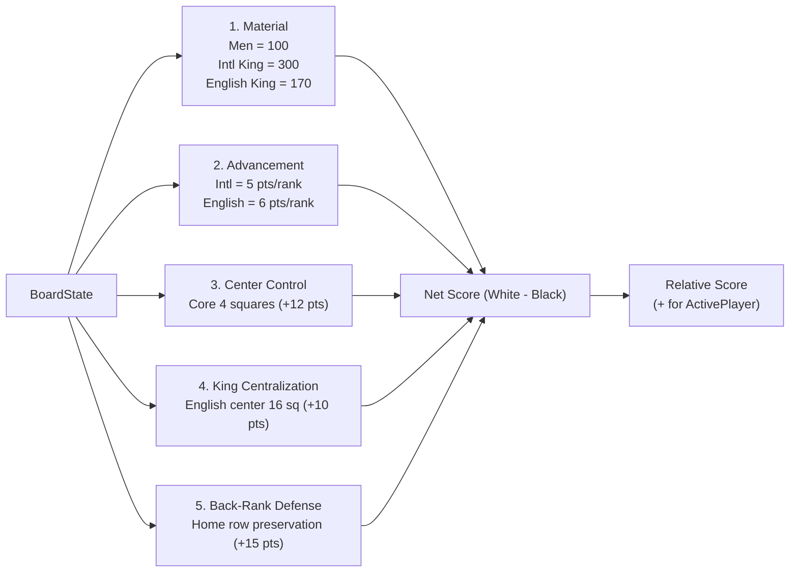

# 05 – Evaluation

[Back to the index](README.md)

## In short

When the search tree reaches a leaf node (at depth 0) or evaluates non-terminal positions, the engine cannot search further and must judge who is winning. This judgment is provided by the static evaluation function `IEvaluationFunction`, implemented in `EvaluationFunction.cs`.

The evaluation computes a heuristic score in centipawns (where 100 centipawns $\approx$ 1 regular man) relative to the **active player**:
* Positive values favor the active player.
* Negative values favor the opponent.
* Zero represents dynamic equality.

---

## Evaluation terms

The score is composed of variant-tailored strategic elements evaluated by `EvaluationFunction.cs`:

### 1. Material Balance
Material is the single most dominant factor in draughts. King values are dynamically adjusted according to the active variant:
* **Regular Man:** 100 points (both variants).
* **International Flying King:** **300 points** (3x regular man). Reflects the immense strategic reach and tactical supremacy of multi-square sliding diagonals across an open 8x8 board.
* **English King (1-Step):** **170 points** (~1.7x regular man). In English Checkers, a King moves strictly 1 square at a time. While retaining multi-directional agility, its localized range limits its board dominance compared to a flying king.

$$\text{MaterialScore} = 100 \cdot (\text{Men}) + K_{\text{variant}} \cdot (\text{Kings})$$

where $K_{\text{International}} = 300$ and $K_{\text{English}} = 170$.

### 2. Piece Advancement
Regular men are encouraged to march forward toward the opposing back row to achieve promotion:
* **International Advancement:** $(7 - \text{Row}) \times 5$ for White; $\text{Row} \times 5$ for Black.
* **English Advancement:** $(7 - \text{Row}) \times 6$ for White; $\text{Row} \times 6$ for Black. In English Checkers, advancing men is weighted higher (+6 pts/step) to drive kinging races.

### 3. Center Control
The central dark squares—specifically squares **14, 15, 18, and 19** (rows 3 and 4, columns 2 through 5)—command key diagonal crossroads across the board. Pieces occupying these central squares enjoy greater mobility and restrict opponent crossings:
* **Center Bonus:** $+12$ points per piece.

### 4. King Centralization (English Checkers)
In English Checkers, short-range kings on the outer board edges or corners are vulnerable to entrapment and have restricted diagonal choices (only 1 or 2 exits). Kings controlling the central 16 squares (ranks 2 through 5 and columns 2 through 5) command up to 4 open diagonal directions:
* **King Centralization Bonus:** $+10$ points per English King in the 16-square central box.

### 5. Back-Rank Defense
Leaving men on a player's home row (Row 7 for White; Row 0 for Black) serves as a fortress against early enemy kinging. Vacating home-row squares too early creates corridors for enemy men to promote.
* **Back-Rank Defense Bonus:** $+15$ points per piece stationed on its initial back rank.

---

## Negamax Formulation

Rather than alternating between a maximizing function for White and a minimizing function for Black, the engine uses the elegant **Negamax** convention:

$$\text{Evaluate}(s) = \begin{cases} \text{WhiteScore} - \text{BlackScore} & \text{if ActivePlayer is White} \\ \text{BlackScore} - \text{WhiteScore} & \text{if ActivePlayer is Black} \end{cases}$$

This ensures that regardless of who is moving, the active player always strives to maximize the returned score.
