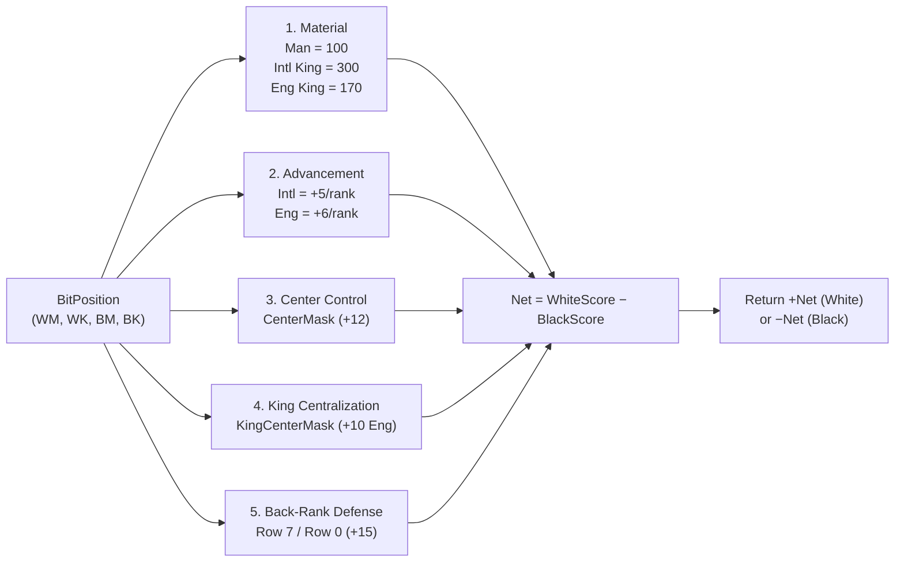

# 05 – Evaluation

[Back to the index](README.md)

## In short

When the search tree reaches its depth horizon (`depth == 0` and no further tactical captures exist in quiescence search), the engine must estimate the strategic value of the quiet board position. This judgment is computed by [`EvaluationFunction.cs`](../../src/Checkers.Core/AI/EvaluationFunction.cs).

The evaluation returns a score in **centipawns** (where $100\text{ points} = 1\text{ regular man}$) from the perspective of the **side to move** (`SideToMove`):
* **Positive ($> 0$):** The active player has a material or positional advantage.
* **Zero ($0$):** Dynamic balance.
* **Negative ($< 0$):** The opponent has the advantage.

---

## Complete mathematical formulation

Let $W_M, W_K, B_M, B_K \in \mathbb{U}_{64}$ denote the four 64-bit bitboards of a position $s$, with $W = W_M \cup W_K$ and $B = B_M \cup B_K$, and let $|\cdot|$ denote the population count (`BitOperations.PopCount`, compiled to the hardware `POPCNT` instruction).

For rule variant $v \in \{\text{International}, \text{English}\}$, the total static score for White is:

$$\text{Score}_{\text{White}}(s, v) = E_{\text{mat}}(W_M, W_K, v) + E_{\text{adv}}(W_M, v) + E_{\text{center}}(W) + E_{\text{king}}(W_K, v) + E_{\text{back}}(W_M)$$

and symmetrically for Black:

$$\text{Score}_{\text{Black}}(s, v) = E_{\text{mat}}(B_M, B_K, v) + E_{\text{adv}}(B_M, v) + E_{\text{center}}(B) + E_{\text{king}}(B_K, v) + E_{\text{back}}(B_M)$$

---

## Evaluation terms in detail

### 1. Material Balance ($E_{\text{mat}}$)
Material is the dominant factor in Draughts, and King weights are calibrated to each variant's geometry:

$$E_{\text{mat}}(M, K, v) = 100 \cdot |M| + K_v \cdot |K|, \qquad K_v = \begin{cases} 300 & \text{if } v = \text{International} \\ 170 & \text{if } v = \text{English} \end{cases}$$

* **Regular Man (`100` pts):** Baseline unit of material in both variants.
* **International Flying King (`300` pts):** Worth **3 regular men**, reflecting the immense tactical dominance of long-range diagonal flight and distant jump threats across an open $8 \times 8$ board.
* **English 1-Step King (`170` pts):** Worth **1.7 regular men**. Because an English King moves only 1 square at a time, two well-coordinated men (or a man supported by a king) can restrict it, matching classic English Checkers heuristics (where a king is valued between $1.5\times$ and $1.75\times$ a man).

### 2. Piece Advancement ($E_{\text{adv}}$)
Regular men are rewarded for each rank advanced toward their promotion row (`Row 0` for White; `Row 7` for Black). Let $R_r$ be the 8-bit mask for row $r \in \{0, \dots, 7\}$:

$$E_{\text{adv}}(W_M, v) = A_v \sum_{r=0}^{6} (7 - r) \cdot |W_M \cap R_r|, \qquad E_{\text{adv}}(B_M, v) = A_v \sum_{r=1}^{7} r \cdot |B_M \cap R_r|$$

where the step bonus $A_v$ is:
* **$A_{\text{International}} = 5\text{ pts/rank}$** (up to $+30\text{ pts}$ on the penultimate rank before crowning).
* **$A_{\text{English}} = 6\text{ pts/rank}$** (up to $+36\text{ pts}$ on the penultimate rank, encouraging tempo in English Checkers crowning races).

### 3. Center Control ($E_{\text{center}}$)
The four innermost dark squares—Draughts squares **14, 15, 18, and 19** (`Rows 3–4, Cols 2–5`, `BitboardMasks.CenterMask = 0x0000142800000000UL`)—command the main diagonal crossroads of the board:

$$E_{\text{center}}(P) = 12 \cdot |P \cap M_{\text{center}}|$$

Pieces occupying these squares enjoy maximum branching mobility and restrict opponent flank transitions.

### 4. King Centralization ($E_{\text{king}}$, English Checkers)
In English Checkers, a 1-step king trapped on the outer board edge has only 1 or 2 diagonal exits and can be pinned by an opposing king. Kings positioned inside the central $4 \times 4$ box (`Rows 2–5, Cols 2–5`, `BitboardMasks.KingCenterMask = 0x0014281428000000UL`, containing 8 dark squares) command all 4 diagonal directions:

$$E_{\text{king}}(K, v) = \begin{cases} 10 \cdot |K \cap M_{\text{kingCenter}}| & \text{if } v = \text{English} \\ 0 & \text{if } v = \text{International} \end{cases}$$

### 5. Back-Rank Defense ($E_{\text{back}}$)
Men stationed on a player's own home rank (`Row 7` for White, squares 29–32; `Row 0` for Black, squares 1–4) act as a fortress preventing enemy men from landing on the crown row:

$$E_{\text{back}}(W_M) = 15 \cdot |W_M \cap R_7|, \qquad E_{\text{back}}(B_M) = 15 \cdot |B_M \cap R_0|$$

Because the $+15\text{ pt}$ back-rank bonus exceeds the $+5\text{ pt}$ or $+6\text{ pt}$ single-step advancement reward, the AI naturally preserves its back-rank defenders until developing them is tactically justified.

---

## Negamax Sign Convention

Rather than maintaining separate `Maximize` and `Minimize` functions in the search tree, `EvaluationFunction.Evaluate` returns the net score oriented toward `SideToMove`:

$$\text{Evaluate}(s, v) = \begin{cases} +\bigl(\text{Score}_{\text{White}}(s, v) - \text{Score}_{\text{Black}}(s, v)\bigr) & \text{if SideToMove} = \text{White} \\ -\bigl(\text{Score}_{\text{White}}(s, v) - \text{Score}_{\text{Black}}(s, v)\bigr) & \text{if SideToMove} = \text{Black} \end{cases}$$

Every node in the Negamax search tree ([Chapter 07](07-search.md)) simply maximizes $-V(\text{child})$.
