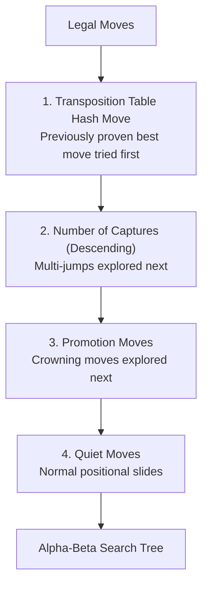

# 06 – Move ordering

[Back to the index](README.md)

## In short

In game-tree search, the efficiency of **Alpha-Beta pruning** depends heavily on the order in which moves are searched:
* **Worst ordering:** If moves are explored from worst to best, no branches are pruned, and the engine must visit all $O(b^d)$ positions (same as brute-force minimax).
* **Optimal ordering:** If the best move is explored first at every node, Alpha-Beta searches only $O(b^{d/2})$ positions—effectively **doubling the depth** the engine can reach in the same time!

---

## Move ordering pipeline in `MinimaxPlayer`

`MinimaxPlayer.cs` sorts candidate legal moves before traversing recursive branches:



### 1. Hash Move from Transposition Table
Before searching children at any node, the engine probes the 64-bit Zobrist Transposition Table (`TranspositionTable.TryProbe`). If an entry exists for the current position with a stored `BestMoveFrom` and `BestMoveTo`, that **Hash Move** is immediately moved to index 0 of candidate moves. In iterative deepening, this guarantees that the principal variation from iteration $d-1$ is examined first at iteration $d$.

### 2. Multi-Jumps First
Moves that capture 2 or more pieces dramatically shift material and create immediate tactical threats. Searching multi-jumps first rapidly raises $\alpha$ (the lower bound), allowing subsequent inferior moves to be pruned immediately.

### 3. Single Captures
Under the mandatory capture rule, if any capture is available, only captures are generated. Ordering captures by piece count guarantees that the most devastating tactical blows are evaluated before smaller exchanges.

### 4. Promotions
Advancing a man onto the crown row generates an agile King (Flying King in International, or 1-step King in English Checkers). Promotions are explored immediately following captures.

### 5. Quiet Moves
Positional slides that do not capture or promote are evaluated last.

### 6. Principal Variation (PV) Ordering at Root
At the root of the search tree during iterative deepening, the best move found in each finished depth iteration is dynamically moved to the head of `currentOrder`:

```csharp
currentOrder.Remove(bestMoveThisDepth);
currentOrder.Insert(0, bestMoveThisDepth);
```

This ensures that subsequent iterations immediately examine the current best move with the widest possible $\alpha$-$\beta$ window.

---

## Code implementation

In `MinimaxPlayer.cs`:

```csharp
private static IReadOnlyList<Move> OrderMoves(IEnumerable<Move> moves, Move? ttMove = null)
{
    var list = moves
        .OrderByDescending(m => m.CapturedPositions.Count) // Multi-jumps first
        .ThenByDescending(m => m.IsPromotion ? 1 : 0)     // Promotions next
        .ToList();

    if (ttMove != null)
    {
        int index = list.FindIndex(m => m.From == ttMove.From && m.To == ttMove.To);
        if (index > 0)
        {
            var move = list[index];
            list.RemoveAt(index);
            list.Insert(0, move); // Prioritize hash move
        }
    }

    return list;
}
```
