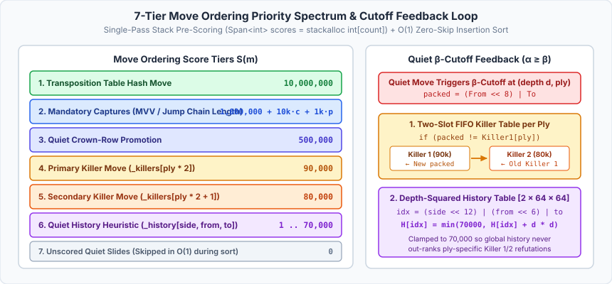
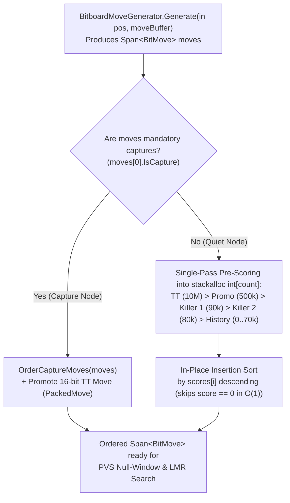

# 06 – Move ordering

[Back to the index](README.md)

## In short

In Alpha-Beta game-tree search, the number of nodes visited to reach depth $d$ with branching factor $b$ depends dramatically on the **order** in which candidate moves are explored:
* **Worst-case ordering** (searching moves from worst to best): No branches are pruned, visiting all:
  $$N_{\text{worst}}(b, d) = O(b^d)$$
* **Optimal ordering** (searching the strongest move first at every node): Alpha-Beta prunes every suboptimal sibling after examining only one refutation reply, reducing complexity to:
  $$N_{\text{best}}(b, d) = O\bigl(b^{\lceil d/2 \rceil} + b^{\lfloor d/2 \rfloor} - 1\bigr) = O\bigl(b^{d/2}\bigr)$$

By reducing the effective branching factor from $b$ to $\sqrt{b}$, strong move ordering allows the engine to search **twice as deep** within the same time budget and provides the foundation for both **Principal Variation Search (PVS)** and **Late Move Reductions (LMR)** ([Chapter 07](07-search.md)).



---

## Move ordering pipeline in `MinimaxPlayer`

At every interior node, [`MinimaxPlayer.cs`](../../src/Checkers.Core/AI/MinimaxPlayer.cs) orders the generated `Span<BitMove>` slice in-place before expanding child subtrees:



### Complete Piecewise Scoring Function

Let $m \in \text{Moves}(s)$ be a legal move at search distance $\text{ply}$ for side to move $c \in \{0, 1\}$, with 16-bit packed identifier $P(m) = (\text{From}(m) \ll 8) \mid \text{To}(m)$. Its ordering score $S(m)$ is:

$$S(m) = \begin{cases} 10{,}000{,}000 & \text{if } P(m) = P_{\text{TT}} \text{ (Transposition Table Hash Move)} \\ 1{,}000{,}000 + 10{,}000\,|\text{Captured}(m)| + 1{,}000\,\mathbb{I}[\text{IsPromotion}(m)] & \text{if } \text{IsCapture}(m) \\ 500{,}000 & \text{if } \text{IsPromotion}(m) \land \neg\text{IsCapture}(m) \\ 90{,}000 & \text{if } P(m) = \text{Killer}_1(\text{ply}) \\ 80{,}000 & \text{if } P(m) = \text{Killer}_2(\text{ply}) \\ H\bigl(c, \text{From}(m), \text{To}(m)\bigr) \in [0, 70{,}000] & \text{otherwise (Quiet Move)} \end{cases}$$

### Priority Tiers

| Priority | Move Category | Ordering Score $S(m)$ | Rationale |
|:---:|---|:---:|---|
| **1 (Highest)** | **Transposition Table Hash Move** | $10{,}000{,}000$ | Proven best move (or $\beta$-cutoff refutation) from a previous search depth or transposed branch (`m.PackedMove == ttPackedMove`). |
| **2** | **Multi-Jump & Single Captures** | $1{,}000{,}000 + 10{,}000c + 1{,}000p$ | Mandatory captures ordered by capture count $c$ (Most Valuable Victim / longest chain) and promotion $p \in \{0, 1\}$. |
| **3** | **Quiet Promotion** | $500{,}000$ | Non-capturing slide onto the crown row, creating a new King ($+200\text{ cp}$ in International, $+40\text{ cp}$ base in English). |
| **4** | **Killer Move 1 (Primary)** | $90{,}000$ | Most recent quiet move at the same `ply` that caused a $\beta$-cutoff in a sibling node (`_killers[ply * 2]`). |
| **5** | **Killer Move 2 (Secondary)** | $80{,}000$ | Second most recent quiet refutation move at the same `ply` (`_killers[ply * 2 + 1]`). |
| **6** | **Quiet History Heuristic** | $1 \dots 70{,}000$ | Cumulative $\sum d^2$ cutoff bonus indexed by `[SideToMove][From][To]` (`_history[(side << 12) | (from << 6) | to]`). |
| **7 (Lowest)** | **Unscored Quiet Moves** | $0$ | Quiet slides with zero history score; skipped in $O(1)$ during insertion sort (`if (currentScore == 0) continue;`). |

---

## Packed 16-Bit Move Identifier (`BitMove.PackedMove`)

Inspired by the compact 16-bit move encoding in Collin Kees's [**Checkers-Engine (Marcher Engine)**](https://github.com/Stermere/Checkers-Engine) ([`hash_table.c`](../../Checkers-Engine-main/src/engine/hash_table.c) and [`killer_table.c`](../../Checkers-Engine-main/src/engine/killer_table.c), where `short move = (move_start << 8) | move_end` packs the start square into the high byte and the destination square into the low byte), [`BitMove`](../../src/Checkers.Core/Bitboards/BitMove.cs) exposes a single 16-bit packed property to avoid comparing separate `From` and `To` fields during move ordering:

$$\text{PackedMove} = \text{ ushort }\bigl((\text{From} \ll 8) \mid \text{To}\bigr)$$

Both `TranspositionEntry.BestMove` ([Chapter 08](08-transposition-table.md)) and the Killer Move table `_killers` store moves in this exact `ushort` format, reducing hash-move and killer-move matching inside the hot loop to a single 16-bit register comparison (`packed == ttPackedMove`, `packed == killer1`).

---

## Killer Move & History Heuristics

Following the refutation ordering architecture of [`killer_table.c`](../../Checkers-Engine-main/src/engine/killer_table.c) and [`board_search.c`](../../Checkers-Engine-main/src/engine/board_search.c) (`USE_HISTORY`) in [`Stermere/Checkers-Engine`](https://github.com/Stermere/Checkers-Engine), whenever a quiet move (`!m.IsCapture && !m.IsPromotion`) triggers a $\beta$-cutoff ($\alpha \ge \beta$) at remaining depth $d$ and search distance `ply`:

1. **Two-Slot FIFO Killer Table (`ushort _killers[MaxPly * 2]`):**
   - Sibling nodes at the same `ply` face similar quiet positional threats. If a quiet move refutes the opponent's previous move in one branch, it is highly likely to refute sibling branches at the same `ply`.
   - If `move.PackedMove != _killers[ply * 2]`, slot 0 shifts into slot 1 and the new refutation move becomes slot 0:
     $$\text{Killer}_2(\text{ply}) \leftarrow \text{Killer}_1(\text{ply}), \qquad \text{Killer}_1(\text{ply}) \leftarrow (\text{From} \ll 8) \mid \text{To}$$
   - Maintaining two slots per ply prevents a single tactical exception in one branch from overwriting the general-purpose refutation move at that depth.
2. **Depth-Squared History Table (`int _history[2 * 64 * 64]`):**
   - While Killer moves capture *local* refutations at a specific `ply`, the History table captures *global* quiet moves that repeatedly succeed across the entire search tree.
   - Deeper $\beta$-cutoffs prune exponentially larger subtrees, so the move's history counter is incremented by $d^2$ and clamped to $70{,}000$ (strictly below `Killer 2 = 80,000` so ply-specific killers always take precedence):
     $$H(\text{side}, \text{from}, \text{to}) \leftarrow \min\bigl(70{,}000,\; H(\text{side}, \text{from}, \text{to}) + d^2\bigr)$$

> [!NOTE]
> **Why Checkers Needs Only TT + 2 Killers + History (From `board_search.c`):** As documented in [`Checkers-Engine-main/src/engine/board_search.c`](../../Checkers-Engine-main/src/engine/board_search.c), a typical Checkers node has only ~8 legal quiet moves (compared to ~35 in Chess). Because the TT Hash Move plus two Killer slots already populate the front of the list, heavier chess ordering heuristics such as Counter-Move tables, History Malus, or History Ageing add per-node overhead without improving cutoff rank.

### Principal Variation (PV) Ordering at the Root

At the root node (`ply == 0`) during Iterative Deepening ([Chapter 07](07-search.md)), the move that achieved the highest score at depth $d$ is promoted to index `0` of `currentOrder` before starting depth $d + 1$:

```csharp
currentOrder.Remove(bestEntryThisDepth.Value);
currentOrder.Insert(0, bestEntryThisDepth.Value);
```

This guarantees that depth $d + 1$ immediately searches the Principal Variation first, establishing the tightest possible lower bound $\alpha$ at the root before probing alternative root moves.

---

## Zero-allocation pre-scored implementation

Because move ordering executes millions of times per second inside `NegamaxBitboard`, `OrderBitMoves` uses two specialized paths:
1. **Capture Fast-Path (`moves[0].IsCapture`):** Because captures are mandatory in Checkers ([Chapter 03](03-rules-and-move-generation.md)), if `moves[0].IsCapture` is true, *every* legal move at the node is a capture. `OrderBitMoves` skips killer and history lookups altogether, sorts by `CaptureCount` and `IsPromotion`, and promotes `ttPackedMove` to `moves[0]`.
2. **Quiet Pre-Scored Path (`Span<int> scores = stackalloc int[count]`):** Each quiet move is scored once into a stack-resident `Span<int>` buffer before running an in-place insertion sort that skips `currentScore == 0` in $O(1)$:

```csharp
[MethodImpl(MethodImplOptions.AggressiveInlining)]
private void OrderBitMoves(
    Span<BitMove> moves,
    ushort ttPackedMove,
    bool hasTtMove,
    int ply,
    PieceColor sideToMove)
{
    int count = moves.Length;
    if (count <= 1)
        return;

    if (moves[0].IsCapture)
    {
        OrderCaptureMoves(moves);
        if (hasTtMove)
        {
            for (int i = 1; i < count; i++)
            {
                if (moves[i].PackedMove == ttPackedMove)
                {
                    BitMove ttMove = moves[i];
                    for (int j = i; j > 0; j--)
                        moves[j] = moves[j - 1];
                    moves[0] = ttMove;
                    break;
                }
            }
        }
        return;
    }

    Span<int> scores = stackalloc int[count];
    ushort killer1 = (uint)ply < MaxPly ? _killers[ply << 1] : (ushort)0;
    ushort killer2 = (uint)ply < MaxPly ? _killers[(ply << 1) + 1] : (ushort)0;
    int sideOffset = (int)sideToMove << 12;

    for (int i = 0; i < count; i++)
    {
        ref readonly BitMove m = ref moves[i];
        ushort packed = m.PackedMove;
        scores[i] = (hasTtMove && packed == ttPackedMove) ? 10_000_000
            : m.IsPromotion ? 500_000
            : packed == killer1 ? 90_000
            : packed == killer2 ? 80_000
            : _history[sideOffset | (m.From << 6) | m.To];
    }

    for (int i = 1; i < count; i++)
    {
        int currentScore = scores[i];
        if (currentScore == 0)
            continue;

        BitMove currentMove = moves[i];
        int j = i - 1;
        while (j >= 0 && scores[j] < currentScore)
        {
            moves[j + 1] = moves[j];
            scores[j + 1] = scores[j];
            j--;
        }
        moves[j + 1] = currentMove;
        scores[j + 1] = currentScore;
    }
}
```

> [!TIP]
> **Why `stackalloc int[count]` Outperforms Preallocated Heap Arrays:** During Phase 3 development, we benchmarked replacing `Span<int> scores = stackalloc int[count]` with a preallocated per-ply `int[][] _scoreBuffers` array on the heap. `stackalloc int[count]` proved **~5% faster in wall-clock time** because RyuJIT statically proves `scores.Length == moves.Length == count`, eliminating array bounds checks inside both loops while keeping `scores` in the hot L1 stack frame.

---

## Empirical Impact Summary

In our 40-position deep benchmark suite ($7\text{–}14$ plies), combining **Killer Moves**, **History Heuristic**, and **Principal Variation Search (PVS)** ([Chapter 07](07-search.md)) in **Phase 3 (Stage A)** delivered:
* **No-TT Tree Reduction:** Cut total evaluated nodes across 40 deep positions by **64.58%** in International (`95,811,314` $\rightarrow$ `33,933,396` nodes, **2.82× fewer**) and **64.86%** in English (`94,110,293` $\rightarrow$ `33,065,884` nodes, **2.85× fewer**).
* **With 4-Way Bucket TT ($1\text{M}$ & $16\text{M}$):** Cut evaluated nodes by an additional **26.56%–28.48%** on top of transposition table pruning (`10,962,720` $\rightarrow$ `7,840,967` nodes in International; `9,974,305` $\rightarrow$ `7,324,654` nodes in English) with **zero loss of exactness**.

For the full per-phase benchmark tables and 5-second timed depth progression, see [Chapter 12 – Engine improvements during development](12-engine-improvements.md#milestone-5-phase-3--search-stage-a-exact-node-reduction).
