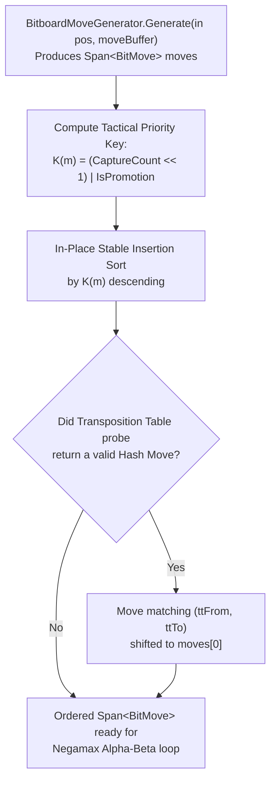

# 06 – Move ordering

[Back to the index](README.md)

## In short

In Alpha-Beta game-tree search, the number of nodes visited to reach depth $d$ with branching factor $b$ depends dramatically on the **order** in which candidate moves are explored:
* **Worst-case ordering** (searching moves from worst to best): No branches are pruned, visiting all:
  $$N_{\text{worst}}(b, d) = O(b^d)$$
* **Optimal ordering** (searching the strongest move first at every node): Alpha-Beta prunes every suboptimal sibling after examining only one refutation reply, reducing complexity to:
  $$N_{\text{best}}(b, d) = O\bigl(b^{\lceil d/2 \rceil} + b^{\lfloor d/2 \rfloor} - 1\bigr) = O\bigl(b^{d/2}\bigr)$$

By reducing the effective branching factor from $b$ to $\sqrt{b}$, strong move ordering allows the engine to search **twice as deep** within the same time budget.

---

## Move ordering pipeline in `MinimaxPlayer`

At every interior node, [`MinimaxPlayer.cs`](../../src/Checkers.Core/AI/MinimaxPlayer.cs) orders the generated `Span<BitMove>` slice in-place before expanding child subtrees:



### Priority Tiers

| Priority | Move Category | Tactical Key $K(m)$ | Rationale |
|:---:|---|:---:|---|
| **1 (Highest)** | **Transposition Table Hash Move** | Moved to `moves[0]` | Proven best move (or $\beta$-cutoff refutation) from a previous search depth or transposed branch. |
| **2** | **Multi-Jump Captures + Promotion** | $(c \ll 1) \mid 1$, $c \ge 2$ | Captures multiple enemy pieces and crowns a king in a single turn. |
| **3** | **Multi-Jump Captures** | $(c \ll 1)$, $c \ge 2$ | Captures $2, 3, \dots$ pieces; largest material swings are searched first. |
| **4** | **Single Capture + Promotion** | $(1 \ll 1) \mid 1 = 3$ | Captures 1 piece and crowns a king. |
| **5** | **Single Capture** | $(1 \ll 1) = 2$ | Standard 1-piece jump capture. |
| **6** | **Quiet Promotion** | $(0 \ll 1) \mid 1 = 1$ | Non-capturing slide onto the crown row, creating a new King (+200 pts in International, +70 pts in English). |
| **7 (Lowest)** | **Quiet Moves** | $0$ | Positional slides that neither capture nor promote. |

### Principal Variation (PV) Ordering at the Root

At the root node (`ply == 0`) during Iterative Deepening ([Chapter 07](07-search.md)), the move that achieved the highest score at depth $d$ is promoted to the very front of `currentOrder` before starting depth $d + 1$:

```csharp
currentOrder.Remove(bestEntryThisDepth.Value);
currentOrder.Insert(0, bestEntryThisDepth.Value);
```

This guarantees that depth $d + 1$ immediately searches the Principal Variation first, establishing a tight lower bound $\alpha$ at the root before testing any alternative root moves.

---

## Zero-allocation in-place implementation

Because move ordering runs millions of times per second inside `NegaMax` and `Quiescence`, allocating LINQ iterators or `List<Move>` objects would bottleneck the garbage collector. Instead, `OrderBitMoves` sorts `Span<BitMove>` in-place on preallocated stack/ply memory:

```csharp
[MethodImpl(MethodImplOptions.AggressiveInlining)]
private static void OrderBitMoves(Span<BitMove> moves, byte ttFrom, byte ttTo, bool hasTtMove)
{
    // 1. In-place insertion sort by (CaptureCount << 1) | IsPromotion descending
    for (int i = 1; i < moves.Length; i++)
    {
        BitMove current = moves[i];
        int currentKey = (current.CaptureCount << 1) | (current.IsPromotion ? 1 : 0);
        if (currentKey == 0)
            continue; // Fast path: quiet non-promoting moves stay in generation order

        int j = i - 1;
        while (j >= 0)
        {
            int prevKey = (moves[j].CaptureCount << 1) | (moves[j].IsPromotion ? 1 : 0);
            if (prevKey >= currentKey)
                break;
            moves[j + 1] = moves[j];
            j--;
        }
        moves[j + 1] = current;
    }

    // 2. Promote Transposition Table Hash Move to index 0
    if (hasTtMove)
    {
        for (int i = 0; i < moves.Length; i++)
        {
            if (moves[i].From == ttFrom && moves[i].To == ttTo)
            {
                if (i > 0)
                {
                    BitMove ttMove = moves[i];
                    for (int j = i; j > 0; j--)
                    {
                        moves[j] = moves[j - 1];
                    }
                    moves[0] = ttMove;
                }
                break;
            }
        }
    }
}
```

Notice the `if (currentKey == 0) continue;` fast-path optimization: in quiet positions where no promotions exist, `OrderBitMoves` scans the span in a single register pass without moving a single struct, then shifts the Transposition Table hash move to `moves[0]`.
