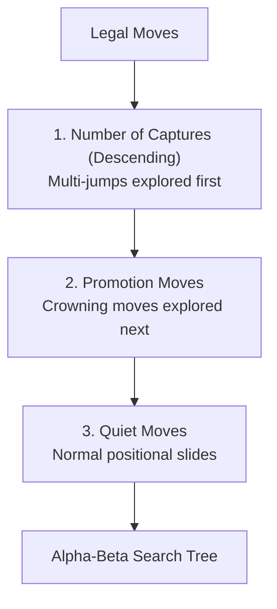

# 06 – Move ordering

[Back to the index](README.md)

## In short

In game-tree search, the efficiency of **Alpha-Beta pruning** depends heavily on the order in which moves are searched:
* **Worst ordering:** If moves are explored from worst to best, no branches are pruned, and the engine must visit all $O(b^d)$ positions (same as brute-force minimax).
* **Optimal ordering:** If the best move is explored first at every node, Alpha-Beta searches only $O(b^{d/2})$ positions—effectively **doubling the depth** the engine can reach in the same time!

---

## Move ordering pipeline in `MinimaxPlayer`

`MinimaxPlayer.cs` sorts candidate legal moves before traversing recursive branches:



### 1. Multi-Jumps First
Moves that capture 2 or more pieces dramatically shift material and create immediate tactical threats. Searching multi-jumps first rapidly raises $\alpha$ (the lower bound), allowing subsequent inferior moves to be pruned immediately.

### 2. Single Captures
Under the mandatory capture rule, if any capture is available, only captures are generated. Ordering captures by piece count guarantees that the most devastating tactical blows are evaluated before smaller exchanges.

### 3. Promotions
Advancing a man onto the crown row generates a powerful Flying King. Promotions are explored immediately following captures.

### 4. Quiet Moves
Positional slides that do not capture or promote are evaluated last.

---

## Code implementation

In `MinimaxPlayer.cs`:

```csharp
private static IReadOnlyList<Move> OrderMoves(IEnumerable<Move> moves) =>
    moves
        .OrderByDescending(m => m.CapturedPositions.Count) // Multi-jumps first
        .ThenByDescending(m => m.IsPromotion ? 1 : 0)     // Promotions next
        .ToList();
```

---

## Phase 4 Extensions

As the engine matures into Phase 4, move ordering will incorporate:
* **Hash Move (Transposition Table):** The move previously found to be best in the same position is tried first of all.
* **Killer Move Heuristic:** Moves that triggered a beta-cutoff at the same depth in neighboring branches are given priority.
* **History Heuristic:** A table rewarding moves that frequently cause cutoffs across the search.
