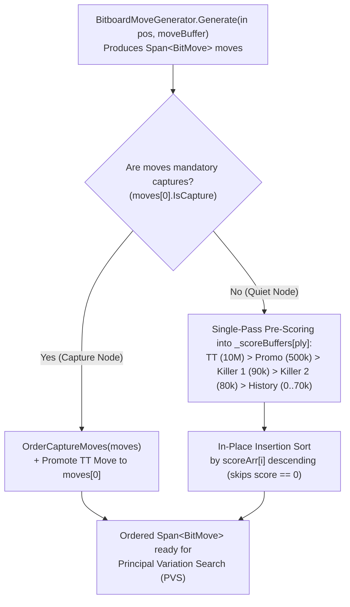

# 06 – Move ordering

[Back to the index](README.md)

## In short

In Alpha-Beta game-tree search, the number of nodes visited to reach depth $d$ with branching factor $b$ depends dramatically on the **order** in which candidate moves are explored:
* **Worst-case ordering** (searching moves from worst to best): No branches are pruned, visiting all:
  $$N_{\text{worst}}(b, d) = O(b^d)$$
* **Optimal ordering** (searching the strongest move first at every node): Alpha-Beta prunes every suboptimal sibling after examining only one refutation reply, reducing complexity to:
  $$N_{\text{best}}(b, d) = O\bigl(b^{\lceil d/2 \rceil} + b^{\lfloor d/2 \rfloor} - 1\bigr) = O\bigl(b^{d/2}\bigr)$$

By reducing the effective branching factor from $b$ to $\sqrt{b}$, strong move ordering allows the engine to search **twice as deep** within the same time budget.

---

## Move ordering pipeline in `MinimaxPlayer`

At every interior node, [`MinimaxPlayer.cs`](../../src/Checkers.Core/AI/MinimaxPlayer.cs) orders the generated `Span<BitMove>` slice in-place before expanding child subtrees:



### Priority Tiers

| Priority | Move Category | Ordering Score $S(m)$ | Rationale |
|:---:|---|:---:|---|
| **1 (Highest)** | **Transposition Table Hash Move** | $10{,}000{,}000$ | Proven best move (or $\beta$-cutoff refutation) from a previous search depth or transposed branch (`m.PackedMove == ttPackedMove`). |
| **2** | **Multi-Jump & Single Captures** | $1{,}000{,}000 + 10{,}000c + 1{,}000p$ | Mandatory captures ordered by capture count $c$ and promotion $p \in \{0, 1\}$. |
| **3** | **Quiet Promotion** | $500{,}000$ | Non-capturing slide onto the crown row, creating a new King (+200 pts in International, +70 pts in English). |
| **4** | **Killer Move 1 (Primary)** | $90{,}000$ | Most recent quiet move at the same `ply` that caused a $\beta$-cutoff in a sibling node (`_killers[ply * 2]`). |
| **5** | **Killer Move 2 (Secondary)** | $80{,}000$ | Second most recent quiet refutation move at the same `ply` (`_killers[ply * 2 + 1]`). |
| **6** | **Quiet History Heuristic** | $0 \dots 70{,}000$ | Cumulative $\sum d^2$ cutoff bonus indexed by `[SideToMove][From][To]` (`_history[(side << 12) | (from << 6) | to]`). |
| **7 (Lowest)** | **Unscored Quiet Moves** | $0$ | Quiet slides with zero history score; skipped in $O(1)$ during insertion sort (`if (currentScore == 0) continue;`). |

---

## Killer Move & History Heuristics

Whenever a quiet move (`!m.IsCapture && !m.IsPromotion`) triggers a $\beta$-cutoff ($\alpha \ge \beta$) at remaining depth $d$ and search distance `ply`:

1. **Two-Slot Killer Table (`ushort _killers[MaxPly * 2]`):**
   - If `move.PackedMove != _killers[ply * 2]`, slot 0 shifts into slot 1 and the new refutation move becomes slot 0:
     $$\text{Killer}_2(\text{ply}) \leftarrow \text{Killer}_1(\text{ply}), \qquad \text{Killer}_1(\text{ply}) \leftarrow (\text{From} \ll 8) \mid \text{To}$$
   - Keeping two slots prevents a single tactical exception in one branch from overwriting the general-purpose refutation move at that ply.
2. **Depth-Squared History Table (`int _history[2 * 64 * 64]`):**
   - Deeper $\beta$-cutoffs prune exponentially larger subtrees, so the move's history counter is incremented by $d^2$ and clamped to $70{,}000$ (strictly below `Killer 2 = 80,000`):
     $$H(\text{side}, \text{from}, \text{to}) \leftarrow \min\bigl(70{,}000,\; H(\text{side}, \text{from}, \text{to}) + d^2\bigr)$$

### Principal Variation (PV) Ordering at the Root

At the root node (`ply == 0`) during Iterative Deepening ([Chapter 07](07-search.md)), the move that achieved the highest score at depth $d$ is promoted to the very front of `currentOrder` before starting depth $d + 1$:

```csharp
currentOrder.Remove(bestEntryThisDepth.Value);
currentOrder.Insert(0, bestEntryThisDepth.Value);
```

This guarantees that depth $d + 1$ immediately searches the Principal Variation first, establishing a tight lower bound $\alpha$ at the root before testing any alternative root moves.

---

## Zero-allocation pre-scored implementation

Because move ordering runs millions of times per second inside `NegaMax`, `OrderBitMoves` pre-scores each move once into a stack-resident `Span<int> scores = stackalloc int[count]` (enabling RyuJIT bounds-check elimination and L1 stack locality) before running an in-place insertion sort that skips `currentScore == 0` in $O(1)$:

```csharp
[MethodImpl(MethodImplOptions.AggressiveInlining)]
private void OrderBitMoves(
    Span<BitMove> moves,
    ushort ttPackedMove,
    bool hasTtMove,
    int ply,
    PieceColor sideToMove)
{
    int count = moves.Length;
    if (count <= 1)
        return;

    Span<int> scores = stackalloc int[count];
    ushort killer1 = (uint)ply < MaxPly ? _killers[ply << 1] : (ushort)0;
    ushort killer2 = (uint)ply < MaxPly ? _killers[(ply << 1) + 1] : (ushort)0;
    int sideOffset = (int)sideToMove << 12;

    for (int i = 0; i < count; i++)
    {
        ref readonly BitMove m = ref moves[i];
        ushort packed = m.PackedMove;
        scores[i] = (hasTtMove && packed == ttPackedMove) ? 10_000_000
            : m.IsCapture ? 1_000_000 + (m.CaptureCount * 10_000) + (m.IsPromotion ? 1_000 : 0)
            : m.IsPromotion ? 500_000
            : packed == killer1 ? 90_000
            : packed == killer2 ? 80_000
            : _history[sideOffset | (m.From << 6) | m.To];
    }

    for (int i = 1; i < count; i++)
    {
        int currentScore = scores[i];
        if (currentScore == 0)
            continue;

        BitMove currentMove = moves[i];
        int j = i - 1;
        while (j >= 0 && scores[j] < currentScore)
        {
            moves[j + 1] = moves[j];
            scores[j + 1] = scores[j];
            j--;
        }
        moves[j + 1] = currentMove;
        scores[j + 1] = currentScore;
    }
}
```


