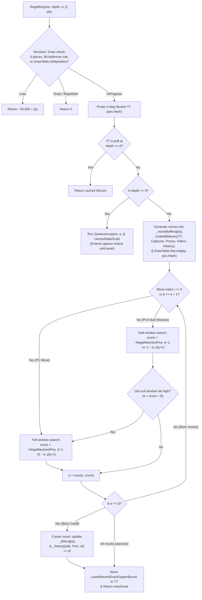

# 07 – Search

[Back to the index](README.md)

## In short

The search engine decides which move the computer will play. [`MinimaxPlayer`](../../src/Checkers.Core/AI/MinimaxPlayer.cs) implements the **Negamax formulation of Alpha-Beta pruning with Iterative Deepening, Transposition Table caching, and Quiescence Search**, powered by an allocation-free 64-bit bitboard copy-make architecture (`BitPosition` and `BitboardMoveGenerator`; see [Chapter 10 – Bitboards](10-bitboards.md)).

Search limits are configured in the **Game -> Settings...** dialog ([Chapter 09](09-time-control.md)):
* **Fixed depth:** $1$ to $20$ plies (default: $8$ plies)
* **Time per move:** $1$ to $60$ seconds (default: $5$ seconds)
* **Time per game:** $1$ to $60$ minutes (default: $5$ minutes)

---

## Negamax Alpha-Beta Algorithm

The minimax principle assumes optimal play from both sides: the active player chooses the move that maximizes their score, while the opponent chooses replies that maximize their own score (minimizing the active player's score).

Because our static evaluation ([Chapter 05](05-evaluation.md)) is symmetric with respect to `SideToMove`, $\max(a, b) = -\min(-a, -b)$, and both players share a single recursive **Negamax** recurrence:

$$V(s, d, \alpha, \beta) = \begin{cases} \text{LossScore} + \text{ply} & \text{if } |P_{\text{own}}(s)| = 0 \lor \neg\text{HasAnyLegalMove}(s) \\ 0 & \text{if } \text{HalfMoveClock}(s) \ge 80 \lor \text{DrawTable.IsRepetition}(s, \text{ply}) \\ \text{Quiescence}(s, \alpha, \beta) & \text{if } d = 0 \\ \displaystyle\max_{m \in \text{Moves}(s)} \Bigl( -V\bigl(\text{Apply}(s, m),\, d - 1,\, -\beta,\, -\alpha\bigr) \Bigr) & \text{if } d > 0 \end{cases}$$

### Alpha ($\alpha$) and Beta ($\beta$) Window Bounds
* **$\alpha$ (Lower Bound):** The minimum score the side to move is already guaranteed to achieve along a previously explored path.
* **$\beta$ (Upper Bound):** The worst score the opponent will tolerate; if the side to move finds a move with $\text{score} \ge \beta$, the opponent will avoid this node entirely by choosing a different branch one ply earlier (**$\beta$-cutoff**).
* When passing bounds to the recursive child call (`SideToMove` flips), the window is negated and swapped: $[\alpha, \beta] \mapsto [-\beta, -\alpha]$.

---

## Principal Variation Search (PVS / Null-Window Search)

Because `OrderBitMoves` ([Chapter 06](06-move-ordering.md)) places the Transposition Table best move, mandatory captures, promotions, Killer moves, and high-history moves at the front of the move list, the first legal move ($i = 0$) is the best move at the vast majority of nodes.

**Principal Variation Search (PVS)** exploits this ordering at every interior node (`ply > 0`):
1. **First Move ($i = 0$):** Searched with the full window $[-\beta, -\alpha]$ to establish an accurate lower bound $\alpha$.
2. **Subsequent Moves ($i > 0$ when $\beta > \alpha + 1$):** Tested first with a **zero-width (null) window** $[-\alpha - 1, -\alpha]$:
   - A null window has $\beta' - \alpha' = 1$, so every child node inside the subtree can immediately fail high or fail low without maintaining an open PV interval.
   - If the null-window probe returns $\text{score} \le \alpha$, the move is proven inferior to the first move and is discarded without ever running a full-window search.
3. **Exact Re-Search on Fail-High ($\alpha < \text{score} < \beta$):** If a later move beats $\alpha$ inside the null window, it is a new Principal Variation candidate and is immediately re-searched with the full window $[-\beta, -\alpha]$ to obtain its exact minimax value.

Because a null-window test in an exact search tree returns $\text{score} > \alpha$ if and only if the true minimax value exceeds $\alpha$, PVS is **100% mathematically exact** while cutting the total number of searched nodes (together with Killer and History move ordering) by **64.6% without TT** and **26.6%–28.5% on top of the 4-Way Bucket TT**.

---

## In-Search Repetition Detection (`DrawTable`)

A cached Transposition Table entry stores the static or subtree evaluation of a board configuration without knowing the sequence of moves that led to it. Without path-aware repetition tracking, a winning engine can walk into a 3-fold repetition draw because the repeated board still looks materially winning at the horizon, and a losing engine cannot intentionally seek a perpetual repetition to salvage a draw.

[`DrawTable`](../../src/Checkers.Core/AI/DrawTable.cs) tracks 64-bit Zobrist hashes along the active search path and from the game's `StateHistory`:
1. **Checked Before TT Probe (`ply > 0`):** At the start of `NegaMax`, before probing `TranspositionTable`, `_drawTable.IsRepetition(in pos, ply)` checks whether `pos.Hash` repeats an ancestor or completes a game-history repetition. If so, `NegaMax` immediately returns `0` (Draw) without polluting the TT.
2. **Pre-Root Game History Seeding (`_twoFoldHashes` & `_oneFoldHashes`):**
   - Any position that has already occurred $\ge 2$ times in `stateHashHistory` is seeded into `_twoFoldHashes`. Reaching it even once in the search (`ply >= 1`) completes a 3-fold repetition in the game and immediately returns `0`.
   - Positions that occurred once in the recent reversible game suffix are seeded into `_oneFoldHashes` and trigger a draw at `ply >= 2` (after both players have had an opportunity to deviate) if `pos.HalfMoveClock >= ply`.
3. **Active Search Path Stack (`_pathHashes[ply]`):**
   - When Kings are on the board (`pos.Kings != 0UL`) and at least 4 reversible half-moves have occurred (`ply >= 4 && pos.HalfMoveClock >= 4`), `IsRepetition` scans backward by 2 plies (`p = ply - 4, ply - 6, ... >= max(0, ply - pos.HalfMoveClock)`) for an exact 64-bit Zobrist match.

---

## Quiescence Search & The Horizon Effect

If a fixed-depth search stops abruptly at `depth == 0` and evaluates the board in the middle of a capture exchange—for example, right after White captures a man, when Black has a mandatory recapture on the very next ply—the static evaluator will misjudge the position by $+100$ centipawns. This pathology is known as the **Horizon Effect**.

To eliminate horizon blunders, `MinimaxPlayer` transitions at `depth == 0` into **`Quiescence`** search, which expands only **tactical capture moves** until no captures remain:

$$Q(s, \alpha, \beta) = \max\Biggl(\text{Evaluate}(s),\; \max_{m \in \text{Captures}(s)} \Bigl(-Q\bigl(\text{Apply}(s, m), -\beta, -\alpha\bigr)\Bigr)\Biggr)$$

1. **Stand-Pat Evaluation:** First, use `cachedStaticEval` from the TT probe if available, or compute `int standPat = EvaluatePosition(in pos);` and increment `LeafEvaluations`.
2. **Stand-Pat Beta Cutoff:** If $\text{standPat} \ge \beta$, return $\beta$ immediately.
3. **Alpha Raise:** If $\text{standPat} > \alpha$, set $\alpha = \text{standPat}$.
4. **Capture-Only Expansion:** First check `BitboardMoveGenerator.HasAnyCapture(in pos, _variant)` in $O(1)$ bitwise time; if false, return $\alpha` immediately. Otherwise call `BitboardMoveGenerator.GenerateCaptures(in pos, _variant, moveBuffer)`, order the captures by `CaptureCount`, and recursively search each capture until a quiet position is reached (capped at safety ply `24`).

---

## Distance-to-Mate Scoring

When a terminal win or loss is detected at search depth `ply` from the root, the terminal score is offset by `ply` (fitted within 16-bit `short` range for compact TT storage):

$$\text{Score}_{\text{win}}(\text{ply}) = +30{,}000 - \text{ply}, \qquad \text{Score}_{\text{loss}}(\text{ply}) = -30{,}000 + \text{ply}$$

Incorporating `ply` guarantees two critical behaviors:
1. **Fastest Win When Ahead:** A forced win in $3$ plies ($+29{,}997$) scores strictly higher than a forced win in $7$ plies ($+29{,}993$), so the AI never toys with a defeated opponent or repeats moves when a direct win exists.
2. **Maximum Resistance When Behind:** Facing a forced loss, the AI prefers $-29{,}990$ (loss in $10$ plies) over $-29{,}996$ (loss in $4$ plies), prolonging the game and maximizing the chance of a human mistake.
3. **Early Iterative Deepening Termination:** If the root search finds a forced win ($\text{bestScoreOverall} \ge 28{,}000$), iterative deepening stops immediately and plays the winning sequence.

---

## Iterative Deepening & Asynchronous Execution

Rather than jumping straight to target depth $D$, `MinimaxPlayer.GetMoveAsync` searches progressively through depths $d = 1, 2, 3, \dots, D$:
1. **Anytime Move Availability:** If the move timer expires mid-search during depth $d$, the engine safely falls back to `bestMoveOverall` from completed depth $d - 1$.
2. **PV, TT & History Seeding:** Each completed depth $d - 1$ populates the Transposition Table, Killer table, and History table, and promotes the best root move to index `0`, making depth $d$ dramatically faster ([Chapter 06](06-move-ordering.md)).
3. **Non-Blocking UI & Cancellation:**
   - **WPF Desktop:** Runs on a background ThreadPool thread via `Task.Run`.
   - **Blazor WebAssembly:** Yields cooperatively to the browser event loop via `await Task.Delay(1, cancellationToken)` after each completed depth and on $\ge 150\text{ ms}$ heartbeats ([Chapter 11](11-app-integration.md)).
   - **Instant Cancellation:** Every $4{,}096$ nodes (`(NodesEvaluated & 4095) == 0`), `cancellationToken.ThrowIfCancellationRequested()` and `sw.ElapsedMilliseconds >= hardLimitMs` are checked.

---

## Live Search Analysis Telemetry

While thinking, `MinimaxPlayer` streams real-time `SearchAnalysis` snapshots through `IProgress<SearchAnalysis>` to the UI Analysis pane:

| Field | Example | Meaning |
|---|---|---|
| **Move** | `23-19` | Candidate root move currently being explored (or completed best move) |
| **Depth** | `8 plies` / `9 plies...` | Highest completed depth (or in-progress depth with ellipsis during heartbeats) |
| **Value** | `+35` / `+Win in 5 plies` | Heuristic score in centipawns, `Forced`, or exact distance-to-win/loss |
| **Best move** | `24-20` | Principal Variation root move from the latest finished iteration |
| **Nodes** | `1,482,910` | Total interior and quiescence nodes visited (`NodesEvaluated`) |
| **Evaluations** | `612,044` | Total static leaf evaluations executed (`LeafEvaluations`) |
| **Time** | `0:01.4` | Elapsed wall-clock time formatted as `m:ss.f` |
