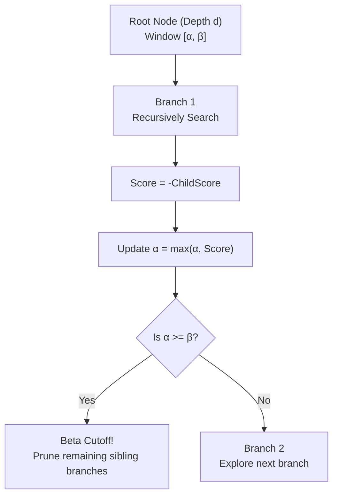

# 07 – Search

[Back to the index](README.md)

## In short

The search engine decides which move the computer will play. `MinimaxPlayer` uses the **Negamax formulation of the Alpha-Beta pruning algorithm with Iterative Deepening**, powered by an allocation-free 64-bit bitboard copy-make search (`BitPosition` and `BitboardMoveGenerator`; see [Chapter 15 – Bitboards](15-bitboards.md)).

The search configuration is customized in the **Game -> Settings...** dialog matching Stello and Connect-4:
* **Fixed depth:** 1 to 20 plies (default: 8 plies)
* **Time per move:** 1 to 60 seconds (default: 5 seconds)
* **Time per game:** 1 to 60 minutes (default: 5 minutes)

---

## Negamax Alpha-Beta Algorithm

The minimax principle assumes that both players play optimally: the active player chooses the move that maximizes their score, while the opponent also chooses moves that maximize their own score (which minimizes the active player's score).

In **Negamax**, this relationship is expressed symmetrically:

$$V(s, d, \alpha, \beta) = \max_{m \in \text{Moves}(s)} \Bigl( -V\bigl(\text{Apply}(s, m), d - 1, -\beta, -\alpha\bigr) \Bigr)$$



### Alpha ($\alpha$) and Beta ($\beta$) Bounds
* $\alpha$ is the minimum score that the maximizing player is guaranteed to achieve.
* $\beta$ is the maximum score that the opponent will permit the maximizing player to achieve.
* Whenever $\alpha \ge \beta$, the opponent has a superior alternative elsewhere in the tree, so the current branch will never be reached in optimal play and can be **pruned** immediately.

---

## Distance-to-Mate Scoring

When a terminal game state (win or loss) is encountered, the score is adjusted by the search depth `ply`:

* **Win Score:** $+100,000 - \text{ply}$
* **Loss Score:** $-100,000 + \text{ply}$
* **Draw Score:** $0$

By incorporating `ply`:
1. The engine aggressively pursues the **fastest possible win** (e.g. mate in 2 ply is scored $+99,998$, higher than mate in 4 ply at $+99,996$).
2. When facing an unavoidable defeat, the engine fights fiercely to **prolong the game** as many plies as possible, giving human opponents opportunities to err.

---

## Asynchronous Execution & Non-Blocking UI

In both WPF and WebAssembly, CPU-bound game search must never block rendering or user interaction:

1. **WPF Desktop:** `MainViewModel` dispatches search to a background ThreadPool thread via `Task.Run(...)`.
2. **Blazor WebAssembly:** In the single-threaded browser runtime, `MinimaxPlayer.GetMoveAsync` cooperatively yields execution to the browser event loop using `await Task.Delay(1, cancellationToken)` at each depth iteration and on $\ge 150\text{ms}$ heartbeats, allowing the browser to paint DOM updates at 60 FPS.
3. **Responsive Cancellation:** A `CancellationToken` is observed throughout the search tree. Every 1,024 nodes evaluated, `cancellationToken.ThrowIfCancellationRequested()` is checked. Starting a **New Game**, **Opening** a file, or clicking **Undo** cancels running searches instantly.

---

## Equal Move Tie-Breaking

If multiple root moves evaluate to the exact same highest score, `MinimaxPlayer` selects one uniformly at random:

```csharp
int selectedIndex = _rng.Next(bestMoves.Count);
return bestMoves[selectedIndex];
```

This prevents the computer opponent from repeating the exact same sequence in every game, making matches varied and engaging.

---

## Live Search Analysis Telemetry

Matching the design and user experience of **Stello** and **Connect-4**, the engine streams real-time search telemetry to the user interface while the computer is actively thinking:

1. **`IProgress<SearchAnalysis>` Pipeline:**
   - `IPlayer.GetMoveAsync(..., IProgress<SearchAnalysis>? progress, ...)` accepts an optional progress reporter.
   - `MainViewModel` creates a `Progress<SearchAnalysis>` on the UI thread, ensuring safe dispatcher marshaling.
   - A monotonic `_searchId` token guards against out-of-order or late progress reports if an AI turn is canceled or undone.

2. **Reporting Triggers:**
   - **Forced Moves:** Immediately reports `Depth = "1 ply (Forced)"`, `Value = "Forced"`.
   - **Iterative Deepening Iterations:** As each completed depth $d \in \{1, 2, \dots, D\}$ finishes, the PV best move, score, total nodes, evaluations, and elapsed time are reported.
   - **Periodic Search Heartbeat:** Every 150–200 ms during deep searches, the engine reports the active candidate move, nodes evaluated, leaf evaluations, and elapsed time (`"Depth: 7 plies..."`), providing continuous visual feedback during long evaluations.

3. **WebAssembly Macrotask Yielding:**
   - In Blazor WebAssembly, progress callbacks are posted to `BrowserSynchronizationContext`.
   - By awaiting `Task.Delay(1)` during reports, the browser dispatches these callbacks, fires `AnalysisViewModel.Updated`, and triggers `InvokeAsync(StateHasChanged)` in `Home.razor` to paint live analysis and animate the thinking progress bar in real time.

4. **Analysis Pane Fields:**
   - **Move:** Current candidate root move being evaluated.
   - **Depth:** Current completed search depth (or active depth with ellipsis during long computations).
   - **Value:** Centipawn / heuristic evaluation score from active player's viewpoint (or `Forced`, `Win`, `Loss`).
   - **Best move:** Best move found so far across completed iterations.
   - **Nodes:** Total number of search tree nodes visited.
   - **Evaluations:** Total number of static / leaf position evaluations.
   - **Time:** Real-time search elapsed time formatted as `m:ss.f`.
