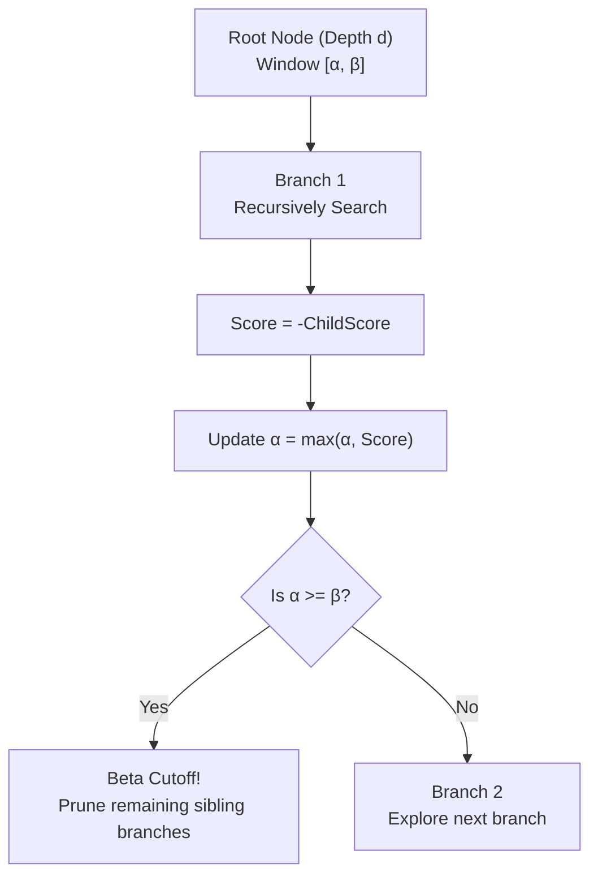

# 07 – Search

[Back to the index](README.md)

## In short

The search engine decides which move the computer will play. `MinimaxPlayer` uses the **Negamax formulation of the Alpha-Beta pruning algorithm**. 

The search balances tactical foresight against computational cost:
* **Easy:** `RandomPlayer` (baseline)
* **Medium:** `MinimaxPlayer` at search depth 3 ($\approx 10$ to $50$ ms per turn)
* **Hard:** `MinimaxPlayer` at search depth 6 ($\approx 100$ to $400$ ms per turn)

---

## Negamax Alpha-Beta Algorithm

The minimax principle assumes that both players play optimally: the active player chooses the move that maximizes their score, while the opponent also chooses moves that maximize their own score (which minimizes the active player's score).

In **Negamax**, this relationship is expressed symmetrically:

$$V(s, d, \alpha, \beta) = \max_{m \in \text{Moves}(s)} \Bigl( -V\bigl(\text{Apply}(s, m), d - 1, -\beta, -\alpha\bigr) \Bigr)$$



### Alpha ($\alpha$) and Beta ($\beta$) Bounds
* $\alpha$ is the minimum score that the maximizing player is guaranteed to achieve.
* $\beta$ is the maximum score that the opponent will permit the maximizing player to achieve.
* Whenever $\alpha \ge \beta$, the opponent has a superior alternative elsewhere in the tree, so the current branch will never be reached in optimal play and can be **pruned** immediately.

---

## Distance-to-Mate Scoring

When a terminal game state (win or loss) is encountered, the score is adjusted by the search depth `ply`:

* **Win Score:** $+100,000 - \text{ply}$
* **Loss Score:** $-100,000 + \text{ply}$
* **Draw Score:** $0$

By incorporating `ply`:
1. The engine aggressively pursues the **fastest possible win** (e.g. mate in 2 ply is scored $+99,998$, higher than mate in 4 ply at $+99,996$).
2. When facing an unavoidable defeat, the engine fights fiercely to **prolong the game** as many plies as possible, giving human opponents opportunities to err.

---

## Asynchronous Execution & Non-Blocking UI

In both WPF and WebAssembly, long-running CPU calculations on the UI thread freeze rendering and user input.

To guarantee a responsive 60 FPS experience:
1. `MainViewModel` dispatches AI computations to background threads via `Task.Run(...)`.
2. A `CancellationToken` is passed down the search tree. Every node checks `cancellationToken.ThrowIfCancellationRequested()`.
3. If the user clicks **New Game** or **Undo** while the AI is computing, the search aborts instantly without lag or thread leaks.

---

## Equal Move Tie-Breaking

If multiple root moves evaluate to the exact same highest score, `MinimaxPlayer` selects one uniformly at random:

```csharp
int selectedIndex = _rng.Next(bestMoves.Count);
return ValueTask.FromResult(bestMoves[selectedIndex]);
```

This prevents the computer opponent from repeating the exact same sequence in every game, making matches varied and engaging.
