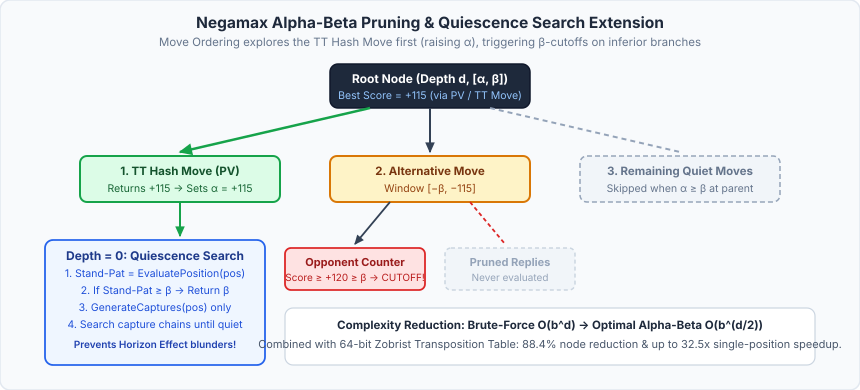
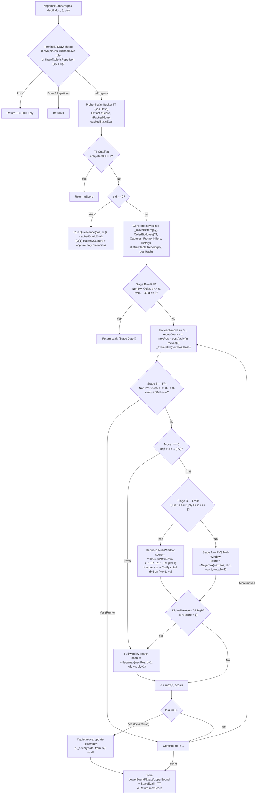
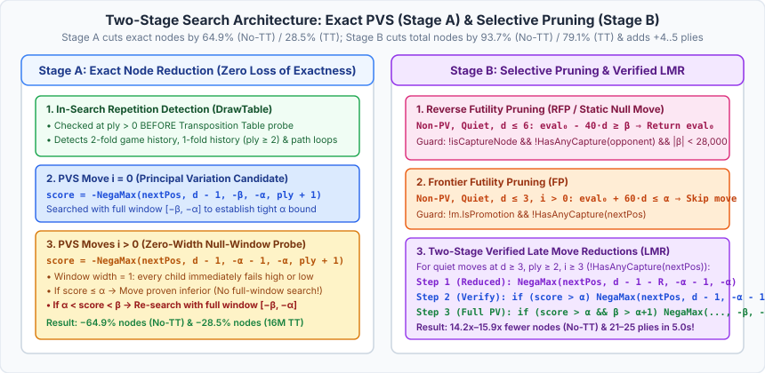

# 07 – Search

[Back to the index](README.md)

## In short

The search engine decides which move the computer will play. [`MinimaxPlayer`](../../src/Checkers.Core/AI/MinimaxPlayer.cs) implements a **Negamax Alpha-Beta search with Principal Variation Search (PVS), In-Search Repetition Detection (`DrawTable`), Reverse Futility Pruning (RFP), Futility Pruning (FP), Verified Late Move Reductions (LMR), Quiescence Search, and Iterative Deepening**, powered by an allocation-free 64-bit bitboard copy-make architecture ([Chapter 10 – Bitboards](10-bitboards.md)).

Search limits are configured in the **Game -> Settings...** dialog ([Chapter 09](09-time-control.md)):
* **Fixed depth:** $1$ to $20$ plies (default: $8$ plies)
* **Time per move:** $1$ to $60$ seconds (default: $5$ seconds)
* **Time per game:** $1$ to $60$ minutes (default: $5$ minutes)

---

## Negamax Alpha-Beta Algorithm

The minimax principle assumes optimal play from both sides: the active player chooses the move that maximizes their score, while the opponent chooses replies that maximize their own score (minimizing the active player's score).

Because our static evaluation ([Chapter 05](05-evaluation.md)) is symmetric with respect to `SideToMove`, $\max(a, b) = -\min(-a, -b)$, and both players share a single recursive **Negamax** recurrence:

$$V(s, d, \alpha, \beta, \text{ply}) = \begin{cases} -30{,}000 + \text{ply} & \text{if } |P_{\text{own}}(s)| = 0 \lor \neg\text{HasAnyLegalMove}(s) \\ 0 & \text{if } \text{HalfMoveClock}(s) \ge 80 \lor \text{DrawTable.IsRepetition}(s, \text{ply}) \\ \text{Quiescence}(s, \alpha, \beta) & \text{if } d = 0 \\ \displaystyle\max_{m \in \text{Moves}(s)} \Bigl( -V\bigl(\text{Apply}(s, m),\, d - 1,\, -\beta,\, -\alpha,\, \text{ply} + 1\bigr) \Bigr) & \text{if } d > 0 \end{cases}$$

### Alpha ($\alpha$) and Beta ($\beta$) Window Bounds
* **$\alpha$ (Lower Bound):** The minimum score the side to move is already guaranteed to achieve along a previously explored path.
* **$\beta$ (Upper Bound):** The worst score the opponent will tolerate; if the side to move finds a move with $\text{score} \ge \beta$, the opponent will avoid this node entirely by choosing a different branch one ply earlier (**$\beta$-cutoff**).
* When passing bounds to the recursive child call (`SideToMove` flips), the window is negated and swapped: $[\alpha, \beta] \mapsto [-\beta, -\alpha]$.

---

## Two-Stage Search Enhancements: Exact (Stage A) vs. Selective (Stage B)

To measure the exact contribution of lossless tree-search algorithms versus selective forward pruning, our search improvements are organized into two distinct stages (controllable via `MinimaxPlayer.UseSelectivePruning`):

---

## Stage A: Exact Search Enhancements (Phase 3)

Stage A reduces the number of nodes required to prove the **exact same minimax value** at a given fixed depth $D$.

### 1. Principal Variation Search (PVS / Null-Window Search)

Because `OrderBitMoves` ([Chapter 06](06-move-ordering.md)) places the Transposition Table best move, mandatory captures, promotions, Killer moves, and high-history moves at the front of the move list, the first legal move ($i = 0$) is the best move at the vast majority of nodes.

**Principal Variation Search (PVS)** exploits this ordering at every interior node (`ply > 0`):
1. **First Move ($i = 0$):** Searched with the full window $[-\beta, -\alpha]$ to establish an accurate lower bound $\alpha$:
   $$\text{score}_0 = -V\bigl(\text{Apply}(s, m_0),\, d - 1,\, -\beta,\, -\alpha,\, \text{ply} + 1\bigr)$$
2. **Subsequent Moves ($i > 0$ when $\beta > \alpha + 1$):** Tested first with a **zero-width (null) window** $[-\alpha - 1, -\alpha]$:
   $$\text{score}_{\text{null}} = -V\bigl(\text{Apply}(s, m_i),\, d - 1,\, -\alpha - 1,\, -\alpha,\, \text{ply} + 1\bigr)$$
   - A null window has width $\beta' - \alpha' = 1$, so every node inside the child subtree is a non-PV node (`beta <= alpha + 1`) and can immediately fail high or fail low without maintaining an open PV interval.
   - If $\text{score}_{\text{null}} \le \alpha$, move $m_i$ is mathematically proven unable to improve upon $\alpha$ and is discarded without ever running a full-window search.
3. **Exact Re-Search on Fail-High ($\alpha < \text{score}_{\text{null}} < \beta$):** If a later move beats $\alpha$ inside the null window, it is a new Principal Variation candidate and is immediately re-searched with the full window $[-\beta, -\alpha]$ to obtain its exact minimax value.

Because a null-window test in an exact search tree returns $\text{score}_{\text{null}} > \alpha$ if and only if the true minimax value exceeds $\alpha$, PVS is **100% mathematically exact** while cutting evaluated nodes (together with Killer and History move ordering) by **64.6%–64.9% without TT** and **26.6%–28.5% on top of the 4-Way Bucket TT**.

### 2. In-Search Repetition Detection (`DrawTable`)

A cached Transposition Table entry stores the static or subtree evaluation of a board configuration without knowing the path of moves that led to it. Without path-aware repetition tracking, an engine that is ahead by $+300$ centipawns can cycle Kings back and forth into a 3-fold repetition draw because the repeated board still evaluates to $+300$ at the horizon; conversely, a losing engine cannot intentionally seek a perpetual repetition to salvage a draw.

[`DrawTable`](../../src/Checkers.Core/AI/DrawTable.cs) tracks 64-bit Zobrist hashes along the active search path and from the game's `StateHistory`:
1. **Checked Before TT Probe (`ply > 0`):** At the start of `NegamaxBitboard`, *before* probing `TranspositionTable`, `_drawTable.IsRepetition(in pos, ply)` checks whether `pos.Hash` repeats an ancestor or completes a game-history repetition. If so, `NegamaxBitboard` immediately returns `0` (Draw) without polluting the TT with a path-dependent score.
2. **Pre-Root Game History Seeding (`_twoFoldHashes` & `_oneFoldHashes`):**
   - Any position that has already occurred $\ge 2$ times in `stateHashHistory` is seeded into `_twoFoldHashes`. Reaching it even once in the search (`ply >= 1`) completes a 3-fold repetition in the game and immediately returns `0`.
   - Positions that occurred once in the recent reversible game suffix (since the last capture or promotion) are seeded into `_oneFoldHashes` and trigger a draw at `ply >= 2` (after both players have had an opportunity to deviate) if `pos.HalfMoveClock >= ply`.
3. **Active Search Path Stack (`_pathHashes[ply]`):**
   - Because regular men only advance forward (`HalfMoveClock` resets to $0$ on every capture or promotion), an in-tree cycle requires at least one King on the board (`pos.Kings != 0UL`) and at least 4 reversible half-moves (`ply >= 4 && pos.HalfMoveClock >= 4`).
   - `IsRepetition` scans backward by steps of 2 plies (same `SideToMove`):
     $$\exists\, p \in \bigl\{\text{ply} - 4,\, \text{ply} - 6,\, \dots,\, \max(0,\, \text{ply} - \text{HalfMoveClock})\bigr\} \quad \text{such that} \quad \text{PathHash}[p] = \text{Hash}(s)$$

---

## Stage B: Selective Pruning & Reductions (Phase 4)

While Stage A explores every quiet move at full depth $d - 1$, Stage B focuses search effort on promising tactical and high-priority lines while pruning or reducing futile quiet branches at non-PV nodes (`beta <= alpha + 1`).

> [!IMPORTANT]
> **Checkers Tactical Safety Invariant:** Because captures in Checkers are strictly **mandatory** ([Chapter 03](03-rules-and-move-generation.md)), any position where either player has a legal capture (`isCaptureNode` or `HasAnyCapture(in nextPos)`) can force an immediate multi-jump material swing. Therefore, all three Stage B techniques (**RFP**, **FP**, and **LMR**) are strictly disabled whenever a capture or promotion is present!

### 1. Reverse Futility Pruning / Static Null Move Pruning (RFP)

At a shallow **non-PV** quiet node (`ply > 0`, `beta <= alpha + 1`, `depth <= 6`, `!isCaptureNode`) where neither the active player nor the opponent has an immediate capture available and $|\beta| < 28{,}000$ (non-mate window), the engine compares the static evaluation $\text{eval}_0$ against $\beta$ with a depth-scaled safety margin ($M_{\text{RFP}} = 40\text{ centipawns/ply}$):

$$\text{eval}_0 - 40 \cdot d \ge \beta \quad \Longrightarrow \quad \text{Return } \text{eval}_0 \text{ immediately (Static }\beta\text{-Cutoff)}$$

**Intuition:** If the active player's static position is already so far above $\beta$ that even losing $40\text{ centipawns}$ per remaining ply still beats $\beta$, making a quiet move will almost certainly fail high. Notice that before returning, `NegamaxBitboard` verifies `!BitboardMoveGenerator.HasAnyCapture(in oppTest, _variant)` in $O(1)$ bitwise time to ensure the active player's pieces are not currently under a mandatory jump threat.

### 2. Frontier Futility Pruning (FP)

Conversely, at a shallow **non-PV** quiet node near the leaves (`ply > 0`, `beta <= alpha + 1`, `depth <= 3`, `!isCaptureNode`) where $|\alpha| < 28{,}000$, if the static evaluation plus an optimistic margin ($M_{\text{FP}} = 60\text{ centipawns/ply}$) still falls short of $\alpha$:

$$\text{eval}_0 + 60 \cdot d \le \alpha$$

the node is Marked `futilityPrunable = true`. After searching at least the best move ($i = 0$) to preserve a valid move and baseline score, any subsequent quiet, non-promoting move ($i > 0$, `!moves[i].IsPromotion`) that does not trigger a capture response (`!BitboardMoveGenerator.HasAnyCapture(in nextPos, _variant)`) cannot realistically recover $+60d$ centipawns and is skipped immediately (`continue`).

### 3. Two-Stage Verified Late Move Reductions (LMR)

At deeper interior nodes (`depth >= 3`, `ply >= 2`), `OrderBitMoves` has already placed the TT Hash Move ($i = 0$), promotions, Killer 1, Killer 2, and top History moves in the first 3 slots ($i \in \{0, 1, 2\}$). Quiet moves ordered at index $i \ge 3$ are statistically unlikely to beat $\alpha$.

When a move $m_i$ ($i \ge 3$) is quiet (`!isCaptureNode && !m.IsPromotion`) and does not leave the opponent with a mandatory capture (`!BitboardMoveGenerator.HasAnyCapture(in nextPos, _variant)`), **Verified LMR** reduces the initial null-window search depth by $R(d, i)$:

$$R(d, i) = \min\Bigl(d - 2,\; 1 + \mathbb{I}[i \ge 8]\Bigr), \qquad d_{\text{reduced}} = (d - 1) - R(d, i) \ge 1$$

To prevent reduced searches from missing subtle multi-move traps, `NegamaxBitboard` enforces a **Two-Stage Verification Protocol**:
1. **Stage 1 — Reduced Null-Window Probe:** Search `nextPos` at reduced depth $d_{\text{reduced}}$ with null window $[-\alpha - 1, -\alpha]$. If $\text{score} \le \alpha$, the move fails low as expected and we save $R$ plies of search.
2. **Stage 2 — Unreduced Null-Window Verification:** If the reduced probe unexpectedly beats $\alpha$ ($\text{score} > \alpha$), the move is **not** trusted immediately; instead, it is re-searched at the full unreduced depth $d - 1$ on the null window $[-\alpha - 1, -\alpha]$.
3. **Stage 3 — Full-Window PV Re-Search:** Only if the unreduced verification at depth $d - 1$ *also* returns $\text{score} > \alpha$ (and the current node is a PV node with $\beta > \alpha + 1$) does `NegamaxBitboard` perform the full-window re-search $[-\beta, -\alpha]$.

---

## Quiescence Search & The Horizon Effect

If a fixed-depth search stops abruptly at `depth == 0` and evaluates the board in the middle of a capture exchange—for example, right after White captures a man, when Black has a mandatory recapture on the very next ply—the static evaluator will misjudge the position by $+100$ centipawns. This pathology is known as the **Horizon Effect**.

To eliminate horizon blunders, `MinimaxPlayer` transitions at `depth == 0` into **`Quiescence`** search, which expands only **tactical capture moves** until no captures remain:

$$Q(s, \alpha, \beta) = \max\Biggl(\text{Evaluate}(s),\; \max_{m \in \text{Captures}(s)} \Bigl(-Q\bigl(\text{Apply}(s, m), -\beta, -\alpha\bigr)\Bigr)\Biggr)$$

1. **Cached Stand-Pat Evaluation:** First, reuse `cachedStaticEval` from the 4-Way Bucket TT probe if available (`hasCachedEval`), or compute `int standPat = EvaluatePosition(in pos);` and store it in the TT.
2. **Stand-Pat Beta Cutoff:** If $\text{standPat} \ge \beta$, return $\beta$ immediately.
3. **Alpha Raise:** If $\text{standPat} > \alpha$, set $\alpha = \text{standPat}$.
4. **$O(1)$ Bitwise Capture Fast-Path:** Check `BitboardMoveGenerator.HasAnyCapture(in pos, _variant)` in $O(1)$ bitwise time ([Chapter 10](10-bitboards.md#2-set-wise-o1-capture-detection-hasanycapture)). Because the vast majority of leaf nodes are quiet, returning $\alpha$ immediately when `HasAnyCapture` is `false` avoids slicing `_moveBuffers` or invoking `GenerateCaptures`.
5. **Capture-Only Expansion:** When captures exist, call `BitboardMoveGenerator.GenerateCaptures(in pos, _variant, moveBuffer)`, order the captures by `CaptureCount`, and recursively search each capture until a quiet position is reached (capped at safety ply `24`).

---

## Distance-to-Mate Scoring

When a terminal win or loss is detected at search distance `ply` from the root, the terminal score is offset by `ply` (fitted within 16-bit `short` range $\pm 30{,}000$ for compact 2-byte TT storage):

$$\text{Score}_{\text{win}}(\text{ply}) = +30{,}000 - \text{ply}, \qquad \text{Score}_{\text{loss}}(\text{ply}) = -30{,}000 + \text{ply}$$

Incorporating `ply` guarantees three critical behaviors:
1. **Fastest Win When Ahead:** A forced win in $3$ plies ($+29{,}997$) scores strictly higher than a forced win in $7$ plies ($+29{,}993$), so the AI never toys with a defeated opponent or repeats moves when a direct win exists.
2. **Maximum Resistance When Behind:** Facing a forced loss, the AI prefers $-29{,}990$ (loss in $10$ plies) over $-29{,}996$ (loss in $4$ plies), prolonging the game and maximizing the chance of a human mistake.
3. **Early Iterative Deepening Termination:** If the root search finds a forced win ($\text{bestScoreOverall} \ge 28{,}000$), iterative deepening stops immediately and plays the winning sequence.

---

## Iterative Deepening & Asynchronous Execution

Rather than jumping straight to target depth $D$, `MinimaxPlayer.GetMoveAsync` searches progressively through depths $d = 1, 2, 3, \dots, D$:
1. **Anytime Move Availability:** If the move timer expires mid-search during depth $d$, the engine safely falls back to `bestMoveOverall` from completed depth $d - 1$.
2. **PV, TT & History Seeding:** Each completed depth $d - 1$ populates the Transposition Table, Killer table, and History table, and promotes the best root move to index `0`, making depth $d$ dramatically faster ([Chapter 06](06-move-ordering.md)).
3. **Non-Blocking UI & Cancellation:**
   - **WPF Desktop:** Runs on a background ThreadPool thread via `Task.Run`.
   - **Blazor WebAssembly:** Yields cooperatively to the browser event loop via `await Task.Delay(1, cancellationToken)` after each completed depth and on $\ge 150\text{ ms}$ heartbeats ([Chapter 12](12-app-integration.md)).
   - **Amortized Cancellation Check:** Every $4{,}096$ nodes (`(NodesEvaluated & 4095) == 0`), `cancellationToken.ThrowIfCancellationRequested()` and `sw.ElapsedMilliseconds >= hardLimitMs` are checked.

---

## Live Search Analysis Telemetry

While thinking, `MinimaxPlayer` streams real-time `SearchAnalysis` snapshots through `IProgress<SearchAnalysis>` to the UI Analysis pane:

| Field | Example | Meaning |
|---|---|---|
| **Move** | `23-19` | Candidate root move currently being explored (or completed best move) |
| **Depth** | `21 plies` / `22 plies...` | Highest completed depth (or in-progress depth with ellipsis during heartbeats) |
| **Value** | `+35` / `+Win in 23 plies` | Heuristic score in centipawns, `Forced`, or exact distance-to-win/loss |
| **Best move** | `24-20` | Principal Variation root move from the latest finished iteration |
| **Nodes** | `34,374,464` | Total interior and quiescence nodes visited (`NodesEvaluated`) |
| **Evaluations** | `8,612,044` | Total static leaf evaluations executed (`LeafEvaluations`) |
| **Time** | `0:04.2` | Elapsed wall-clock time formatted as `m:ss.f` |

---

## Empirical Impact Summary (Stage A vs. Stage B)

Across the 40-position deep benchmark suite ($7\text{–}14$ plies) and the 5-position timed suite ($5.0\text{ s}$ per position, $16\text{M}$ TT):

| Benchmark Suite & Metric | Phase 0 (Bitboard Baseline) | Phase 3 (Stage A: Exact PVS) | Phase 4 (Stage B: Selective LMR/RFP/FP) | Total Improvement vs. Phase 0 |
|---|---:|---:|---:|---:|
| **International 40-Pos Nodes (No-TT)** | `95,811,314` | `33,933,396` (`-64.6%`) | **`6,727,472`** | **-92.98% (14.24× fewer nodes)** |
| **International 40-Pos Nodes (16M TT)** | `10,921,266` | `7,840,967` (`-28.2%`) | **`2,349,717`** | **-78.48% (4.65× fewer nodes)** |
| **English 40-Pos Nodes (No-TT)** | `94,110,293` | `33,065,884` (`-64.9%`) | **`5,922,594`** | **-93.71% (15.89× fewer nodes)** |
| **English 40-Pos Nodes (16M TT)** | `9,944,268` | `7,324,654` (`-26.3%`) | **`2,083,260`** | **-79.05% (4.77× fewer nodes)** |
| **5.0s Timed Depth Reached (5 Pos)** | `16–20 plies` | `17–20 plies` (`+1..2`) | **`21–25 plies`** | **+4 to +5 plies deeper** *(Solves 23-ply forced win in 2.15s)* |

For the complete per-phase benchmark data and analysis, see [Chapter 11 – Engine improvements during development](11-engine-improvements.md).
