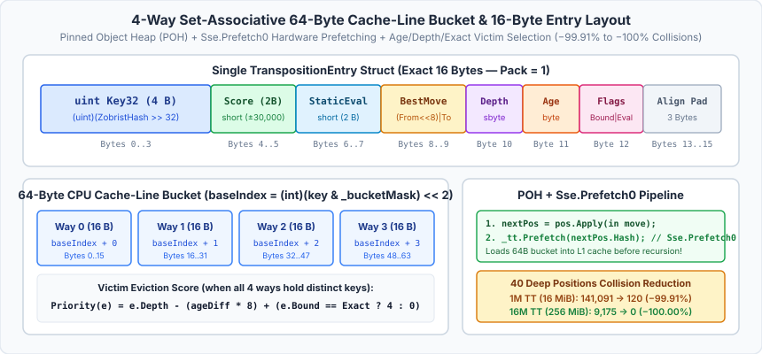
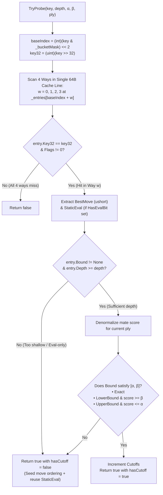

# 08 – Transposition table

[Back to the index](README.md)

## In short

In Checkers, many different move sequences transpose into the exact same board configuration. The **Transposition Table** ([`TranspositionTable.cs`](../../src/Checkers.Core/AI/TranspositionTable.cs)) is a high-speed, **4-way set-associative hash table** indexed by the 64-bit Zobrist hash ([Chapter 02](02-board-and-coordinates.md)) and organized into **64-byte CPU cache-line buckets** on the .NET **Pinned Object Heap (POH)**.

When `MinimaxPlayer` encounters a position—either via a different move order in the current tree, across successive iterations of Iterative Deepening, or on subsequent turns of a game—it probes the 4-way bucket in $O(1)$ time to:
1. **Trigger an immediate $\alpha$-$\beta$ cutoff** if the cached entry was searched to at least the required remaining depth (`entry.Depth >= depth`) and its bound flag satisfies $[\alpha, \beta]$.
2. **Seed move ordering** ([Chapter 06](06-move-ordering.md)) by searching the stored 16-bit `BestMove` (`(fromSq << 8) | toSq`) first at index `0` even when the cached depth is shallower than `depth`.
3. **Reuse the cached `StaticEval`** (`short StaticEval`) for Quiescence stand-pat, Reverse Futility Pruning, and Futility Pruning ([Chapter 07](07-search.md)) without recomputing `EvaluationFunction.Evaluate`.



---

## Compact 16-byte entry & 64-byte cache-line bucket layout

[`TranspositionTable.cs`](../../src/Checkers.Core/AI/TranspositionTable.cs) packs each `TranspositionEntry` into an exact **16-byte value struct** (`[StructLayout(LayoutKind.Sequential, Pack = 1)]`) so that **one 4-way bucket ($4 \times 16\text{ B} = 64\text{ B}$) fits inside a single 64-byte CPU cache line**:

```
┌────────────────────┬───────────┬────────────┬───────────┬───────┬──────┬───────┬───────────┐
│     Key32 (4 B)    │ Score(2B) │StaticEv(2B)│BestMove2B │ Depth │ Age  │ Flags │ Pad (3 B) │
│     uint (0..3)    │short(4..5)│short (6..7)│ushort(8.9)│ (10)  │ (11) │ (12)  │  (13..15) │
└────────────────────┴───────────┴────────────┴───────────┴───────┴──────┴───────┴───────────┘
 0                  3 4         5 6          7 8         9   10      11     12    13       15
```

| Bytes | Field | Type | Contents |
|---|---|---|---|
| `0–3` | `Key32` | `uint` | Upper 32 bits of the 64-bit Zobrist hash: `(uint)(key >> 32)` |
| `4–5` | `Score` | `short` | Centipawn or ply-normalized mate score ($\pm 30{,}000$) |
| `6–7` | `StaticEval` | `short` | Cached static heuristic evaluation from `EvaluationFunction.Evaluate` |
| `8–9` | `BestMove` | `ushort` | Packed bitboard move `(ushort)((fromSq << 8) \| toSq)` (`0..63`), or `0` if none |
| `10` | `Depth` | `sbyte` | Remaining search depth $d$ when the entry was recorded (`-1` if eval-only) |
| `11` | `Age` | `byte` | 8-bit search generation counter (`0..255`), incremented once per root turn |
| `12` | `Flags` | `byte` | Bits `0–1`: `TranspositionBound` ($0..3$); Bit `2` (`0x04`): `HasStaticEval` |
| `13–15` | `_pad0`, `_pad1` | `byte + ushort` | Explicit alignment padding to exact 16-byte struct stride |

### 50–54 Bit Combined Zobrist Verification
Because a table of $N = 2^k$ entries ($k \in \{20, \dots, 24\}$) contains $N_{\text{buckets}} = 2^{k-2}$ buckets, the bucket index `key & _bucketMask` implicitly verifies the lower $k - 2 \in \{18, \dots, 22\}$ bits of the 64-bit Zobrist hash, while `Key32 = (uint)(key >> 32)` explicitly verifies all upper 32 bits:

$$\text{Total Verified Hash Bits} = 32 + \log_2(N / 4) = 30 + k \in [50, 54]\text{ bits}$$

Saving 4 bytes on the key field (`uint Key32` instead of `ulong Key`) and 2 bytes on `Score` (`short` instead of `int`) frees the exact bytes needed to store `short StaticEval` and a full 8-bit `byte Age` inside the same 16-byte footprint.

---

## Alpha-Beta Search Bounds

Because Alpha-Beta searches within a window $[\alpha, \beta]$, not every node finishes with an exact minimax value:

| Bound Flag | Storage Condition | Meaning & Cutoff Condition on Probe (`entry.Depth >= depth`) |
|---|---|---|
| **`Exact`** (`1`) | $\alpha < \text{score} < \beta$ | Every child move was searched without a $\beta$-cutoff, and at least one move improved $\alpha$. **Always returns `score` immediately.** |
| **`LowerBound`** (`2`) | $\text{score} \ge \beta$ | A fail-high $\beta$-cutoff occurred; the true minimax score is *at least* `score`. **Triggers cutoff if $\text{score} \ge \beta$.** |
| **`UpperBound`** (`3`) | $\text{score} \le \alpha$ | A fail-low occurred (all moves scored $\le \alpha$); the true minimax score is *at most* `score`. **Triggers cutoff if $\text{score} \le \alpha$.** |

---

## 4-Way Bucket Probe and Store Pipeline



---

## 4-Way Victim Selection & Replacement Strategy

In a direct-mapped (1-slot) hash table, whenever two active positions map to the same index, one must immediately overwrite or be rejected by the other. Grouping 4 entries into a **64-byte set-associative bucket** (`BucketSize = 4`) provides 4 independent ways within the exact same L1/L3 cache line fetch.

When `Store` is called for `key`:
1. **Pass 1 — Exact Match or Empty Way:** If any of the 4 ways (`w = 0..3`) already holds `Key32 == key32` or is empty (`Flags == 0`), that way is selected immediately (`victimWay = w`).
   - **BestMove Preservation on Fail-Low:** When updating the same position (`existing.Key32 == key32`), if the new store has no best move (`bestMove == 0`, e.g., an `UpperBound` fail-low) or is an eval-only store, the existing `BestMove` and `StaticEval` are preserved!
   - **Depth Protection on Same Key:** An existing entry for the *same* key from the current generation is only overwritten if the new bound is `Exact`, or `depth >= existing.Depth - 2`.
2. **Pass 2 — Priority-Based Victim Eviction:** If all 4 ways in the bucket hold distinct keys (`Key32 != key32`), `Store` evaluates a replacement priority score for each way $w \in \{0, 1, 2, 3\}$ and overwrites the slot with the **lowest priority**:

$$\text{Priority}(e) = e.\text{Depth} - 8 \cdot \bigl((\text{age} - e.\text{Age}) \bmod 256\bigr) + \begin{cases} 4 & \text{if } e.\text{Bound} = \text{Exact} \\ 0 & \text{otherwise} \end{cases}$$

* **Stale Generation Eviction (`-8 * ageDiff`):** Entries from earlier turns in the match (`e.Age != _currentAge`) receive a steep negative penalty ($-8$ priority per turn of age), ensuring they are always evicted before current-search entries.
* **Exact-Bound Protection (`+4`):** Exact Principal Variation nodes are given a $+4\text{ ply}$ priority bonus over `LowerBound` / `UpperBound` entries of similar depth.
* **Depth Preference (`e.Depth`):** Among current-generation entries, the shallowest subtree is evicted so deep interior nodes that cost thousands of evaluations are retained.

---

## Pinned Object Heap (POH) & Hardware Cache Prefetching (`Sse.Prefetch0`)

In the 64-bit bitboard engine, per-node move generation, copy-make, and `POPCNT` evaluation take only **~28–30 nanoseconds**. By comparison, a random Zobrist lookup into a 16 MiB–256 MiB Transposition Table in L3 cache or main DRAM takes **15–40 nanoseconds**.

To hide this memory latency:
1. **Pinned Object Heap Allocation:** `TranspositionTable` allocates `_entries` on the .NET **Pinned Object Heap** (`GC.AllocateArray<TranspositionEntry>(count, pinned: true)`) and caches the fixed base pointer `TranspositionEntry* _entriesPtr = (TranspositionEntry*) Unsafe.AsPointer(ref MemoryMarshal.GetArrayDataReference(_entries))`. Because the GC never relocates POH arrays, address calculation requires zero pinning overhead during search.
2. **Early Hardware Prefetch (`Sse.Prefetch0`):** Inside `MinimaxPlayer.NegamaxBitboard`, immediately after `BitPosition nextPos = pos.Apply(in moves[i])` computes the child's Zobrist hash `nextPos.Hash`—*before* checking futility pruning, setting up LMR reductions, or pushing the recursive stack frame—the engine issues a hardware prefetch instruction:

```csharp
[MethodImpl(MethodImplOptions.AggressiveInlining)]
public void Prefetch(ulong key)
{
    if (Sse.IsSupported)
    {
        Sse.Prefetch0(_entriesPtr + ((int)(key & _bucketMask) << 2));
    }
}
```

By the time the recursive `NegamaxBitboard` call finishes its terminal/repetition checks and invokes `TryProbe`, the entire 64-byte 4-way bucket is already warming in the CPU's L1 data cache.

---

## Multi-Turn Persistence & Configurable Sizing

The table capacity $N = 2^k$ is always an exact power of two (with $N_{\text{buckets}} = N / 4 = 2^{k-2}$), replacing integer division (`%`) with a single-cycle bitwise AND mask:

$$\text{baseIndex} = \bigl(\text{key} \land (N_{\text{buckets}} - 1)\bigr) \ll 2$$

The capacity is user-configurable in the **Game -> Settings...** dialog across five power-of-two tiers from **$1,048,576$ ($2^{20}$, default)** up to **$16,777,216$ ($2^{24}$)**:

| Setting | Entries ($N = 2^k$) | 4-Way Buckets ($2^{k-2}$) | Memory ($16\text{ B} \times N$) | Target Environment |
|---|---|---|---|---|
| **Default ($2^{20}$)** | $1,048,576$ | $262,144$ | $16\text{ MiB}$ | Default desktop & web client (fits inside CPU L3 cache) |
| **Medium ($2^{21}$)** | $2,097,152$ | $524,288$ | $32\text{ MiB}$ | Extended time-per-move play |
| **Large ($2^{22}$)** | $4,194,304$ | $1,048,576$ | $64\text{ MiB}$ | Deep tactical analysis |
| **Extra Large ($2^{23}$)** | $8,388,608$ | $2,097,152$ | $128\text{ MiB}$ | Long clock games |
| **Maximum ($2^{24}$)** | $16,777,216$ | $4,194,304$ | $256\text{ MiB}$ | Maximum capacity (zero collisions across 40 deep positions) |
| **Lightweight / Tests ($2^{16}$)** | $65,536$ | $16,384$ | $1\text{ MiB}$ | Fast unit test execution |

During interactive gameplay, `MainViewModel` retains the `TranspositionTable` across turns without calling `Clear()`. At the start of each computer turn, `MinimaxPlayer` calls `_tt.NewSearch()`, which increments `_currentAge` (`byte`, $0\dots 255$) in $O(1)$ time—allowing deep subtrees calculated on turn $t$ to accelerate turn $t + 1$ while automatically aging out stale entries during bucket eviction.

---

## Score Normalization (Win Distance Invariance)

As described in [Chapter 07](07-search.md#distance-to-mate-scoring), a forced win or loss score ($|\text{score}| \ge 28{,}000$, where `WinScore = 30,000` fits inside a 16-bit `short`) depends on the `ply` distance from the root: $\pm 30{,}000 \mp \text{ply}$. If stored raw at $\text{ply}_1$ and retrieved via a transposition at $\text{ply}_2 \neq \text{ply}_1$, the mate distance would be corrupted.

To make stored mate scores independent of the root path length, `TranspositionTable` normalizes mate scores relative to the node itself:

$$\text{NormalizeForStore}(\text{score}, \text{ply}) = \begin{cases} \text{score} + \text{ply} & \text{if } \text{score} \ge +28{,}000 \\ \text{score} - \text{ply} & \text{if } \text{score} \le -28{,}000 \\ \text{score} & \text{otherwise} \end{cases}$$

$$\text{NormalizeForRetrieve}(\text{stored}, \text{ply}) = \begin{cases} \text{stored} - \text{ply} & \text{if } \text{stored} \ge +28{,}000 \\ \text{stored} + \text{ply} & \text{if } \text{stored} \le -28{,}000 \\ \text{stored} & \text{otherwise} \end{cases}$$

---

## Empirical Performance & Collision Summary

Across our 40-position deep benchmark suite ($7\text{–}14$ plies, ~95.8M baseline nodes):

1. **88.4% Node Reduction & 8.16× Tree Pruning Speedup (No-TT vs. TT):**
   - Enabling the Transposition Table reduces total evaluated nodes across the 40 deep International positions from **`95,811,314` to `10,962,720` nodes (-88.56%)**, and in English Checkers from **`94,110,293` to `9,974,305` nodes (-89.40%)**, generating over **500,000 direct hash cutoffs**.
2. **99.91%–100% Collision Elimination via 4-Way Cache-Line Buckets (Phase 2):**
   - Upgrading from a 1-slot direct-mapped table to **4-way set-associative 64-byte buckets** virtually eliminated hash collisions while accelerating TT throughput by **+11.9% to +14.2%**:

| Variant & Table Size | 1-Slot Direct Collisions (Phase 1) | 4-Way Bucket Collisions (Phase 2) | Collision Reduction | Phase 0 Time | Phase 2 Time | Phase 2 Throughput |
|---|---:|---:|---:|---:|---:|---:|
| **International — 1M TT (16 MiB)** | `141,091` | **`120`** | **-99.91%** | `714 ms` | **`638 ms`** | **17.18M nodes/s (+11.9%)** |
| **International — 16M TT (256 MiB)** | `9,175` | **`0`** | **-100.00%** | `850 ms` | **`764 ms`** | **14.34M nodes/s (+11.6%)** |
| **English — 1M TT (16 MiB)** | `121,868` | **`78`** | **-99.94%** | `638 ms` | **`557 ms`** | **17.85M nodes/s (+14.2%)** |
| **English — 16M TT (256 MiB)** | `7,915` | **`0`** | **-100.00%** | `720 ms` | **`656 ms`** | **15.14M nodes/s (+9.6%)** |

For the complete 40-position per-position benchmark tables ($1\text{M}$ vs. $16\text{M}$ TT, Standard and Deep suites) and the Phase 0–4 progression, see [Chapter 12 – Engine improvements during development](12-engine-improvements.md).
