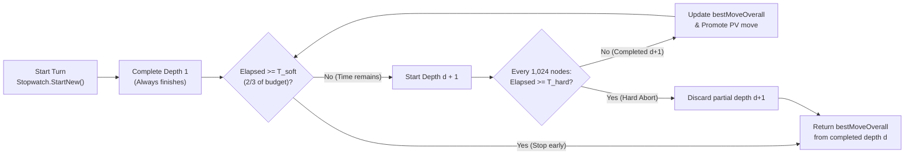

# 09 – Time control

[Back to the index](README.md)

## In short

How long the computer player is permitted to think is configured via the **Game -> Settings...** modal dialog, matching the design of Stello and Connect-4.

The search engine uses **Iterative Deepening** ([Chapter 07](07-search.md)) bounded by two time thresholds:
1. **Soft Limit ($T_{\text{soft}}$):** Checked *between* depth iterations ($d \rightarrow d + 1$). Prevents starting a new ply iteration when less than $\frac{1}{3}$ of the move budget remains.
2. **Hard Limit ($T_{\text{hard}}$):** Checked every $1{,}024$ nodes *inside* `NegaMax` and `Quiescence`. Aborts an in-progress iteration immediately if the budget expires, returning `bestMoveOverall` from the last completed depth $d - 1$.

---

## The three time control modes

[`SearchLimits.cs`](../../src/Checkers.Core/AI/SearchLimits.cs) and [`GameSettings.cs`](../../src/Checkers.App/Models/GameSettings.cs):

| Mode | Factory Method | UI Slider Range | Max Iterative Depth | Description |
|---|---|:---:|:---:|---|
| **Fixed depth** | `SearchLimits.FixedDepth(plies)` | $1\text{–}20$ plies (default: $8$) | $D = \text{Depth}$ | Explores depths $1, 2, \dots, D$ with no wall-clock timeout ($T_{\text{soft}} = T_{\text{hard}} = \infty$). |
| **Time per move** | `SearchLimits.TimePerMove(time)` | $1\text{–}60\text{ s}$ (default: $5\text{ s}$) | $20$ plies | Allocates a fixed wall-clock budget $T$ for every computer turn. |
| **Time per game** | `SearchLimits.TimePerGame(remaining)` | $1\text{–}60\text{ min}$ (default: $5\text{ min}$) | $20$ plies | Shared chess clock dynamically apportioned across the remaining moves of the match. |

---

## Soft and hard time budget equations

Let $P = |W| + |B|$ be the total number of pieces remaining on the board (`state.WhitePiecesCount + state.BlackPiecesCount`).

### 1. Time per Move
Given user setting $T_{\text{move}}$ (in milliseconds):

$$T_{\text{hard}} = T_{\text{move}}, \qquad T_{\text{soft}} = \left\lfloor \frac{2}{3}\, T_{\text{hard}} \right\rfloor$$

### 2. Dynamic Time per Game Allocation
Given remaining clock time $T_{\text{rem}}$ (in milliseconds), the engine estimates the number of remaining moves as $\hat{M} = \text{clamp}(P, 2, 25)$ and allocates:

$$T_{\text{hard}} = \max\!\left(10\text{ ms},\; \left\lfloor \frac{T_{\text{rem}}}{\min\bigl(25, \max(2, |W| + |B|)\bigr)} \right\rfloor\right), \qquad T_{\text{soft}} = \left\lfloor \frac{2}{3}\, T_{\text{hard}} \right\rfloor$$

* **Opening & Middlegame ($P \approx 16\text{–}24$):** Allocates $\frac{1}{24}$ to $\frac{1}{16}$ of the remaining clock per turn, preserving clock reserve for complex middle-game tactics.
* **Endgame ($P \le 6$):** Allocates larger fractions of the remaining clock to calculate deep king endgames accurately.
* **Clock Exhaustion Guard (`10 ms` floor):** Even in extreme time trouble ($T_{\text{rem}} \approx 0$), at least $10\text{ ms}$ is granted so depth $1$ completes cleanly and returns a legal move.

### Iterative Deepening Time Lifecycle

Because branching factor $b$ causes depth $d + 1$ to take roughly $\sqrt{b} \approx 2.5\times\text{–}4\times$ longer than depth $d$, if $\ge \frac{2}{3}$ of the budget has already been consumed finishing depth $d$, depth $d + 1$ is unlikely to complete before $T_{\text{hard}}$. Stopping at $T_{\text{soft}}$ avoids wasting the remaining $\frac{1}{3}$ of the clock on an aborted search!

---

## Chess clock management & Undo refunds

In `TimePerGame` mode, [`MainViewModel`](../../src/Checkers.App/ViewModels/MainViewModel.cs) manages the computer's chess clock across the game lifecycle:
1. **Snapshot Before Search:** Before each move at ply $k$, the remaining computer clock is recorded in `_timeLeftAtPly[k]`.
2. **Elapsed Deduction:** While the computer searches, a UI timer updates the live countdown banner (`[Clock: 4:32]`) and sidebar clock card. Upon move completion, elapsed thinking time is subtracted from `_computerTimeRemaining`.
3. **Exact Undo Refund:** If the human player presses **Undo** (`Ctrl+Z`), `MainViewModel` restores `_computerTimeRemaining` to the exact value saved in `_timeLeftAtPly` for that ply, preventing Undo from draining the computer's clock.

---

## Settings Dialog Configuration

The **Game -> Settings...** modal dialog ([`SettingsViewModel.cs`](../../src/Checkers.App/ViewModels/SettingsViewModel.cs)) consolidates all rule, time control, and memory settings:

1. **Checkers Rules & Variant:**
   - **International Draughts (Flying Kings):** Kings slide and capture across open diagonals with mandatory continuation.
   - **English Checkers (1-Step Kings):** Kings move and jump strictly 1 step in all 4 diagonal directions.
   - *Mid-Game Safety Prompt:* If the user changes the variant while a game has moves on the board, `MainViewModel` prompts for confirmation before starting a fresh game under the new rule set.
2. **Computer Search Limits:**
   - Radio selection between **Fixed Depth** ($1\text{–}20$ plies), **Time per Move** ($1\text{–}60\text{ s}$), and **Time per Game** ($1\text{–}60\text{ min}$).
3. **Transposition Table Capacity:**
   - Selector from **$1,048,576$ entries ($16\text{ MiB}$, default)** up to **$16,777,216$ entries ($256\text{ MiB}$)** ([Chapter 08](08-transposition-table.md)).
