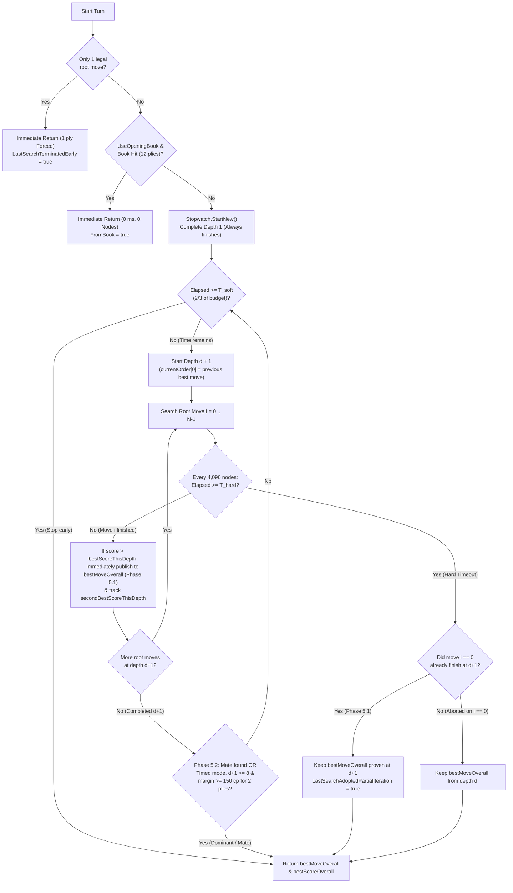

# 09 – Time control

[Back to the index](README.md)

## In short

How long the computer player is permitted to think is configured via the **Game -> Settings...** modal dialog, matching the design of Stello and Connect-4.

The search engine uses **Iterative Deepening** ([Chapter 07](07-search.md)) bounded by two time thresholds:
1. **Soft Limit ($T_{\text{soft}}$):** Checked *between* depth iterations ($d \rightarrow d + 1$). Prevents starting a new ply iteration when less than $\frac{1}{3}$ of the move budget remains.
2. **Hard Limit ($T_{\text{hard}}$):** Checked every $4{,}096$ nodes (`(NodesEvaluated & 4095) == 0`) *inside* `NegamaxBitboard` and `Quiescence`. Aborts an in-progress iteration immediately if the budget expires, returning `bestMoveOverall` from the last completed depth $d - 1$.

---

## The three time control modes

[`SearchLimits.cs`](../../src/Checkers.Core/AI/SearchLimits.cs) and [`GameSettings.cs`](../../src/Checkers.App/Models/GameSettings.cs):

| Mode | Factory Method | UI Slider Range | Max Iterative Depth | Description |
|---|---|:---:|:---:|---|
| **Fixed depth** | `SearchLimits.FixedDepth(plies)` | $1\text{–}20$ plies (default: $8$) | $D = \text{Depth}$ | Explores depths $1, 2, \dots, D$ with no wall-clock timeout ($T_{\text{soft}} = T_{\text{hard}} = \infty$). |
| **Time per move** | `SearchLimits.TimePerMove(time)` | $1\text{–}60\text{ s}$ (default: $5\text{ s}$) | $48$ plies (`MaxPly = 64`) | Allocates a fixed wall-clock budget $T$ for every computer turn. |
| **Time per game** | `SearchLimits.TimePerGame(remaining)` | $1\text{–}60\text{ min}$ (default: $5\text{ min}$) | $48$ plies (`MaxPly = 64`) | Shared chess clock dynamically apportioned across the remaining moves of the match. |

---

## Soft and hard time budget equations

Let $P = |W| + |B|$ be the total number of pieces remaining on the board (`state.WhitePiecesCount + state.BlackPiecesCount`).

### 1. Time per Move
Given user setting $T_{\text{move}}$ (in milliseconds):

$$T_{\text{hard}} = T_{\text{move}}, \qquad T_{\text{soft}} = \left\lfloor \frac{2}{3}\, T_{\text{hard}} \right\rfloor$$

### 2. Dynamic Time per Game Allocation
Given remaining clock time $T_{\text{rem}}$ (in milliseconds), the engine estimates the number of remaining moves as $\hat{M} = \text{clamp}(P, 2, 25)$ and allocates:

$$T_{\text{hard}} = \max\!\left(10\text{ ms},\; \left\lfloor \frac{T_{\text{rem}}}{\min\bigl(25, \max(2, |W| + |B|)\bigr)} \right\rfloor\right), \qquad T_{\text{soft}} = \left\lfloor \frac{2}{3}\, T_{\text{hard}} \right\rfloor$$

* **Opening & Middlegame ($P \approx 16\text{–}24$):** Allocates $\frac{1}{24}$ to $\frac{1}{16}$ of the remaining clock per turn, preserving clock reserve for complex middle-game tactics.
* **Endgame ($P \le 6$):** Allocates larger fractions of the remaining clock to calculate deep king endgames accurately.
* **Clock Exhaustion Guard (`10 ms` floor):** Even in extreme time trouble ($T_{\text{rem}} \approx 0$), at least $10\text{ ms}$ is granted so depth $1$ completes cleanly and returns a legal move.

### Iterative Deepening Time Lifecycle

Because branching factor $b$ causes depth $d + 1$ to take roughly $\sqrt{b} \approx 2.5\times\text{–}4\times$ longer than depth $d$, if $\ge \frac{2}{3}$ of the budget has already been consumed finishing depth $d$, depth $d + 1$ is unlikely to complete before $T_{\text{hard}}$. Stopping at $T_{\text{soft}}$ avoids wasting the remaining $\frac{1}{3}$ of the clock on an aborted search.

---

## Root Search & Time Management Optimizations (Phase 5)

Inspired by `USE_PARTIAL_ITERATION` and `TERMINATE_EARLY_THRESHOLD` in [`board_search.c`](../../Checkers-Engine-main/src/engine/board_search.c) from Collin Kees's [**Checkers-Engine (Marcher Engine)**](https://github.com/Stermere/Checkers-Engine), [`MinimaxPlayer.GetMoveAsync`](../../src/Checkers.Core/AI/MinimaxPlayer.cs) implements two root-level time management mechanisms to maximize search quality when an iteration crosses $T_{\text{hard}}$ and avoid wasting clock time when a single move clearly dominates (see [Chapter 12 – Engine improvements](12-engine-improvements.md#milestone-7-phase-5-root-search--time-management)):

### 1. Partial-Iteration Root Move Adoption on Timeout (`LastSearchAdoptedPartialIteration`)
At the start of every iterative deepening pass $d$, `currentOrder[0]` is always the Principal Variation move from completed depth $d - 1$.
* As soon as root move $i = 0$ completes without aborting, its exact depth-$d$ evaluation $S_d(m_0)$ is established and `alpha` is raised to $S_d(m_0)$.
* Every subsequent root move $i > 0$ that completes without aborting and achieves $S_d(m_i) > \text{bestScoreThisDepth}$ has been proven **at the same full depth $d$** to be strictly superior to $m_0$ (and all moves $0 \dots i - 1$).
* Therefore, `MinimaxPlayer` immediately publishes each newly proven depth-$d$ best move and score to `bestMoveOverall` and `bestScoreOverall` inside the root loop:
  $$\text{If } \neg\text{aborted} \land S_d(m_i) > \text{bestScoreThisDepth}: \quad \text{bestMoveOverall} \leftarrow m_i,\; \text{bestScoreOverall} \leftarrow S_d(m_i)$$
* If a later root move $k > i$ hits $T_{\text{hard}}$, the engine retains the depth-$d$ refutation/improvement (`LastSearchAdoptedPartialIteration = true`) instead of reverting to the stale depth-$(d-1)$ choice. Conversely, if $T_{\text{hard}}$ expires while still searching $i = 0$, `bestEntryThisDepth` is `null` and the depth-$(d-1)$ result stands untouched.

### 2. Early Root Termination on Single Viable Move (`UseEarlyRootTermination`)
Because the root loop in `GetMoveAsync` searches each root move $m_i$ with $[-\beta, -\alpha] = [-200{,}000, -\alpha]$ (applying PVS null windows starting at `ply >= 1`), the principal continuation of every root move is evaluated with `isNullWindow == false` and returns a genuine fail-soft score without static forward-pruning distortion.

During each root pass $d$, `GetMoveAsync` tracks both the highest score $S_d^{(1)} = \text{bestScoreThisDepth}$ and the second-highest score $S_d^{(2)} = \text{secondBestScoreThisDepth}$. In timed modes (`TimePerMove` and `TimePerGame`), iterative deepening terminates early (`LastSearchTerminatedEarly = true`) when either:
1. **Proven Mate Score:** $\text{bestScoreOverall} \ge +28{,}000$ (forced win found) or $\text{bestScoreOverall} \le -28{,}000$ (all legal moves are proven losses).
2. **Dominant Single Viable Move ($d \ge 8$):** At depth $d \ge 8$, the same root move $m^*$ has led every alternative root move by at least $\Delta_{\text{dom}} = 150\text{ cp}$ ($1.5\text{ men}$) for $K_{\text{streak}} = 2$ consecutive completed iterations:
   $$d \ge 8 \;\land\; m^*_d = m^*_{d-1} \;\land\; \bigl(S_d^{(1)} - S_d^{(2)} \ge 150\bigr) \;\land\; \bigl(S_{d-1}^{(1)} - S_{d-1}^{(2)} \ge 150\bigr)$$

---

## Chess clock management & Undo refunds

In `TimePerGame` mode, [`MainViewModel`](../../src/Checkers.App/ViewModels/MainViewModel.cs) manages the computer's chess clock across the game lifecycle:
1. **Snapshot Before Search:** Before each move at ply $k$, the remaining computer clock is recorded in `_timeLeftAtPly[k]`.
2. **Elapsed Deduction:** While the computer searches, a UI timer updates the live countdown banner (`[Clock: 4:32]`) and sidebar clock card. Upon move completion, elapsed thinking time is subtracted from `_computerTimeRemaining` (opening book hits take `0 ms`, preserving 100% of the clock for the middlegame).
3. **Exact Undo Refund:** If the human player presses **Undo** (`Ctrl+Z`), `MainViewModel` restores `_computerTimeRemaining` to the exact value saved in `_timeLeftAtPly` for that ply, preventing Undo from draining the computer's clock.

---

## Settings Dialog Configuration

The **Game -> Settings...** modal dialog ([`SettingsViewModel.cs`](../../src/Checkers.App/ViewModels/SettingsViewModel.cs)) consolidates all rule, time control, opening book, and memory settings:

1. **Checkers Rules & Variant:**
   - **International Draughts (Flying Kings):** Kings slide and capture across open diagonals with mandatory continuation.
   - **English Checkers (1-Step Kings):** Kings move and jump strictly 1 step in all 4 diagonal directions.
   - *Mid-Game Safety Prompt:* If the user changes the variant while a game has moves on the board, `MainViewModel` prompts for confirmation before starting a fresh game under the new rule set.
2. **Computer Search Limits:**
   - Radio selection between **Fixed Depth** ($1\text{–}20$ plies), **Time per Move** ($1\text{–}60\text{ s}$), and **Time per Game** ($1\text{–}60\text{ min}$).
3. **Transposition Table Capacity:**
   - Selector from **$1,048,576$ entries ($16\text{ MiB}$, default)** up to **$16,777,216$ entries ($256\text{ MiB}$)** ([Chapter 08](08-transposition-table.md)).
4. **Opening Book (`UseOpeningBook`):**
   - Checkbox toggle (**enabled by default**) to use the embedded 12-ply Drop-Out Expansion opening book (`32,369` English / `26,367` International positions; [Chapter 10](10-opening-book.md)).
