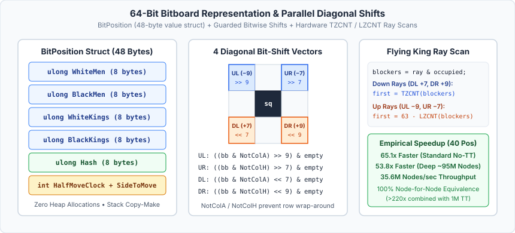
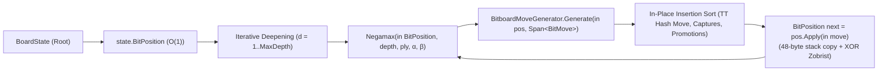

# 10 – Bitboards

[Back to the index](README.md)

## In short

In the initial implementation of `Checkers.Core`, `BoardState` stored pieces in a heap-allocated `Piece?[8, 8]` array, and cloning that array alongside `List<Move>` / `List<Position>` allocations at every node of an Alpha-Beta search tree created substantial memory-bandwidth and garbage-collection overhead.

To maximize search throughput while preserving **100% behavioral and node-for-node search equivalence**, `Checkers.Core` was refactored to a pure **64-bit Bitboard Engine** (`Checkers.Core.Bitboards`), backing `BoardState`, `RuleEngine`, `EvaluationFunction`, and `MinimaxPlayer` directly by 64-bit bitboards:
- **`BitPosition` (`struct`, 48 bytes):** Represents the entire board using four `ulong` bitboards (`WhiteMen`, `BlackMen`, `WhiteKings`, `BlackKings`), an incrementally maintained 64-bit Zobrist `Hash`, `HalfMoveClock`, and `SideToMove`. `BoardState` wraps `BitPosition` directly with zero array allocation.
- **`BitMove` (`readonly record struct`, 16 bytes):** Value-type move representation storing `ulong Captured` (all jumped squares as a bitmask), `byte From`, `byte To`, and `bool IsPromotion` with zero heap allocations.
- **`BitboardMoveGenerator` & `RuleEngine`:** Generates legal moves into stack/per-ply `Span<BitMove>` buffers using parallel 64-bit shift-and-mask operations for Men and English 1-Step Kings, and hardware `BitOperations.TrailingZeroCount` / `LeadingZeroCount` diagonal ray scans for International Flying Kings.
- **`EvaluationFunction`:** Computes the exact same static evaluation using hardware `BitOperations.PopCount` (`POPCNT` instruction) and precomputed row/center masks instead of 64-square loops.
- **`MinimaxPlayer`:** Allocation-free Negamax Alpha-Beta search using value-type copy-make (`BitPosition next = pos.Apply(in move)`), preallocated per-ply `BitMove[][]` buffers, single move generation per node, and in-place insertion sort.

Across the 40-position benchmark suite, the bitboard engine evaluated the **exact same number of nodes, leaf evaluations, and TT cutoffs** as the original `Piece?[8, 8]` array engine while delivering:
- **63x–65x speedup** on standard depths (7–9 plies, No-TT) and **23.6x–24.0x speedup** with the 1M Transposition Table.
- **50.4x–53.8x speedup** on deep searches (~5s/pos baseline, 7–14 plies, ~95M nodes, No-TT) and **25.1x–25.6x speedup** with the 1M Transposition Table (**>208x–222x combined speedup** over the uncached array baseline).



---

## 64-Bit 8×8 Bitboard Layout

Every square `(Row, Col)` on the 8×8 board maps directly to bit index:

$$\text{sq} = \text{Row} \times 8 + \text{Col} \in \{0, 1, \dots, 63\}$$

A square is occupied in a bitboard `bb` if and only if `((bb >> sq) & 1UL) != 0`. Because this matches the exact indexing of `Zobrist.PieceTable[64, 4]`, incremental Zobrist hash updates during `BitPosition.Apply` require only direct table lookups by bit index.

```
Row 0 (Black Back Rank):   0   [1]   2   [3]   4   [5]   6   [7]
Row 1:                    [8]   9  [10]  11  [12]  13  [14]  15
Row 2:                    16  [17]  18  [19]  20  [21]  22  [23]
Row 3:                   [24]  25  [26]  27  [28]  29  [30]  31
Row 4:                    32  [33]  34  [35]  36  [37]  38  [39]
Row 5:                   [40]  41  [42]  43  [44]  45  [46]  47
Row 6:                    48  [49]  50  [51]  52  [53]  54  [55]
Row 7 (White Back Rank): [56]  57  [58]  59  [60]  61  [62]  63
```

### Precomputed Masks (`BitboardMasks.cs`)

To prevent horizontal wrap-around when shifting bits diagonally across files A (`Col == 0`) and H (`Col == 7`), `BitboardMasks` defines compile-time constants and static lookup tables:

| Constant / Table | Hex Value / Type | Purpose |
|---|---|---|
| `DarkSquares` | `0x55AA55AA55AA55AAUL` | All 32 playable dark squares `(Row + Col) % 2 == 1` |
| `NotColA` | `0xFEFEFEFEFEFEFEFEUL` | Excludes Column 0 (prevents left-shift wrap-around) |
| `NotColH` | `0x7F7F7F7F7F7F7F7FUL` | Excludes Column 7 (prevents right-shift wrap-around) |
| `NotColAB` | `0xFCFCFCFCFCFCFCFCUL` | Excludes Columns 0 & 1 (2-square left jump guard) |
| `NotColGH` | `0x3F3F3F3F3F3F3F3FUL` | Excludes Columns 6 & 7 (2-square right jump guard) |
| `Row0` | `0x00000000000000FFUL` | White promotion rank (`Row == 0`) |
| `Row7` | `0xFF00000000000000UL` | Black promotion rank (`Row == 7`) |
| `CenterMask` | `0x0000142800000000UL` | Core dark squares `14, 15, 18, 19` (Rows 3–4, Cols 2–5: `+12` center control bonus) |
| `KingCenterMask` | `0x0014281428000000UL` | Central 4×4 dark squares (Rows 2–5, Cols 2–5: `+10` English king centralization) |
| `Rays[4, 64]` | `ulong[4, 64]` | Diagonal dark-square ray masks (`UL`, `UR`, `DL`, `DR`) from square `sq` |

### Diagonal Bit Shifts

Moving one step diagonally corresponds to a fixed bit shift combined with a file guard mask:
- **Up-Left (`-1 row, -1 col`, `-9`):** `(bb & NotColA) >> 9`
- **Up-Right (`-1 row, +1 col`, `-7`):** `(bb & NotColH) >> 7`
- **Down-Left (`+1 row, -1 col`, `+7`):** `(bb & NotColA) << 7`
- **Down-Right (`+1 row, +1 col`, `+9`):** `(bb & NotColH) << 9`

---

## Bitboard Move Generation (`BitboardMoveGenerator.cs`)

### 1. $O(1)$ Terminal Mobility Detection (`HasAnyLegalMove`)

A key mathematical insight connects the two supported rule variants:
> **Theorem:** A board position has at least one legal move in **International Draughts (Flying Kings)** if and only if it has at least one legal move in **English Checkers (1-Step Kings)**.
> *Proof:* Any Flying King move along a diagonal ray requires either the immediately adjacent square at distance 1 to be empty (which is already a legal 1-step quiet move) or the square at distance 1 to hold an enemy piece with distance 2 empty (which is already a legal 1-step jump capture), or distance 1 is empty before a long jump (which means the 1-step quiet move was already legal).

Consequently, `BitboardMoveGenerator.HasAnyLegalMove(in BitPosition pos, CheckersVariant variant)` executes in **$O(1)$ constant time** using parallel bitwise shifts across all friendly pieces simultaneously—with zero loops and zero allocations:

```csharp
ulong upLeftQuiet = ((upMovers & NotColA) >> 9) & empty;
ulong upRightQuiet = ((upMovers & NotColH) >> 7) & empty;
if ((upLeftQuiet | upRightQuiet) != 0)
    return true;
```

### 2. Men and English 1-Step Kings

- **Quiet Moves:** Parallel shift-and-mask (`(movers & NotColA) >> 9 & empty`) identifies all pieces capable of sliding. Individual set bits are iterated via `BitOperations.TrailingZeroCount(mask)` and cleared via `mask &= mask - 1`.
- **Jump Captures:** Parallel 2-step shift-and-mask (`(((movers & NotColAB) >> 9) & enemy) >> 9 & empty`) detects whether any capture exists before recursive multi-jump expansion. Multi-jump recursion updates the local `own`, `enemy`, and `capturedMask` bitboards in registers, automatically preventing jumping the same piece twice (`(enemy & (1UL << midSq)) != 0`).

### 3. International Flying Kings (`TrailingZeroCount` / `LeadingZeroCount`)

For Flying Kings, ray attacks along each of the 4 diagonal directions (`UL`, `UR`, `DL`, `DR`) are resolved without square-by-square loops up to the first blocker:
1. Compute `ulong blockers = ray & occupied;` along `Rays[dir, sq]`.
2. Locate the **first blocker** along the ray using a single hardware instruction:
   - For positive shifts (`DL`, `DR`, where bit indices increase away from `sq`), the closest blocker is `BitOperations.TrailingZeroCount(blockers)`.
   - For negative shifts (`UL`, `UR`, where bit indices decrease away from `sq`), the closest blocker is `63 - BitOperations.LeadingZeroCount(blockers)`.
3. **Quiet slides:** All squares on the ray strictly before the first blocker (`ray & ~Rays[dir, firstBlocker] & ~(1UL << firstBlocker)`) are valid quiet destinations.
4. **Flying captures:** If the first blocker is an uncaptured `enemy` piece (`(enemy & (1UL << firstBlocker)) != 0`), the ray beyond `firstBlocker` (`Rays[dir, firstBlocker]`) is masked against `occupied` to find the second blocker; all empty squares between `firstBlocker` and the second blocker are valid landing squares, each tested recursively for continuation jumps.

---

## Bitboard Static Evaluation (`EvaluationFunction.cs`)

`EvaluationFunction.Evaluate(in BitPosition pos, CheckersVariant variant)` replaces the 64-square nested array loop with hardware `BitOperations.PopCount` instructions:

1. **Material:**
   $$\text{Score}_{\text{mat}} = 100 \cdot \bigl(\text{PopCount}(W_M) - \text{PopCount}(B_M)\bigr) + W_{\text{king}} \cdot \bigl(\text{PopCount}(W_K) - \text{PopCount}(B_K)\bigr)$$
   where $W_{\text{king}} = 300$ (`International`) or $170$ (`English`).
2. **Advancement Bonus:** Computed per rank using `BitOperations.PopCount(pos.WhiteMen & BitboardMasks.Rows[r]) * ((7 - r) * 5)`.
3. **Center Control (`+12`):** `12 * (PopCount(pos.White & CenterMask) - PopCount(pos.Black & CenterMask))`.
4. **English King Centralization (`+10`):** `10 * (PopCount(pos.WhiteKings & KingCenterMask) - PopCount(pos.BlackKings & KingCenterMask))`.

---

## Value-Type Copy-Make Search (`MinimaxPlayer.cs`)



Unlike the original array-based `MinimaxPlayer`, which cloned a `Piece?[8, 8]` `BoardState` on the managed heap and called `RuleEngine.GetLegalMoves` twice per internal node (once via `EvaluateGameStatus` and once for child expansion), the bitboard `MinimaxPlayer`:
1. Generates moves **once** into a preallocated per-ply buffer `_moveBuffers[ply]` (`BitMove[128]`).
2. If `moveCount == 0`, immediately returns `LossScore + ply` (opponent has no legal moves) without calling a second move generator.
3. Orders moves in-place using a zero-allocation stable insertion sort preserving exact priority order (`TT Hash Move`, `CaptureCount` descending, `IsPromotion` descending).
4. Applies each move via `BitPosition next = pos.Apply(in move)`, copying 48 bytes on the stack and updating `Hash` with 2–4 XOR operations.

---

## Empirical Benchmark: Standard Depths (7–9 Plies)

You can reproduce the standard 40-position benchmark across both variants using:

```powershell
dotnet run --project tools/Checkers.Benchmark/Checkers.Benchmark.csproj -c Release -- --engines
```

### Summary Across All 40 Positions (Standard 7–9 Plies)

| Variant | Mode | Array Nodes | Bitboard Nodes | Node Equivalence | Array Time | Bitboard Time | Speedup |
|---|---|---:|---:|:---:|---:|---:|---:|
| **International (Flying Kings)** | **No-TT Baseline** | 2,317,030 | 2,317,030 | **100% (40/40)** | 3,776 ms | 58 ms | **65.10x** |
| **International (Flying Kings)** | **Default TT (1M)** | 664,471 | 664,471 | **100% (40/40)** | 1,128 ms | 47 ms | **24.00x** |
| **English Checkers (1-Step Kings)** | **No-TT Baseline** | 2,454,069 | 2,454,069 | **100% (40/40)** | 3,857 ms | 61 ms | **63.23x** |
| **English Checkers (1-Step Kings)** | **Default TT (1M)** | 665,966 | 665,966 | **100% (40/40)** | 1,088 ms | 46 ms | **23.65x** |

### Table 1A: International Draughts — Standard No-TT Baseline (Array vs. Bitboard)

| # | Category | Depth | Array Nodes (No-TT) | Bitboard Nodes (No-TT) | Array Time | Bitboard Time | Speedup | Identical |
|---|:---:|:---:|---:|---:|---:|---:|---:|:---:|
| 1 | Opening | 7 plies | 8,965 | 8,965 | 92 ms | 1 ms | **92.00x** | Yes |
| 2 | Opening | 7 plies | 10,821 | 10,821 | 68 ms | 1 ms | **68.00x** | Yes |
| 3 | Opening | 7 plies | 44,913 | 44,913 | 81 ms | 4 ms | **20.25x** | Yes |
| 4 | Opening | 7 plies | 67,449 | 67,449 | 120 ms | 1 ms | **120.00x** | Yes |
| 5 | Opening | 7 plies | 69,129 | 69,129 | 114 ms | 1 ms | **114.00x** | Yes |
| 6 | Opening | 8 plies | 70,060 | 70,060 | 116 ms | 2 ms | **58.00x** | Yes |
| 7 | Opening | 7 plies | 87,714 | 87,714 | 149 ms | 2 ms | **74.50x** | Yes |
| 8 | Opening | 7 plies | 48,374 | 48,374 | 80 ms | 1 ms | **80.00x** | Yes |
| 9 | Opening | 7 plies | 59,062 | 59,062 | 93 ms | 1 ms | **93.00x** | Yes |
| 10 | Opening | 7 plies | 46,247 | 46,247 | 71 ms | 1 ms | **71.00x** | Yes |
| 11 | Middlegame | 8 plies | 42,472 | 42,472 | 63 ms | 1 ms | **63.00x** | Yes |
| 12 | Middlegame | 7 plies | 53,188 | 53,188 | 90 ms | 1 ms | **90.00x** | Yes |
| 13 | Middlegame | 7 plies | 134,182 | 134,182 | 212 ms | 3 ms | **70.67x** | Yes |
| 14 | Middlegame | 7 plies | 56,142 | 56,142 | 90 ms | 1 ms | **90.00x** | Yes |
| 15 | Middlegame | 7 plies | 69,640 | 69,640 | 116 ms | 2 ms | **58.00x** | Yes |
| 16 | Middlegame | 8 plies | 11,328 | 11,328 | 17 ms | 1 ms | **17.00x** | Yes |
| 17 | Middlegame | 8 plies | 36,601 | 36,601 | 64 ms | 1 ms | **64.00x** | Yes |
| 18 | Middlegame | 7 plies | 41,710 | 41,710 | 63 ms | 1 ms | **63.00x** | Yes |
| 19 | Middlegame | 8 plies | 55,338 | 55,338 | 85 ms | 1 ms | **85.00x** | Yes |
| 20 | Middlegame | 8 plies | 118,841 | 118,841 | 184 ms | 3 ms | **61.33x** | Yes |
| 21 | Middlegame | 8 plies | 43,885 | 43,885 | 70 ms | 1 ms | **70.00x** | Yes |
| 22 | Middlegame | 8 plies | 17,425 | 17,425 | 26 ms | 1 ms | **26.00x** | Yes |
| 23 | Middlegame | 7 plies | 61,587 | 61,587 | 107 ms | 1 ms | **107.00x** | Yes |
| 24 | Middlegame | 7 plies | 36,218 | 36,218 | 66 ms | 1 ms | **66.00x** | Yes |
| 25 | Middlegame | 8 plies | 67,300 | 67,300 | 125 ms | 2 ms | **62.50x** | Yes |
| 26 | Endgame | 8 plies | 48,927 | 48,927 | 63 ms | 1 ms | **63.00x** | Yes |
| 27 | Endgame | 7 plies | 46,614 | 46,614 | 78 ms | 1 ms | **78.00x** | Yes |
| 28 | Endgame | 9 plies | 8,892 | 8,892 | 14 ms | 1 ms | **14.00x** | Yes |
| 29 | Endgame | 7 plies | 51,929 | 51,929 | 107 ms | 1 ms | **107.00x** | Yes |
| 30 | Endgame | 8 plies | 48,050 | 48,050 | 58 ms | 1 ms | **58.00x** | Yes |
| 31 | Endgame | 8 plies | 95,291 | 95,291 | 91 ms | 1 ms | **91.00x** | Yes |
| 32 | Endgame | 7 plies | 139,705 | 139,705 | 204 ms | 3 ms | **68.00x** | Yes |
| 33 | Endgame | 8 plies | 75,185 | 75,185 | 125 ms | 2 ms | **62.50x** | Yes |
| 34 | Endgame | 7 plies | 90,965 | 90,965 | 149 ms | 2 ms | **74.50x** | Yes |
| 35 | Endgame | 8 plies | 29,293 | 29,293 | 39 ms | 1 ms | **39.00x** | Yes |
| 36 | Blockade/Tension | 8 plies | 43,113 | 43,113 | 69 ms | 1 ms | **69.00x** | Yes |
| 37 | Blockade/Tension | 8 plies | 25,695 | 25,695 | 41 ms | 1 ms | **41.00x** | Yes |
| 38 | Blockade/Tension | 8 plies | 33,991 | 33,991 | 45 ms | 1 ms | **45.00x** | Yes |
| 39 | Blockade/Tension | 7 plies | 85,130 | 85,130 | 107 ms | 1 ms | **107.00x** | Yes |
| 40 | Blockade/Tension | 8 plies | 135,659 | 135,659 | 224 ms | 4 ms | **56.00x** | Yes |
|---|:---:|:---:|---:|---:|---:|---:|---:|:---:|
| **Total** | **All 40** | **7–9 plies** | **2,317,030** | **2,317,030** | **3,776 ms** | **58 ms** | **65.10x** | **100%** |

### Table 1B: International Draughts — Standard Default TT 1M (Array vs. Bitboard)

| # | Category | Depth | Array TT Nodes (1M) | Bitboard TT Nodes (1M) | Array TT Time | Bitboard TT Time | Speedup | TT Cutoffs | Identical |
|---|:---:|:---:|---:|---:|---:|---:|---:|---:|:---:|
| 1 | Opening | 7 plies | 4,134 | 4,134 | 42 ms | 1 ms | **42.00x** | 21 | Yes |
| 2 | Opening | 7 plies | 7,876 | 7,876 | 15 ms | 1 ms | **15.00x** | 82 | Yes |
| 3 | Opening | 7 plies | 6,195 | 6,195 | 11 ms | 1 ms | **11.00x** | 42 | Yes |
| 4 | Opening | 7 plies | 17,927 | 17,927 | 32 ms | 1 ms | **32.00x** | 321 | Yes |
| 5 | Opening | 7 plies | 9,540 | 9,540 | 16 ms | 1 ms | **16.00x** | 175 | Yes |
| 6 | Opening | 8 plies | 25,735 | 25,735 | 45 ms | 1 ms | **45.00x** | 610 | Yes |
| 7 | Opening | 7 plies | 6,766 | 6,766 | 12 ms | 1 ms | **12.00x** | 41 | Yes |
| 8 | Opening | 7 plies | 7,890 | 7,890 | 13 ms | 1 ms | **13.00x** | 64 | Yes |
| 9 | Opening | 7 plies | 13,974 | 13,974 | 24 ms | 1 ms | **24.00x** | 213 | Yes |
| 10 | Opening | 7 plies | 8,585 | 8,585 | 14 ms | 1 ms | **14.00x** | 62 | Yes |
| 11 | Middlegame | 8 plies | 16,203 | 16,203 | 26 ms | 1 ms | **26.00x** | 652 | Yes |
| 12 | Middlegame | 7 plies | 11,666 | 11,666 | 20 ms | 1 ms | **20.00x** | 263 | Yes |
| 13 | Middlegame | 7 plies | 35,519 | 35,519 | 60 ms | 2 ms | **30.00x** | 496 | Yes |
| 14 | Middlegame | 7 plies | 10,008 | 10,008 | 17 ms | 1 ms | **17.00x** | 345 | Yes |
| 15 | Middlegame | 7 plies | 31,815 | 31,815 | 56 ms | 2 ms | **28.00x** | 807 | Yes |
| 16 | Middlegame | 8 plies | 7,462 | 7,462 | 13 ms | 1 ms | **13.00x** | 116 | Yes |
| 17 | Middlegame | 8 plies | 10,266 | 10,266 | 19 ms | 1 ms | **19.00x** | 153 | Yes |
| 18 | Middlegame | 7 plies | 6,496 | 6,496 | 11 ms | 1 ms | **11.00x** | 137 | Yes |
| 19 | Middlegame | 8 plies | 22,599 | 22,599 | 36 ms | 1 ms | **36.00x** | 651 | Yes |
| 20 | Middlegame | 8 plies | 32,487 | 32,487 | 56 ms | 2 ms | **28.00x** | 818 | Yes |
| 21 | Middlegame | 8 plies | 12,158 | 12,158 | 20 ms | 1 ms | **20.00x** | 314 | Yes |
| 22 | Middlegame | 8 plies | 11,383 | 11,383 | 17 ms | 1 ms | **17.00x** | 565 | Yes |
| 23 | Middlegame | 7 plies | 12,579 | 12,579 | 24 ms | 1 ms | **24.00x** | 314 | Yes |
| 24 | Middlegame | 7 plies | 8,757 | 8,757 | 15 ms | 1 ms | **15.00x** | 110 | Yes |
| 25 | Middlegame | 8 plies | 24,042 | 24,042 | 46 ms | 1 ms | **46.00x** | 506 | Yes |
| 26 | Endgame | 8 plies | 23,148 | 23,148 | 26 ms | 1 ms | **26.00x** | 1,083 | Yes |
| 27 | Endgame | 7 plies | 16,010 | 16,010 | 28 ms | 1 ms | **28.00x** | 254 | Yes |
| 28 | Endgame | 9 plies | 6,222 | 6,222 | 9 ms | 1 ms | **9.00x** | 326 | Yes |
| 29 | Endgame | 7 plies | 16,865 | 16,865 | 35 ms | 1 ms | **35.00x** | 728 | Yes |
| 30 | Endgame | 8 plies | 15,962 | 15,962 | 20 ms | 1 ms | **20.00x** | 643 | Yes |
| 31 | Endgame | 8 plies | 20,585 | 20,585 | 22 ms | 1 ms | **22.00x** | 1,550 | Yes |
| 32 | Endgame | 7 plies | 55,961 | 55,961 | 87 ms | 3 ms | **29.00x** | 3,605 | Yes |
| 33 | Endgame | 8 plies | 31,368 | 31,368 | 56 ms | 2 ms | **28.00x** | 714 | Yes |
| 34 | Endgame | 7 plies | 16,121 | 16,121 | 27 ms | 1 ms | **27.00x** | 608 | Yes |
| 35 | Endgame | 8 plies | 13,406 | 13,406 | 19 ms | 1 ms | **19.00x** | 355 | Yes |
| 36 | Blockade/Tension | 8 plies | 17,679 | 17,679 | 28 ms | 1 ms | **28.00x** | 409 | Yes |
| 37 | Blockade/Tension | 8 plies | 10,331 | 10,331 | 17 ms | 1 ms | **17.00x** | 581 | Yes |
| 38 | Blockade/Tension | 8 plies | 13,149 | 13,149 | 19 ms | 1 ms | **19.00x** | 350 | Yes |
| 39 | Blockade/Tension | 7 plies | 12,022 | 12,022 | 18 ms | 1 ms | **18.00x** | 333 | Yes |
| 40 | Blockade/Tension | 8 plies | 33,580 | 33,580 | 57 ms | 2 ms | **28.50x** | 1,146 | Yes |
|---|:---:|:---:|---:|---:|---:|---:|---:|---:|:---:|
| **Total** | **All 40** | **7–9 plies** | **664,471** | **664,471** | **1,128 ms** | **47 ms** | **24.00x** | **20,563** | **100%** |

### Table 2A: English Checkers — Standard No-TT Baseline (Array vs. Bitboard)

| # | Category | Depth | Array Nodes (No-TT) | Bitboard Nodes (No-TT) | Array Time | Bitboard Time | Speedup | Identical |
|---|:---:|:---:|---:|---:|---:|---:|---:|:---:|
| 1 | Opening | 8 plies | 27,030 | 27,030 | 47 ms | 1 ms | **47.00x** | Yes |
| 2 | Opening | 8 plies | 57,262 | 57,262 | 92 ms | 2 ms | **46.00x** | Yes |
| 3 | Opening | 7 plies | 44,579 | 44,579 | 73 ms | 1 ms | **73.00x** | Yes |
| 4 | Opening | 7 plies | 64,263 | 64,263 | 109 ms | 1 ms | **109.00x** | Yes |
| 5 | Opening | 7 plies | 69,944 | 69,944 | 126 ms | 1 ms | **126.00x** | Yes |
| 6 | Opening | 8 plies | 66,556 | 66,556 | 114 ms | 2 ms | **57.00x** | Yes |
| 7 | Opening | 7 plies | 87,592 | 87,592 | 152 ms | 2 ms | **76.00x** | Yes |
| 8 | Opening | 7 plies | 48,719 | 48,719 | 80 ms | 1 ms | **80.00x** | Yes |
| 9 | Opening | 7 plies | 57,817 | 57,817 | 93 ms | 1 ms | **93.00x** | Yes |
| 10 | Opening | 7 plies | 47,665 | 47,665 | 86 ms | 1 ms | **86.00x** | Yes |
| 11 | Middlegame | 8 plies | 40,946 | 40,946 | 60 ms | 1 ms | **60.00x** | Yes |
| 12 | Middlegame | 7 plies | 52,933 | 52,933 | 89 ms | 1 ms | **89.00x** | Yes |
| 13 | Middlegame | 7 plies | 128,724 | 128,724 | 195 ms | 3 ms | **65.00x** | Yes |
| 14 | Middlegame | 7 plies | 57,089 | 57,089 | 92 ms | 1 ms | **92.00x** | Yes |
| 15 | Middlegame | 7 plies | 107,797 | 107,797 | 163 ms | 2 ms | **81.50x** | Yes |
| 16 | Middlegame | 8 plies | 14,720 | 14,720 | 23 ms | 1 ms | **23.00x** | Yes |
| 17 | Middlegame | 8 plies | 27,412 | 27,412 | 44 ms | 1 ms | **44.00x** | Yes |
| 18 | Middlegame | 7 plies | 41,853 | 41,853 | 64 ms | 1 ms | **64.00x** | Yes |
| 19 | Middlegame | 8 plies | 80,287 | 80,287 | 119 ms | 2 ms | **59.50x** | Yes |
| 20 | Middlegame | 8 plies | 146,777 | 146,777 | 222 ms | 3 ms | **74.00x** | Yes |
| 21 | Middlegame | 8 plies | 46,620 | 46,620 | 69 ms | 1 ms | **69.00x** | Yes |
| 22 | Middlegame | 8 plies | 17,127 | 17,127 | 24 ms | 1 ms | **24.00x** | Yes |
| 23 | Middlegame | 7 plies | 59,753 | 59,753 | 97 ms | 1 ms | **97.00x** | Yes |
| 24 | Middlegame | 8 plies | 149,043 | 149,043 | 231 ms | 4 ms | **57.75x** | Yes |
| 25 | Middlegame | 8 plies | 66,523 | 66,523 | 116 ms | 2 ms | **58.00x** | Yes |
| 26 | Endgame | 8 plies | 46,763 | 46,763 | 50 ms | 1 ms | **50.00x** | Yes |
| 27 | Endgame | 8 plies | 25,253 | 25,253 | 38 ms | 1 ms | **38.00x** | Yes |
| 28 | Endgame | 8 plies | 63,664 | 63,664 | 84 ms | 1 ms | **84.00x** | Yes |
| 29 | Endgame | 8 plies | 137,016 | 137,016 | 170 ms | 3 ms | **56.67x** | Yes |
| 30 | Endgame | 8 plies | 26,815 | 26,815 | 32 ms | 1 ms | **32.00x** | Yes |
| 31 | Endgame | 8 plies | 36,153 | 36,153 | 38 ms | 1 ms | **38.00x** | Yes |
| 32 | Endgame | 8 plies | 21,127 | 21,127 | 27 ms | 1 ms | **27.00x** | Yes |
| 33 | Endgame | 8 plies | 44,646 | 44,646 | 60 ms | 1 ms | **60.00x** | Yes |
| 34 | Endgame | 8 plies | 103,037 | 103,037 | 185 ms | 2 ms | **92.50x** | Yes |
| 35 | Endgame | 8 plies | 64,187 | 64,187 | 105 ms | 2 ms | **52.50x** | Yes |
| 36 | Blockade/Tension | 8 plies | 51,974 | 51,974 | 96 ms | 2 ms | **48.00x** | Yes |
| 37 | Blockade/Tension | 8 plies | 13,456 | 13,456 | 22 ms | 1 ms | **22.00x** | Yes |
| 38 | Blockade/Tension | 8 plies | 31,089 | 31,089 | 53 ms | 1 ms | **53.00x** | Yes |
| 39 | Blockade/Tension | 7 plies | 89,779 | 89,779 | 147 ms | 2 ms | **73.50x** | Yes |
| 40 | Blockade/Tension | 8 plies | 90,079 | 90,079 | 170 ms | 3 ms | **56.67x** | Yes |
|---|:---:|:---:|---:|---:|---:|---:|---:|:---:|
| **Total** | **All 40** | **7–8 plies** | **2,454,069** | **2,454,069** | **3,857 ms** | **61 ms** | **63.23x** | **100%** |

### Table 2B: English Checkers — Standard Default TT 1M (Array vs. Bitboard)

| # | Category | Depth | Array TT Nodes (1M) | Bitboard TT Nodes (1M) | Array TT Time | Bitboard TT Time | Speedup | TT Cutoffs | Identical |
|---|:---:|:---:|---:|---:|---:|---:|---:|---:|:---:|
| 1 | Opening | 8 plies | 10,461 | 10,461 | 19 ms | 1 ms | **19.00x** | 105 | Yes |
| 2 | Opening | 8 plies | 22,470 | 22,470 | 39 ms | 1 ms | **39.00x** | 221 | Yes |
| 3 | Opening | 7 plies | 6,084 | 6,084 | 11 ms | 1 ms | **11.00x** | 42 | Yes |
| 4 | Opening | 7 plies | 16,370 | 16,370 | 29 ms | 1 ms | **29.00x** | 292 | Yes |
| 5 | Opening | 7 plies | 8,844 | 8,844 | 14 ms | 1 ms | **14.00x** | 170 | Yes |
| 6 | Opening | 8 plies | 26,976 | 26,976 | 48 ms | 2 ms | **24.00x** | 647 | Yes |
| 7 | Opening | 7 plies | 7,332 | 7,332 | 13 ms | 1 ms | **13.00x** | 48 | Yes |
| 8 | Opening | 7 plies | 8,174 | 8,174 | 14 ms | 1 ms | **14.00x** | 64 | Yes |
| 9 | Opening | 7 plies | 14,053 | 14,053 | 24 ms | 1 ms | **24.00x** | 216 | Yes |
| 10 | Opening | 7 plies | 8,627 | 8,627 | 15 ms | 1 ms | **15.00x** | 87 | Yes |
| 11 | Middlegame | 8 plies | 16,323 | 16,323 | 25 ms | 1 ms | **25.00x** | 668 | Yes |
| 12 | Middlegame | 7 plies | 11,567 | 11,567 | 19 ms | 1 ms | **19.00x** | 261 | Yes |
| 13 | Middlegame | 7 plies | 34,788 | 34,788 | 56 ms | 2 ms | **28.00x** | 546 | Yes |
| 14 | Middlegame | 7 plies | 10,042 | 10,042 | 16 ms | 1 ms | **16.00x** | 346 | Yes |
| 15 | Middlegame | 7 plies | 26,376 | 26,376 | 44 ms | 1 ms | **44.00x** | 593 | Yes |
| 16 | Middlegame | 8 plies | 8,715 | 8,715 | 14 ms | 1 ms | **14.00x** | 151 | Yes |
| 17 | Middlegame | 8 plies | 10,030 | 10,030 | 16 ms | 1 ms | **16.00x** | 143 | Yes |
| 18 | Middlegame | 7 plies | 6,517 | 6,517 | 11 ms | 1 ms | **11.00x** | 136 | Yes |
| 19 | Middlegame | 8 plies | 28,570 | 28,570 | 44 ms | 1 ms | **44.00x** | 574 | Yes |
| 20 | Middlegame | 8 plies | 45,133 | 45,133 | 71 ms | 2 ms | **35.50x** | 1,275 | Yes |
| 21 | Middlegame | 8 plies | 14,699 | 14,699 | 22 ms | 1 ms | **22.00x** | 397 | Yes |
| 22 | Middlegame | 8 plies | 11,208 | 11,208 | 16 ms | 1 ms | **16.00x** | 575 | Yes |
| 23 | Middlegame | 7 plies | 13,167 | 13,167 | 23 ms | 1 ms | **23.00x** | 314 | Yes |
| 24 | Middlegame | 8 plies | 33,817 | 33,817 | 56 ms | 2 ms | **28.00x** | 514 | Yes |
| 25 | Middlegame | 8 plies | 22,159 | 22,159 | 38 ms | 1 ms | **38.00x** | 501 | Yes |
| 26 | Endgame | 8 plies | 15,257 | 15,257 | 17 ms | 1 ms | **17.00x** | 540 | Yes |
| 27 | Endgame | 8 plies | 11,007 | 11,007 | 16 ms | 1 ms | **16.00x** | 1,026 | Yes |
| 28 | Endgame | 8 plies | 17,095 | 17,095 | 23 ms | 1 ms | **23.00x** | 1,793 | Yes |
| 29 | Endgame | 8 plies | 37,425 | 37,425 | 52 ms | 2 ms | **26.00x** | 2,132 | Yes |
| 30 | Endgame | 8 plies | 10,534 | 10,534 | 20 ms | 1 ms | **20.00x** | 335 | Yes |
| 31 | Endgame | 8 plies | 8,250 | 8,250 | 9 ms | 1 ms | **9.00x** | 576 | Yes |
| 32 | Endgame | 8 plies | 7,561 | 7,561 | 9 ms | 1 ms | **9.00x** | 560 | Yes |
| 33 | Endgame | 8 plies | 8,932 | 8,932 | 13 ms | 1 ms | **13.00x** | 401 | Yes |
| 34 | Endgame | 8 plies | 19,885 | 19,885 | 33 ms | 1 ms | **33.00x** | 873 | Yes |
| 35 | Endgame | 8 plies | 18,686 | 18,686 | 33 ms | 1 ms | **33.00x** | 428 | Yes |
| 36 | Blockade/Tension | 8 plies | 17,369 | 17,369 | 34 ms | 1 ms | **34.00x** | 556 | Yes |
| 37 | Blockade/Tension | 8 plies | 3,677 | 3,677 | 6 ms | 1 ms | **6.00x** | 218 | Yes |
| 38 | Blockade/Tension | 8 plies | 11,499 | 11,499 | 24 ms | 1 ms | **24.00x** | 333 | Yes |
| 39 | Blockade/Tension | 7 plies | 26,443 | 26,443 | 44 ms | 1 ms | **44.00x** | 557 | Yes |
| 40 | Blockade/Tension | 8 plies | 29,844 | 29,844 | 58 ms | 2 ms | **29.00x** | 553 | Yes |
|---|:---:|:---:|---:|---:|---:|---:|---:|---:|:---:|
| **Total** | **All 40** | **7–8 plies** | **665,966** | **665,966** | **1,088 ms** | **46 ms** | **23.65x** | **19,767** | **100%** |

---

## Empirical Benchmark: Deep Search (~5 Seconds / Position Baseline, 7–14 Plies)

To evaluate sustained throughput and cache interaction at deeper plies (where the Array No-TT baseline runs for ~3–6 seconds per position, ~95 million nodes per variant), run:

```powershell
dotnet run --project tools/Checkers.Benchmark/Checkers.Benchmark.csproj -c Release -- --engines --deep
```

### Summary Across All 40 Positions (Deep Search, 7–14 Plies)

| Variant | Mode | Array Nodes | Bitboard Nodes | Node Equivalence | Array Time | Bitboard Time | Speedup | Throughput (Bitboard) |
|---|---|---:|---:|:---:|---:|---:|---:|---:|
| **International (Flying Kings)** | **No-TT Baseline** | 95,811,314 | 95,811,314 | **100% (40/40)** | 148,822 ms | 2,951 ms | **50.43x** | **32.47M nodes/s** |
| **International (Flying Kings)** | **Default TT (1M)** | 10,962,720 | 10,962,720 | **100% (40/40)** | 17,941 ms | 714 ms | **25.13x** | **15.35M nodes/s** |
| **English Checkers (1-Step Kings)** | **No-TT Baseline** | 94,110,293 | 94,110,293 | **100% (40/40)** | 142,038 ms | 2,641 ms | **53.78x** | **35.63M nodes/s** |
| **English Checkers (1-Step Kings)** | **Default TT (1M)** | 9,974,305 | 9,974,305 | **100% (40/40)** | 16,342 ms | 638 ms | **25.61x** | **15.63M nodes/s** |

### Key Analytical Observations

1. **50x–54x Raw Tree-Walk Acceleration (No-TT):**
   Without a transposition table, the array engine spends nearly 2.5 minutes (`148.8s` in International, `142.0s` in English) evaluating ~95M nodes (`~644k–662k nodes/s`), bound by `Piece?[8, 8]` heap cloning, `List<Move>` allocations, and 64-square loops. The bitboard engine walks the exact same 95M-node trees in **2.95s** (`International`, **32.47M nodes/s**) and **2.64s** (`English`, **35.63M nodes/s**).
2. **Why TT Speedup Is ~25x vs. ~52x Without TT (Amdahl's Law & DRAM Latency):**
   When the 1M-entry (16 MiB) Transposition Table is enabled, every node probes and stores a 16-byte `TranspositionEntry` in L3/main memory. In the array engine, a 15–20 ns L3/DRAM cache miss is negligible compared to ~1,550 ns of per-node array cloning and heap allocation. In the bitboard engine, where move generation, copy-make, and `PopCount` evaluation take only **~28–30 ns per node**, the L3/DRAM transposition table probe/store accounts for roughly half of the per-node execution time (`~65 ns/node` total, or **~15.5M nodes/s**). Even so, `Bitboard + 1M TT` finishes all 40 deep positions in **0.71s** (`International`) and **0.64s** (`English`)—a **25.1x–25.6x speedup** over `Array + 1M TT` and a **208x–222x combined speedup** over `Array No-TT`.
3. **Flying Kings vs. 1-Step Kings Throughput:**
   English Checkers achieves slightly higher raw throughput (**35.63M nodes/s** vs. **32.47M nodes/s** in International, ~9.7% faster) because 1-Step Kings use pure shift-and-mask instructions, whereas International Flying Kings perform `LeadingZeroCount` / `TrailingZeroCount` ray scans when kings are on the board. However, both variants exceed 32 million nodes/second.

### Table 3A: International Draughts — Deep No-TT Baseline (Array vs. Bitboard)

| # | Category | Depth | Array Nodes (No-TT) | Bitboard Nodes (No-TT) | Array Time | Bitboard Time | Speedup | Identical |
|---|:---:|:---:|---:|---:|---:|---:|---:|:---:|
| 1 | Opening | 11 plies | 1,364,775 | 1,364,775 | 2,423 ms | 134 ms | **18.08x** | Yes |
| 2 | Opening | 12 plies | 2,268,109 | 2,268,109 | 3,806 ms | 69 ms | **55.16x** | Yes |
| 3 | Opening | 11 plies | 2,152,631 | 2,152,631 | 3,494 ms | 67 ms | **52.15x** | Yes |
| 4 | Opening | 10 plies | 3,862,989 | 3,862,989 | 6,496 ms | 111 ms | **58.52x** | Yes |
| 5 | Opening | 10 plies | 2,204,847 | 2,204,847 | 3,817 ms | 65 ms | **58.72x** | Yes |
| 6 | Opening | 11 plies | 1,540,643 | 1,540,643 | 2,653 ms | 45 ms | **58.96x** | Yes |
| 7 | Opening | 10 plies | 2,267,162 | 2,267,162 | 3,989 ms | 70 ms | **56.99x** | Yes |
| 8 | Opening | 10 plies | 1,915,942 | 1,915,942 | 3,276 ms | 59 ms | **55.53x** | Yes |
| 9 | Opening | 10 plies | 1,662,035 | 1,662,035 | 2,908 ms | 47 ms | **61.87x** | Yes |
| 10 | Opening | 10 plies | 1,742,411 | 1,742,411 | 2,825 ms | 48 ms | **58.85x** | Yes |
| 11 | Middlegame | 12 plies | 2,074,281 | 2,074,281 | 2,997 ms | 51 ms | **58.76x** | Yes |
| 12 | Middlegame | 10 plies | 2,101,525 | 2,101,525 | 3,069 ms | 55 ms | **55.80x** | Yes |
| 13 | Middlegame | 10 plies | 2,763,961 | 2,763,961 | 4,107 ms | 78 ms | **52.65x** | Yes |
| 14 | Middlegame | 10 plies | 2,723,163 | 2,723,163 | 3,904 ms | 70 ms | **55.77x** | Yes |
| 15 | Middlegame | 10 plies | 2,115,795 | 2,115,795 | 3,466 ms | 60 ms | **57.77x** | Yes |
| 16 | Middlegame | 14 plies | 2,595,254 | 2,595,254 | 3,825 ms | 84 ms | **45.54x** | Yes |
| 17 | Middlegame | 12 plies | 2,799,308 | 2,799,308 | 4,481 ms | 108 ms | **41.49x** | Yes |
| 18 | Middlegame | 11 plies | 4,329,327 | 4,329,327 | 6,165 ms | 120 ms | **51.38x** | Yes |
| 19 | Middlegame | 12 plies | 3,506,277 | 3,506,277 | 4,825 ms | 112 ms | **43.08x** | Yes |
| 20 | Middlegame | 11 plies | 4,253,714 | 4,253,714 | 6,008 ms | 113 ms | **53.17x** | Yes |
| 21 | Middlegame | 13 plies | 2,674,334 | 2,674,334 | 3,739 ms | 88 ms | **42.49x** | Yes |
| 22 | Middlegame | 14 plies | 2,560,701 | 2,560,701 | 3,658 ms | 75 ms | **48.77x** | Yes |
| 23 | Middlegame | 10 plies | 2,632,773 | 2,632,773 | 4,027 ms | 72 ms | **55.93x** | Yes |
| 24 | Middlegame | 11 plies | 3,509,716 | 3,509,716 | 5,410 ms | 104 ms | **52.02x** | Yes |
| 25 | Middlegame | 11 plies | 1,757,145 | 1,757,145 | 2,890 ms | 59 ms | **48.98x** | Yes |
| 26 | Endgame | 8 plies | 48,927 | 48,927 | 58 ms | 1 ms | **58.00x** | Yes |
| 27 | Endgame | 10 plies | 1,662,722 | 1,662,722 | 2,895 ms | 55 ms | **52.64x** | Yes |
| 28 | Endgame | 7 plies | 8,892 | 8,892 | 18 ms | 1 ms | **18.00x** | Yes |
| 29 | Endgame | 10 plies | 2,248,895 | 2,248,895 | 3,434 ms | 63 ms | **54.51x** | Yes |
| 30 | Endgame | 11 plies | 980,995 | 980,995 | 1,350 ms | 31 ms | **43.55x** | Yes |
| 31 | Endgame | 11 plies | 1,622,990 | 1,622,990 | 1,934 ms | 41 ms | **47.17x** | Yes |
| 32 | Endgame | 9 plies | 1,648,479 | 1,648,479 | 2,319 ms | 43 ms | **53.93x** | Yes |
| 33 | Endgame | 11 plies | 3,996,874 | 3,996,874 | 6,758 ms | 144 ms | **46.93x** | Yes |
| 34 | Endgame | 10 plies | 4,030,225 | 4,030,225 | 7,398 ms | 121 ms | **61.14x** | Yes |
| 35 | Endgame | 12 plies | 1,739,170 | 1,739,170 | 2,283 ms | 49 ms | **46.59x** | Yes |
| 36 | Blockade/Tension | 12 plies | 2,714,028 | 2,714,028 | 4,273 ms | 88 ms | **48.56x** | Yes |
| 37 | Blockade/Tension | 12 plies | 2,900,280 | 2,900,280 | 4,915 ms | 100 ms | **49.15x** | Yes |
| 38 | Blockade/Tension | 12 plies | 1,596,534 | 1,596,534 | 2,225 ms | 42 ms | **52.98x** | Yes |
| 39 | Blockade/Tension | 10 plies | 3,579,147 | 3,579,147 | 5,692 ms | 108 ms | **52.70x** | Yes |
| 40 | Blockade/Tension | 11 plies | 3,654,338 | 3,654,338 | 5,012 ms | 100 ms | **50.12x** | Yes |
|---|:---:|:---:|---:|---:|---:|---:|---:|:---:|
| **Total** | **All 40** | **7–14 plies** | **95,811,314** | **95,811,314** | **148,822 ms** | **2,951 ms** | **50.43x** | **100%** |

### Table 3B: International Draughts — Deep Default TT 1M (Array vs. Bitboard)

| # | Category | Depth | Array TT Nodes (1M) | Bitboard TT Nodes (1M) | Array TT Time | Bitboard TT Time | Speedup | TT Cutoffs | Identical |
|---|:---:|:---:|---:|---:|---:|---:|---:|---:|:---:|
| 1 | Opening | 11 plies | 292,659 | 292,659 | 533 ms | 38 ms | **14.03x** | 5,515 | Yes |
| 2 | Opening | 12 plies | 477,847 | 477,847 | 844 ms | 30 ms | **28.13x** | 8,986 | Yes |
| 3 | Opening | 11 plies | 62,373 | 62,373 | 110 ms | 4 ms | **27.50x** | 1,627 | Yes |
| 4 | Opening | 10 plies | 483,930 | 483,930 | 875 ms | 31 ms | **28.23x** | 12,810 | Yes |
| 5 | Opening | 10 plies | 149,910 | 149,910 | 273 ms | 10 ms | **27.30x** | 4,616 | Yes |
| 6 | Opening | 11 plies | 322,604 | 322,604 | 581 ms | 23 ms | **25.26x** | 6,667 | Yes |
| 7 | Opening | 10 plies | 269,454 | 269,454 | 499 ms | 19 ms | **26.26x** | 4,910 | Yes |
| 8 | Opening | 10 plies | 272,268 | 272,268 | 489 ms | 18 ms | **27.17x** | 5,705 | Yes |
| 9 | Opening | 10 plies | 240,271 | 240,271 | 444 ms | 16 ms | **27.75x** | 8,900 | Yes |
| 10 | Opening | 10 plies | 138,374 | 138,374 | 234 ms | 9 ms | **26.00x** | 3,073 | Yes |
| 11 | Middlegame | 12 plies | 186,845 | 186,845 | 287 ms | 10 ms | **28.70x** | 14,172 | Yes |
| 12 | Middlegame | 10 plies | 116,233 | 116,233 | 185 ms | 7 ms | **26.43x** | 3,615 | Yes |
| 13 | Middlegame | 10 plies | 337,093 | 337,093 | 586 ms | 21 ms | **27.90x** | 11,016 | Yes |
| 14 | Middlegame | 10 plies | 278,835 | 278,835 | 432 ms | 17 ms | **25.41x** | 11,006 | Yes |
| 15 | Middlegame | 10 plies | 358,175 | 358,175 | 596 ms | 22 ms | **27.09x** | 13,415 | Yes |
| 16 | Middlegame | 14 plies | 382,298 | 382,298 | 621 ms | 26 ms | **23.88x** | 14,591 | Yes |
| 17 | Middlegame | 12 plies | 307,907 | 307,907 | 518 ms | 22 ms | **23.55x** | 10,283 | Yes |
| 18 | Middlegame | 11 plies | 447,196 | 447,196 | 643 ms | 26 ms | **24.73x** | 19,383 | Yes |
| 19 | Middlegame | 12 plies | 533,483 | 533,483 | 785 ms | 32 ms | **24.53x** | 17,763 | Yes |
| 20 | Middlegame | 11 plies | 489,824 | 489,824 | 729 ms | 29 ms | **25.14x** | 18,960 | Yes |
| 21 | Middlegame | 13 plies | 355,299 | 355,299 | 528 ms | 24 ms | **22.00x** | 15,743 | Yes |
| 22 | Middlegame | 14 plies | 601,181 | 601,181 | 879 ms | 35 ms | **25.11x** | 52,526 | Yes |
| 23 | Middlegame | 10 plies | 311,310 | 311,310 | 507 ms | 19 ms | **26.68x** | 10,217 | Yes |
| 24 | Middlegame | 11 plies | 208,480 | 208,480 | 332 ms | 13 ms | **25.54x** | 7,567 | Yes |
| 25 | Middlegame | 11 plies | 216,934 | 216,934 | 399 ms | 19 ms | **21.00x** | 5,486 | Yes |
| 26 | Endgame | 8 plies | 23,148 | 23,148 | 27 ms | 1 ms | **27.00x** | 1,083 | Yes |
| 27 | Endgame | 10 plies | 163,987 | 163,987 | 281 ms | 10 ms | **28.10x** | 10,476 | Yes |
| 28 | Endgame | 7 plies | 6,222 | 6,222 | 10 ms | 1 ms | **10.00x** | 326 | Yes |
| 29 | Endgame | 10 plies | 226,528 | 226,528 | 338 ms | 12 ms | **28.17x** | 14,609 | Yes |
| 30 | Endgame | 11 plies | 202,311 | 202,311 | 288 ms | 13 ms | **22.15x** | 17,962 | Yes |
| 31 | Endgame | 11 plies | 154,247 | 154,247 | 184 ms | 8 ms | **23.00x** | 21,131 | Yes |
| 32 | Endgame | 9 plies | 177,484 | 177,484 | 263 ms | 9 ms | **29.22x** | 19,183 | Yes |
| 33 | Endgame | 11 plies | 415,579 | 415,579 | 718 ms | 27 ms | **26.59x** | 24,137 | Yes |
| 34 | Endgame | 10 plies | 243,580 | 243,580 | 420 ms | 15 ms | **28.00x** | 16,764 | Yes |
| 35 | Endgame | 12 plies | 288,749 | 288,749 | 432 ms | 16 ms | **27.00x** | 16,590 | Yes |
| 36 | Blockade/Tension | 12 plies | 149,121 | 149,121 | 242 ms | 10 ms | **24.20x** | 5,415 | Yes |
| 37 | Blockade/Tension | 12 plies | 296,991 | 296,991 | 545 ms | 21 ms | **25.95x** | 27,969 | Yes |
| 38 | Blockade/Tension | 12 plies | 184,351 | 184,351 | 295 ms | 12 ms | **24.58x** | 11,248 | Yes |
| 39 | Blockade/Tension | 10 plies | 348,199 | 348,199 | 602 ms | 24 ms | **25.08x** | 24,611 | Yes |
| 40 | Blockade/Tension | 11 plies | 241,440 | 241,440 | 387 ms | 15 ms | **25.80x** | 9,651 | Yes |
|---|:---:|:---:|---:|---:|---:|---:|---:|---:|:---:|
| **Total** | **All 40** | **7–14 plies** | **10,962,720** | **10,962,720** | **17,941 ms** | **714 ms** | **25.13x** | **509,707** | **100%** |

### Table 4A: English Checkers — Deep No-TT Baseline (Array vs. Bitboard)

| # | Category | Depth | Array Nodes (No-TT) | Bitboard Nodes (No-TT) | Array Time | Bitboard Time | Speedup | Identical |
|---|:---:|:---:|---:|---:|---:|---:|---:|:---:|
| 1 | Opening | 11 plies | 1,294,270 | 1,294,270 | 2,284 ms | 43 ms | **53.12x** | Yes |
| 2 | Opening | 12 plies | 2,138,095 | 2,138,095 | 3,603 ms | 63 ms | **57.19x** | Yes |
| 3 | Opening | 11 plies | 2,057,136 | 2,057,136 | 3,459 ms | 63 ms | **54.90x** | Yes |
| 4 | Opening | 10 plies | 3,569,409 | 3,569,409 | 6,084 ms | 102 ms | **59.65x** | Yes |
| 5 | Opening | 10 plies | 2,086,232 | 2,086,232 | 3,655 ms | 60 ms | **60.92x** | Yes |
| 6 | Opening | 11 plies | 1,665,490 | 1,665,490 | 2,880 ms | 52 ms | **55.38x** | Yes |
| 7 | Opening | 10 plies | 2,197,338 | 2,197,338 | 3,994 ms | 70 ms | **57.06x** | Yes |
| 8 | Opening | 10 plies | 1,536,945 | 1,536,945 | 2,671 ms | 49 ms | **54.51x** | Yes |
| 9 | Opening | 10 plies | 1,677,412 | 1,677,412 | 2,977 ms | 49 ms | **60.76x** | Yes |
| 10 | Opening | 10 plies | 1,513,798 | 1,513,798 | 2,620 ms | 44 ms | **59.55x** | Yes |
| 11 | Middlegame | 12 plies | 2,102,311 | 2,102,311 | 3,298 ms | 54 ms | **61.07x** | Yes |
| 12 | Middlegame | 10 plies | 2,012,460 | 2,012,460 | 3,227 ms | 56 ms | **57.62x** | Yes |
| 13 | Middlegame | 10 plies | 2,776,892 | 2,776,892 | 4,488 ms | 80 ms | **56.10x** | Yes |
| 14 | Middlegame | 10 plies | 2,671,917 | 2,671,917 | 4,263 ms | 72 ms | **59.21x** | Yes |
| 15 | Middlegame | 10 plies | 2,266,742 | 2,266,742 | 3,951 ms | 64 ms | **61.73x** | Yes |
| 16 | Middlegame | 13 plies | 2,132,682 | 2,132,682 | 3,390 ms | 66 ms | **51.36x** | Yes |
| 17 | Middlegame | 13 plies | 3,255,476 | 3,255,476 | 4,576 ms | 99 ms | **46.22x** | Yes |
| 18 | Middlegame | 11 plies | 3,827,935 | 3,827,935 | 5,837 ms | 107 ms | **54.55x** | Yes |
| 19 | Middlegame | 11 plies | 2,013,507 | 2,013,507 | 3,158 ms | 64 ms | **49.34x** | Yes |
| 20 | Middlegame | 10 plies | 1,740,082 | 1,740,082 | 2,615 ms | 47 ms | **55.64x** | Yes |
| 21 | Middlegame | 13 plies | 3,336,533 | 3,336,533 | 4,770 ms | 104 ms | **45.87x** | Yes |
| 22 | Middlegame | 14 plies | 3,267,500 | 3,267,500 | 4,893 ms | 91 ms | **53.77x** | Yes |
| 23 | Middlegame | 10 plies | 2,280,301 | 2,280,301 | 3,867 ms | 64 ms | **60.42x** | Yes |
| 24 | Middlegame | 10 plies | 1,428,276 | 1,428,276 | 2,213 ms | 41 ms | **53.98x** | Yes |
| 25 | Middlegame | 11 plies | 2,557,148 | 2,557,148 | 4,340 ms | 80 ms | **54.25x** | Yes |
| 26 | Endgame | 10 plies | 169,400 | 169,400 | 181 ms | 4 ms | **45.25x** | Yes |
| 27 | Endgame | 12 plies | 2,962,029 | 2,962,029 | 4,448 ms | 72 ms | **61.78x** | Yes |
| 28 | Endgame | 10 plies | 446,884 | 446,884 | 519 ms | 11 ms | **47.18x** | Yes |
| 29 | Endgame | 11 plies | 3,767,508 | 3,767,508 | 6,367 ms | 117 ms | **54.42x** | Yes |
| 30 | Endgame | 12 plies | 3,801,531 | 3,801,531 | 4,242 ms | 91 ms | **46.62x** | Yes |
| 31 | Endgame | 12 plies | 2,755,776 | 2,755,776 | 2,766 ms | 62 ms | **44.61x** | Yes |
| 32 | Endgame | 13 plies | 3,821,065 | 3,821,065 | 3,863 ms | 87 ms | **44.40x** | Yes |
| 33 | Endgame | 12 plies | 3,087,414 | 3,087,414 | 4,296 ms | 80 ms | **53.70x** | Yes |
| 34 | Endgame | 11 plies | 1,958,377 | 1,958,377 | 2,434 ms | 49 ms | **49.67x** | Yes |
| 35 | Endgame | 12 plies | 3,105,628 | 3,105,628 | 4,295 ms | 88 ms | **48.81x** | Yes |
| 36 | Blockade/Tension | 12 plies | 3,275,724 | 3,275,724 | 5,010 ms | 96 ms | **52.19x** | Yes |
| 37 | Blockade/Tension | 12 plies | 1,659,349 | 1,659,349 | 2,465 ms | 42 ms | **58.69x** | Yes |
| 38 | Blockade/Tension | 12 plies | 1,814,426 | 1,814,426 | 2,327 ms | 46 ms | **50.59x** | Yes |
| 39 | Blockade/Tension | 9 plies | 1,700,602 | 1,700,602 | 2,347 ms | 43 ms | **54.58x** | Yes |
| 40 | Blockade/Tension | 11 plies | 2,378,693 | 2,378,693 | 3,365 ms | 69 ms | **48.77x** | Yes |
|---|:---:|:---:|---:|---:|---:|---:|---:|:---:|
| **Total** | **All 40** | **9–14 plies** | **94,110,293** | **94,110,293** | **142,038 ms** | **2,641 ms** | **53.78x** | **100%** |

### Table 4B: English Checkers — Deep Default TT 1M (Array vs. Bitboard)

| # | Category | Depth | Array TT Nodes (1M) | Bitboard TT Nodes (1M) | Array TT Time | Bitboard TT Time | Speedup | TT Cutoffs | Identical |
|---|:---:|:---:|---:|---:|---:|---:|---:|---:|:---:|
| 1 | Opening | 11 plies | 303,974 | 303,974 | 550 ms | 22 ms | **25.00x** | 5,612 | Yes |
| 2 | Opening | 12 plies | 507,515 | 507,515 | 907 ms | 35 ms | **25.91x** | 9,046 | Yes |
| 3 | Opening | 11 plies | 62,942 | 62,942 | 110 ms | 4 ms | **27.50x** | 1,737 | Yes |
| 4 | Opening | 10 plies | 466,653 | 466,653 | 845 ms | 30 ms | **28.17x** | 11,771 | Yes |
| 5 | Opening | 10 plies | 101,218 | 101,218 | 186 ms | 9 ms | **20.67x** | 3,005 | Yes |
| 6 | Opening | 11 plies | 360,452 | 360,452 | 655 ms | 26 ms | **25.19x** | 7,486 | Yes |
| 7 | Opening | 10 plies | 247,023 | 247,023 | 465 ms | 17 ms | **27.35x** | 4,625 | Yes |
| 8 | Opening | 10 plies | 227,275 | 227,275 | 418 ms | 15 ms | **27.87x** | 4,964 | Yes |
| 9 | Opening | 10 plies | 256,138 | 256,138 | 484 ms | 18 ms | **26.89x** | 10,247 | Yes |
| 10 | Opening | 10 plies | 113,785 | 113,785 | 215 ms | 7 ms | **30.71x** | 2,713 | Yes |
| 11 | Middlegame | 12 plies | 178,515 | 178,515 | 295 ms | 11 ms | **26.82x** | 14,174 | Yes |
| 12 | Middlegame | 10 plies | 118,606 | 118,606 | 205 ms | 8 ms | **25.62x** | 3,714 | Yes |
| 13 | Middlegame | 10 plies | 351,326 | 351,326 | 602 ms | 23 ms | **26.17x** | 12,289 | Yes |
| 14 | Middlegame | 10 plies | 259,476 | 259,476 | 436 ms | 18 ms | **24.22x** | 10,055 | Yes |
| 15 | Middlegame | 10 plies | 237,947 | 237,947 | 425 ms | 15 ms | **28.33x** | 14,146 | Yes |
| 16 | Middlegame | 13 plies | 386,421 | 386,421 | 660 ms | 25 ms | **26.40x** | 17,635 | Yes |
| 17 | Middlegame | 13 plies | 263,284 | 263,284 | 409 ms | 17 ms | **24.06x** | 9,985 | Yes |
| 18 | Middlegame | 11 plies | 166,453 | 166,453 | 269 ms | 11 ms | **24.45x** | 8,284 | Yes |
| 19 | Middlegame | 11 plies | 264,965 | 264,965 | 424 ms | 19 ms | **22.32x** | 8,689 | Yes |
| 20 | Middlegame | 10 plies | 246,797 | 246,797 | 397 ms | 16 ms | **24.81x** | 8,973 | Yes |
| 21 | Middlegame | 13 plies | 437,542 | 437,542 | 679 ms | 30 ms | **22.63x** | 22,060 | Yes |
| 22 | Middlegame | 14 plies | 668,943 | 668,943 | 1,028 ms | 38 ms | **27.05x** | 61,729 | Yes |
| 23 | Middlegame | 10 plies | 272,785 | 272,785 | 489 ms | 18 ms | **27.17x** | 9,070 | Yes |
| 24 | Middlegame | 10 plies | 158,808 | 158,808 | 266 ms | 10 ms | **26.60x** | 4,571 | Yes |
| 25 | Middlegame | 11 plies | 331,296 | 331,296 | 592 ms | 24 ms | **24.67x** | 8,630 | Yes |
| 26 | Endgame | 10 plies | 54,215 | 54,215 | 65 ms | 3 ms | **21.67x** | 2,492 | Yes |
| 27 | Endgame | 12 plies | 214,309 | 214,309 | 335 ms | 12 ms | **27.92x** | 22,603 | Yes |
| 28 | Endgame | 10 plies | 66,102 | 66,102 | 87 ms | 3 ms | **29.00x** | 8,420 | Yes |
| 29 | Endgame | 11 plies | 242,093 | 242,093 | 380 ms | 15 ms | **25.33x** | 31,022 | Yes |
| 30 | Endgame | 12 plies | 363,329 | 363,329 | 470 ms | 20 ms | **23.50x** | 26,915 | Yes |
| 31 | Endgame | 12 plies | 186,527 | 186,527 | 213 ms | 9 ms | **23.67x** | 18,773 | Yes |
| 32 | Endgame | 13 plies | 117,500 | 117,500 | 142 ms | 5 ms | **28.40x** | 16,415 | Yes |
| 33 | Endgame | 12 plies | 152,943 | 152,943 | 228 ms | 9 ms | **25.33x** | 10,566 | Yes |
| 34 | Endgame | 11 plies | 187,489 | 187,489 | 259 ms | 10 ms | **25.90x** | 10,649 | Yes |
| 35 | Endgame | 12 plies | 299,966 | 299,966 | 450 ms | 19 ms | **23.68x** | 16,298 | Yes |
| 36 | Blockade/Tension | 12 plies | 409,988 | 409,988 | 671 ms | 26 ms | **25.81x** | 24,340 | Yes |
| 37 | Blockade/Tension | 12 plies | 56,098 | 56,098 | 85 ms | 3 ms | **28.33x** | 4,859 | Yes |
| 38 | Blockade/Tension | 12 plies | 190,519 | 190,519 | 275 ms | 11 ms | **25.00x** | 11,926 | Yes |
| 39 | Blockade/Tension | 9 plies | 193,931 | 193,931 | 296 ms | 11 ms | **26.91x** | 6,957 | Yes |
| 40 | Blockade/Tension | 11 plies | 249,157 | 249,157 | 375 ms | 16 ms | **23.44x** | 7,761 | Yes |
|---|:---:|:---:|---:|---:|---:|---:|---:|---:|:---:|
| **Total** | **All 40** | **9–14 plies** | **9,974,305** | **9,974,305** | **16,342 ms** | **638 ms** | **25.61x** | **495,206** | **100%** |

---

## Phased Engine Improvements Progression (`Checkers-Engine-main` Audit)

Following our audit of [`Checkers-Engine-main/src/engine`](file:///c:/Udvikling/Spil/Checkers/Checkers-Engine-main/src/engine), we are benchmarking each phase of engine improvements against the **Phase 0 Bitboard Baseline** using:
1. **Part A — 40-Position Deep Fixed-Depth Suite (7–14 Plies):** Evaluates exact node counts, wall-clock execution time, and throughput (`M nodes/s`) across both International and English Checkers.
2. **Part B — 5-Position Timed Suite (5.0s Budget / Position, 16M TT, International):** Evaluates completed search depth, best move, score, total nodes, and throughput on 5 representative positions (`#1 Opening`, `#13 Middlegame`, `#20 Middlegame`, `#32 Endgame`, `#40 Blockade/Tension`).

To reproduce this benchmark at any phase, run:

```powershell
dotnet run --project tools/Checkers.Benchmark/Checkers.Benchmark.csproj -c Release -- --phase-bench
```

### Phase 1: Engine Speed Improvements (Move Generation & Data Structures)

- **Set-Wise $O(1)$ `BitboardMoveGenerator.HasAnyCapture` Fast-Path:** Uses 4 bitwise shift-and-mask tests across all pieces simultaneously (plus fast ray-rejection for Flying Kings) so `MinimaxPlayer.Quiescence` immediately returns `standPat` on quiet leaf nodes without slicing move buffers or invoking `GenerateCaptures`.
- **Flying King Ray Fast-Rejection (`(ray & unjumpedEnemy) == 0UL` + `StepTarget` pre-check):** Skips `LeadingZeroCount`/`TrailingZeroCount` and landing-mask computation whenever a diagonal ray has no unjumped enemy piece or the square immediately behind the first blocker is blocked.
- **Redundant `HasAnyLegalMove` Elimination:** Avoids calling `HasAnyLegalMove` on interior nodes (`depth > 0` with `HalfMoveClock < 80`, where `Generate` already detects `moveCount == 0`) and on the initial `depth == 0` entry into `Quiescence` (already verified in `NegaMax`).
- **Packed `ushort` Move Identifier (`BitMove.PackedMove`) & `4095` Timer Check Mask:** Reduces TT move matching in `OrderBitMoves` to a single 16-bit equality check and cuts `Stopwatch.ElapsedMilliseconds` OS queries by $4\times$.

#### Part A: 40-Position Deep Fixed-Depth Comparison (Phase 0 vs. Phase 1)

| Variant | Mode | Phase 0 Nodes | Phase 1 Nodes | Node Equivalence | Phase 0 Time | Phase 1 Time | Phase 0 NPS | Phase 1 NPS | Throughput Gain |
|---|---|---:|---:|:---:|---:|---:|---:|---:|---:|
| **International** | **No-TT** | 95,811,314 | 95,811,314 | **100% (40/40)** | 2,951 ms | **2,918 ms** | 32.47M/s | **32.83M/s** | **+1.1%** |
| **International** | **1M TT** | 10,962,720 | 10,962,720 | **100% (40/40)** | 714 ms | **672 ms** | 15.35M/s | **16.30M/s** | **+6.2%** |
| **International** | **16M TT** | 10,921,266 | 10,921,266 | **100% (40/40)** | 850 ms | **824 ms** | 12.85M/s | **13.24M/s** | **+3.0%** |
| **English** | **No-TT** | 94,110,293 | 94,110,293 | **100% (40/40)** | 2,641 ms | **2,567 ms** | 35.63M/s | **36.66M/s** | **+2.9%** |
| **English** | **1M TT** | 9,974,305 | 9,974,305 | **100% (40/40)** | 638 ms | **575 ms** | 15.63M/s | **17.34M/s** | **+10.9%** |
| **English** | **16M TT** | 9,944,268 | 9,944,268 | **100% (40/40)** | 720 ms | **708 ms** | 13.81M/s | **14.03M/s** | **+1.6%** |

#### Part B: 5-Position Timed Benchmark (5.0s Budget / Position, 16M TT, International)

| Position | Category | Phase 0 Depth | Phase 1 Depth | Best Move | Score | Phase 1 Nodes | Phase 1 Time | Phase 0 NPS | Phase 1 NPS |
|---|:---:|:---:|:---:|:---:|:---:|---:|---:|---:|---:|
| **Pos #1** | Opening | 17 plies | **17 plies** | `9-14` | `+5` | 60,440,576 | 5,000 ms | 11.02M/s | **12.09M/s** |
| **Pos #13** | Middlegame | 16 plies | **17 plies (+1)** | `28-24` | `-3` | 50,385,840 | 4,508 ms | 9.84M/s | **11.17M/s** |
| **Pos #20** | Middlegame | 18 plies | **18 plies** | `5-9` | `+12` | 55,496,704 | 5,000 ms | 10.07M/s | **11.10M/s** |
| **Pos #32** | Endgame | 20 plies | **20 plies** | `18-14` | `+439` | 51,732,793 | 4,311 ms | 10.53M/s | **12.00M/s** |
| **Pos #40** | Blockade/Tension | 18 plies | **18 plies** | `29x8` | `+765` | 37,892,371 | 3,352 ms | 10.85M/s | **11.30M/s** |
