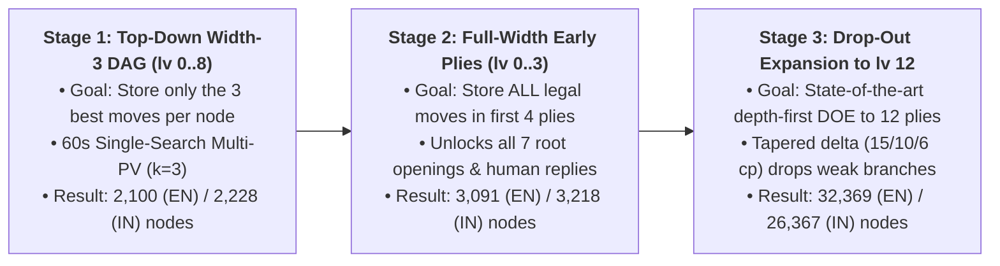
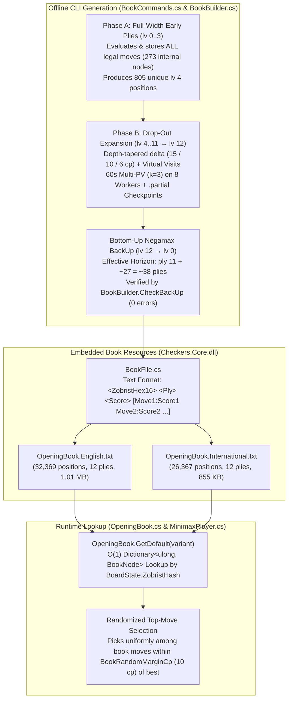

# 10 – Opening book

[Back to the index](README.md)

## In short

During the first 12 plies (`6` full turns for both White and Black), the Checkers game tree branches across millions of move sequences and move-order transpositions. Searching the initial board from scratch on every move wastes clock time and tends to play the exact same deterministic opening line in every game.

To give `Checkers.Core` instant, varied, and deeply analyzed opening play for both **English Checkers** and **International Draughts (Flying Kings)**, the engine embeds two pre-computed, transposition-aware **12-ply Opening Books** (`lv 0 .. lv 11` evaluated at `60s` per position, reaching `lv 12` frontier leaves, with an effective search horizon of **`ply 36–42`** from the start of the game):
- [`src/Checkers.Core/AI/Book/OpeningBook.English.txt`](../../src/Checkers.Core/AI/Book/OpeningBook.English.txt) (**`32,369` unique positions**, `14,320` evaluated internal nodes + `18,049` frontier leaves, **`1.01 MB`**)
- [`src/Checkers.Core/AI/Book/OpeningBook.International.txt`](../../src/Checkers.Core/AI/Book/OpeningBook.International.txt) (**`26,367` unique positions**, `11,541` evaluated internal nodes + `14,826` frontier leaves, **`855.3 KB`**)

---

## 1. Three Stages of Innovation

The opening books were built iteratively through **three stages of algorithmic innovation**, where each stage solved a practical limitation discovered in the previous one while reusing 100% of the previously computed 60-second position evaluations:



### Stage 1 — Top-Down Multi-PV ($k = 3$) Book to `lv 8` (`GenerateTopDown`)
* **Goal & Motivation:** A naive full-width Checkers tree to 8 plies contains over `200,000` positions, most of which arise from weak or losing moves. The first stage (`BookBuilder.GenerateTopDown`) aimed to build a compact book containing **only relevant candidate moves** — the **top 3 moves per position** ($k = 3$) — evaluated with a 60-second Single-Search Multi-PV search, merged into a `ZobristHash` Directed Acyclic Graph (DAG), and backed up bottom-up via Negamax (`BookBuilder.BackUp`).
* **Result:** Produced a verified 8-ply (`lv 0..8`) baseline book of **`2,100` unique positions** for English Checkers (`1h 57m`) and **`2,228` unique positions** for International Checkers (`2h 04m`).
* **Limitation Discovered:** In the very first plies of Checkers (`lv 0..3`), there are **more than 3 good, nearly equal moves per position**. At `lv 0`, there are `7` legal starting moves (`22-18`, `22-17`, `24-19`, `23-19`, `21-17`, `23-18`, `24-20`), `6` of which are famous named openings within `10 cp` of each other. Storing only `3` moves at `lv 0..3` meant the AI never played classic openings like *Old Faithful* (`23-19`), *Double Corner* (`24-19`), or *Cross* (`23-18`), and if a human opponent played one of those on move 1 or 2, the AI was immediately out of book.

### Stage 2 — Full-Width Early Plies (`lv 0..3` Fully Calculated, `--full-width-plies 4`)
* **Goal & Motivation:** To make the opening book complete in the early phase of the game, the second stage widened the first **4 levels (`lv 0, 1, 2, 3` — the first 2 full turns by both players)** to evaluate and store **all legal moves** (`1 + 7 + 49 + 216 = 273` internal positions producing `805` unique positions at `lv 4`), while preserving 100% of the existing `lv 4..8` subtrees from Stage 1.
* **Result:** Expanded the books to **`3,091` positions** (English) and **`3,218` positions** (International) in `~38 minutes` per variant, guaranteeing that the AI remains in book against **any legal human move** in the first 4 plies and unlocking all 7 starting moves at `lv 0`.
* **Limitation Discovered:** While storing all legal moves in `lv 0..3` is essential for coverage against human play, many of the `805` resulting positions at `lv 4` are reached via inaccurate 3rd- or 4th-ply moves (`-20 cp` to `-150 cp`). Expanding all `805` `lv 4` positions uniformly with breadth-first search down to `lv 8` or `lv 12` would waste decenas of hours deeply analyzing blunder lines that the AI will never choose.

### Stage 3 — Depth-First Drop-Out Expansion (DOE) to `lv 12` (`ExpandDropOut`)
* **Goal & Motivation:** To simultaneously catch up the newly unlocked competitive openings from Stage 2 and push the book depth from `8` plies to **`12` plies (`lv 12`)** without exponential blowup, the third stage replaced uniform breadth-first expansion with the state-of-the-art **Drop-Out Expansion (DOE)** algorithm (`BookBuilder.ExpandDropOut`).
* **How It Solved the Problem:** Starting from the root (`lv 0`), DOE repeatedly descends depth-first to select the next unexpanded leaf (`ply < 12`). At each node along the descent, any move whose backed-up score trails the node's best move by more than a depth-tapered threshold $\delta(\text{ply})$ (`15 cp` at `lv 0..5`, `10 cp` at `lv 6..9`, `6 cp` at `lv 10+`) **drops out** and is never expanded further. Among the remaining active moves, DOE selects the child with the lowest visit count (`Visits + PendingVisits`).
* **Result:** DOE automatically ignored **~63%–70%** of the weak `lv 4` leaves from Stage 2, caught up all newly added competitive openings (*Double Corner*, *Old Faithful*, *Cross*) to `lv 8`, and then expanded **100% of active opening lines all the way to `lv 12`** (`0` active leaves remaining below `lv 12`), producing the final **`32,369`-position English** and **`26,367`-position International** 12-ply books.

### Evolution Across the Three Stages

| Stage | Strategy Summary | Max Book Depth | **English Positions (`Internal / Leaves`)** | **International Positions (`Internal / Leaves`)** |
| :--- | :--- | :---: | :---: | :---: |
| **Stage 1** | Uniform Top-Down Multi-PV ($k=3$) | `8 plies` (`lv 8`) | **`2,100`** (`975 / 1,125`) | **`2,228`** (`1,028 / 1,200`) |
| **Stage 2** | Full-Width `lv 0..3` (`All Moves`) + Stage 1 `lv 4..8` | `8 plies` (`lv 8`) | **`3,091`** (`1,212 / 1,879`) | **`3,218`** (`1,265 / 1,953`) |
| **Stage 3 (Catch-Up)** | Full-Width `lv 0..3` + DOE Catch-Up to `lv 8` | `8 plies` (`lv 8`) | **`8,048`** (`3,573 / 4,475`) | **`6,877`** (`2,992 / 3,885`) |
| **Stage 3 (Final)** | **Full-Width `lv 0..3` + Complete DOE to `lv 12`** | **`12 plies` (`lv 12`)** | **`32,369`** (`14,320 / 18,049`) | **`26,367`** (`11,541 / 14,826`) |

---

## 2. Architecture Overview

The opening book subsystem in [`src/Checkers.Core/AI/Book/`](../../src/Checkers.Core/AI/Book/) consists of three core classes and a CLI generator/verifier in [`tools/Checkers.Benchmark/BookCommands.cs`](../../tools/Checkers.Benchmark/BookCommands.cs):



| File | Responsibility |
| :--- | :--- |
| [`BookFile.cs`](../../src/Checkers.Core/AI/Book/BookFile.cs) | Reads, writes, parses, and formats [`BookNode`](../../src/Checkers.Core/AI/Book/BookFile.cs) records and resilient `.partial` checkpoints (`ReadPartialNodes`). |
| [`BookBuilder.cs`](../../src/Checkers.Core/AI/Book/BookBuilder.cs) | Implements two-phase Full-Width + Drop-Out Expansion (`ExpandDropOut`), uniform Top-Down Multi-PV generation (`GenerateTopDown`), bottom-up topological Negamax score propagation (`BackUp`), and full graph verification (`CheckBackUp`). |
| [`OpeningBook.cs`](../../src/Checkers.Core/AI/Book/OpeningBook.cs) | Lazy-loads the embedded resource for each [`CheckersVariant`](../../src/Checkers.Core/Models/CheckersVariant.cs) into an $O(1)$ `Dictionary<ulong, BookNode>` keyed by 64-bit `ZobristHash`, and implements `TryGetMove` with configurable randomization margin (`10 cp`) and child-transposition fallback. |
| [`BookCommands.cs`](../../tools/Checkers.Benchmark/BookCommands.cs) | Multi-threaded CLI (`book expand-doe`, `book generate`, and `book verify`) with per-node `.partial` checkpointing, periodic live book flushes, timed execution budgets, and `Ctrl+C` graceful stop/resume. |

---

## 3. Core Algorithms in Detail

### 3.1 Single-Search Multi-PV Root Search (`MinimaxPlayer.SearchMultiPv`)
At each position selected for evaluation (`maxMoves = all legal moves` at `lv 0..3`; `maxMoves = 3` at `lv 4..11`), [`MinimaxPlayer.SearchMultiPv`](../../src/Checkers.Core/AI/MinimaxPlayer.cs) runs a **single 60-second iterative-deepening search** (`d = 1 .. 48`) to find the top $k$ moves and their exact scores:
- In standard single-PV alpha-beta, root `alpha` is raised to the `1st`-best move's score (`topScores[0]`), which causes the `2nd` and `3rd` best moves to fail low without receiving exact scores.
- In `SearchMultiPv(state, legalMoves, multiPvCount: k)`, root `alpha` is instead held at the **$k$-th best score found so far at depth $d$** (`topKScores[k - 1]`, or `-200,000` until $k$ moves have been searched):
  - All moves that enter the top $k$ beat `alpha` against an open upper window (`beta = +200,000`, i.e., `alpha_child = -200,000`) and therefore return their **exact minimax scores** in a single pass sharing the same `32 MiB` `TranspositionTable`.
  - At `lv 4..11` ($k = 3$), all inferior moves (`4th`, `5th`, ...) that score $\le \text{topKScores}[2]$ fail high in the child node and are pruned by alpha-beta.
- **Forced-Capture Fast Path:** When a position at an internal level (`ply < maxPly - 1`) has only **1 legal move** (a mandatory jump), the move choice is 100% forced and its final score will be overwritten by the bottom-up Negamax `BackUp` from deeper leaves. Both `ExpandDropOut` and `GenerateTopDown` score single forced moves with a fast depth-10 search (`< 10 ms`) rather than spending 60 seconds choosing between 1 move.

### 3.2 `ZobristHash` Transposition Deduplication (DAG)
Independent opening moves by White (`rows 5..7`) and Black (`rows 0..2`) frequently commute (`22-18, 11-15, 23-19` reaches the exact same board state as `23-19, 11-15, 22-18`).
- Every board state is identified by its 64-bit [`ZobristHash`](02-board-and-coordinates.md) (`BitPosition.ComputeZobristHash()`), which depends only on `(WhiteMen, WhiteKings, BlackMen, BlackKings, SideToMove)`.
- Whenever two different move sequences transpose into the same `ZobristHash`, they point to the **same child node in the DAG**, and that board position is evaluated and expanded **only once**.

### 3.3 Drop-Out Expansion (DOE) Descent & Virtual Visits (`ExpandDropOut`)
In Phase B of `BookBuilder.ExpandDropOut`, the generator expands the DAG selectively up to `--max-ply 12`:
1. **Depth-Tapered Drop-Out Filter ($\delta(\text{ply})$):**
   At any expanded internal node $u$ with best move score $S^*(u) = \max_{m} \text{MoveScore}(u, m)$, a stored move $m$ is considered **active** if and only if:
   $$S^*(u) - \text{MoveScore}(u, m) \le \delta(\text{ply})$$
   where [`BookBuilder.GetDefaultDropOutDelta`](../../src/Checkers.Core/AI/Book/BookBuilder.cs) uses a tapered schedule:
   - **`lv 0 .. lv 5`:** $\delta = 15\text{ cp}$ (`5 cp` safety buffer above the runtime `10 cp` randomization margin so slightly trailing early lines can recover if deeper search shows they equalize)
   - **`lv 6 .. lv 9`:** $\delta = 10\text{ cp}$ (matches the runtime `10 cp` randomization margin)
   - **`lv 10+`:** $\delta = 6\text{ cp}$ (narrows deep exploration to the strongest principal continuations)
2. **Least-Visited Selection with Parallel Virtual Visits (`8 Workers`):**
   - Each node tracks `Visits` (number of expanded nodes in its subgraph) and `PendingVisits` (number of in-flight worker threads currently descending through that node), plus a bottom-up `HasAvailableDoeLeaf` flag indicating whether its active subgraph contains at least one unexpanded, non-in-flight leaf at `ply < maxPly`.
   - At each step of the top-down descent from `lv 0`, a worker selects the active child with `HasAvailableDoeLeaf == true` that minimizes `Visits + PendingVisits`.
   - reserving a path increments `PendingVisits` along `root → ... → leaf` and marks the leaf `InFlight = true`, ensuring all `8` workers on the Ryzen 7 7800X3D simultaneously expand 8 distinct least-visited branches without collisions or dead ends.

### 3.4 Bottom-Up Topological Negamax `BackUp` & `CheckBackUp`
After every node expansion:
1. Shortest-path `Ply` from `lv 0` is refreshed via breadth-first traversal, and all reachable DAG nodes are ordered in **topological post-order** (children always processed before parents).
2. Scores are propagated bottom-up from the frontier leaves (`lv 4..12`) to the root (`lv 0`) via Negamax:
   $$\text{MoveScore}(u, m) = -\text{Score}(\text{Child}(u, m)), \qquad \text{Score}(u) = \max_{m \in \text{Moves}(u)} \text{MoveScore}(u, m)$$
   Because scores are backed up after every expansion, a branch that begins to lose material at `lv 10` immediately sees its score drop at `lv 6..8`; if it falls more than $\delta(\text{ply})$ behind its sibling moves, it **automatically drops out** of future DOE descents, while previously trailing alternatives that hold equality automatically become active.
3. [`BookBuilder.CheckBackUp`](../../src/Checkers.Core/AI/Book/BookBuilder.cs) verifies that every reachable node and move in the book satisfies `node.Score == max(m.Score)` and `m.Score == -child.Score` with **0 errors**.

---

## 4. Final 12-Ply Book Results (`AMD Ryzen 7 7800X3D`, `8 Workers`, `60s / Node`)

Both opening books were generated and expanded to 100% completion at `lv 12` (`0` active leaves remaining below `lv 12`) on an **AMD Ryzen 7 7800X3D** (`8 physical cores / 16 threads, 96 MB 3D V-Cache, 32 GB RAM`) using `8` parallel workers (`1` worker per physical Zen 4 core, `32 MiB` TT per worker, `~400M–690M` nodes evaluated per 60-second position at depths `24–31 plies`):

### 4.1 Summary Comparison (`Full-Width lv 0..3` + `Complete DOE to lv 12`)

| Metric | **English Checkers (`OpeningBook.English.txt`)** | **International Checkers (`OpeningBook.International.txt`)** |
| :--- | :---: | :---: |
| **Evaluated Internal Levels** | `lv 0 .. lv 11` (`12` plies of moves, reaching `lv 12`) | `lv 0 .. lv 11` (`12` plies of moves, reaching `lv 12`) |
| **Moves Stored per Position** | **All legal moves (`lv 0..3`)** + **Top `3` via DOE (`lv 4..11`)** | **All legal moves (`lv 0..3`)** + **Top `3` via DOE (`lv 4..11`)** |
| **Search Budget per Position** | `60s` Multi-PV, `24–31 plies` (`~400M–690M` nodes) | `60s` Multi-PV, `24–31 plies` (`~400M–690M` nodes) |
| **Unique Internal Positions (`lv 0..11`)** | **`14,320`** (`100%` complete to `lv 12`) | **`11,541`** (`100%` complete to `lv 12`) |
| **Unique Frontier Leaves (`lv 4..12`)** | **`18,049`** (**`8,605` at `lv 12`**) | **`14,826`** (**`4,904` at `lv 12`**) |
| **Total Unique Book Positions (`lv 0..12`)** | **`32,369`** | **`26,367`** |
| **Embedded File Size** | **`1,062,670 bytes` (`1.01 MB`)** | **`875,844 bytes` (`855.3 KB`)** |
| **Root (`lv 0`) Backed-Up Score & All 7 Moves** | **`+2` — `22-18 (+2)`, `22-17 (-4)`, `24-19 (-4)`, `23-18 (-8)`, `23-19 (-8)`, `21-17 (-16)`, `24-20 (-16)`** | **`+2` — `22-18 (+2)`, `21-17 (+1)`, `24-19 (-5)`, `22-17 (-6)`, `23-19 (-9)`, `23-18 (-17)`, `24-20 (-19)`** |
| **`BookBuilder.CheckBackUp` Verification** | **`OK (0 errors)`** | **`OK (0 errors)`** |

### 4.2 Unique Positions per Level (`lv 0` through `lv 12`)

| Book Level (`Ply`) | Side to Move | Strategy at Level | **English Unique Positions** | **International Unique Positions** |
| :---: | :---: | :---: | :---: | :---: |
| **`lv 0` (`Ply 0`)** | White (Move 1) | Full-Width (`All 7 Moves`) | `1` | `1` |
| **`lv 1` (`Ply 1`)** | Black (Move 1) | Full-Width (`All 7 Moves`) | `7` | `7` |
| **`lv 2` (`Ply 2`)** | White (Move 2) | Full-Width (`All Legal Moves`) | `49` | `49` |
| **`lv 3` (`Ply 3`)** | Black (Move 2) | Full-Width (`All Legal Moves`) | `216` | `216` |
| **`lv 4` (`Ply 4`)** | White (Move 3) | DOE ($\delta = 15\text{ cp}, k = 3$) | `805` | `805` |
| **`lv 5` (`Ply 5`)** | Black (Move 3) | DOE ($\delta = 15\text{ cp}, k = 3$) | `795` | `632` |
| **`lv 6` (`Ply 6`)** | White (Move 4) | DOE ($\delta = 10\text{ cp}, k = 3$) | `1,333` | `1,161` |
| **`lv 7` (`Ply 7`)** | Black (Move 4) | DOE ($\delta = 10\text{ cp}, k = 3$) | `2,151` | `1,999` |
| **`lv 8` (`Ply 8`)** | White (Move 5) | DOE ($\delta = 10\text{ cp}, k = 3$) | `3,378` | `3,253` |
| **`lv 9` (`Ply 9`)** | Black (Move 5) | DOE ($\delta = 10\text{ cp}, k = 3$) | `3,453` | `3,573` |
| **`lv 10` (`Ply 10`)** | White (Move 6) | DOE ($\delta = 6\text{ cp}, k = 3$) | `4,687` | `4,350` |
| **`lv 11` (`Ply 11`)** | Black (Move 6) | DOE ($\delta = 6\text{ cp}, k = 3$) | `6,889` | `5,417` |
| **`lv 12` (`Ply 12` Leaves)** | White (Move 7) | Frontier Leaves | `8,605` | `4,904` |
| **Total (`lv 0 .. 12`)** | — | — | **`32,369`** | **`26,367`** |

---

## 5. Text File Format & Runtime Integration

### 5.1 Human-Readable Text Format
Each line in `OpeningBook.English.txt` and `OpeningBook.International.txt` stores one unique board position (`<ZobristHex> <Ply> <Score> [Move1:Score1 Move2:Score2 ...]`):
```text
# Checkers Opening Book (English) — depth 12 plies (lv 0..11 evaluated), width 3, 32369 unique positions (14320 internal, 18049 leaves)
# Format: <ZobristHex> <Ply> <Score> [Move1:Score1 Move2:Score2 Move3:Score3]
29E98DC071E54022 0 +2 22-18:+2 22-17:-4 24-19:-4 23-18:-8 23-19:-8 21-17:-16 24-20:-16
015C85F6BBBF4F27 1 +8 11-15:+8 9-13:+6 10-15:+2 11-16:-2 9-14:-4 12-16:-8 10-14:-18
45FB48D367B7B66A 1 +4 11-15:+4 9-13:0 11-16:-6 10-15:-8 10-14:-10 9-14:-12 12-16:-16
```

### 5.2 Runtime Lookup & `10 cp` Randomized Variety
At the beginning of [`MinimaxPlayer.GetMoveAsync`](../../src/Checkers.Core/AI/MinimaxPlayer.cs), when `UseOpeningBook` is enabled:
1. `OpeningBook.GetDefault(_variant)` looks up `state.ZobristHash` in $O(1)$.
2. `TryGetMove` filters the node's stored moves to those within **`BookRandomMarginCp` (`10 cp` by default)** of the highest-scored book move (`bestScore - move.Score <= 10`) and selects one uniformly at random.
   - For example, at `lv 0` in English Checkers (`22-18:+2`, `22-17:-4`, `24-19:-4`, `23-18:-8`, `23-19:-8`, `21-17:-16`, `24-20:-16`), the top **5 classical openings** (`22-18`, `22-17`, `24-19`, `23-18`, `23-19`) are all within `10 cp` of `+2` and are played with equal probability, while weaker starting moves (`21-17:-16`, `24-20:-16`) are excluded when the AI chooses a move — yet remain stored in the book so the AI knows all replies if a human opponent plays them!
3. If a position has no explicit move list (or the opponent played an off-book move that transposes back into a known book position on the next ply), `TryGetMove` also checks if any legal move leads to a child `ZobristHash` present in the book (`impliedScore = -childNode.Score`).
4. When a book move is returned, `MinimaxPlayer` returns immediately (`0.0s`, `NodesEvaluated = 0`) and reports `Depth = "Book (12 plies)"` and `FromBook = true` in [`SearchAnalysis`](../../src/Checkers.Core/AI/SearchAnalysis.cs).

---

## 6. CLI Reference (`Checkers.Benchmark book`)

All opening book commands are provided by [`tools/Checkers.Benchmark/BookCommands.cs`](../../tools/Checkers.Benchmark/BookCommands.cs) and invoked via:

```powershell
dotnet run -c Release --project tools/Checkers.Benchmark -- book <subcommand> [options]
```

### 6.1 Subcommands

| Subcommand | Description |
| :--- | :--- |
| **`book expand-doe`** *(or `book doe`)* | Two-phase **Full-Width Early Plies (`lv 0..3`) + Drop-Out Expansion (DOE)** on existing or new books. Supports timed intervals, iteration limits, periodic live book flushes, and `.partial` checkpoint resume. |
| **`book generate`** | Uniform top-down level-by-level (`lv 0 .. max-level`) Multi-PV book generator (Stage 1 baseline). |
| **`book verify`** | Loads the opening book(s), prints per-level node statistics and root evaluations, and runs `BookBuilder.CheckBackUp` to verify 100% parent/child Negamax consistency. |

### 6.2 Command-Line Switches for `book expand-doe`

| Switch | Default | Description |
| :--- | :---: | :--- |
| `--variant <English\|International\|All>` | `All` | Variant(s) to expand (`English`, `International`, or `All` to run both sequentially). |
| `--full-width-plies <count>` | `4` | Number of starting plies (`lv 0 .. count - 1`) where **all legal moves** are evaluated and stored (`4` = `lv 0..3`). Set to `0` to disable Phase A widening. |
| `--max-ply <plies>` | `12` | Maximum depth ceiling per active line (`1..32`). Unexpanded leaves at `ply >= max-ply` are treated as depth-complete. |
| `--width <1..32>` | `3` | Number of top candidate moves stored per expanded DOE leaf at `lv >= full-width-plies`. |
| `--delta-cp <cp>` | *(tapered)* | Optional flat drop-out margin in centipawns across all plies. When omitted, uses the default depth-tapered schedule (`15 cp` at `lv 0..5`, `10 cp` at `lv 6..9`, `6 cp` at `lv 10+`). |
| `--iterations <count>` | *(unlimited)* | Optional maximum number of newly searched positions per variant before stopping cleanly. |
| `--max-time-min <minutes>` | *(unlimited)* | Optional wall-clock time budget in minutes per variant (e.g., `360` = `6 hours` per variant / `12 hours` total for `All`). |
| `--node-time-s <seconds>` | `60` | Search time per position in seconds for `MinimaxPlayer.SearchMultiPv`. |
| `--node-depth <plies>` | *(disabled)* | Optional fixed search depth per position (overrides `--node-time-s`; useful for fast testing). |
| `--workers <count>` | `8` | Number of parallel worker threads (each with its own dedicated `32 MiB` transposition table). |
| `--flush-interval <count>` | `25` | Number of newly expanded DOE nodes between automatic backed-up book flushes to disk (`~2.5 minutes` at `60s/node` on `8` workers). |
| `--out <path>` | *(default book)* | Optional custom output file path (when running a single `--variant`). |

### 6.3 Command-Line Switches for `book generate` and `book verify`

| Subcommand | Switch | Default | Description |
| :--- | :--- | :---: | :--- |
| **`book generate`** | `--variant <English\|International\|All>` | `All` | Variant(s) to generate. |
| **`book generate`** | `--max-level <0..31>` | `7` | Deepest internal level to evaluate (`7` = `lv 0..7` evaluated, reaching `lv 8` leaves). |
| **`book generate`** | `--width <1..32>` | `3` | Top moves to store per position across all levels. |
| **`book generate`** | `--node-time-s <seconds>` | `60` | Search time per position in seconds. |
| **`book generate`** | `--node-depth <plies>` | *(disabled)* | Optional fixed search depth per node. |
| **`book generate`** | `--workers <count>` | `8` | Parallel worker threads. |
| **`book generate`** | `--out <path>` | *(default book)* | Optional custom output file path. |
| **`book verify`** | `--variant <English\|International\|All>` | `All` | Variant(s) to verify. |
| **`book verify`** | `--book <path>` | *(default book)* | Optional path to a specific book file to verify. |

---

### 6.4 Practical Examples

```powershell
# 1. Stage 1 baseline: Uniform top-down width-3 generation to lv 8 (max-level 7)
dotnet run -c Release --project tools/Checkers.Benchmark -- book generate --variant All --max-level 7 --width 3 --node-time-s 60 --workers 8

# 2. Stage 2 (Phase A only): Widen lv 0..3 to store ALL legal moves while preserving existing lv 4..8 subtrees
dotnet run -c Release --project tools/Checkers.Benchmark -- book expand-doe --variant All --full-width-plies 4 --max-ply 4 --width 3 --node-time-s 60 --workers 8

# 3. Stage 3 (Catch-Up): Timed 12-hour interval (360 min/variant) to catch up newly widened active openings to lv 8
dotnet run -c Release --project tools/Checkers.Benchmark -- book expand-doe --variant All --full-width-plies 4 --max-ply 8 --width 3 --max-time-min 360 --node-time-s 60 --workers 8

# 4. Stage 3 (Full 12-Ply DOE): Expand all competitive lines up to 12 plies (lv 12)
dotnet run -c Release --project tools/Checkers.Benchmark -- book expand-doe --variant All --full-width-plies 4 --max-ply 12 --width 3 --node-time-s 60 --workers 8

# 5. Verify Negamax back-up consistency and print level-by-level statistics for both books
dotnet run -c Release --project tools/Checkers.Benchmark -- book verify
```