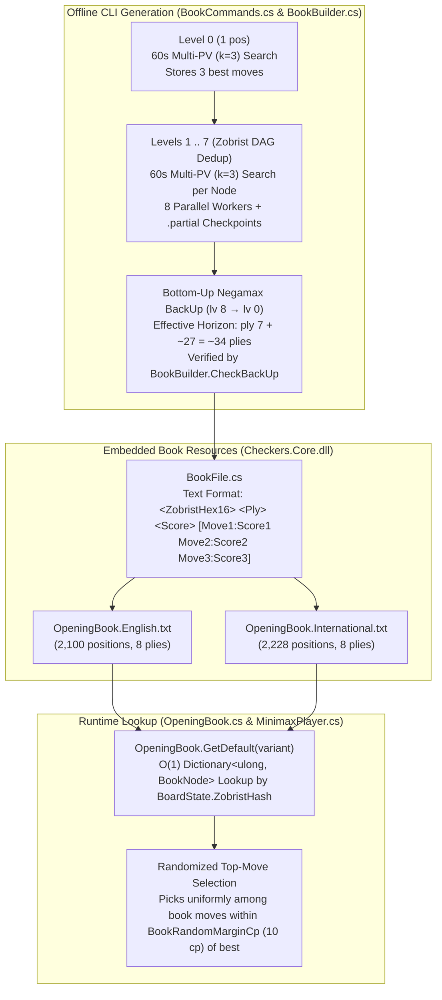

# 10 – Opening book

[Back to the index](README.md)

## In short

During the first 8 plies (`4` full turns for both White and Black), the Checkers game tree branches across thousands of symmetries and move-order transpositions. Searching the initial board from scratch on every move wastes clock time and tends to play the exact same deterministic opening line in every game.

To give `Checkers.Core` instant, varied, and deeply analyzed opening play for both **English Checkers** and **International Draughts (Flying Kings)**, the engine embeds two pre-computed, transposition-aware **8-ply Opening Books**:
- [`src/Checkers.Core/AI/Book/OpeningBook.English.txt`](../../src/Checkers.Core/AI/Book/OpeningBook.English.txt) (`2,100` unique positions, `66.6 KB`)
- [`src/Checkers.Core/AI/Book/OpeningBook.International.txt`](../../src/Checkers.Core/AI/Book/OpeningBook.International.txt) (`2,228` unique positions, `71.3 KB`)

---

## 1. Architecture Overview

The opening book subsystem in [`src/Checkers.Core/AI/Book/`](../../src/Checkers.Core/AI/Book/) consists of three core classes and a CLI generator/verifier in [`tools/Checkers.Benchmark/BookCommands.cs`](../../tools/Checkers.Benchmark/BookCommands.cs):



| File | Responsibility |
| :--- | :--- |
| [`BookFile.cs`](../../src/Checkers.Core/AI/Book/BookFile.cs) | Reads, writes, parses, and formats [`BookNode`](../../src/Checkers.Core/AI/Book/BookFile.cs) records and resilient `.partial` checkpoints (`ReadPartialNodes`). |
| [`BookBuilder.cs`](../../src/Checkers.Core/AI/Book/BookBuilder.cs) | Implements Top-Down Level-by-Level Multi-PV generation (`GenerateTopDown`), breadth-first DAG enumeration (`Enumerate`), bottom-up Negamax score propagation (`BackUp`), and full tree verification (`CheckBackUp`). |
| [`OpeningBook.cs`](../../src/Checkers.Core/AI/Book/OpeningBook.cs) | Lazy-loads the embedded resource for each [`CheckersVariant`](../../src/Checkers.Core/Models/CheckersVariant.cs) into an $O(1)$ `Dictionary<ulong, BookNode>` keyed by 64-bit `ZobristHash`, and implements `TryGetMove` with configurable randomization margin (`10 cp`) and child-transposition fallback. |
| [`BookCommands.cs`](../../tools/Checkers.Benchmark/BookCommands.cs) | Multi-threaded CLI (`book generate` and `book verify`) with per-node `.partial` checkpointing, incremental playable book flushes after each completed level, and `Ctrl+C` graceful stop/resume. |

---

## 2. Top-Down Level-by-Level Multi-PV Generation (`Approach A`)

A full-width Checkers tree to 8 plies contains over `200,000` positions, most of which involve inferior opening moves. Instead of expanding weak moves or relying on a shallow screening search to guess candidate moves, `BookBuilder.GenerateTopDown` builds a **width-$k$ ($k = 3$) Directed Acyclic Graph (DAG)** top-down from `lv 0` through `lv 7`:

### 2.1 Single-Search Multi-PV ($k = 3$) Root Search
At each unique position at level `lv p` (`0 <= p <= 7`), [`MinimaxPlayer.SearchMultiPv`](../../src/Checkers.Core/AI/MinimaxPlayer.cs) runs a **single 60-second iterative-deepening search** (`d = 1 .. 48`) to find the **3 best moves and their exact scores**:
- In standard single-PV alpha-beta, root `alpha` is raised to the `1st`-best move's score (`topScores[0]`), which causes the `2nd` and `3rd` best moves to fail low without receiving exact scores.
- In `SearchMultiPv(state, legalMoves, multiPvCount: 3)`, root `alpha` is instead held at the **$k$-th (`3rd`) best score found so far at depth $d$** (`topKScores[k - 1]`, or `-200,000` for the first 3 moves):
  - All moves that enter the top 3 beat `alpha` against an open upper window (`beta = +200,000`, i.e., `alpha_child = -200,000`) and therefore return their **exact minimax scores** in a single pass sharing the same `32 MiB` `TranspositionTable`.
  - All inferior moves (`4th`, `5th`, ...) that score $\le \text{topKScores}[2]$ fail high in the child node and are pruned by alpha-beta.
- **Forced-Capture Fast Path (`lv < 7`):** When a position at an internal level (`lv 0..6`) has only **1 legal move** (a mandatory jump), the move choice is 100% forced and its final score will be overwritten by the bottom-up Negamax `BackUp` from `lv 7`. `GenerateTopDown` scores single forced moves at `lv < 7` with a fast depth-10 search (`< 10 ms`) rather than spending 60 seconds choosing between 1 move.

### 2.2 `ZobristHash` Transposition Deduplication
Independent opening moves by White (`rows 5..7`) and Black (`rows 0..2`) frequently commute (`22-18, 11-15, 23-19` reaches the exact same board state as `23-19, 11-15, 22-18`).
- Every board state is identified by its 64-bit [`ZobristHash`](02-board-and-coordinates.md) (`BitPosition.ComputeZobristHash()`), which depends only on `(WhiteMen, WhiteKings, BlackMen, BlackKings, SideToMove)`.
- `GenerateTopDown` maintains a `reservedHashes` set across levels. Whenever two different move sequences transpose into the same `ZobristHash`, they point to the **same child node in the DAG**, and that board position is evaluated **only once**.
- Across `lv 0 .. lv 7`, transposition deduplication and forced captures reduce the number of evaluated positions from $1 + 3 + 9 + 27 + 81 + 243 + 729 + 2,187 = 3,280$ raw nodes down to **`975` unique internal positions** (English) and **`1,028` unique internal positions** (International) — a **~70% reduction** in search time.

### 2.3 Bottom-Up Negamax Score Propagation (`BackUp` & `CheckBackUp`)
When `lv 7` completes its 60-second Multi-PV searches (reaching search depths of `24–30 plies` from `lv 7`, i.e. **`ply 31–37` from the start of the game**):
1. Each move $(u \xrightarrow{m} w)$ from `lv 7` to a frontier leaf $w$ at `lv 8` defines the implied leaf score `-move.Score` from $w$'s perspective.
2. [`BookBuilder.BackUp`](../../src/Checkers.Core/AI/Book/BookBuilder.cs) propagates those scores bottom-up from `lv 8` down to `lv 0` via Negamax:
   $$\text{MoveScore}(u, m) = -\text{Score}(\text{Child}(u, m)), \qquad \text{Score}(u) = \max_{m \in \text{Moves}(u)} \text{MoveScore}(u, m)$$
3. Each node's stored moves are sorted descending by their backed-up score, and [`BookBuilder.CheckBackUp`](../../src/Checkers.Core/AI/Book/BookBuilder.cs) verifies that every reachable node and move from `lv 0` to `lv 8` satisfies `node.Score == max(m.Score)` and `m.Score == -child.Score` with **0 errors**.

---

## 3. Empirical Generation Results (`AMD Ryzen 7 7800X3D`, `8 Workers`, `60s / Node`)

Both opening books were generated on an **AMD Ryzen 7 7800X3D** (`8 physical cores / 16 threads, 96 MB 3D V-Cache, 32 GB RAM`) using `8` parallel workers (`1` worker per physical Zen 4 core, `32 MiB` TT per worker, `~480M–690M` nodes evaluated per 60-second position at depths `24–30 plies`):

### 3.1 Summary Comparison (Full-Width `lv 0..3` + Drop-Out Expansion to `lv 12`)

| Metric | **English Checkers (`OpeningBook.English.txt`)** | **International Checkers (`OpeningBook.International.txt`)** |
| :--- | :---: | :---: |
| **Evaluated Internal Levels** | `lv 0 .. lv 11` (`12` plies of moves, reaching `lv 12`) | `lv 0 .. lv 11` (`12` plies of moves, reaching `lv 12`) |
| **Moves Stored per Position** | **All legal moves (`lv 0..3`)** + **Top `3` via DOE (`lv 4..11`)** | **All legal moves (`lv 0..3`)** + **Top `3` via DOE (`lv 4..11`)** |
| **Search Budget per Position** | `60s` Multi-PV, `24–31 plies` (`~400M–690M` nodes) | `60s` Multi-PV, `24–31 plies` (`~400M–690M` nodes) |
| **Unique Internal Positions (`lv 0..11`)** | **`14,320`** (`100%` complete to `lv 12`) | **`11,541`** (`100%` complete to `lv 12`) |
| **Unique Frontier Leaves (`lv 4..12`)** | **`18,049`** (**`8,605` at `lv 12`**) | **`14,826`** (**`4,904` at `lv 12`**) |
| **Total Unique Book Positions (`lv 0..12`)** | **`32,369`** (up from `2,100` baseline) | **`26,367`** (up from `2,228` baseline) |
| **Embedded File Size** | **`1,062,670 bytes` (`1.01 MB`)** | **`875,844 bytes` (`855.3 KB`)** |
| **Root (`lv 0`) Backed-Up Score & All 7 Moves** | **`+2` — `22-18 (+2)`, `22-17 (-4)`, `24-19 (-4)`, `23-18 (-8)`, `23-19 (-8)`, `21-17 (-16)`, `24-20 (-16)`** | **`+2` — `22-18 (+2)`, `21-17 (+1)`, `24-19 (-5)`, `22-17 (-6)`, `23-19 (-9)`, `23-18 (-17)`, `24-20 (-19)`** |
| **`BookBuilder.CheckBackUp` Verification** | **`OK (0 errors)`** | **`OK (0 errors)`** |

### 3.2 Unique Positions per Level (`lv 0` through `lv 12`)

| Book Level (`Ply`) | Side to Move | Strategy at Level | **English Unique Positions** | **International Unique Positions** |
| :---: | :---: | :---: | :---: | :---: |
| **`lv 0` (`Ply 0`)** | White (Move 1) | Full-Width (`All 7 Moves`) | `1` | `1` |
| **`lv 1` (`Ply 1`)** | Black (Move 1) | Full-Width (`All 7 Moves`) | `7` | `7` |
| **`lv 2` (`Ply 2`)** | White (Move 2) | Full-Width (`All Legal Moves`) | `49` | `49` |
| **`lv 3` (`Ply 3`)** | Black (Move 2) | Full-Width (`All Legal Moves`) | `216` | `216` |
| **`lv 4` (`Ply 4`)** | White (Move 3) | DOE ($\delta = 15\text{ cp}, k = 3$) | `805` | `805` |
| **`lv 5` (`Ply 5`)** | Black (Move 3) | DOE ($\delta = 15\text{ cp}, k = 3$) | `795` | `632` |
| **`lv 6` (`Ply 6`)** | White (Move 4) | DOE ($\delta = 10\text{ cp}, k = 3$) | `1,333` | `1,161` |
| **`lv 7` (`Ply 7`)** | Black (Move 4) | DOE ($\delta = 10\text{ cp}, k = 3$) | `2,151` | `1,999` |
| **`lv 8` (`Ply 8`)** | White (Move 5) | DOE ($\delta = 10\text{ cp}, k = 3$) | `3,378` | `3,253` |
| **`lv 9` (`Ply 9`)** | Black (Move 5) | DOE ($\delta = 10\text{ cp}, k = 3$) | `3,453` | `3,573` |
| **`lv 10` (`Ply 10`)** | White (Move 6) | DOE ($\delta = 6\text{ cp}, k = 3$) | `4,687` | `4,350` |
| **`lv 11` (`Ply 11`)** | Black (Move 6) | DOE ($\delta = 6\text{ cp}, k = 3$) | `6,889` | `5,417` |
| **`lv 12` (`Ply 12` Leaves)** | White (Move 7) | Frontier Leaves | `8,605` | `4,904` |
| **Total (`lv 0 .. 12`)** | — | — | **`32,369`** | **`26,367`** |

---

## 4. Text File Format & Runtime Integration

### 4.1 Human-Readable Text Format
Each line in `OpeningBook.English.txt` and `OpeningBook.International.txt` stores one unique board position:
```text
# Checkers Opening Book (English) — depth 8 plies (lv 0..7 evaluated), width 3, 2100 unique positions (975 internal, 1125 leaves)
# Format: <ZobristHex> <Ply> <Score> [Move1:Score1 Move2:Score2 Move3:Score3]
# Generated 2026-10-05 17:00 by Checkers.Benchmark book generate (60s Multi-PV (3) search/node, 8 workers, 1h 57m 00s)
29E98DC071E54022 0 +2 22-18:+2 22-17:-2 21-17:-6
C5BCD8C573E91211 1 +2 10-15:+2 11-15:0 10-14:-24
45FB48D367B7B66A 1 -2 11-15:-2 10-14:-4 11-16:-6
D771BBCAEDE04A59 1 +6 9-13:+6 11-15:+1 10-15:-2
```

### 4.2 Runtime Lookup & `10 cp` Randomized Variety
At the beginning of [`MinimaxPlayer.GetMoveAsync`](../../src/Checkers.Core/AI/MinimaxPlayer.cs), when `UseOpeningBook` is enabled:
1. `OpeningBook.GetDefault(_variant)` looks up `state.ZobristHash` in $O(1)$.
2. `TryGetMove` filters the node's stored moves to those within **`BookRandomMarginCp` (`10 cp` by default)** of the highest-scored book move (`bestScore - move.Score <= 10`) and selects one uniformly at random.
   - For example, at `lv 0` in English Checkers (`22-18:+2`, `22-17:-2`, `21-17:-6`), all three moves are within `8 cp` ($\le 10\text{ cp}$) of `+2`, so the AI plays all three classic openings with equal probability while automatically excluding any move that drops more than `10 cp` (such as `10-14:-24` on `lv 1`).
3. If a position has no explicit move list (or the opponent played an off-book move that transposes back into a known book position on the next ply), `TryGetMove` also checks if any legal move leads to a child `ZobristHash` present in the book (`impliedScore = -childNode.Score`).
4. When a book move is returned, `MinimaxPlayer` returns immediately (`0.0s`, `NodesEvaluated = 0`) and reports `Depth = "Book (8 plies)"` and `FromBook = true` in [`SearchAnalysis`](../../src/Checkers.Core/AI/SearchAnalysis.cs).

---

## 5. Full-Width Early Plies + Drop-Out Expansion (`ExpandDropOut`)

To expand existing opening books beyond 8 plies while ensuring 100% coverage of early human moves, [`BookBuilder.ExpandDropOut`](../../src/Checkers.Core/AI/Book/BookBuilder.cs) and the `book expand-doe` CLI command in [`BookCommands.cs`](../../tools/Checkers.Benchmark/BookCommands.cs) implement a two-phase algorithm:

1. **Phase A — Full-Width Early Plies (`--full-width-plies 4`, i.e., `lv 0..3`):**
   - Evaluates and stores **all legal moves** in the first 4 plies (`1 + 7 + 49 + 216 = 273` internal positions producing `805` `lv 4` positions) while preserving 100% of any existing `lv 4..8` subtrees already in the book.
   - Guarantees the AI remains in book against any legal human move in the first 2 full turns (`Black -> White -> Black -> White`) and unlocks all 7 classical starting moves at `lv 0` (`22-18`, `22-17`, `24-19`, `23-19`, `21-17`, `23-18`, `24-20`).
   - Already-widened positions at `lv 0..3` are detected and skipped in `0 ms` on subsequent runs.
2. **Phase B — Drop-Out Expansion (DOE) from `lv 4` up to `--max-ply 12`:**
   - Repeatedly descends from the root, filtering out candidate moves whose backed-up score trails a node's best move by more than the depth-tapered drop-out threshold $\delta(\text{ply})$ ([`BookBuilder.GetDefaultDropOutDelta`](../../src/Checkers.Core/AI/Book/BookBuilder.cs)):
     - **`lv 0 .. lv 5`:** $\delta = 15\text{ cp}$ (`5 cp` safety margin above runtime `10 cp` randomization)
     - **`lv 6 .. lv 9`:** $\delta = 10\text{ cp}$ (matches runtime `10 cp` randomization)
     - **`lv 10+`:** $\delta = 6\text{ cp}$ (focuses deep search on the narrowest principal lines)
   - Automatically ignores weak/blunder moves among the `805` `lv 4` positions (`~63%–70%` dropped out immediately) while prioritizing newly widened competitive openings (such as `24-19` *Double Corner*, `23-19` *Old Faithful*, and `23-18` *Cross*) using least-visited selection with virtual visits (`Visits + PendingVisits`) across all `8` parallel workers.
   - Expands each chosen leaf with a `60s` Multi-PV (`--width 3`) search and propagates updated Negamax scores bottom-up to the root via topological post-order `BackUp`.

---

## 6. CLI Reference (`Checkers.Benchmark book`)

All opening book commands are provided by [`tools/Checkers.Benchmark/BookCommands.cs`](../../tools/Checkers.Benchmark/BookCommands.cs) and invoked via:

```powershell
dotnet run -c Release --project tools/Checkers.Benchmark -- book <subcommand> [options]
```

### 6.1 Subcommands

| Subcommand | Description |
| :--- | :--- |
| **`book expand-doe`** *(or `book doe`)* | Two-phase **Full-Width Early Plies (`lv 0..3`) + Drop-Out Expansion (DOE)** on existing or new books. Supports timed intervals, iteration limits, periodic live book flushes, and `.partial` checkpoint resume. |
| **`book generate`** | Uniform top-down level-by-level (`lv 0 .. max-level`) Multi-PV book generator. |
| **`book verify`** | Loads the opening book(s), prints per-level node statistics and root evaluations, and runs `BookBuilder.CheckBackUp` to verify 100% parent/child Negamax consistency. |

### 6.2 Command-Line Switches for `book expand-doe`

| Switch | Default | Description |
| :--- | :---: | :--- |
| `--variant <English\|International\|All>` | `All` | Variant(s) to expand (`English`, `International`, or `All` to run both sequentially). |
| `--full-width-plies <count>` | `4` | Number of starting plies (`lv 0 .. count - 1`) where **all legal moves** are evaluated and stored (`4` = `lv 0..3`). Set to `0` to disable Phase A widening. |
| `--max-ply <plies>` | `12` | Maximum depth ceiling per active line (`1..32`). Unexpanded leaves at `ply >= max-ply` are treated as depth-complete. |
| `--width <1..32>` | `3` | Number of top candidate moves stored per expanded DOE leaf at `lv >= full-width-plies`. |
| `--delta-cp <cp>` | *(tapered)* | Optional flat drop-out margin in centipawns across all plies. When omitted, uses the default depth-tapered schedule (`15 cp` at `lv 0..5`, `10 cp` at `lv 6..9`, `6 cp` at `lv 10+`). |
| `--iterations <count>` | *(unlimited)* | Optional maximum number of newly searched positions per variant before stopping cleanly. |
| `--max-time-min <minutes>` | *(unlimited)* | Optional wall-clock time budget in minutes per variant (e.g., `360` = `6 hours` per variant / `12 hours` total for `All`). |
| `--node-time-s <seconds>` | `60` | Search time per position in seconds for `MinimaxPlayer.SearchMultiPv`. |
| `--node-depth <plies>` | *(disabled)* | Optional fixed search depth per position (overrides `--node-time-s`; useful for fast testing). |
| `--workers <count>` | `8` | Number of parallel worker threads (each with its own dedicated `32 MiB` transposition table). |
| `--flush-interval <count>` | `25` | Number of newly expanded DOE nodes between automatic backed-up book flushes to disk (`~2.5 minutes` at `60s/node` on `8` workers). |
| `--out <path>` | *(default book)* | Optional custom output file path (when running a single `--variant`). |

### 6.3 Command-Line Switches for `book generate` and `book verify`

| Subcommand | Switch | Default | Description |
| :--- | :--- | :---: | :--- |
| **`book generate`** | `--variant <English\|International\|All>` | `All` | Variant(s) to generate. |
| **`book generate`** | `--max-level <0..31>` | `7` | Deepest internal level to evaluate (`7` = `lv 0..7` evaluated, reaching `lv 8` leaves). |
| **`book generate`** | `--width <1..32>` | `3` | Top moves to store per position across all levels. |
| **`book generate`** | `--node-time-s <seconds>` | `60` | Search time per position in seconds. |
| **`book generate`** | `--node-depth <plies>` | *(disabled)* | Optional fixed search depth per node. |
| **`book generate`** | `--workers <count>` | `8` | Parallel worker threads. |
| **`book generate`** | `--out <path>` | *(default book)* | Optional custom output file path. |
| **`book verify`** | `--variant <English\|International\|All>` | `All` | Variant(s) to verify. |
| **`book verify`** | `--book <path>` | *(default book)* | Optional path to a specific book file to verify. |

---

### 6.4 Practical Examples

```powershell
# 1. Phase A only: Widen lv 0..3 to store ALL legal moves while preserving existing lv 4..8 subtrees
dotnet run -c Release --project tools/Checkers.Benchmark -- book expand-doe --variant All --full-width-plies 4 --max-ply 4 --width 3 --node-time-s 60 --workers 8

# 2. Timed 12-hour interval (360 min/variant): Catch up newly widened active openings to lv 8
dotnet run -c Release --project tools/Checkers.Benchmark -- book expand-doe --variant All --full-width-plies 4 --max-ply 8 --width 3 --max-time-min 360 --node-time-s 60 --workers 8

# 3. Expand competitive lines up to 12 plies (lv 12) in 12-hour intervals (360 min/variant)
dotnet run -c Release --project tools/Checkers.Benchmark -- book expand-doe --variant All --full-width-plies 4 --max-ply 12 --width 3 --max-time-min 360 --node-time-s 60 --workers 8

# 4. Expand only English Checkers for a fixed budget of 200 newly searched positions
dotnet run -c Release --project tools/Checkers.Benchmark -- book expand-doe --variant English --full-width-plies 4 --max-ply 12 --iterations 200 --node-time-s 60 --workers 8

# 5. Verify Negamax back-up consistency and print level-by-level statistics for both books
dotnet run -c Release --project tools/Checkers.Benchmark -- book verify
```