# 10 – Time control

[Back to the index](README.md)

## In short

How long the computer player is permitted to think is configured via the **Game -> Settings...** modal dialog, matching the design of Stello and Connect-4. 

The search engine employs **Iterative Deepening** bounded by a **soft limit** (which prevents initiating a new ply iteration when insufficient time remains) and a **hard limit** (which aborts mid-search if the time budget expires, falling back to the completed result of the previous finished depth).

---

## The three time control modes

[SearchLimits.cs](../../src/Checkers.Core/AI/SearchLimits.cs) and [GameSettings.cs](../../src/Checkers.App/Models/GameSettings.cs):

| Mode | Limits Factory | UI Range | Description |
|---|---|---|---|
| **Fixed depth** | `SearchLimits.FixedDepth(plies)` | 1–20 plies (default: 8) | Fixed search depth. Iterative deepening explores depths $1, 2, \dots, D$. |
| **Time per move** | `SearchLimits.TimePerMove(time)` | 1–60 seconds (default: 5) | Fixed time allocation for each individual move. |
| **Time per game** | `SearchLimits.TimePerGame(remaining)` | 1–60 minutes (default: 5) | Shared chess clock distributed across all remaining moves in the game. |

---

## Soft and hard time limits

When searching under time controls, the engine calculates soft and hard thresholds:

| Mode | Move Budget | Soft Limit | Hard Limit |
|---|---|---|---|
| **Time per move** | The setting $T$ | $\frac{2}{3} \cdot T$ | $T$ |
| **Time per game** | $\max\left(10\ \text{ms},\, \frac{\text{remaining}}{\text{clamp}(\text{piecesLeft},\, 2,\, 25)}\right)$ | $\frac{2}{3} \cdot \text{budget}$ | $\text{budget}$ |
| **Fixed depth** | $\infty$ | None | None |

### Dynamic time per game allocation
In **Time per game** mode, the remaining clock is distributed dynamically across remaining moves:
- Early and middle game (more pieces on the board): smaller slices are allocated to preserve time for complex tactical phases.
- Late game: more time per move is allocated to calculate precise king endings.
- When the clock is fully exhausted, a safety minimum of 10 ms is provided so the engine can always return a valid move.

### Iterative deepening time lifecycle

```mermaid
gantt
    title Search timeline for a 6-second move budget
    dateFormat x
    axisFormat %S s
    tickInterval 1second
    section Search
    Depth 1 to 5 completed               : 0, 3200
    Depth 6 completed                     : 3200, 3900
    section Cutoff
    Soft limit (4.0s) reached            : milestone, 4000, 0ms
    New Depth 7 aborted / skipped         : 4000, 4000
    section Hard Bound
    Hard limit (6.0s)                     : milestone, 6000, 0ms
```

1. **Between depth iterations:** If elapsed time has reached or exceeded the **soft limit** ($\ge \frac{2}{3}$ of the budget), the engine stops iterating and plays the best move from the last finished depth.
2. **During depth iterations:** The **hard limit** is checked every 512 nodes evaluated. If the hard limit expires mid-search, the current depth is abandoned and the move from the previous completed depth is played.

---

## Clock management & Undo refunds

In `TimePerGame` mode, the application tracks the clock continuously:
- **Deduction:** Thinking time elapsed during the AI turn is deducted from the remaining computer clock.
- **Display:** The live countdown is displayed in the board banner (`[Clock: 4:32]`) and the right sidebar card.
- **Undo Refund:** The engine records `_timeLeftAtPly[ply]`. If the human player takes back a move (`Ctrl+Z`), the computer clock is restored to the exact time available at that ply.

---

## Cancellation & UI responsiveness

AI search executes asynchronously on a background thread (`Task.Run`) and observes a `CancellationToken`:
- Starting a **New Game** (`Ctrl+N`), **Opening** a file (`Ctrl+O`), or pressing **Undo** (`Ctrl+Z`) cancels running AI tasks immediately.
- The UI remains completely responsive at 60 FPS while the computer thinks, displaying a thinking progress bar and updating the analysis pane.
