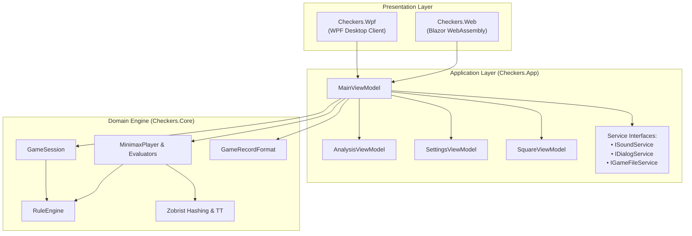

# 12 – App integration

[Back to the index](README.md)

## In short

The solution achieves complete separation of concerns by placing all game rules and search logic in `Checkers.Core`, while user interface logic and state coordination reside in the shared `Checkers.App` library.

Two client applications consume `Checkers.App`:
1. **`Checkers.Wpf`:** High-performance desktop presentation layer targeting .NET 10 on Windows.
2. **`Checkers.Web`:** Responsive Blazor WebAssembly client compiled Ahead-Of-Time (AOT) to WebAssembly and hosted statically (e.g., Azure Static Web Apps).

---

## Architectural layers

---

## Shared ViewModels (`Checkers.App`)

### `MainViewModel`
The primary coordinator for interactive gameplay:
* **Board state representation:** Maintains an $8 \times 8$ grid of `SquareViewModel` objects and an observable `BoardSquares` collection bound to XAML/HTML templates.
* **Game modes:** Supports `HumanVsHuman`, `HumanVsComputer`, and `ComputerVsComputer`.
* **Selection & Move Validation:** Intercepts square clicks or drag-and-drop operations, identifies valid destinations, highlights mandatory capture sources in red, and executes legal moves.
* **Undo/Redo & Clocks:** Maintains undo availability, coordinates move history lists, and restores chess clocks when moves are retracted.
* **AI Turn Dispatch:** Monitors turn transitions, cancels running searches when new moves occur, and triggers computer moves asynchronously.

### `AnalysisViewModel`
Maintains real-time engine telemetry during computer thinking:
* Properties: `Move`, `Depth`, `Value`, `BestMove`, `Nodes`, `Evaluations`, `Time`.
* **`Updated` Event:** Exposes `public event Action? Updated;` raised immediately whenever new telemetry is received or when the pane is reset.

### `SettingsViewModel`
Backs the **Game -> Settings...** modal dialog:
* Radio toggles for **International Draughts (Flying Kings)** vs. **English Checkers (1-Step Kings)**.
* Sliders for **Fixed Depth** (1–20), **Time per Move** (1–60s), and **Time per Game** (1–60m).

---

## Presentation layer differences

Although both frontends bind to the exact same `MainViewModel`, desktop and web environments have distinct execution and UI characteristics:

| Feature | WPF Desktop (`Checkers.Wpf`) | Blazor WebAssembly (`Checkers.Web`) |
|---|---|---|
| **Runtime Model** | Multi-threaded CLR (.NET 10) | Single-threaded WebAssembly (.NET 10 AOT) |
| **Search Execution** | Background ThreadPool (`Task.Run`) | Cooperative macrotask yielding (`Task.Delay(1)`) |
| **Telemetry Dispatch** | `Dispatcher.BeginInvoke` via `Progress<T>` | `BrowserSynchronizationContext` + `Analysis.Updated` |
| **File I/O** | Native `OpenFileDialog` / `SaveFileDialog` | Browser file picker & blob downloads (`fileService.js`) |
| **Audio Playback** | System sound / procedural sounds | HTML5 Audio Elements (`checkers.playSound`) |
| **Documentation** | Built-in web links | Integrated `/docs` route with Markdig renderer |

---

## Desktop ThreadPool vs. WebAssembly Cooperative Yielding

### Desktop WPF
In WPF, UI rendering occurs on the main STA thread while `Task.Run` executes the minimax search on a separate worker thread. The `Progress<SearchAnalysis>` instance marshals updates back to the UI thread via `Dispatcher`, allowing continuous 60 FPS animations and live analysis numbers without stalling the search.

### Blazor WebAssembly
In standard WebAssembly, all C# code shares the browser's single execution thread with the DOM renderer:
* If the search ran in a tight synchronous loop, the browser could not process pending message queue items or render frames until search finished.
* To solve this, `MinimaxPlayer.GetMoveAsync` is `async ValueTask<Move>`. Whenever `progress != null`, it awaits `Task.Delay(1, cancellationToken)`:
  1. At every completed depth iteration ($d = 1 \dots D$).
  2. Between root moves if $\ge 150\text{ms}$ have elapsed since the last report.
  3. On single forced moves.
* Each `Task.Delay(1)` schedules a macrotask on the browser event loop. During this brief slice, the browser executes posted `Progress<T>` callbacks, fires `AnalysisViewModel.Updated`, calls `InvokeAsync(StateHasChanged)` in `Home.razor`, and repaints the DOM before resuming C# search calculations.
