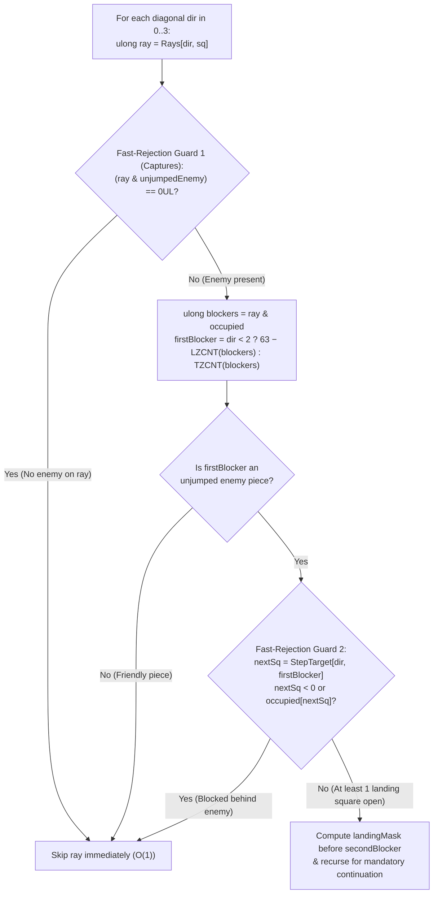
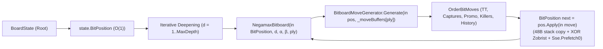

# 11 – Bitboards

[Back to the index](README.md)

## In short

In the initial implementation of `Checkers.Core`, `BoardState` stored pieces in a heap-allocated `Piece?[8, 8]` array, and cloning that array alongside `List<Move>` / `List<Position>` allocations at every node of an Alpha-Beta search tree created substantial memory-bandwidth and garbage-collection overhead.

To maximize search throughput while preserving **100% behavioral and node-for-node search equivalence** (the same strict node-equality verification principle used by [`verify_identical.py`](https://github.com/Stermere/Checkers-Engine/blob/main/src/python/verify_identical.py) in Collin Kees's [**Checkers-Engine (Marcher Engine)**](https://github.com/Stermere/Checkers-Engine)), `Checkers.Core` is built on a pure **64-bit Bitboard Engine** (`Checkers.Core.Bitboards`), backing `BoardState`, `RuleEngine`, `EvaluationFunction`, and `MinimaxPlayer` directly by 64-bit bitboards:
- **[`BitPosition`](../../src/Checkers.Core/Bitboards/BitPosition.cs) (`struct`, 48 bytes):** Represents the entire board using four `ulong` bitboards (`WhiteMen`, `BlackMen`, `WhiteKings`, `BlackKings`, corresponding to `p1, p2, p1k, p2k` in [`board_eval.c`](https://github.com/Stermere/Checkers-Engine/blob/main/src/engine/board_eval.c) / [`board_search.c`](https://github.com/Stermere/Checkers-Engine/blob/main/src/engine/board_search.c)), an incrementally maintained 64-bit Zobrist `Hash`, `HalfMoveClock`, and `SideToMove`. `BoardState` wraps `BitPosition` directly with zero array allocation.
- **[`BitMove`](../../src/Checkers.Core/Bitboards/BitMove.cs) (`readonly record struct`, 16 bytes):** Value-type move representation storing `ulong Captured` (all jumped squares as a bitmask), `byte From`, `byte To`, `bool IsPromotion`, and a 16-bit packed identifier `ushort PackedMove = (ushort)((From << 8) | To)` with zero heap allocations.
- **[`BitboardMoveGenerator`](../../src/Checkers.Core/Bitboards/BitboardMoveGenerator.cs) & [`RuleEngine`](../../src/Checkers.Core/Engine/RuleEngine.cs):** Generates legal moves into stack/per-ply `Span<BitMove>` buffers using parallel 64-bit shift-and-mask operations for Men and English 1-Step Kings, hardware `BitOperations.TrailingZeroCount` / `LeadingZeroCount` diagonal ray scans with fast-rejection guards for International Flying Kings, and set-wise $O(1)$ capture/mobility checks (`HasAnyCapture`, inspired by `has_any_jump` in [`board_search.c`](https://github.com/Stermere/Checkers-Engine/blob/main/src/engine/board_search.c)).
- **[`EvaluationFunction`](../../src/Checkers.Core/AI/EvaluationFunction.cs):** Computes the static evaluation using hardware `BitOperations.PopCount` (`POPCNT` instruction) and precomputed row/center/PST masks instead of 64-square loops.
- **[`MinimaxPlayer`](../../src/Checkers.Core/AI/MinimaxPlayer.cs):** Allocation-free Negamax Alpha-Beta search using value-type copy-make (`BitPosition next = pos.Apply(in move)`), preallocated per-ply `BitMove[][]` buffers, single move generation per node, and in-place insertion sort.


---

## 64-Bit 8×8 Bitboard Layout

Every square `(Row, Col)` on the 8×8 board maps directly to bit index:

$$\text{sq} = \text{Row} \times 8 + \text{Col} \in \{0, 1, \dots, 63\}$$

A square is occupied in a bitboard `bb` if and only if `((bb >> sq) & 1UL) != 0`. Because this matches the exact indexing of `Zobrist.PieceTable[64, 4]`, incremental Zobrist hash updates during `BitPosition.Apply` require only direct table lookups by bit index.

```
Row 0 (Black Back Rank):   0   [1]   2   [3]   4   [5]   6   [7]
Row 1:                    [8]   9  [10]  11  [12]  13  [14]  15
Row 2:                    16  [17]  18  [19]  20  [21]  22  [23]
Row 3:                   [24]  25  [26]  27  [28]  29  [30]  31
Row 4:                    32  [33]  34  [35]  36  [37]  38  [39]
Row 5:                   [40]  41  [42]  43  [44]  45  [46]  47
Row 6:                    48  [49]  50  [51]  52  [53]  54  [55]
Row 7 (White Back Rank): [56]  57  [58]  59  [60]  61  [62]  63
```

### Precomputed Masks (`BitboardMasks.cs`)

To prevent horizontal wrap-around when shifting bits diagonally across files A (`Col == 0`) and H (`Col == 7`), [`BitboardMasks.cs`](../../src/Checkers.Core/Bitboards/BitboardMasks.cs) defines compile-time constants and static lookup tables:

| Constant / Table | Hex Value / Type | Purpose |
|---|---|---|
| `DarkSquares` | `0x55AA55AA55AA55AAUL` | All 32 playable dark squares `(Row + Col) % 2 == 1` |
| `NotColA` | `0xFEFEFEFEFEFEFEFEUL` | Excludes Column 0 (prevents left-shift wrap-around) |
| `NotColH` | `0x7F7F7F7F7F7F7F7FUL` | Excludes Column 7 (prevents right-shift wrap-around) |
| `NotColAB` | `0xFCFCFCFCFCFCFCFCUL` | Excludes Columns 0 & 1 (2-square left jump guard) |
| `NotColGH` | `0x3F3F3F3F3F3F3F3FUL` | Excludes Columns 6 & 7 (2-square right jump guard) |
| `Row0` | `0x00000000000000FFUL` | White promotion rank (`Row == 0`) |
| `Row7` | `0xFF00000000000000UL` | Black promotion rank (`Row == 7`) |
| `CenterMask` | `0x0000142800000000UL` | Core dark squares `14, 15, 18, 19` (Rows 3–4, Cols 2–5: `+12` center control bonus) |
| `KingCenterMask` | `0x0014281428000000UL` | Central 4×4 dark squares (Rows 2–5, Cols 2–5: `+10` English king centralization) |
| `Rays[4, 64]` | `ulong[4, 64]` | Diagonal dark-square ray masks (`UL`, `UR`, `DL`, `DR`) from square `sq` |
| `StepTarget[4, 64]` | `sbyte[4, 64]` | Adjacent diagonal square index (`0..63`, or `-1` if off-board) for $O(1)$ blocker lookahead |

### Diagonal Bit Shifts

Moving one step diagonally corresponds to a fixed bit shift combined with a file guard mask:
- **Up-Left (`-1 row, -1 col`, `-9`):** `(bb & NotColA) >> 9`
- **Up-Right (`-1 row, +1 col`, `-7`):** `(bb & NotColH) >> 7`
- **Down-Left (`+1 row, -1 col`, `+7`):** `(bb & NotColA) << 7`
- **Down-Right (`+1 row, +1 col`, `+9`):** `(bb & NotColH) << 9`

---

## Bitboard Move Generation & Phase 1 Speed Optimizations (`BitboardMoveGenerator.cs`)

### 1. $O(1)$ Terminal Mobility Detection (`HasAnyLegalMove`)

A key mathematical insight connects the two supported rule variants:
> **Theorem:** A board position has at least one legal move in **International Draughts (Flying Kings)** if and only if it has at least one legal move in **English Checkers (1-Step Kings)**.
> *Proof:* Any Flying King move along a diagonal ray requires either the immediately adjacent square at distance 1 to be empty (which is already a legal 1-step quiet move) or the square at distance 1 to hold an enemy piece with distance 2 empty (which is already a legal 1-step jump capture), or distance 1 is empty before a long jump (which means the 1-step quiet move was already legal).

Consequently, `BitboardMoveGenerator.HasAnyLegalMove(in BitPosition pos, CheckersVariant variant)` executes in **$O(1)$ constant time** using parallel bitwise shifts across all friendly pieces simultaneously—with zero loops and zero allocations:

```csharp
ulong upLeftQuiet = ((upMovers & NotColA) >> 9) & empty;
ulong upRightQuiet = ((upMovers & NotColH) >> 7) & empty;
if ((upLeftQuiet | upRightQuiet) != 0)
    return true;
```

**Redundant `HasAnyLegalMove` Elimination (Phase 1):**
Inside `MinimaxPlayer.NegamaxBitboard`, `HasAnyLegalMove` is only called when `pos.HalfMoveClock >= 80` (to verify that a blocked loss takes precedence over the 40-move draw rule before returning `0`). On normal interior nodes (`depth > 0`), `BitboardMoveGenerator.Generate` is already called and returns `moveCount == 0` when the active player has no legal moves, saving millions of redundant mobility checks. Similarly, on the initial `depth == 0` entry into `Quiescence`, `NegamaxBitboard` has already verified terminal status, so `HasAnyLegalMove` is only checked at `qPly > 0`.

### 2. Set-Wise $O(1)$ Capture Detection (`HasAnyCapture`)

In Checkers, determining whether *any* legal capture exists on the board is critical in three hot paths:
1. **Quiescence Search (`depth == 0`):** If no capture exists after `standPat` evaluation, `Quiescence` can return $\alpha$ immediately without slicing `_moveBuffers` or invoking `GenerateCaptures`.
2. **Reverse Futility & Futility Pruning ([Chapter 07](07-search.md#stage-b-selective-pruning--reductions-phase-4)):** Verifying that neither player has an immediate jump threat before pruning.
3. **Verified Late Move Reductions (LMR):** Verifying that a quiet move `nextPos = pos.Apply(in move)` does not expose a friendly piece to a mandatory capture before reducing depth.

Let $M_{\text{up}}, M_{\text{down}} \in \mathbb{U}_{64}$ be the friendly pieces capable of jumping upward and downward respectively, $E$ be the enemy pieces, and $\emptyset = \text{DarkSquares} \setminus (W \cup B)$ be the empty dark squares. `BitboardMoveGenerator.HasAnyCapture` tests all pieces in parallel across the four jump vectors:

$$J_{\text{UL}} = \Bigl(\bigl((M_{\text{up}} \land \text{NotColAB}) \gg 9\bigr) \land E\Bigr) \gg 9 \land \emptyset, \qquad J_{\text{UR}} = \Bigl(\bigl((M_{\text{up}} \land \text{NotColGH}) \gg 7\bigr) \land E\Bigr) \gg 7 \land \emptyset$$

$$J_{\text{DL}} = \Bigl(\bigl((M_{\text{down}} \land \text{NotColAB}) \ll 7\bigr) \land E\Bigr) \ll 7 \land \emptyset, \qquad J_{\text{DR}} = \Bigl(\bigl((M_{\text{down}} \land \text{NotColGH}) \ll 9\bigr) \land E\Bigr) \ll 9 \land \emptyset$$

If $(J_{\text{UL}} \mid J_{\text{UR}} \mid J_{\text{DL}} \mid J_{\text{DR}}) \neq 0$, a 1-hop jump exists and `HasAnyCapture` returns `true` in **4 bitwise expressions**. Only when International Flying Kings are on the board (`ownKings != 0UL`) and no 1-hop jump was found does it check long-range king rays via `CanKingCaptureFrom`.

### 3. Men and English 1-Step Kings Move Generation

- **Quiet Moves:** Parallel shift-and-mask (`(movers & NotColA) >> 9 & empty`) identifies all pieces capable of sliding. Individual set bits are iterated via `BitOperations.TrailingZeroCount(mask)` and cleared via `mask &= mask - 1`.
- **Jump Captures:** Parallel 2-step shift-and-mask (`(((movers & NotColAB) >> 9) & enemy) >> 9 & empty`) detects whether any capture exists before recursive multi-jump expansion. Multi-jump recursion updates the local `own`, `enemy`, and `capturedMask` bitboards in CPU registers, automatically preventing jumping the same piece twice (`(enemy & (1UL << midSq)) != 0`).

### 4. International Flying Kings (`TZCNT` / `LZCNT` + Phase 1 Ray Fast-Rejection)

For Flying Kings, ray attacks along each of the 4 diagonal directions (`UL`, `UR`, `DL`, `DR`) are resolved using hardware bit-scan instructions combined with **two Phase 1 fast-rejection guards**:



1. **Fast-Rejection Guard 1 (`(ray & unjumpedEnemy) == 0UL`):** During capture detection and multi-jump expansion (`CanKingCaptureFrom` and `ExpandFlyingKingJumps`), if a diagonal ray contains *zero* unjumped enemy pieces, the ray is skipped before computing `blockers` or executing `LZCNT`/`TZCNT`.
2. **Hardware Blocker Discovery (`TZCNT` / `LZCNT`):**
   - Compute `ulong blockers = ray & occupied;` along `Rays[dir, sq]`.
   - For positive shifts (`DL`, `DR`, where bit indices increase away from `sq`), the closest blocker is `BitOperations.TrailingZeroCount(blockers)`.
   - For negative shifts (`UL`, `UR`, where bit indices decrease away from `sq`), the closest blocker is `63 - BitOperations.LeadingZeroCount(blockers)`.
3. **Fast-Rejection Guard 2 (`StepTarget[dir, firstBlocker]`):** Even when `firstBlocker` is an unjumped enemy piece, a jump is only possible if the single square immediately behind `firstBlocker` (`nextSq = StepTarget[dir, firstBlocker]`) is on the board (`nextSq >= 0`) and unoccupied (`(occupied & (1UL << nextSq)) == 0UL`). Checking `StepTarget` in $O(1)$ rejects blocked enemy pieces without computing `afterEnemyRay` or scanning for a second blocker.
4. **Quiet Slides & Flying Captures:**
   - **Quiet slides:** All squares on the ray strictly before `firstBlocker` (`ray & ~Rays[dir, firstBlocker] & ~(1UL << firstBlocker)`) are valid quiet destinations.
   - **Flying captures:** When Guard 1 and Guard 2 pass, all empty squares between `firstBlocker` and the second blocker are valid landing squares, each tested recursively for mandatory continuation jumps ([Chapter 03](03-rules-and-move-generation.md#the-mandatory-continuation-requirement)).

---

## Bitboard Static Evaluation (`EvaluationFunction.cs`)

`EvaluationFunction.Evaluate(in BitPosition pos, CheckersVariant variant)` (and `LegacyEvaluationFunction.Evaluate` for Phase 0–5 equivalence testing) replaces 64-square nested array loops with hardware `BitOperations.PopCount` (`POPCNT`), `TrailingZeroCount` (`TZCNT`), and `LeadingZeroCount` (`LZCNT`) instructions ([Chapter 05](05-evaluation.md)), evaluating a position in **8.8–13.1 nanoseconds**:

1. **Material:**
   $$\text{Score}_{\text{mat}} = 100 \cdot \bigl(\text{PopCount}(W_M) - \text{PopCount}(B_M)\bigr) + W_{\text{king}} \cdot \bigl(\text{PopCount}(W_K) - \text{PopCount}(B_K)\bigr)$$
   where $W_{\text{king}} = 300$ (`International` Flying Kings) or $140$ (`English` 1-Step Kings; $170$ in `LegacyEvaluationFunction`).
2. **Vectorized Piece-Square Tables (PSTs):** Evaluated across all pieces simultaneously in $O(1)$ using precomputed 64-bit weight masks (`PopCount(wm & WhiteManPst1/2/3Mask)`, `PopCount(wk & EnglishKingPst4/5Mask)`, `PopCount(wk & FlyingKingMainDiagonalMask)`).
3. **Advancement Bonus:** Computed per rank using `BitOperations.PopCount(pos.WhiteMen & Row[r]) * (7 - r)` (late-game gated $|A| \le 12$ in English; continuous $+5\text{ to }+6\text{ cp/rank}$ in International).
4. **Precomputed Forward Promotion Cones (`ConeWhite[64]`, `ConeBlack[64]`):** Detects unstoppable Runaway Checkers when `enemyKings == 0` via `(ConeWhite[sq] & allPieces) == 0UL`.
5. **Parallel Bitshift Tail Pins & Structural Masks:** Computes King tail pins (`(wk & Cols0To5) & (bm >> 9) & (bm >> 18)`) and classical formations (`Right Lock`, `Bridge`, `Triangle`, `Oreo`, `Dog`) in $O(1)$ bitwise operations.

---

## Value-Type Copy-Make Search (`MinimaxPlayer.cs`)



Unlike the original array-based `MinimaxPlayer`, which cloned a `Piece?[8, 8]` `BoardState` on the managed heap and called `RuleEngine.GetLegalMoves` twice per internal node, the bitboard `MinimaxPlayer`:
1. Generates moves **once** into a preallocated per-ply buffer `_moveBuffers[ply]` (`BitMove[128]`).
2. If `moveCount == 0`, immediately returns `LossScore + ply` (opponent has no legal moves) without calling a second move generator.
3. Orders moves in-place using a zero-allocation insertion sort ([Chapter 06](06-move-ordering.md)).
4. Applies each move via `BitPosition next = pos.Apply(in move)`, copying 48 bytes on the stack, updating `Hash` with 2–4 XOR operations, and issuing `Sse.Prefetch0` for the child's 64-byte TT bucket ([Chapter 08](08-transposition-table.md)).

---

## Empirical Speedup Summary

Across our 40-position benchmark suite, refactoring from `Piece?[8, 8]` heap arrays to 64-bit bitboards (with Phase 1 move-generation optimizations) preserved **100% node-for-node search equivalence** while delivering over a **50×–65× raw speedup**:

| Benchmark Suite & Variant | Mode | Array Engine Time | Bitboard Engine Time (Phase 0 / Phase 1) | Raw Throughput | Speedup vs. Array |
|---|---|---:|---:|---:|---:|
| **Standard 40 Pos (7–9 plies, International)** | **No-TT** | `3,776 ms` | **`58 ms`** | `39.95M nodes/s` | **65.10×** |
| **Standard 40 Pos (7–9 plies, English)** | **No-TT** | `3,857 ms` | **`61 ms`** | `40.23M nodes/s` | **63.23×** |
| **Deep 40 Pos (7–14 plies, International)** | **No-TT** | `148,822 ms` | `2,951 ms` / **`2,918 ms`** | **`32.83M nodes/s`** | **51.00×** |
| **Deep 40 Pos (7–14 plies, International)** | **1M TT** | `17,941 ms` | `714 ms` / **`672 ms`** | **`16.30M nodes/s`** | **26.70×** *(221× vs. No-TT)* |
| **Deep 40 Pos (7–14 plies, English)** | **No-TT** | `142,038 ms` | `2,641 ms` / **`2,567 ms`** | **`36.66M nodes/s`** | **55.33×** |
| **Deep 40 Pos (7–14 plies, English)** | **1M TT** | `16,342 ms` | `638 ms` / **`575 ms`** | **`17.34M nodes/s`** | **28.42×** *(247× vs. No-TT)* |

For the complete 40-position per-position tables (Standard and Deep suites across both variants) and the full Phase 0–4 benchmark progression, see [Chapter 12 – Engine improvements during development](12-engine-improvements.md).
