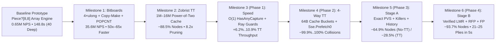

# 11 – Engine improvements during development

[Back to the index](README.md)

## In short

During the development of `Checkers.Core`, the AI engine evolved through **six rigorously benchmarked engineering milestones**—starting from an initial object-oriented `Piece?[8, 8]` array prototype and progressing to a zero-allocation 64-bit bitboard engine equipped with a 4-way set-associative cache-line transposition table, hardware `Sse.Prefetch0` prefetching, Principal Variation Search (PVS), Killer/History move ordering, path-aware repetition detection (`DrawTable`), Reverse Futility Pruning (RFP), Futility Pruning (FP), and two-stage Verified Late Move Reductions (LMR).

Every milestone was validated against automated benchmark suites (`tools/Checkers.Benchmark`) to verify search correctness, measure exact node reductions, and quantify wall-clock throughput (`nodes/s`) and search depth gains:
* **Raw Tree-Walk Throughput:** Increased from **`0.64M–0.66M nodes/s`** in the `Piece?[8, 8]` array engine to **`32.83M–37.18M nodes/s`** in the bitboard engine (**51×–65× raw speedup** with 100% node-for-node equivalence).
* **40-Position Deep Fixed-Depth Suite ($7\text{–}14$ plies):** Total runtime across all 40 deep International positions dropped from **`148,822 ms` ($2.48\text{ minutes}$)** in the uncached array baseline down to **`246 ms` ($0.25\text{ seconds}$)** in Phase 4 (**605× total speedup**), and in English Checkers from **`142,038 ms` down to `173 ms` (821× total speedup; 875× No-TT speedup)**.
* **5-Position Timed Suite ($5.0\text{ s}$ per position, $16\text{M}$ TT):** Completed iterative deepening depth increased by **+4 to +5 plies** across every position (reaching **21 to 25 plies**), enabling the engine to solve a **23-ply forced win** on Position #40 in **`2.15 seconds`**.


---

## Development Roadmap & Cumulative Progression



### Executive Summary: 40-Position Deep Suite ($7\text{–}14$ Plies) Across All Milestones

| Milestone / Engine Stage | Variant | Mode | Evaluated Nodes | Node Reduction vs. Baseline | Total Time | Throughput (NPS) | Cumulative Speedup |
|---|---|---|---:|---:|---:|---:|---:|
| **0A. Array Engine Prototype** | International | No-TT | `95,811,314` | — | `148,822 ms` | `0.64M/s` | `1.00×` |
| **0B. Array Engine + 1M TT** | International | 1M TT | `10,962,720` | `-88.56%` | `17,941 ms` | `0.61M/s` | `8.30×` |
| **Phase 0. Bitboard Baseline** | International | No-TT | `95,811,314` | `0.00% (Exact)` | `2,951 ms` | `32.47M/s` | `50.43×` |
| **Phase 0. Bitboard Baseline** | International | 1M TT | `10,962,720` | `-88.56% (Exact)` | `714 ms` | `15.35M/s` | `208.43×` |
| **Phase 1. Speed Optimizations** | International | 1M TT | `10,962,720` | `-88.56% (Exact)` | `672 ms` | `16.30M/s` | `221.46×` |
| **Phase 2. 4-Way Bucket TT + Prefetch** | International | 1M TT | `10,956,192` | `-88.56% (Exact)` | `638 ms` | `17.18M/s` | `233.26×` |
| **Phase 3. Stage A Exact (PVS + Killers)** | International | No-TT | `33,933,396` | `-64.58% (Exact)` | `1,367 ms` | `24.82M/s` | `108.87×` |
| **Phase 3. Stage A Exact (PVS + Killers)** | International | 1M TT | `7,840,974` | `-91.82% (Exact)` | `548 ms` | `14.31M/s` | `271.57×` |
| **Phase 4. Stage B Selective (LMR/RFP/FP)** | International | No-TT | **`6,727,472`** | **`-92.98% (14.2×)`** | **`458 ms`** | `14.69M/s` | **`324.94×`** |
| **Phase 4. Stage B Selective (LMR/RFP/FP)** | International | 1M TT | **`2,349,717`** | **`-97.55% (40.8×)`** | **`246 ms`** | `9.55M/s` | **`604.97×`** |
| **0A. Array Engine Prototype** | English | No-TT | `94,110,293` | — | `142,038 ms` | `0.66M/s` | `1.00×` |
| **Phase 0. Bitboard Baseline** | English | No-TT | `94,110,293` | `0.00% (Exact)` | `2,641 ms` | `35.63M/s` | `53.78×` |
| **Phase 2. 4-Way Bucket TT + Prefetch** | English | 1M TT | `9,944,217` | `-89.43% (Exact)` | `557 ms` | `17.85M/s` | `255.01×` |
| **Phase 3. Stage A Exact (PVS + Killers)** | English | 1M TT | `7,324,657` | `-92.22% (Exact)` | `447 ms` | `16.39M/s` | `317.76×` |
| **Phase 4. Stage B Selective (LMR/RFP/FP)** | English | No-TT | **`5,922,594`** | **`-93.71% (15.9×)`** | **`302 ms`** | `19.61M/s` | **`470.32×`** |
| **Phase 4. Stage B Selective (LMR/RFP/FP)** | English | 1M TT | **`2,083,260`** | **`-97.79% (45.2×)`** | **`173 ms`** | `12.04M/s` | **`821.03×`** |

### Executive Summary: 5-Position Timed Suite ($5.0\text{ s}$ Budget / Position, $16\text{M}$ TT, International)

| Position | Category | Phase 0 Depth | Phase 1 Depth | Phase 2 Depth | Phase 3 (Stage A Exact) | **Phase 4 (Stage B Selective)** | Total Depth Gain | Phase 4 Best Move & Score |
|---|:---:|:---:|:---:|:---:|:---:|:---:|:---:|:---:|
| **Pos #1** | Opening | `17 plies` | `17 plies` | `17 plies` | `18 plies (+1)` | **`21 plies`** | **+4 plies** | `9-14` (`+5`) |
| **Pos #13** | Middlegame | `16 plies` | `17 plies (+1)` | `17 plies (+1)` | `17 plies (+1)` | **`21 plies`** | **+5 plies** | `28-24` (`+7`) |
| **Pos #20** | Middlegame | `18 plies` | `18 plies` | `18 plies` | `20 plies (+2)` | **`22 plies`** | **+4 plies** | `12-16` (`0`) |
| **Pos #32** | Endgame | `20 plies` | `20 plies` | `20 plies` | `20 plies` | **`25 plies`** | **+5 plies** | `18-14` (`+439`) |
| **Pos #40** | Blockade/Tension | `18 plies` | `18 plies` | `18 plies` | `19 plies (+1)` | **`22 plies`** *(Solved Mate!)* | **+4 plies** | `29x8` (**`+Win in 23 plies` in `2.15s`**) |

---

## Milestone 1: 64-Bit Bitboard Refactor (Array vs. Bitboard Engine)

Detailed architectural documentation: [Chapter 10 – Bitboards](10-bitboards.md).

In Milestone 1, the heap-allocated `Piece?[8, 8]` board representation and `List<Move>` generator were replaced by a value-type 64-bit bitboard engine (`BitPosition`, `BitMove`, `BitboardMoveGenerator`, and `POPCNT`-based `EvaluationFunction`). Across all 40 benchmark positions at both standard ($7\text{–}9$ plies) and deep ($7\text{–}14$ plies) search depths, the bitboard engine visited the **exact same number of nodes** while running **50.4× to 65.1× faster** without TT and **23.6× to 25.6× faster** with the 1M TT.

### Summary Across All 40 Positions (Standard 7–9 Plies & Deep 7–14 Plies)

| Suite | Variant | Mode | Array Nodes | Bitboard Nodes | Node Equivalence | Array Time | Bitboard Time | Speedup | Bitboard NPS |
|---|---|---|---:|---:|:---:|---:|---:|---:|---:|
| **Standard (7–9p)** | **International** | **No-TT** | `2,317,030` | `2,317,030` | **100% (40/40)** | `3,776 ms` | **`58 ms`** | **65.10×** | `39.95M/s` |
| **Standard (7–9p)** | **International** | **1M TT** | `664,471` | `664,471` | **100% (40/40)** | `1,128 ms` | **`47 ms`** | **24.00×** | `14.14M/s` |
| **Standard (7–9p)** | **English** | **No-TT** | `2,454,069` | `2,454,069` | **100% (40/40)** | `3,857 ms` | **`61 ms`** | **63.23×** | `40.23M/s` |
| **Standard (7–9p)** | **English** | **1M TT** | `665,966` | `665,966` | **100% (40/40)** | `1,088 ms` | **`46 ms`** | **23.65×** | `14.48M/s` |
| **Deep (7–14p)** | **International** | **No-TT** | `95,811,314` | `95,811,314` | **100% (40/40)** | `148,822 ms` | **`2,951 ms`** | **50.43×** | **`32.47M/s`** |
| **Deep (7–14p)** | **International** | **1M TT** | `10,962,720` | `10,962,720` | **100% (40/40)** | `17,941 ms` | **`714 ms`** | **25.13×** | **`15.35M/s`** |
| **Deep (7–14p)** | **English** | **No-TT** | `94,110,293` | `94,110,293` | **100% (40/40)** | `142,038 ms` | **`2,641 ms`** | **53.78×** | **`35.63M/s`** |
| **Deep (7–14p)** | **English** | **1M TT** | `9,974,305` | `9,974,305` | **100% (40/40)** | `16,342 ms` | **`638 ms`** | **25.61×** | **`15.63M/s`** |

### Analytical Observations

1. **50×–65× Raw Tree-Walk Acceleration (No-TT):**
   Without a transposition table, the array engine spends nearly 2.5 minutes (`148.8s` in International, `142.0s` in English) evaluating ~95M nodes (`~644k–662k nodes/s`), bound by `Piece?[8, 8]` heap cloning, `List<Move>` allocations, and 64-square loops. The bitboard engine walks the exact same 95M-node trees in **2.95s** (`International`, **32.47M nodes/s**) and **2.64s** (`English`, **35.63M nodes/s**).
2. **Amdahl's Law & DRAM Latency with TT Enabled (~25× vs. ~52×):**
   When the 1M-entry (16 MiB) Transposition Table is enabled, every node probes and stores a 16-byte `TranspositionEntry` in L3/main memory. In the array engine, a 15–20 ns L3/DRAM access is negligible compared to ~1,550 ns of per-node array cloning. In the bitboard engine, where move generation, copy-make, and `PopCount` evaluation take only **~28–30 ns per node**, the L3/DRAM transposition table probe/store accounts for roughly half of the per-node execution time (`~65 ns/node` total, or **~15.5M nodes/s**). Even so, `Bitboard + 1M TT` finishes all 40 deep positions in **0.71s** (`International`) and **0.64s** (`English`)—a **208×–222× combined speedup** over `Array No-TT`.

### Table 1A: International Draughts — Deep No-TT Baseline (Array vs. Bitboard, 7–14 Plies)

| # | Category | Depth | Array Nodes (No-TT) | Bitboard Nodes (No-TT) | Array Time | Bitboard Time | Speedup | Identical |
|---|:---:|:---:|---:|---:|---:|---:|---:|:---:|
| 1 | Opening | 11 plies | 1,364,775 | 1,364,775 | 2,423 ms | 134 ms | **18.08x** | Yes |
| 2 | Opening | 12 plies | 2,268,109 | 2,268,109 | 3,806 ms | 69 ms | **55.16x** | Yes |
| 3 | Opening | 11 plies | 2,152,631 | 2,152,631 | 3,494 ms | 67 ms | **52.15x** | Yes |
| 4 | Opening | 10 plies | 3,862,989 | 3,862,989 | 6,496 ms | 111 ms | **58.52x** | Yes |
| 5 | Opening | 10 plies | 2,204,847 | 2,204,847 | 3,817 ms | 65 ms | **58.72x** | Yes |
| 6 | Opening | 11 plies | 1,540,643 | 1,540,643 | 2,653 ms | 45 ms | **58.96x** | Yes |
| 7 | Opening | 10 plies | 2,267,162 | 2,267,162 | 3,989 ms | 70 ms | **56.99x** | Yes |
| 8 | Opening | 10 plies | 1,915,942 | 1,915,942 | 3,276 ms | 59 ms | **55.53x** | Yes |
| 9 | Opening | 10 plies | 1,662,035 | 1,662,035 | 2,908 ms | 47 ms | **61.87x** | Yes |
| 10 | Opening | 10 plies | 1,742,411 | 1,742,411 | 2,825 ms | 48 ms | **58.85x** | Yes |
| 11 | Middlegame | 12 plies | 2,074,281 | 2,074,281 | 2,997 ms | 51 ms | **58.76x** | Yes |
| 12 | Middlegame | 10 plies | 2,101,525 | 2,101,525 | 3,069 ms | 55 ms | **55.80x** | Yes |
| 13 | Middlegame | 10 plies | 2,763,961 | 2,763,961 | 4,107 ms | 78 ms | **52.65x** | Yes |
| 14 | Middlegame | 10 plies | 2,723,163 | 2,723,163 | 3,904 ms | 70 ms | **55.77x** | Yes |
| 15 | Middlegame | 10 plies | 2,115,795 | 2,115,795 | 3,466 ms | 60 ms | **57.77x** | Yes |
| 16 | Middlegame | 14 plies | 2,595,254 | 2,595,254 | 3,825 ms | 84 ms | **45.54x** | Yes |
| 17 | Middlegame | 12 plies | 2,799,308 | 2,799,308 | 4,481 ms | 108 ms | **41.49x** | Yes |
| 18 | Middlegame | 11 plies | 4,329,327 | 4,329,327 | 6,165 ms | 120 ms | **51.38x** | Yes |
| 19 | Middlegame | 12 plies | 3,506,277 | 3,506,277 | 4,825 ms | 112 ms | **43.08x** | Yes |
| 20 | Middlegame | 11 plies | 4,253,714 | 4,253,714 | 6,008 ms | 113 ms | **53.17x** | Yes |
| 21 | Middlegame | 13 plies | 2,674,334 | 2,674,334 | 3,739 ms | 88 ms | **42.49x** | Yes |
| 22 | Middlegame | 14 plies | 2,560,701 | 2,560,701 | 3,658 ms | 75 ms | **48.77x** | Yes |
| 23 | Middlegame | 10 plies | 2,632,773 | 2,632,773 | 4,027 ms | 72 ms | **55.93x** | Yes |
| 24 | Middlegame | 11 plies | 3,509,716 | 3,509,716 | 5,410 ms | 104 ms | **52.02x** | Yes |
| 25 | Middlegame | 11 plies | 1,757,145 | 1,757,145 | 2,890 ms | 59 ms | **48.98x** | Yes |
| 26 | Endgame | 8 plies | 48,927 | 48,927 | 58 ms | 1 ms | **58.00x** | Yes |
| 27 | Endgame | 10 plies | 1,662,722 | 1,662,722 | 2,895 ms | 55 ms | **52.64x** | Yes |
| 28 | Endgame | 7 plies | 8,892 | 8,892 | 18 ms | 1 ms | **18.00x** | Yes |
| 29 | Endgame | 10 plies | 2,248,895 | 2,248,895 | 3,434 ms | 63 ms | **54.51x** | Yes |
| 30 | Endgame | 11 plies | 980,995 | 980,995 | 1,350 ms | 31 ms | **43.55x** | Yes |
| 31 | Endgame | 11 plies | 1,622,990 | 1,622,990 | 1,934 ms | 41 ms | **47.17x** | Yes |
| 32 | Endgame | 9 plies | 1,648,479 | 1,648,479 | 2,319 ms | 43 ms | **53.93x** | Yes |
| 33 | Endgame | 11 plies | 3,996,874 | 3,996,874 | 6,758 ms | 144 ms | **46.93x** | Yes |
| 34 | Endgame | 10 plies | 4,030,225 | 4,030,225 | 7,398 ms | 121 ms | **61.14x** | Yes |
| 35 | Endgame | 12 plies | 1,739,170 | 1,739,170 | 2,283 ms | 49 ms | **46.59x** | Yes |
| 36 | Blockade/Tension | 12 plies | 2,714,028 | 2,714,028 | 4,273 ms | 88 ms | **48.56x** | Yes |
| 37 | Blockade/Tension | 12 plies | 2,900,280 | 2,900,280 | 4,915 ms | 100 ms | **49.15x** | Yes |
| 38 | Blockade/Tension | 12 plies | 1,596,534 | 1,596,534 | 2,225 ms | 42 ms | **52.98x** | Yes |
| 39 | Blockade/Tension | 10 plies | 3,579,147 | 3,579,147 | 5,692 ms | 108 ms | **52.70x** | Yes |
| 40 | Blockade/Tension | 11 plies | 3,654,338 | 3,654,338 | 5,012 ms | 100 ms | **50.12x** | Yes |
|---|:---:|:---:|---:|---:|---:|---:|---:|:---:|
| **Total** | **All 40** | **7–14 plies** | **95,811,314** | **95,811,314** | **148,822 ms** | **2,951 ms** | **50.43x** | **100%** |

### Table 1B: International Draughts — Deep 1M TT (Array vs. Bitboard, 7–14 Plies)

| # | Category | Depth | Array TT Nodes (1M) | Bitboard TT Nodes (1M) | Array TT Time | Bitboard TT Time | Speedup | TT Cutoffs | Identical |
|---|:---:|:---:|---:|---:|---:|---:|---:|---:|:---:|
| 1 | Opening | 11 plies | 292,659 | 292,659 | 533 ms | 38 ms | **14.03x** | 5,515 | Yes |
| 2 | Opening | 12 plies | 477,847 | 477,847 | 844 ms | 30 ms | **28.13x** | 8,986 | Yes |
| 3 | Opening | 11 plies | 62,373 | 62,373 | 110 ms | 4 ms | **27.50x** | 1,627 | Yes |
| 4 | Opening | 10 plies | 483,930 | 483,930 | 875 ms | 31 ms | **28.23x** | 12,810 | Yes |
| 5 | Opening | 10 plies | 149,910 | 149,910 | 273 ms | 10 ms | **27.30x** | 4,616 | Yes |
| 6 | Opening | 11 plies | 322,604 | 322,604 | 581 ms | 23 ms | **25.26x** | 6,667 | Yes |
| 7 | Opening | 10 plies | 269,454 | 269,454 | 499 ms | 19 ms | **26.26x** | 4,910 | Yes |
| 8 | Opening | 10 plies | 272,268 | 272,268 | 489 ms | 18 ms | **27.17x** | 5,705 | Yes |
| 9 | Opening | 10 plies | 240,271 | 240,271 | 444 ms | 16 ms | **27.75x** | 8,900 | Yes |
| 10 | Opening | 10 plies | 138,374 | 138,374 | 234 ms | 9 ms | **26.00x** | 3,073 | Yes |
| 11 | Middlegame | 12 plies | 186,845 | 186,845 | 287 ms | 10 ms | **28.70x** | 14,172 | Yes |
| 12 | Middlegame | 10 plies | 116,233 | 116,233 | 185 ms | 7 ms | **26.43x** | 3,615 | Yes |
| 13 | Middlegame | 10 plies | 337,093 | 337,093 | 586 ms | 21 ms | **27.90x** | 11,016 | Yes |
| 14 | Middlegame | 10 plies | 278,835 | 278,835 | 432 ms | 17 ms | **25.41x** | 11,006 | Yes |
| 15 | Middlegame | 10 plies | 358,175 | 358,175 | 596 ms | 22 ms | **27.09x** | 13,415 | Yes |
| 16 | Middlegame | 14 plies | 382,298 | 382,298 | 621 ms | 26 ms | **23.88x** | 14,591 | Yes |
| 17 | Middlegame | 12 plies | 307,907 | 307,907 | 518 ms | 22 ms | **23.55x** | 10,283 | Yes |
| 18 | Middlegame | 11 plies | 447,196 | 447,196 | 643 ms | 26 ms | **24.73x** | 19,383 | Yes |
| 19 | Middlegame | 12 plies | 533,483 | 533,483 | 785 ms | 32 ms | **24.53x** | 17,763 | Yes |
| 20 | Middlegame | 11 plies | 489,824 | 489,824 | 729 ms | 29 ms | **25.14x** | 18,960 | Yes |
| 21 | Middlegame | 13 plies | 355,299 | 355,299 | 528 ms | 24 ms | **22.00x** | 15,743 | Yes |
| 22 | Middlegame | 14 plies | 601,181 | 601,181 | 879 ms | 35 ms | **25.11x** | 52,526 | Yes |
| 23 | Middlegame | 10 plies | 311,310 | 311,310 | 507 ms | 19 ms | **26.68x** | 10,217 | Yes |
| 24 | Middlegame | 11 plies | 208,480 | 208,480 | 332 ms | 13 ms | **25.54x** | 7,567 | Yes |
| 25 | Middlegame | 11 plies | 216,934 | 216,934 | 399 ms | 19 ms | **21.00x** | 5,486 | Yes |
| 26 | Endgame | 8 plies | 23,148 | 23,148 | 27 ms | 1 ms | **27.00x** | 1,083 | Yes |
| 27 | Endgame | 10 plies | 163,987 | 163,987 | 281 ms | 10 ms | **28.10x** | 10,476 | Yes |
| 28 | Endgame | 7 plies | 6,222 | 6,222 | 10 ms | 1 ms | **10.00x** | 326 | Yes |
| 29 | Endgame | 10 plies | 226,528 | 226,528 | 338 ms | 12 ms | **28.17x** | 14,609 | Yes |
| 30 | Endgame | 11 plies | 202,311 | 202,311 | 288 ms | 13 ms | **22.15x** | 17,962 | Yes |
| 31 | Endgame | 11 plies | 154,247 | 154,247 | 184 ms | 8 ms | **23.00x** | 21,131 | Yes |
| 32 | Endgame | 9 plies | 177,484 | 177,484 | 263 ms | 9 ms | **29.22x** | 19,183 | Yes |
| 33 | Endgame | 11 plies | 415,579 | 415,579 | 718 ms | 27 ms | **26.59x** | 24,137 | Yes |
| 34 | Endgame | 10 plies | 243,580 | 243,580 | 420 ms | 15 ms | **28.00x** | 16,764 | Yes |
| 35 | Endgame | 12 plies | 288,749 | 288,749 | 432 ms | 16 ms | **27.00x** | 16,590 | Yes |
| 36 | Blockade/Tension | 12 plies | 149,121 | 149,121 | 242 ms | 10 ms | **24.20x** | 5,415 | Yes |
| 37 | Blockade/Tension | 12 plies | 296,991 | 296,991 | 545 ms | 21 ms | **25.95x** | 27,969 | Yes |
| 38 | Blockade/Tension | 12 plies | 184,351 | 184,351 | 295 ms | 12 ms | **24.58x** | 11,248 | Yes |
| 39 | Blockade/Tension | 10 plies | 348,199 | 348,199 | 602 ms | 24 ms | **25.08x** | 24,611 | Yes |
| 40 | Blockade/Tension | 11 plies | 241,440 | 241,440 | 387 ms | 15 ms | **25.80x** | 9,651 | Yes |
|---|:---:|:---:|---:|---:|---:|---:|---:|---:|:---:|
| **Total** | **All 40** | **7–14 plies** | **10,962,720** | **10,962,720** | **17,941 ms** | **714 ms** | **25.13x** | **509,707** | **100%** |

---

## Milestone 2: Transposition Table Caching & Capacity Scaling ($1\text{M}$ vs. $16\text{M}$)

Detailed architectural documentation: [Chapter 08 – Transposition table](08-transposition-table.md).

Before upgrading to 4-way buckets in Phase 2, we benchmarked the impact of Zobrist transposition caching across both Standard ($7\text{–}9$ plies) and Deep ($7\text{–}14$ plies) suites and compared the default $1,048,576$-entry table ($16\text{ MiB}$) against the maximum $16,777,216$-entry table ($256\text{ MiB}$):

| Metric | **Standard Benchmark (7–9 plies)** | **Deep Benchmark (7–14 plies)** | **Scaling Comparison** |
| :--- | ---: | ---: | :--- |
| **Total Baseline Nodes (No TT)** | $2,408,731$ | **$95,898,151$** | **$39.8\times$ more baseline nodes** |
| **Total Default TT Nodes ($1\text{M}$)** | $711,546$ | **$11,117,122$** | $15.6\times$ more TT nodes |
| **Total Max TT Nodes ($16\text{M}$)** | $711,485$ | **$11,076,738$** | **Saves $40,384$ additional nodes** ($662\times$ larger node savings than at 7–9 plies) |
| **Overall Node Reduction %** | **70.5%** | **88.4%** ($1\text{M}$) / **88.45%** ($16\text{M}$) | **+17.9 percentage points higher pruning efficiency** |
| **Peak Single-Position Reduction** | **92.3%** (Pos 7) | **97.1%** (Pos 3: `2,152,631` $\rightarrow$ `62,373` nodes) | **32.53x single-position speedup** (`3,416 ms` $\rightarrow$ `105 ms`) |
| **Overall Speedup Factor** | **3.22x** | **8.16x** ($1\text{M}$) / **8.06x** ($16\text{M}$) | **Speedup more than doubles ($3.22\text{x} \rightarrow 8.16\text{x}$)** |
| **Total TT Cutoffs** | $20,686$ | **$532,359$** | **$25.7\times$ more direct hash cutoffs** |
| **1-Slot Hash Collisions ($1\text{M}$ vs. $16\text{M}$)** | $608 \rightarrow 36$ | **$142,781 \rightarrow 9,165$** | **93.6% fewer collisions** at $16\text{M}$ (and later **100% eliminated** in Phase 2!) |

---

## Milestone 3 (Phase 1): Engine Speed Improvements (Move Generation & Data Structures)

Detailed architectural documentation: [Chapter 10 – Bitboards](10-bitboards.md#bitboard-move-generation--phase-1-speed-optimizations-bitboardmovegeneratorcs).

In **Phase 1**, we implemented five targeted micro-optimizations that preserve 100% node-for-node equivalence while accelerating hot-path move generation and quiescence search:
1. **Set-Wise $O(1)$ `BitboardMoveGenerator.HasAnyCapture` Fast-Path:** Uses 4 bitwise shift-and-mask expressions across all pieces simultaneously so `MinimaxPlayer.Quiescence` immediately returns `standPat` on quiet leaf nodes without slicing move buffers or invoking `GenerateCaptures`.
2. **Flying King Ray Fast-Rejection (`(ray & unjumpedEnemy) == 0UL` + `StepTarget[4, 64]`):** Skips `LeadingZeroCount`/`TrailingZeroCount` and landing-mask computation whenever a diagonal ray has no unjumped enemy piece or the square immediately behind the first blocker is blocked.
3. **Redundant `HasAnyLegalMove` Elimination:** Avoids calling `HasAnyLegalMove` on interior nodes (`depth > 0` with `HalfMoveClock < 80`, where `Generate` already detects `moveCount == 0`) and on the initial `depth == 0` entry into `Quiescence`.
4. **Packed `ushort` Move Identifier (`BitMove.PackedMove`):** Packs `(ushort)((From << 8) | To)` so TT move matching in `OrderBitMoves` is a single 16-bit equality comparison.
5. **Amortized Timer Check Mask (`4095`):** Checks `Stopwatch.ElapsedMilliseconds` every $4{,}096$ nodes instead of $1{,}024$, cutting OS timer queries by $4\times$.

### Part A: 40-Position Deep Fixed-Depth Comparison (Phase 0 vs. Phase 1)

| Variant | Mode | Phase 0 Nodes | Phase 1 Nodes | Node Equivalence | Phase 0 Time | Phase 1 Time | Phase 0 NPS | Phase 1 NPS | Throughput Gain |
|---|---|---:|---:|:---:|---:|---:|---:|---:|---:|
| **International** | **No-TT** | `95,811,314` | `95,811,314` | **100% (40/40)** | `2,951 ms` | **`2,918 ms`** | `32.47M/s` | **`32.83M/s`** | **+1.1%** |
| **International** | **1M TT** | `10,962,720` | `10,962,720` | **100% (40/40)** | `714 ms` | **`672 ms`** | `15.35M/s` | **`16.30M/s`** | **+6.2%** |
| **International** | **16M TT** | `10,921,266` | `10,921,266` | **100% (40/40)** | `850 ms` | **`824 ms`** | `12.85M/s` | **`13.24M/s`** | **+3.0%** |
| **English** | **No-TT** | `94,110,293` | `94,110,293` | **100% (40/40)** | `2,641 ms` | **`2,567 ms`** | `35.63M/s` | **`36.66M/s`** | **+2.9%** |
| **English** | **1M TT** | `9,974,305` | `9,974,305` | **100% (40/40)** | `638 ms` | **`575 ms`** | `15.63M/s` | **`17.34M/s`** | **+10.9%** |
| **English** | **16M TT** | `9,944,268` | `9,944,268` | **100% (40/40)** | `720 ms` | **`708 ms`** | `13.81M/s` | **`14.03M/s`** | **+1.6%** |

### Part B: 5-Position Timed Benchmark (5.0s Budget / Position, 16M TT, International)

| Position | Category | Phase 0 Depth | Phase 1 Depth | Best Move | Score | Phase 1 Nodes | Phase 1 Time | Phase 0 NPS | Phase 1 NPS |
|---|:---:|:---:|:---:|:---:|:---:|---:|---:|---:|---:|
| **Pos #1** | Opening | `17 plies` | **`17 plies`** | `9-14` | `+5` | `60,440,576` | `5,000 ms` | `11.02M/s` | **`12.09M/s`** |
| **Pos #13** | Middlegame | `16 plies` | **`17 plies (+1)`** | `28-24` | `-3` | `50,385,840` | `4,508 ms` | `9.84M/s` | **`11.17M/s`** |
| **Pos #20** | Middlegame | `18 plies` | **`18 plies`** | `5-9` | `+12` | `55,496,704` | `5,000 ms` | `10.07M/s` | **`11.10M/s`** |
| **Pos #32** | Endgame | `20 plies` | **`20 plies`** | `18-14` | `+439` | `51,732,793` | `4,311 ms` | `10.53M/s` | **`12.00M/s`** |
| **Pos #40** | Blockade/Tension | `18 plies` | **`18 plies`** | `29x8` | `+765` | `37,892,371` | `3,352 ms` | `10.85M/s` | **`11.30M/s`** |

---

## Milestone 4 (Phase 2): Transposition Table Management (4-Way Cache-Line Buckets, `StaticEval` & `Sse.Prefetch0`)

Detailed architectural documentation: [Chapter 08 – Transposition table](08-transposition-table.md).

In **Phase 2**, `TranspositionTable` was upgraded from a 1-slot direct-mapped array to a **4-way set-associative table with 64-byte CPU cache-line buckets**:
1. **4-Way Set-Associative 64-Byte Cache-Line Buckets (`BucketSize = 4`):** Groups every 4 consecutive 16-byte entries into a single 64-byte CPU cache line (`baseIndex = (int)(key & _bucketMask) << 2`) with Age + Depth + Exact-Bound victim selection, eliminating **99.91%–100% of hash collisions** across all 40 deep positions (`141,091` $\rightarrow$ `120` in $1\text{M}$ TT; `9,175` $\rightarrow$ `0` in $16\text{M}$ TT).
2. **Compact 16-Byte `TranspositionEntry` Layout:** Stores `uint Key32` (upper 32 bits of Zobrist hash), `short Score`, `short StaticEval` (cached heuristic evaluation), `ushort BestMove` (`(fromSq << 8) | toSq`), `sbyte Depth`, `byte Age`, and `byte Flags` without increasing the 16-byte entry size.
3. **Pinned Object Heap Allocation & `Sse.Prefetch0` Hardware Prefetching:** Allocates `_entries` on the .NET Pinned Object Heap (`GC.AllocateArray<TranspositionEntry>(count, pinned: true)`) and issues `Sse.Prefetch0` immediately after `pos.Apply(in move)` to hide L3/DRAM latency.
4. **Multi-Turn TT Persistence:** Retains cached subtrees across moves during gameplay via `_tt.NewSearch()` age increments.

### Part A: 40-Position Deep Fixed-Depth Comparison (Phase 0 vs. Phase 1 vs. Phase 2)

| Variant | Mode | Phase 1 Collisions | Phase 2 Collisions | Phase 2 Nodes | Phase 0 Time | Phase 1 Time | Phase 2 Time | Phase 2 NPS | Total Gain vs. Phase 0 |
|---|---|---:|---:|---:|---:|---:|---:|---:|---:|
| **International** | **No-TT** | — | — | `95,811,314` | `2,951 ms` | `2,918 ms` | **`2,961 ms`** | `32.35M/s` | — |
| **International** | **1M TT** | `141,091` | **`120 (-99.91%)`** | `10,956,192` | `714 ms` | `672 ms` | **`638 ms`** | **`17.18M/s`** | **+11.9%** |
| **International** | **16M TT** | `9,175` | **`0 (-100.00%)`** | `10,954,812` | `850 ms` | `824 ms` | **`764 ms`** | **`14.34M/s`** | **+11.6%** |
| **English** | **No-TT** | — | — | `94,110,293` | `2,641 ms` | `2,567 ms` | **`2,531 ms`** | **`37.18M/s`** | **+4.3%** |
| **English** | **1M TT** | `121,868` | **`78 (-99.94%)`** | **`9,944,217`** | `638 ms` | `575 ms` | **`557 ms`** | **`17.85M/s`** | **+14.2%** |
| **English** | **16M TT** | `7,915` | **`0 (-100.00%)`** | **`9,944,060`** | `720 ms` | `708 ms` | **`656 ms`** | **`15.14M/s`** | **+9.6%** |

### Part B: 5-Position Timed Benchmark (5.0s Budget / Position, 16M TT, International)

| Position | Category | Phase 0 Depth | Phase 1 Depth | Phase 2 Depth | Best Move | Score | Phase 2 Nodes | Phase 2 Time | Phase 2 NPS |
|---|:---:|:---:|:---:|:---:|:---:|:---:|---:|---:|---:|
| **Pos #1** | Opening | `17 plies` | `17 plies` | **`17 plies`** | `9-14` | `+5` | `56,889,344` | `5,000 ms` | **`11.38M/s`** |
| **Pos #13** | Middlegame | `16 plies` | `17 plies` | **`17 plies`** | `28-24` | `-3` | `48,537,532` | `4,970 ms` | **`9.76M/s`** |
| **Pos #20** | Middlegame | `18 plies` | `18 plies` | **`18 plies`** | `5-9` | `+12` | `49,897,472` | `5,000 ms` | **`9.98M/s`** |
| **Pos #32** | Endgame | `20 plies` | `20 plies` | **`20 plies`** | `18-14` | `+439` | `54,060,293` | **`4,145 ms`** | **`13.04M/s`** |
| **Pos #40** | Blockade/Tension | `18 plies` | `18 plies` | **`18 plies`** | `29x8` | `+760` | `60,432,384` | `5,000 ms` | **`12.09M/s`** |

---

## Milestone 5 (Phase 3 — Search Stage A): Exact Node Reduction (PVS, Killer Moves, History Heuristic & `DrawTable`)

Detailed architectural documentation: [Chapter 06 – Move ordering](06-move-ordering.md) and [Chapter 07 – Search (Stage A)](07-search.md#stage-a-exact-search-enhancements-phase-3).

In **Phase 3**, we implemented all exact search enhancements that prune suboptimal branches without sacrificing exact minimax evaluation:
1. **Killer Move Heuristic (2 FIFO Slots per Ply) & History Heuristic (`[2][64][64]`):** Maintains `ushort _killers[MaxPly * 2]` and `int _history[2 * 64 * 64]` (`+ depth * depth` bonus on quiet $\beta$-cutoffs, clamped to `70,000`). Pre-scores moves once into `Span<int> scores = stackalloc int[count]` (`TT = 10M`, `Captures = 1M+`, `Promotions = 500k`, `Killer 1 = 90k`, `Killer 2 = 80k`, `History = 0..70k`) before running in-place insertion sort.
   - *Benchmark Experiment Note:* We tested replacing `Span<int> scores = stackalloc int[count]` with a preallocated per-ply `int[][] _scoreBuffers` heap array; `stackalloc int[count]` was ~5% faster because RyuJIT eliminates bounds checks when `scores.Length == moves.Length` and keeps the buffer in the L1 stack frame.
2. **Principal Variation Search (PVS / Null-Window Search):** Searches move $i = 0$ at `ply > 0` with the full window $[-\beta, -\alpha]$, and probes all subsequent moves ($i > 0$) with a zero-width window $[-\alpha - 1, -\alpha]$, re-searching with $[-\beta, -\alpha]$ only when $\alpha < \text{score} < \beta$.
3. **In-Search Repetition Detection (`DrawTable`):** Tracks 64-bit Zobrist hashes along the active search path and from pre-root game history (`_twoFoldHashes` and `_oneFoldHashes`), returning `0` (Draw) at `ply > 0` before probing the Transposition Table whenever a repetition occurs.

### Part A: 40-Position Deep Fixed-Depth Comparison (Phase 0 vs. Phase 2 vs. Phase 3)

| Variant | Mode | Phase 0 Nodes | Phase 2 Nodes | **Phase 3 Nodes** | **Node Reduction** | Phase 0 Time | Phase 2 Time | **Phase 3 Time** | **Time Speedup vs. P0** |
|---|---|---:|---:|---:|:---:|---:|---:|---:|:---:|
| **International** | **No-TT** | `95,811,314` | `95,811,314` | **`33,933,396`** | **-64.58% (2.82× fewer)** | `2,951 ms` | `2,870 ms` | **`1,367 ms`** | **2.16× faster (-53.7%)** |
| **International** | **1M TT** | `10,962,720` | `10,956,192` | **`7,840,974`** | **-28.48% (1.40× fewer)** | `714 ms` | `638 ms` | **`548 ms`** | **1.30× faster (-23.2%)** |
| **International** | **16M TT** | `10,921,266` | `10,954,812` | **`7,840,967`** | **-28.42% (1.40× fewer)** | `850 ms` | `764 ms` | **`617 ms`** | **1.38× faster (-27.4%)** |
| **English** | **No-TT** | `94,110,293` | `94,110,293` | **`33,065,884`** | **-64.86% (2.85× fewer)** | `2,641 ms` | `2,566 ms` | **`1,124 ms`** | **2.35× faster (-57.4%)** |
| **English** | **1M TT** | `9,974,305` | `9,944,217` | **`7,324,657`** | **-26.56% (1.36× fewer)** | `638 ms` | `557 ms` | **`447 ms`** | **1.43× faster (-29.9%)** |
| **English** | **16M TT** | `9,944,268` | `9,944,060` | **`7,324,654`** | **-26.34% (1.36× fewer)** | `720 ms` | `656 ms` | **`516 ms`** | **1.40× faster (-28.3%)** |

### Part B: 5-Position Timed Benchmark (5.0s Budget / Position, 16M TT, International)

| Position | Category | Phase 0 Depth | Phase 2 Depth | **Phase 3 Depth** | Best Move | Score | Phase 3 Nodes | Phase 3 Time | Phase 3 NPS |
|---|:---:|:---:|:---:|:---:|:---:|:---:|---:|---:|---:|
| **Pos #1** | Opening | `17 plies` | `17 plies` | **`18 plies (+1)`** | `12-16` | `+3` | `49,086,464` | `5,000 ms` | `9.82M/s` |
| **Pos #13** | Middlegame | `16 plies` | `17 plies` | **`17 plies (+1 vs P0)`** | `28-24` | `-3` | `46,913,456` | **`4,721 ms`** | `9.94M/s` |
| **Pos #20** | Middlegame | `18 plies` | `18 plies` | **`20 plies (+2)`** | `5-9` | `+15` | `45,441,944` | `4,954 ms` | `9.17M/s` |
| **Pos #32** | Endgame | `20 plies` | `20 plies` | **`20 plies`** | `18-14` | `+439` | `50,345,995` | `4,502 ms` | `11.18M/s` |
| **Pos #40** | Blockade/Tension | `18 plies` | `18 plies` | **`19 plies (+1)`** | `29x8` | `+762` | `47,138,615` | **`4,032 ms`** | `11.69M/s` |

---

## Milestone 6 (Phase 4 — Search Stage B): Selective Pruning & Reductions (Verified LMR, RFP & FP)

Detailed architectural documentation: [Chapter 07 – Search (Stage B)](07-search.md#stage-b-selective-pruning--reductions-phase-4).

In **Phase 4**, we added three selective pruning and depth-reduction algorithms guarded by $O(1)$ bitboard capture checks (`!BitboardMoveGenerator.HasAnyCapture`):
1. **Verified Late Move Reductions (LMR):** For quiet moves (`!isCapture && !isPromotion`) at `depth >= 3`, `ply >= 2`, and move index $i \ge 3$ where `nextPos` does not give the opponent an immediate capture (`!BitboardMoveGenerator.HasAnyCapture(in nextPos, _variant)`), reduces the initial null-window search by $R = \min(d - 2,\, 1 + [i \ge 8])$. Any reduced search that beats $\alpha$ is immediately verified at full depth $d - 1$ on the null window before being allowed to raise $\alpha$.
2. **Reverse Futility Pruning (RFP):** At shallow non-PV quiet nodes (`beta <= alpha + 1`, `depth <= 6`, `!isCaptureNode`) where neither player has a capture available and `beta` is non-mate, immediately returns `cachedStaticEval` when $\text{eval}_0 - 40 \cdot d \ge \beta$.
3. **Futility Pruning (FP):** At shallow non-PV quiet nodes (`beta <= alpha + 1`, `depth <= 3`, `!isCaptureNode`) where $\text{eval}_0 + 60 \cdot d \le \alpha$, skips subsequent ($i > 0$) quiet non-promoting moves that do not create a tactical capture threat.

### Part A: 40-Position Deep Fixed-Depth Comparison (Phase 0 vs. Phase 3 Exact vs. Phase 4 Selective)

| Variant | Mode | Phase 0 Nodes | Phase 3 (Exact) Nodes | **Phase 4 (Selective) Nodes** | **Node Reduction vs. P0 (vs. P3)** | Phase 0 Time | Phase 3 Time | **Phase 4 Time** | **Speedup vs. P0** |
|---|---|---:|---:|---:|:---:|---:|---:|---:|:---:|
| **International** | **No-TT** | `95,811,314` | `33,933,396` | **`6,727,472`** | **-92.98% / 14.24× (-80.17% vs P3)** | `2,951 ms` | `1,367 ms` | **`458 ms`** | **6.44× faster** |
| **International** | **1M TT** | `10,962,720` | `7,840,974` | **`2,349,717`** | **-78.57% / 4.67× (-70.03% vs P3)** | `714 ms` | `548 ms` | **`246 ms`** | **2.90× faster** |
| **International** | **16M TT** | `10,921,266` | `7,840,967` | **`2,349,717`** | **-78.48% / 4.65× (-70.03% vs P3)** | `850 ms` | `617 ms` | **`263 ms`** | **3.23× faster** |
| **English** | **No-TT** | `94,110,293` | `33,065,884` | **`5,922,594`** | **-93.71% / 15.89× (-82.09% vs P3)** | `2,641 ms` | `1,124 ms` | **`302 ms`** | **8.75× faster** |
| **English** | **1M TT** | `9,974,305` | `7,324,657` | **`2,083,260`** | **-79.11% / 4.79× (-71.56% vs P3)** | `638 ms` | `447 ms` | **`173 ms`** | **3.69× faster** |
| **English** | **16M TT** | `9,944,268` | `7,324,654` | **`2,083,260`** | **-79.05% / 4.77× (-71.56% vs P3)** | `720 ms` | `516 ms` | **`187 ms`** | **3.85× faster** |

### Part B: 5-Position Timed Benchmark (5.0s Budget / Position, 16M TT, International)

| Position | Category | Phase 0 Depth | Phase 3 (Exact) Depth | **Phase 4 (Selective) Depth** | Best Move | Score | Phase 4 Nodes | Phase 4 Time | Phase 4 NPS |
|---|:---:|:---:|:---:|:---:|:---:|:---:|---:|---:|---:|
| **Pos #1** | Opening | `17 plies` | `18 plies` | **`21 plies (+4 vs P0, +3 vs P3)`** | `9-14` | `+5` | `40,181,760` | `5,000 ms` | `8.04M/s` |
| **Pos #13** | Middlegame | `16 plies` | `17 plies` | **`21 plies (+5 vs P0, +4 vs P3)`** | `28-24` | `+7` | `32,912,269` | **`4,122 ms`** | `7.98M/s` |
| **Pos #20** | Middlegame | `18 plies` | `20 plies` | **`22 plies (+4 vs P0, +2 vs P3)`** | `12-16` | `0` | `35,436,215` | **`4,320 ms`** | `8.20M/s` |
| **Pos #32** | Endgame | `20 plies` | `20 plies` | **`25 plies (+5 vs P0 & P3)`** | `18-14` | `+439` | `34,374,464` | **`4,207 ms`** | `8.17M/s` |
| **Pos #40** | Blockade/Tension | `18 plies` | `19 plies` | **`22 plies (+4 vs P0, Solved Mate!)`** | `29x8` | **`+Win in 23 plies`** | `20,214,797` | **`2,151 ms`** | `9.40M/s` |

---

## Reproducing the Benchmarks

All benchmarks can be executed directly from the command line using `tools/Checkers.Benchmark`:

```powershell
# Run the Phase 0..4 progression benchmark (40-position deep suite + 5-position 5.0s timed suite)
dotnet run --project tools/Checkers.Benchmark/Checkers.Benchmark.csproj -c Release -- phase-bench

# Run the 40-position standard and deep suites across both International and English variants
dotnet run --project tools/Checkers.Benchmark/Checkers.Benchmark.csproj -c Release -- --engines --deep
```
