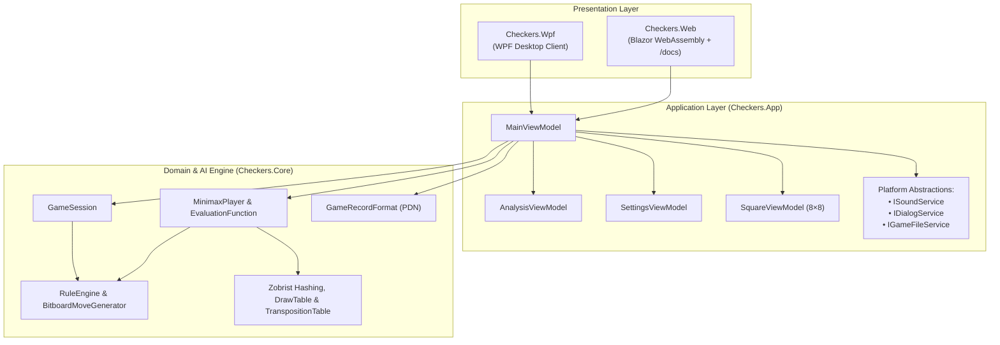

# 12 – App integration

[Back to the index](README.md)

## In short

The solution achieves strict separation of concerns by placing all game rules, bitboards, and AI search logic in `Checkers.Core`, while user interface state coordination and view models reside in the shared `Checkers.App` library.

Two client applications consume `Checkers.App`:
1. **`Checkers.Wpf`:** Native Windows desktop client targeting `.NET 10` (`net10.0-windows`).
2. **`Checkers.Web`:** Responsive Blazor WebAssembly client compiled Ahead-Of-Time (AOT) to WebAssembly and hosted statically (e.g., Azure Static Web Apps).

---

## Architectural layers



---

## Shared ViewModels (`Checkers.App`)

### `MainViewModel`
[`MainViewModel.cs`](../../src/Checkers.App/ViewModels/MainViewModel.cs) is the central coordinator for interactive gameplay:
* **Board State Synchronization:** Maintains an $8 \times 8$ array and observable `BoardSquares` collection of `SquareViewModel` instances bound to XAML/Razor templates.
* **Game Modes:** Supports `HumanVsHuman`, `HumanVsComputer`, and `ComputerVsComputer`.
* **Selection, Drag-and-Drop & Mandatory Capture Highlighting:** Intercepts square clicks and drag-and-drop gestures, computes legal destination squares, highlights pieces with mandatory captures, and executes legal moves.
* **Persistent Transposition Table & Game History Lifecycle:** Retains a single `TranspositionTable` instance across moves within a match (calling `NewSearch()` to increment the 8-bit generation age), passes `Session.StateHistory` Zobrist hashes into `GetMoveAsync` for `DrawTable` repetition detection, and clears/resizes the table when starting a new game or changing table capacity in Settings.
* **Undo/Redo & Chess Clocks:** Coordinates linear Undo/Redo stacks and refunds elapsed thinking time (`_timeLeftAtPly`) when moves are taken back in `TimePerGame` mode ([Chapter 09](09-time-control.md)).

### `AnalysisViewModel`
[`AnalysisViewModel.cs`](../../src/Checkers.App/ViewModels/AnalysisViewModel.cs) binds the real-time search telemetry panel:
* Observable properties: `Move`, `Depth`, `Value`, `BestMove`, `Nodes`, `Evaluations`, `Time`.
* **`Updated` Event:** Raises `public event Action? Updated;` whenever a new `SearchAnalysis` snapshot arrives so Blazor components can trigger `InvokeAsync(StateHasChanged)`.

### `SettingsViewModel`
[`SettingsViewModel.cs`](../../src/Checkers.App/ViewModels/SettingsViewModel.cs) backs the **Game -> Settings...** modal dialog:
* Rule variant selection: **International Draughts (Flying Kings)** vs. **English Checkers (1-Step Kings)**.
* Time control mode & sliders: **Fixed Depth** ($1\text{–}20$), **Time per Move** ($1\text{–}60\text{ s}$), and **Time per Game** ($1\text{–}60\text{ min}$).
* Transposition Table size selector: **$1,048,576$ ($16\text{ MiB}$)** up to **$16,777,216$ ($256\text{ MiB}$)** entries.

---

## Presentation layer comparison

| Feature | WPF Desktop (`Checkers.Wpf`) | Blazor WebAssembly (`Checkers.Web`) |
|---|---|---|
| **Runtime Model** | Multi-threaded CLR (`.NET 10`) | Single-threaded WebAssembly (`.NET 10` AOT) |
| **AI Search Execution** | Background ThreadPool (`Task.Run`) | Cooperative macrotask yielding (`await Task.Delay(1)`) |
| **Telemetry Marshaling** | `Dispatcher` via `Progress<SearchAnalysis>` | `BrowserSynchronizationContext` + `Analysis.Updated` |
| **File Save / Load** | Native `OpenFileDialog` / `SaveFileDialog` | Browser File API & Blob downloads (`fileService.js`) |
| **Audio Synthesis** | Procedural PCM wave synthesis (`SoundService`) | Web Audio / HTML5 audio interop (`checkers.playSound`) |
| **Documentation Viewer** | Links to documentation | Integrated `/docs` route (`BrainDocs.cs` + Markdig + KaTeX + Mermaid) |

---

## Desktop ThreadPool vs. WebAssembly Cooperative Yielding

```mermaid
sequenceDiagram
    autonumber
    participant UI as Browser Event Loop / Home.razor
    participant VM as MainViewModel / AnalysisViewModel
    participant AI as MinimaxPlayer (WASM Single Thread)

    UI->>VM: Human completes move → Trigger AI turn
    VM->>AI: GetMoveAsync(state, legalMoves, progress, ct, stateHashHistory)
    loop Iterative Deepening (d = 1 .. MaxDepth)
        AI->>AI: NegamaxBitboard search (d plies)
        AI->>VM: progress.Report(SearchAnalysis)
        AI->>UI: await Task.Delay(1, ct) [Yield macrotask]
        UI->>VM: BrowserSynchronizationContext dispatches Progress callback
        VM->>UI: Analysis.Updated fires → InvokeAsync(StateHasChanged)
        UI->>UI: Browser repaints DOM &amp; thinking progress bar (60 FPS)
        UI-->>AI: Resume C# continuation for depth d + 1
    end
    AI-->>VM: Return bestMoveOverall
    VM->>UI: Apply move &amp; update board
```

### Desktop WPF
In WPF, UI rendering runs on the main STA thread while `Task.Run` executes `MinimaxPlayer.GetMoveAsync` on a background ThreadPool worker. `Progress<SearchAnalysis>` automatically marshals callbacks onto the WPF `Dispatcher`, keeping animations and telemetry updates smooth at 60 FPS.

### Blazor WebAssembly
In standard WebAssembly, C# code shares the browser's single UI thread with the DOM renderer:
* If `MinimaxPlayer` ran synchronously without yielding, the browser could not process queued `Progress<T>` callbacks or repaint the screen until the entire search finished.
* By awaiting `Task.Delay(1, cancellationToken)` after each completed depth iteration and on $\ge 150\text{ ms}$ heartbeats, `MinimaxPlayer` yields a macrotask slice to the browser event loop. During that slice, `BrowserSynchronizationContext` invokes the pending `Progress<SearchAnalysis>` handler, `AnalysisViewModel.Updated` triggers `StateHasChanged()`, and the browser paints the updated depth, node count, and evaluation score in real time.

---

## Integrated Documentation Pipeline (`BrainDocs.cs`)

In `Checkers.Web`, the contents of `docs/brain/` (including Markdown chapters and `images/*.svg` diagrams) are copied into `wwwroot/content/brain/` during build (`CopyBrainDocs` target in `Checkers.Web.csproj`) and rendered dynamically at `/docs`:
1. **Chapter Discovery:** [`BrainDocs.cs`](../../src/Checkers.Web/Services/BrainDocs.cs) parses `README.md` and extracts all links matching `^\d\d-[a-z0-9-]+\.md$` to build the ordered sidebar Table of Contents and Previous/Next chapter navigation.
2. **Markdown to HTML:** Markdig (`UseAutoIdentifiers(AutoIdentifierOptions.GitHub)` + `UseAdvancedExtensions()`) compiles Markdown tables, code blocks, math spans (`$...$`, `$$...$$`), and `mermaid` fenced blocks into semantic HTML and rewrites relative image and chapter URLs.
3. **Client-Side Math & Diagrams:** [`docs.js`](../../src/Checkers.Web/wwwroot/js/docs.js) lazy-loads **KaTeX** to typeset LaTeX equations and **Mermaid.js** to render architectural flowcharts, sequence diagrams, and state machines.
