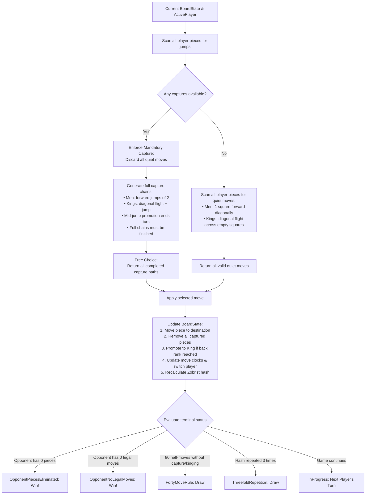

# The Checkers brain

Checkers (Draughts) is a strategic board game for two players played on an 8x8 grid with 12 pieces per side. The computer's "brain" is the engine library `Checkers.Core`, which evaluates legal moves, handles state transitions, and decides computer moves.

The engine implements **8x8 Draughts with International Flying Kings and English short captures**:
- **the board and coordinates**: 8x8 grid, playable dark square mathematics, standard Draughts 1–32 square notation, and 64-bit deterministic Zobrist hashing;
- **the rules and move generation**: forward diagonal quiet moves, short jump captures for regular men, multi-square sliding and long-distance jump captures for flying kings, strict mandatory captures with free choice among capture lines, and turn-ending promotion;
- **the game session**: atomic `Move` models, standard move notation (`11-15`, `29x18x4`), comprehensive Undo/Redo stacks, and terminal state evaluation (piece elimination, blocked opponent, 40-move rule, threefold repetition);
- **the evaluation & search** *(Phases 3–4)*: Minimax with Alpha-Beta pruning, move ordering, and quiescence search.

These documents explain how the engine works, how the mathematical concepts are implemented, and how the parts fit together.

---

## The brain on one page

This is how the engine determines legal moves and transitions game states:

---

## Chapters

| # | Chapter | Status | Content |
|---|---|---|---|
| 01 | [Overview](01-overview.md) | **Available** | Architecture, projects, main types, and the life of a move |
| 02 | [Board and coordinates](02-board-and-coordinates.md) | **Available** | 8x8 grid geometry, 1..32 Draughts notation, and Zobrist hashing |
| 03 | [Rules and move generation](03-rules-and-move-generation.md) | **Available** | Slides, short jumps, flying kings, multi-jumps, forced captures, promotion |
| 04 | [Game record](04-game-record.md) | **Available** | Move notation, GameSession coordinator, Undo/Redo, win and draw detection |
| 05 | [Evaluation](05-evaluation.md) | **Available** | Static heuristic scoring: material weights, center control, advancement |
| 06 | [Move ordering](06-move-ordering.md) | **Available** | Sorting captures, promotions, and multi-jumps for alpha-beta cutoffs |
| 07 | [Search](07-search.md) | **Available** | Minimax search, alpha-beta pruning, async execution, distance-to-mate |
| 08 | Transposition table | *Phase 4* | 64-bit Zobrist hash table, entry flags, and replacement policies |
| 09 | Endgame solver | *Phase 4* | Solved endgame databases / heuristics for small-piece positions |
| 10 | Time control | *Phase 4* | Soft and hard move timers, dynamic depth allocation |
| 11 | Opening book | *Phase 4* | Precalculated opening repertoire lookup |
| 12 | App integration | *Phase 2 & 5* | Game loop, background workers, WPF and Blazor WebAssembly integration |
| 13 | Glossary | *Upcoming* | Checkers and draughts terms used across these documents |
| 14 | References | *Upcoming* | Official rules, algorithmic literature, and source references |

---

## Reading paths

- **Engine Fundamentals & Rules:** Read chapters [01](01-overview.md), [02](02-board-and-coordinates.md), [03](03-rules-and-move-generation.md), and [04](04-game-record.md).
- **Game Application & UI Integration:** Read chapters [01](01-overview.md), [04](04-game-record.md), and [12](12-app-integration.md).
- **AI & Engine Search:** Read chapters [01](01-overview.md), [05](05-evaluation.md), [06](06-move-ordering.md), [07](07-search.md), and [08](08-transposition-table.md).
