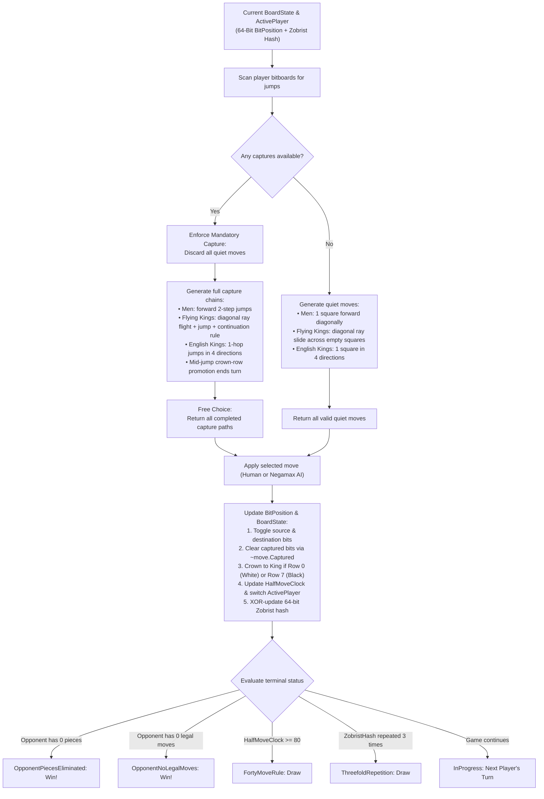
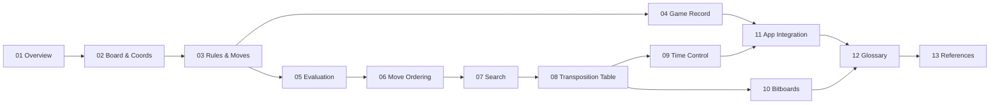

# The Checkers brain

Checkers (Draughts) is a strategic board game of perfect information for two players played on the 32 dark squares of an $8 \times 8$ grid with 12 pieces per side. The computer's "brain" is the engine library `Checkers.Core`, which models board state using 64-bit bitboards, generates legal moves, evaluates positions, and searches the game tree to decide computer moves.

The engine implements **8×8 Draughts with two selectable rule variants — International Draughts (Flying Kings) and English Checkers (1-Step Kings)**:
- **Board & coordinates**: $8 \times 8$ grid geometry, playable dark-square parity $(\text{Row} + \text{Col}) \bmod 2 = 1$, standard Draughts 1–32 square notation, 64-bit bitboards (`4 × ulong`), and deterministic 64-bit Zobrist hashing;
- **Rules & move generation**: forward diagonal slides and short jumps for regular men, multi-square diagonal flight and long-distance jump captures with mandatory continuation for International flying kings, 4-direction single-step moves and jumps for English kings, strict mandatory captures with free choice among capture lines, and turn-ending crown-row promotion;
- **Game session & persistence**: atomic `Move` records, standard algebraic Draughts notation (`11-15`, `29x18x4`), `GameSession` state machine with Undo/Redo stacks, terminal condition evaluation (piece elimination, blocked opponent, 40-move rule, threefold repetition), and Portable Draughts Notation (PDN) save/load persistence;
- **Evaluation, search & transposition caching**: hardware `POPCNT`-accelerated static heuristic evaluation, in-place move ordering, Negamax with Alpha-Beta pruning, quiescence search, iterative deepening, configurable power-of-two 64-bit Zobrist transposition tables ($1,048,576$ to $16,777,216$ entries), and live search telemetry in both WPF desktop and Blazor WebAssembly;
- **Time control**: Settings dialog supporting Fixed Depth ($1\text{–}20$ plies), Time per Move ($1\text{–}60\text{ s}$), and Time per Game ($1\text{–}60\text{ min}$) with soft/hard time budgets, dynamic piece-count clock allocation, and Undo time refunds.

These documents explain how the engine works, how the mathematical and bitwise concepts are implemented, and how the parts fit together from introduction to references.

---

## The brain on one page

This is how the engine determines legal moves, searches for optimal play, and transitions game states:

---

## Chapters

The documentation is organized in a logical progression from architectural overview and board fundamentals, through rules, AI evaluation, search, and bitboard optimization, to UI integration, glossary, and academic references:

| # | Chapter | Section | Content |
|---|---|---|---|
| 01 | [Overview](01-overview.md) | **Introduction** | Clean Architecture, projects, main engine types, rule variants, and the life of a move |
| 02 | [Board and coordinates](02-board-and-coordinates.md) | **Foundations** | $8 \times 8$ grid geometry, $1\dots 32$ Draughts notation, initial setup, and 64-bit Zobrist hashing |
| 03 | [Rules and move generation](03-rules-and-move-generation.md) | **Foundations** | Men slides/jumps, English 1-step kings, International flying kings, continuation rule, mandatory captures, promotion |
| 04 | [Game record](04-game-record.md) | **Foundations** | Move notation, `GameSession` state machine, Undo/Redo stacks, win/draw detection, and PDN persistence |
| 05 | [Evaluation](05-evaluation.md) | **AI & Search** | Static heuristic scoring: material weights, rank advancement, center control, king centralization, back-rank defense |
| 06 | [Move ordering](06-move-ordering.md) | **AI & Search** | Alpha-Beta pruning efficiency, TT hash move, capture/promotion priority keys, in-place insertion sort, root PV ordering |
| 07 | [Search](07-search.md) | **AI & Search** | Negamax Alpha-Beta pruning, Quiescence search, Iterative Deepening, Distance-to-Mate, async yielding, live telemetry |
| 08 | [Transposition table](08-transposition-table.md) | **AI & Search** | 16-byte cache-aligned Zobrist table, bound flags, replacement strategy, and 40-position empirical benchmarks ($1\text{M}$ vs $16\text{M}$) |
| 09 | [Time control](09-time-control.md) | **AI & Search** | Fixed Depth, Time per Move, Time per Game, soft/hard time budgets, dynamic piece-count allocation, Undo clock refunds |
| 10 | [Bitboards](10-bitboards.md) | **Optimization** | 64-bit bitboard representation (`4 × ulong`), shift/mask & ray-scan move generation, `POPCNT` evaluation, copy-make search, and 65× speedup benchmarks |
| 11 | [App integration](11-app-integration.md) | **Architecture** | Shared MVVM ViewModels, WPF desktop ThreadPool vs. Blazor WebAssembly AOT macrotask yielding, live analysis pipeline |
| 12 | [Glossary](12-glossary.md) | **Reference** | Definitions and cross-references for all Checkers, Draughts, Bitboard, and AI search terms |
| 13 | [References](13-references.md) | **Reference** | Official WCDF/FMJD rulesets, foundational AI search literature, and .NET 10 technical references |

---

## Reading paths

- **Engine Fundamentals & Rules:** Read chapters [01](01-overview.md), [02](02-board-and-coordinates.md), [03](03-rules-and-move-generation.md), and [04](04-game-record.md).
- **AI Search & Bitboard Optimization:** Read chapters [05](05-evaluation.md), [06](06-move-ordering.md), [07](07-search.md), [08](08-transposition-table.md), [09](09-time-control.md), and [10](10-bitboards.md).
- **Game Application & UI Integration:** Read chapters [01](01-overview.md), [04](04-game-record.md), and [11](11-app-integration.md).
- **Terminology & Academic Literature:** Check chapters [12](12-glossary.md) and [13](13-references.md).
