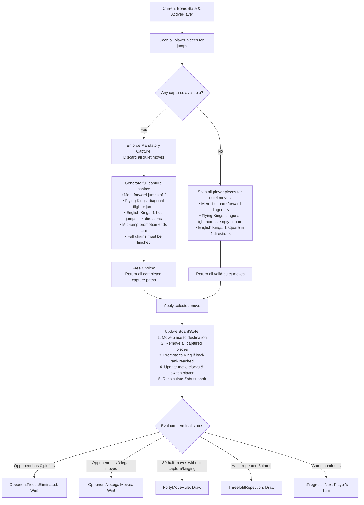

# The Checkers brain

Checkers (Draughts) is a strategic board game for two players played on an 8x8 grid with 12 pieces per side. The computer's "brain" is the engine library `Checkers.Core`, which evaluates legal moves, handles state transitions, and decides computer moves.

The engine implements **8x8 Draughts with selectable variants: International Draughts (Flying Kings) and English Checkers (1-Step Kings)**:
- **the board and coordinates**: 8x8 grid, playable dark square mathematics, standard Draughts 1–32 square notation, and 64-bit deterministic Zobrist hashing;
- **the rules and move generation**: forward diagonal quiet moves, short jump captures for regular men, multi-square sliding and long-distance jump captures for flying kings, single-hop 4-direction jumps for English kings, strict mandatory captures with free choice among capture lines, and turn-ending promotion;
- **the game session & persistence**: atomic `Move` models, standard move notation (`11-15`, `29x18x4`), comprehensive Undo/Redo stacks, terminal state evaluation (piece elimination, blocked opponent, 40-move rule, threefold repetition), and PDN save/load file persistence;
- **the evaluation & search**: Minimax with Alpha-Beta pruning, iterative deepening, PV move ordering, 64-bit Zobrist transposition table, quiescence search, and live search telemetry streaming in both WPF desktop and Blazor WebAssembly;
- **the time control**: Settings dialog with Fixed Depth (1–20 plies), Time per Move (1–60s), and Time per Game (1–60m) with live chess clock countdown and undo refunds.

These documents explain how the engine works, how the mathematical concepts are implemented, and how the parts fit together.

---

## The brain on one page

This is how the engine determines legal moves and transitions game states:

---

## Chapters

| # | Chapter | Status | Content |
|---|---|---|---|
| 01 | [Overview](01-overview.md) | **Available** | Architecture, projects, main types, variants, and the life of a move |
| 02 | [Board and coordinates](02-board-and-coordinates.md) | **Available** | 8x8 grid geometry, 1..32 Draughts notation, and Zobrist hashing |
| 03 | [Rules and move generation](03-rules-and-move-generation.md) | **Available** | Slides, short jumps, flying kings, English kings, multi-jumps, forced captures, promotion |
| 04 | [Game record](04-game-record.md) | **Available** | Move notation, GameSession coordinator, Undo/Redo, win/draw detection, and PDN persistence |
| 05 | [Evaluation](05-evaluation.md) | **Available** | Static heuristic scoring: material weights, advancement, center control, king centralization |
| 06 | [Move ordering](06-move-ordering.md) | **Available** | Hash moves (TT), multi-jumps, promotions, and PV move ordering |
| 07 | [Search](07-search.md) | **Available** | Minimax, alpha-beta pruning, iterative deepening, async execution, distance-to-mate, live telemetry |
| 08 | [Transposition table](08-transposition-table.md) | **Available** | 64-bit Zobrist hash table, entry flags, and 40-position empirical benchmark |
| 09 | Endgame solver | *Upcoming* | Solved endgame databases / heuristics for small-piece positions |
| 10 | [Time control](10-time-control.md) | **Available** | Soft and hard move timers, dynamic depth allocation, chess clocks, Settings modal |
| 11 | Opening book | *Upcoming* | Precalculated opening repertoire lookup |
| 12 | [App integration](12-app-integration.md) | **Available** | Shared ViewModels, WPF desktop, Blazor WebAssembly, cooperative search yielding, live analysis |
| 13 | [Glossary](13-glossary.md) | **Available** | Checkers and draughts terms used across these documents |
| 14 | [References](14-references.md) | **Available** | Official rules, algorithmic literature, and source references |

---

## Reading paths

- **Engine Fundamentals & Rules:** Read chapters [01](01-overview.md), [02](02-board-and-coordinates.md), [03](03-rules-and-move-generation.md), and [04](04-game-record.md).
- **Game Application & UI Integration:** Read chapters [01](01-overview.md), [04](04-game-record.md), and [12](12-app-integration.md).
- **AI & Engine Search:** Read chapters [01](01-overview.md), [05](05-evaluation.md), [06](06-move-ordering.md), [07](07-search.md), [08](08-transposition-table.md), and [10](10-time-control.md).
- **Reference & Vocabulary:** Check chapters [13](13-glossary.md) and [14](14-references.md).
