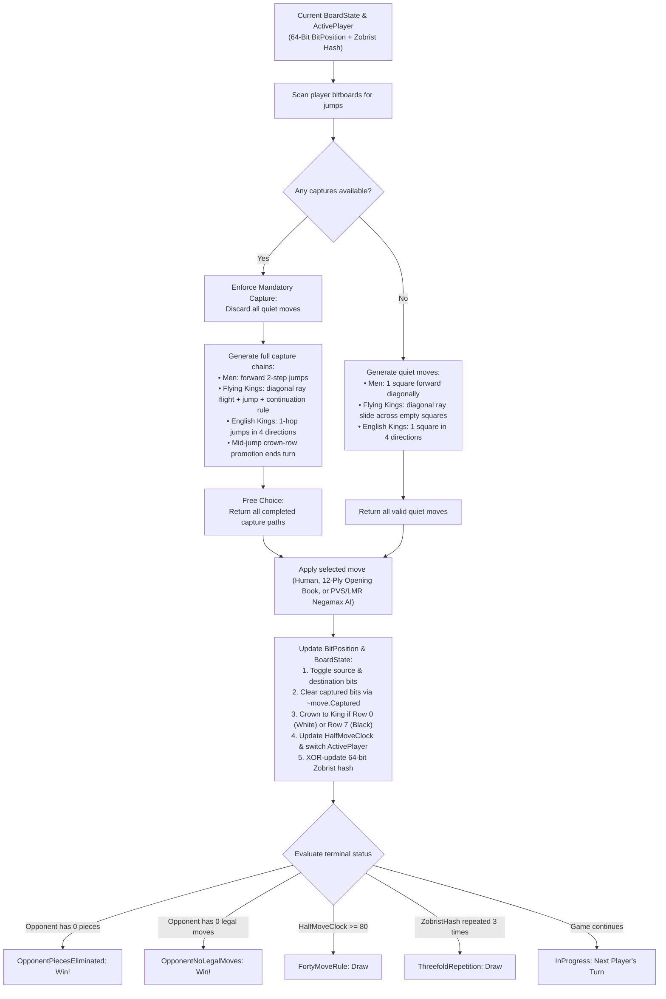
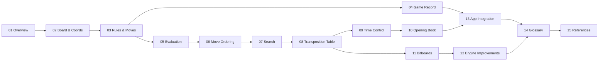

# The Checkers brain

Checkers (Draughts) is a strategic board game of perfect information for two players played on the 32 dark squares of an $8 \times 8$ grid with 12 pieces per side. The computer's "brain" is the engine library `Checkers.Core`, which models board state using 64-bit bitboards, generates legal moves, evaluates positions, and searches the game tree to decide computer moves.

The engine implements **8×8 Draughts with two selectable rule variants — International Draughts (Flying Kings) and English Checkers (1-Step Kings)**:
- **Board & coordinates**: $8 \times 8$ grid geometry, playable dark-square parity $(\text{Row} + \text{Col}) \bmod 2 = 1$, standard Draughts 1–32 square notation, 64-bit bitboards (`4 × ulong`), and deterministic 64-bit Zobrist hashing;
- **Rules & move generation**: forward diagonal slides and short jumps for regular men, multi-square diagonal flight and long-distance jump captures with mandatory continuation for International flying kings, 4-direction single-step moves and jumps for English kings, strict mandatory captures with free choice among capture lines, and turn-ending crown-row promotion;
- **Game session & persistence**: atomic `Move` records, standard algebraic Draughts notation (`11-15`, `29x18x4`), `GameSession` state machine with Undo/Redo stacks, terminal condition evaluation (piece elimination, blocked opponent, 40-move rule, threefold repetition), and Portable Draughts Notation (PDN) save/load persistence;
- **Evaluation, search, opening book & transposition caching**: hardware `POPCNT`-accelerated static heuristic evaluation (`board_eval.c` $2\times$ port for English Checkers + Flying Kings adaptation for International Draughts), embedded 12-ply Drop-Out Expansion (DOE) opening books (`32,369` English / `26,367` International positions), 7-tier move ordering (TT hash move, captures, promotions, 2-slot Killer moves, depth-squared History heuristic), Negamax Alpha-Beta with Principal Variation Search (PVS), in-search `DrawTable` repetition detection, Reverse Futility Pruning (RFP), Futility Pruning (FP), two-stage Verified Late Move Reductions (LMR), quiescence search, iterative deepening, configurable 4-way set-associative 64-byte cache-line Zobrist transposition tables ($1,048,576$ to $16,777,216$ entries) with `Sse.Prefetch0` hardware prefetching, and live search telemetry in both WPF desktop and Blazor WebAssembly;
- **Time control & settings**: Settings dialog supporting Fixed Depth ($1\text{–}20$ plies), Time per Move ($1\text{–}60\text{ s}$), and Time per Game ($1\text{–}60\text{ min}$) with soft/hard time budgets, dynamic piece-count clock allocation, Undo time refunds, and Opening Book toggle.

Several core AI subsystems—including the 64-bit bitboard layout, 16-byte 4-way cache-line transposition table (`hash_table.c`), `DrawTable` repetition guard (`draw_table.c`), 16-bit packed killer/history move ordering (`killer_table.c`), PVS + Verified LMR/RFP/FP selective pruning (`board_search.c`), partial-iteration root adoption, and the `POPCNT`-vectorized English static evaluation (`board_eval.c`)—were inspired by and adapted from Collin Kees's open-source C engine [**Checkers-Engine (Marcher Engine)**](https://github.com/Stermere/Checkers-Engine) (included locally in [`Checkers-Engine-main/`](../../Checkers-Engine-main/)).

These documents explain how the engine works, how the mathematical and bitwise concepts are implemented, and how the parts fit together from introduction to references.

---

## The brain on one page

This is how the engine determines legal moves, searches for optimal play, and transitions game states:

---

## Chapters

The documentation is organized in a logical progression from architectural overview and board fundamentals, through rules, AI evaluation, search, transposition table caching, opening book construction, bitboard optimization, and empirical development benchmarks, to UI integration, glossary, and academic references:

| # | Chapter | Section | Content |
|---|---|---|---|
| 01 | [Overview](01-overview.md) | **Introduction** | Clean Architecture, projects, main engine types, rule variants, and the life of a move |
| 02 | [Board and coordinates](02-board-and-coordinates.md) | **Foundations** | $8 \times 8$ grid geometry, $1\dots 32$ Draughts notation, initial setup, and 64-bit Zobrist hashing |
| 03 | [Rules and move generation](03-rules-and-move-generation.md) | **Foundations** | Men slides/jumps, English 1-step kings, International flying kings, continuation rule, mandatory captures, promotion |
| 04 | [Game record](04-game-record.md) | **Foundations** | Move notation, `GameSession` state machine, Undo/Redo stacks, win/draw detection, and PDN persistence |
| 05 | [Evaluation](05-evaluation.md) | **AI & Search** | Hardware `POPCNT` static evaluation: `board_eval.c` $2\times$ port (English) & Flying Kings adaptation, PSTs, runaway cones, tail pins, and structural patterns |
| 06 | [Move ordering](06-move-ordering.md) | **AI & Search** | 7-tier priority spectrum (TT hash move, captures, promotions, 2-slot Killers, depth-squared History), `stackalloc` pre-scoring |
| 07 | [Search](07-search.md) | **AI & Search** | Negamax Alpha-Beta, Stage A Exact (PVS, `DrawTable`) & Stage B Selective (Verified LMR, RFP, FP), Quiescence, Iterative Deepening |
| 08 | [Transposition table](08-transposition-table.md) | **AI & Search** | 4-way set-associative 64-byte cache-line buckets, 16-byte entry with `StaticEval`, Pinned Object Heap + `Sse.Prefetch0` |
| 09 | [Time control](09-time-control.md) | **AI & Search** | Fixed Depth, Time per Move, Time per Game, soft/hard time budgets, dynamic piece-count allocation, Undo clock refunds |
| 10 | [Opening book](10-opening-book.md) | **AI & Search** | Full-width early plies (`lv 0..3`), Drop-Out Expansion (`lv 4..12`), Negamax back-up, and embedded 12-ply English & International books |
| 11 | [Bitboards](11-bitboards.md) | **Optimization** | 64-bit bitboard representation (`4 × ulong`), $O(1)$ `HasAnyCapture`, ray fast-rejection guards, `POPCNT` evaluation, copy-make search |
| 12 | [Engine improvements during development](12-engine-improvements.md) | **Optimization** | Complete chronological milestones (Bitboard refactor & Phases 1–7) with 40-position deep, timed, self-play, and opening book benchmarks |
| 13 | [App integration](13-app-integration.md) | **Architecture** | Shared MVVM ViewModels, WPF desktop ThreadPool vs. Blazor WebAssembly AOT macrotask yielding, live analysis pipeline |
| 14 | [Glossary](14-glossary.md) | **Reference** | Definitions and cross-references for all Checkers, Draughts, Bitboard, and AI search terms |
| 15 | [References](15-references.md) | **Reference** | Official WCDF/FMJD rulesets, foundational AI search literature, and .NET 10 technical references |

---

## Reading paths

- **Engine Fundamentals & Rules:** Read chapters [01](01-overview.md), [02](02-board-and-coordinates.md), [03](03-rules-and-move-generation.md), and [04](04-game-record.md).
- **AI Search, Opening Book, Bitboards & Development Benchmarks:** Read chapters [05](05-evaluation.md), [06](06-move-ordering.md), [07](07-search.md), [08](08-transposition-table.md), [09](09-time-control.md), [10](10-opening-book.md), [11](11-bitboards.md), and [12](12-engine-improvements.md).
- **Game Application & UI Integration:** Read chapters [01](01-overview.md), [04](04-game-record.md), and [13](13-app-integration.md).
- **Terminology & Academic Literature:** Check chapters [14](14-glossary.md) and [15](15-references.md).
