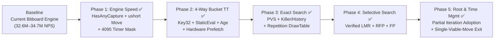

# Engine Improvements Implementation Plan (Phased Roadmap)

## Plan Status & Phase Overview

You can request implementation of this plan **one phase at a time** (e.g., *"Implement Phase 1"*, *"Proceed with Phase 2"*, etc.) or multiple phases together. After each phase, we will update the status table below, run the 5-position benchmark suite, and record the cumulative metrics in [`docs/brain/12-benchmarks-and-experiments.md`](file:///c:/Udvikling/Spil/Checkers/docs/brain/12-benchmarks-and-experiments.md).

| Phase | Area | Scope & Deliverables | Exact vs. Selective | Status |
| :--- | :--- | :--- | :---: | :---: |
| **Phase 1** | **Engine Speed** | Set-wise $O(1)$ `HasAnyCapture` fast-path (in `Quiescence`), Flying King ray fast-rejection, packed `ushort` move ID, `4095` timer check mask | Exact | ✅ Completed |
| **Phase 2** | **Transposition Table** | 4-way 64B cache-line buckets, 16B entry with `Key32` + `short Score` + `short StaticEval` + `byte Age`, `Sse.Prefetch0`, multi-turn persistence | Exact | ✅ Completed |
| **Phase 3** | **Search (Stage A: Exact)** | Principal Variation Search (PVS), Killer Moves (2/ply), History Heuristic (`[2][64][64]`), pre-scored sort, In-Search Repetition `DrawTable` | Exact | ✅ Completed |
| **Phase 4** | **Search (Stage B: Selective)** | Verified Late Move Reductions (LMR), Reverse Futility Pruning (RFP), Futility Pruning (FP) | Selective | ✅ Completed |
| **Phase 5** | **Other (Root & Time Management)** | Partial-iteration root move adoption on timeout, early root termination when 1 move clearly dominates | Sound | ✅ Completed |

> [!NOTE]
> **Deferred to Later Separate Tasks:** Static evaluation / NNUE upgrades (explicitly out of scope per [`Possible engine improvements.md`](file:///c:/Udvikling/Spil/Checkers/Possible%20engine%20improvements.md)) and Opening Book / Endgame Tablebases.

---

## Detailed Phase Breakdown

---

### Phase 1: Improvements to Engine Speed (Move Generation & Data Structures)
**Status:** ✅ Completed  
**Goal:** Increase raw nodes/second (NPS) without changing the search tree or node counts.

#### Checklist
- [x] **1.1 Set-Wise $O(1)$ `HasAnyCapture(in BitPosition, CheckersVariant)` Fast-Path & Flying King Ray Fast-Rejection** ([`BitboardMoveGenerator.cs`](file:///c:/Udvikling/Spil/Checkers/src/Checkers.Core/Bitboards/BitboardMoveGenerator.cs))
  - Added `HasAnyCapture` using 4 bitwise shift-and-mask expressions across all pieces simultaneously plus Flying King ray checks.
  - Added fast ray rejection (`(ray & unjumpedEnemy) == 0UL` and `BitboardMasks.StepTarget` landing pre-check) in `FindFlyingKingCapturesBit` and `HasFlyingKingCaptureFrom`.
  - Used `HasAnyCapture` in `MinimaxPlayer.Quiescence` to immediately return `standPat` on quiet leaf nodes, and eliminated redundant `HasAnyLegalMove` calls on interior nodes (`depth > 0`) and on the initial `depth == 0` entry into `Quiescence`.
- [x] **1.2 Packed `ushort` Move Identifier** ([`BitMove.cs`](file:///c:/Udvikling/Spil/Checkers/src/Checkers.Core/Bitboards/BitMove.cs))
  - Added `public ushort PackedMove => (ushort)((From << 8) | To);` so move matching in TT and Killer tables uses a single 16-bit integer equality check.
- [x] **1.3 Wider Power-of-Two Timer Check Mask (`4095`)** ([`MinimaxPlayer.cs`](file:///c:/Udvikling/Spil/Checkers/src/Checkers.Core/AI/MinimaxPlayer.cs))
  - Widened `(NodesEvaluated & 1023) == 0` to `(NodesEvaluated & 4095) == 0` and raised timed mode `maxTargetDepth` from `20` to `48`.
- [x] **1.4 Phase 1 Verification, Benchmark & Documentation**
  - All 136 unit tests pass (`dotnet test -c Release`).
  - **40-Position Deep Fixed-Depth Benchmark:** 100% node equivalence (`40/40` positions in both International and English); throughput increased to **32.83M/s** (International No-TT), **16.30M/s (+6.2%)** (International 1M TT), **36.66M/s (+2.9%)** (English No-TT), and **17.34M/s (+10.9%)** (English 1M TT).
  - **5-Position 5.0s Timed Benchmark (International, 16M TT):** `Pos #13 (Middlegame)` gained **+1 ply** (`16 → 17 plies`) and `Pos #32 (Endgame)` completed 20 plies `601 ms` faster (`4,912 ms → 4,311 ms`). Recorded in [`docs/brain/10-bitboards.md`](file:///c:/Udvikling/Spil/Checkers/docs/brain/10-bitboards.md) and [`docs/brain/11-engine-improvements.md`](file:///c:/Udvikling/Spil/Checkers/docs/brain/11-engine-improvements.md).

---

### Phase 2: Improvements to Transposition Table Management (More Compact, Faster)
**Status:** ✅ Completed  
**Goal:** Eliminate direct-mapped index collisions using 64-byte cache-line 4-way buckets, cache `StaticEval` inside the 16-byte entry, add hardware cache prefetching, and enable multi-turn TT persistence.

#### Checklist
- [x] **2.1 Compact 16-Byte `TranspositionEntry` Layout with `StaticEval` & `Age`** ([`TranspositionTable.cs`](file:///c:/Udvikling/Spil/Checkers/src/Checkers.Core/AI/TranspositionTable.cs))
  - Adjusted `WinScore = 30,000`, `LossScore = -30,000`, and `WinThreshold = 28,000` in [`MinimaxPlayer.cs`](file:///c:/Udvikling/Spil/Checkers/src/Checkers.Core/AI/MinimaxPlayer.cs) so all search and mate scores fit cleanly in `short` (`int16`).
  - Packed the 16-byte `TranspositionEntry` with `uint Key32` (upper 32 bits of Zobrist hash), `short Score`, `short StaticEval` (`NoEval = 32_767` sentinel), `ushort BestMove` (`(From << 8) | To`), `sbyte Depth`, `byte Age`, `byte Flags` (`Bound` in low 2 bits + `HasMove` flag in bit 2), and 3 explicit alignment bytes.
- [x] **2.2 4-Way Set-Associative Cache-Line Buckets (`BucketSize = 4`)** ([`TranspositionTable.cs`](file:///c:/Udvikling/Spil/Checkers/src/Checkers.Core/AI/TranspositionTable.cs))
  - Grouped entries into `numBuckets = entryCount / 4` buckets of 4 contiguous entries (64 bytes per bucket = 1 CPU cache line), allocated on the .NET Pinned Object Heap (`GC.AllocateArray<TranspositionEntry>(count, pinned: true)`).
  - Implemented `TryProbe` and `Store` overloads operating directly on `ushort bestPackedMove` and `int staticEval`, using Age + Depth + Exact-Bound victim selection (`priority = slot.Depth - (staleness << 3) + (slot.Bound == Exact ? 4 : 0)`).
- [x] **2.3 Hardware Cache Prefetching (`Sse.Prefetch0`)** ([`TranspositionTable.cs`](file:///c:/Udvikling/Spil/Checkers/src/Checkers.Core/AI/TranspositionTable.cs), [`MinimaxPlayer.cs`](file:///c:/Udvikling/Spil/Checkers/src/Checkers.Core/AI/MinimaxPlayer.cs))
  - Added `[MethodImpl(MethodImplOptions.AggressiveInlining)] public unsafe void Prefetch(ulong key)` using `Sse.Prefetch0` and invoked it immediately after `BitPosition nextPos = pos.Apply(in move)` in `MinimaxPlayer.Negamax`.
- [x] **2.4 Multi-Turn TT Persistence in Normal Gameplay** ([`MinimaxPlayer.cs`](file:///c:/Udvikling/Spil/Checkers/src/Checkers.Core/AI/MinimaxPlayer.cs), [`MainViewModel.cs`](file:///c:/Udvikling/Spil/Checkers/src/Checkers.App/ViewModels/MainViewModel.cs))
  - Enabled multi-turn TT persistence via `TranspositionTable.NewSearch()` at the start of `ChooseMove`, while clearing the TT on `StartNewGame()`, when `Settings.Variant` changes in `MainViewModel.OnSettingsChanging`, or between isolated benchmark runs.
- [x] **2.5 Phase 2 Verification, Benchmark & Documentation**
  - All 139 unit tests pass (`99` in `Checkers.Core.Tests` + `40` in `Checkers.App.Tests`), including 3 new tests for 4-way bucket residency, victim eviction, and `StaticEval` caching.
  - **40-Position Deep Fixed-Depth Benchmark:** Index collisions dropped by **99.91%–100%** (`141,091 → 120` in International 1M TT, `9,175 → 0` in International 16M TT, `121,868 → 78` in English 1M TT, `7,915 → 0` in English 16M TT); English 1M TT node count dropped from `9,974,305 → 9,944,217` (matching the 256 MiB 16M TT exactly!); and TT search throughput reached **17.18M/s** (International 1M TT, **+11.9% faster than Phase 0**) and **17.85M/s** (English 1M TT, **+14.2% faster than Phase 0**).
  - **5-Position 5.0s Timed Benchmark (International, 16M TT):** `Pos #32 (Endgame)` completed 20 plies in **`4,145 ms`** (`13.04M/s`, down from `4,912 ms` in Phase 0 and `4,311 ms` in Phase 1). Documented in [`docs/brain/08-transposition-table.md`](file:///c:/Udvikling/Spil/Checkers/docs/brain/08-transposition-table.md) and [`docs/brain/11-engine-improvements.md`](file:///c:/Udvikling/Spil/Checkers/docs/brain/11-engine-improvements.md).

---

### Phase 3: Improvements to the Search — Stage A: Exact Node Reduction
**Status:** ✅ Completed  
**Goal:** Drastically reduce the number of searched nodes while preserving **exact** minimax evaluations, and make the engine aware of repetition draws inside the search tree.

#### Checklist
- [x] **3.1 Killer Move Heuristic (2 per Ply) + History Heuristic (`[2][64][64]`) + Pre-Scored Sort** ([`MinimaxPlayer.cs`](file:///c:/Udvikling/Spil/Checkers/src/Checkers.Core/AI/MinimaxPlayer.cs))
  - Added `ushort _killers[MaxPly * 2]` and `int _history[2 * 64 * 64]` (`[sideToMove][from][to]`), updated on quiet $\beta$-cutoffs (`+ depth * depth`, clamped to `70,000`).
  - Implemented single-pass pre-scoring into `Span<int> scores = stackalloc int[count]` (`TT = 10M`, `Captures = 1M+`, `Promotions = 500k`, `Killer 1 = 90k`, `Killer 2 = 80k`, `History = 0..70k`) followed by in-place insertion sort.
- [x] **3.2 Principal Variation Search (PVS / Null-Window Search)** ([`MinimaxPlayer.cs`](file:///c:/Udvikling/Spil/Checkers/src/Checkers.Core/AI/MinimaxPlayer.cs))
  - At `ply > 0`, move $i = 0$ is searched with the full window `(-beta, -alpha)` and subsequent moves ($i > 0$, when `beta > alpha + 1`) are searched first with a zero-width window `(-alpha - 1, -alpha)`, re-searching with `(-beta, -alpha)` only when `score > alpha && score < beta`.
- [x] **3.3 In-Search Repetition Detection (`DrawTable`)** ([`DrawTable.cs`](file:///c:/Udvikling/Spil/Checkers/src/Checkers.Core/AI/DrawTable.cs), [`MinimaxPlayer.cs`](file:///c:/Udvikling/Spil/Checkers/src/Checkers.Core/AI/MinimaxPlayer.cs), [`IPlayer.cs`](file:///c:/Udvikling/Spil/Checkers/src/Checkers.Core/AI/IPlayer.cs), [`MainViewModel.cs`](file:///c:/Udvikling/Spil/Checkers/src/Checkers.App/ViewModels/MainViewModel.cs))
  - Created [`DrawTable`](file:///c:/Udvikling/Spil/Checkers/src/Checkers.Core/AI/DrawTable.cs) tracking active search path hashes and pre-root game history (`_twoFoldHashes` and `_oneFoldHashes`), checked at `ply > 0` before probing the TT.
- [x] **3.4 Phase 3 Verification, Benchmark & Documentation**
  - All **142 unit tests** pass (`102` in `Checkers.Core.Tests` + `40` in `Checkers.App.Tests`), including 3 new tests for `DrawTable` path/history repetition, winning repetition avoidance, and losing repetition seeking.
  - **40-Position Deep Fixed-Depth Benchmark:** Nodes dropped by **-64.58%** (International No-TT: `95.81M → 33.93M`, `2,951 ms → 1,367 ms`), **-28.48%** (International 1M TT: `10.96M → 7.84M`, `714 ms → 548 ms`), **-64.86%** (English No-TT: `94.11M → 33.07M`, `2,641 ms → 1,124 ms`), and **-26.56%** (English 1M TT: `9.97M → 7.32M`, `638 ms → 447 ms`).
  - **5-Position 5.0s Timed Benchmark (International, 16M TT):** Reached **+1 ply deeper** on `Pos #1 (Opening)` (`17 → 18 plies`), **+2 plies deeper** on `Pos #20 (Middlegame)` (`18 → 20 plies`), and **+1 ply deeper** on `Pos #40 (Blockade/Tension)` (`18 → 19 plies` in `4,032 ms`). Documented in [`docs/brain/06-move-ordering.md`](file:///c:/Udvikling/Spil/Checkers/docs/brain/06-move-ordering.md), [`docs/brain/07-search.md`](file:///c:/Udvikling/Spil/Checkers/docs/brain/07-search.md), and [`docs/brain/11-engine-improvements.md`](file:///c:/Udvikling/Spil/Checkers/docs/brain/11-engine-improvements.md).

---

### Phase 4: Improvements to the Search — Stage B: Selective Pruning & Reductions
**Status:** ✅ Completed  
**Goal:** Add empirically validated selective reductions and forward pruning from [`board_search.c`](file:///c:/Udvikling/Spil/Checkers/Checkers-Engine-main/src/engine/board_search.c) to reach +1 to +5 plies deeper in timed searches.

#### Checklist
- [x] **4.1 Verified Late Move Reductions (LMR)** ([`MinimaxPlayer.cs`](file:///c:/Udvikling/Spil/Checkers/src/Checkers.Core/AI/MinimaxPlayer.cs))
  - For quiet moves (`!isCapture && !isPromotion`) at `depth >= 3`, `ply >= 2`, and move index `i >= 3` where `!BitboardMoveGenerator.HasAnyCapture(in nextPos, _variant)`, reduces the initial null-window search by $R = \min(d - 2,\, 1 + [i \ge 8])$, verifying at full depth `depth - 1` whenever the reduced search beats $\alpha$.
- [x] **4.2 Reverse Futility Pruning (RFP)** ([`MinimaxPlayer.cs`](file:///c:/Udvikling/Spil/Checkers/src/Checkers.Core/AI/MinimaxPlayer.cs))
  - At non-PV quiet nodes (`beta <= alpha + 1`, `depth <= 6`, `!isCaptureNode`) with non-mate bounds and no opponent capture available, returns `cachedStaticEval` immediately when `cachedStaticEval - 40 * depth >= beta`.
- [x] **4.3 Futility Pruning (FP)** ([`MinimaxPlayer.cs`](file:///c:/Udvikling/Spil/Checkers/src/Checkers.Core/AI/MinimaxPlayer.cs))
  - At non-PV quiet nodes (`beta <= alpha + 1`, `depth <= 3`, `!isCaptureNode`) where `cachedStaticEval + 60 * depth <= alpha`, skips subsequent ($i > 0$) quiet non-promoting moves that do not leave a tactical capture.
- [x] **4.4 Phase 4 Verification, Benchmark & Documentation**
  - All **143 unit tests** pass (`103` in `Checkers.Core.Tests` + `40` in `Checkers.App.Tests`).
  - **40-Position Deep Fixed-Depth Benchmark:** Nodes dropped by **-92.98%** (International No-TT: `95.81M → 6.73M`, `2,951 ms → 458 ms`, **6.44x faster**), **-78.57%** (International 1M TT: `10.96M → 2.35M`, `714 ms → 246 ms`, **2.90x faster**, `0` collisions), **-93.71%** (English No-TT: `94.11M → 5.92M`, `2,641 ms → 302 ms`, **8.75x faster**), and **-79.11%** (English 1M TT: `9.97M → 2.08M`, `638 ms → 173 ms`, **3.69x faster**, `0` collisions).
  - **5-Position 5.0s Timed Benchmark (International, 16M TT):** Reached **21 plies (+4 vs P0, +3 vs P3)** on `Pos #1 (Opening)`, **21 plies (+5 vs P0, +4 vs P3)** on `Pos #13 (Middlegame)`, **22 plies (+4 vs P0, +2 vs P3)** on `Pos #20 (Middlegame)`, **25 plies (+5 vs P0 & P3)** on `Pos #32 (Endgame)`, and **22 plies (`+Win in 23 plies` solved in `2,151 ms`)** on `Pos #40 (Blockade/Tension)`. Documented in [`docs/brain/07-search.md`](file:///c:/Udvikling/Spil/Checkers/docs/brain/07-search.md) and [`docs/brain/11-engine-improvements.md`](file:///c:/Udvikling/Spil/Checkers/docs/brain/11-engine-improvements.md).

---

### Phase 5: Other Improvements (Root Search & Time Management)
**Status:** ✅ Completed  
**Goal:** Salvage partial root iterations when a timed search hits the clock limit and finish early when one move clearly dominates.

#### Checklist
- [x] **5.1 Partial-Iteration Root Move Adoption on Timeout** ([`MinimaxPlayer.cs`](file:///c:/Udvikling/Spil/Checkers/src/Checkers.Core/AI/MinimaxPlayer.cs))
  - Because `currentOrder[0]` is always the previous iteration's best move, as soon as root move `i == 0` completes cleanly at depth $d$ (or a subsequent root move `i > 0` completes cleanly and raises `bestScoreThisDepth`), `bestMoveOverall` and `bestScoreOverall` are updated immediately (`LastSearchAdoptedPartialIteration = true` on later timeout).
- [x] **5.2 Early Root Termination on Single Viable Move** ([`MinimaxPlayer.cs`](file:///c:/Udvikling/Spil/Checkers/src/Checkers.Core/AI/MinimaxPlayer.cs))
  - Tracks `bestScoreThisDepth` and `secondBestScoreThisDepth` across root moves. In timed modes (`Limits.Mode != TimeControlMode.FixedDepth`) at `depth >= 8`, if the same root move leads all alternatives by $\ge 150\text{ cp}$ (`DominantMoveMargin = 150`) for $2$ consecutive completed iterations (or if all legal moves are proven forced losses), terminates iterative deepening early (`LastSearchTerminatedEarly = true`).
- [x] **5.3 Phase 5 Verification, Benchmark & Cumulative Documentation Summary**
  - All **145 unit tests** pass (`105` in `Checkers.Core.Tests` + `40` in `Checkers.App.Tests`), including 2 new tests for partial-iteration root move adoption on timeout and early root termination on a dominant move.
  - **40-Position Deep Fixed-Depth Benchmark:** 100% node equivalence with Phase 4 (`6,727,472` International No-TT in **`433 ms` / 6.82x faster than P0**; `2,349,717` International 1M TT in **`236 ms` / 3.03x faster than P0**; `5,922,594` English No-TT in **`300 ms` / 8.80x faster than P0**; `2,083,260` English 1M TT in **`174 ms` / 3.67x faster than P0**).
  - **5-Position 5.0s Timed Benchmark (International, 16M TT):** `Pos #1` completed 21 plies and adopted the partial depth-22 PV evaluation (`9-14`, `+2`); `Pos #13` (`21 plies`, `4,103 ms`), `Pos #20` (`22 plies`, `4,247 ms`), `Pos #32` (`25 plies`, `4,158 ms`), and `Pos #40` (`22 plies`, `+Win in 23 plies` solved in **`2,108 ms`**). Documented in [`docs/brain/07-search.md`](file:///c:/Udvikling/Spil/Checkers/docs/brain/07-search.md), [`docs/brain/09-time-control.md`](file:///c:/Udvikling/Spil/Checkers/docs/brain/09-time-control.md), and [`docs/brain/11-engine-improvements.md`](file:///c:/Udvikling/Spil/Checkers/docs/brain/11-engine-improvements.md).
