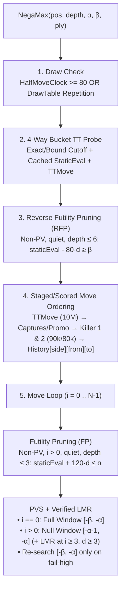
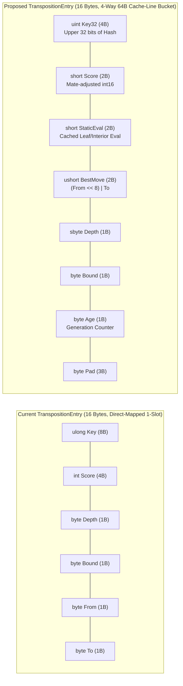

# Engine Improvements Plan (Based on `Checkers-Engine-main`)

## Executive Summary

We conducted a deep technical audit of Collin Kees's C checkers engine ([`Checkers-Engine-main/src/engine`](file:///c:/Udvikling/Spil/Checkers/Checkers-Engine-main/src/engine)) and compared its architecture, data structures, and empirical ablation notes against our current C# Bitboard engine in [`Checkers.Core`](file:///c:/Udvikling/Spil/Checkers/src/Checkers.Core).

Because we already migrated our board and move generator to 64-bit bitboards ([`BitPosition.cs`](file:///c:/Udvikling/Spil/Checkers/src/Checkers.Core/Engine/BitPosition.cs) and [`BitboardMoveGenerator.cs`](file:///c:/Udvikling/Spil/Checkers/src/Checkers.Core/Engine/BitboardMoveGenerator.cs)), our raw per-node throughput (**32.6M–34.7M nodes/s**) is already faster than the C engine's handcrafted/NNUE speed. However, **`Checkers-Engine-main` has a much more sophisticated search tree, move ordering pipeline, and cache-line-bucketed Transposition Table**, along with detailed ablation logs in [`board_search.c`](file:///c:/Udvikling/Spil/Checkers/Checkers-Engine-main/src/engine/board_search.c#L77-L230) showing exactly what reduces nodes in 8×8 Checkers (where average branching factor $b \approx 8$) and what fails.

Below are our concrete recommendations organized into the four areas from [`Possible engine improvements.md`](file:///c:/Udvikling/Spil/Checkers/Possible%20engine%20improvements.md) (excluding evaluation, which will be handled later).

---

## 1. Improvements to the Search (Node Reduction)

Currently, [`MinimaxPlayer.cs`](file:///c:/Udvikling/Spil/Checkers/src/Checkers.Core/AI/MinimaxPlayer.cs) uses basic NegaMax with full $[\alpha, \beta]$ windows on every move, no Killer or History heuristics (all quiet non-promoting moves tie at score `0` and are searched in square-index order), no selectivity/pruning, and no in-search repetition detection.

### 1A. Principal Variation Search (PVS / Null-Window Search) — *Exact, High Impact*
- **Reference:** [`board_search.c:1602-1658`](file:///c:/Udvikling/Spil/Checkers/Checkers-Engine-main/src/engine/board_search.c#L1602-L1658)
- **What it does:** Once the first move ($i = 0$, typically the TT move) has been searched with the full window $[-\beta, -\alpha]$, every subsequent move ($i > 0$ at `ply > 0`) is searched with a zero/null window $[-\alpha - 1, -\alpha]$ to prove it is inferior. Only if that null-window search fails high ($\text{score} > \alpha$ and $\text{score} < \beta$) do we re-search with the full window $[-\beta, -\alpha]$.
- **Why we should adopt it:** PVS is **mathematically exact** (never changes the minimax result when there are no reductions) and yields **15%–30% node reductions** immediately, scaling even higher once Killer and History heuristics improve move ordering.

### 1B. Killer Move Heuristic (2 per Ply) + History Heuristic (`[2][64][64]`) — *Exact, High Impact*
- **Reference:** [`killer_table.c`](file:///c:/Udvikling/Spil/Checkers/Checkers-Engine-main/src/engine/killer_table.c), [`board_search.c:739-800, 1705-1709`](file:///c:/Udvikling/Spil/Checkers/Checkers-Engine-main/src/engine/board_search.c#L739-L800)
- **What it does:**
  - **Killer Moves:** Stores 2 quiet (non-capture) moves per ply (`Killer1[ply]`, `Killer2[ply]`) that caused a $\beta$-cutoff at the same ply. Scored right below captures/promotions (`90,000` and `80,000`).
  - **History Table:** A flat array `int History[2 * 64 * 64]` indexed by `(sideToMove, move.From, move.To)`. When a quiet move causes a $\beta$-cutoff at depth $d$, increment `History[side, from, to] += d * d` (capped to `70,000` so it stays below Killer 2).
  - **Pre-scored Insertion Sort:** Just like [`order_moves` in `board_search.c:775-800`](file:///c:/Udvikling/Spil/Checkers/Checkers-Engine-main/src/engine/board_search.c#L775-L800), compute move scores once into a `Span<int> scores = stackalloc int[moveCount]` and sort `(moves, scores)` together instead of calling `ScoreMove()` $O(N^2)$ times inside the insertion sort loop.
- **Why we should adopt it:** Currently in [`MinimaxPlayer.cs:367-409`](file:///c:/Udvikling/Spil/Checkers/src/Checkers.Core/AI/MinimaxPlayer.cs#L367-L409), **every non-TT quiet move gets a score of `0`**, meaning quiet moves are searched in arbitrary board-index order. Adding Killer + History heuristics is the single biggest catalyst for faster $\beta$-cutoffs.

### 1C. In-Search Repetition Detection (`DrawTable`) — *Soundness & Tactical Accuracy*
- **Reference:** [`draw_table.c`](file:///c:/Udvikling/Spil/Checkers/Checkers-Engine-main/src/engine/draw_table.c), [`board_search.c:255-261, 1269-1277, 1797-1820`](file:///c:/Udvikling/Spil/Checkers/Checkers-Engine-main/src/engine/board_search.c#L1269-L1277)
- **What it does:** [`GameController.cs`](file:///c:/Udvikling/Spil/Checkers/src/Checkers.Core/GameController.cs) tracks 3-fold repetition in actual gameplay, and [`MinimaxPlayer.cs`](file:///c:/Udvikling/Spil/Checkers/src/Checkers.Core/AI/MinimaxPlayer.cs) checks the 40-move clock (`HalfMoveClock >= 80`), **but `MinimaxPlayer` currently has no repetition tracking along the search path or from game history**.
- **How `Checkers-Engine-main` solves it:** Uses a tiny, zero-allocation power-of-two direct-mapped hash table (or small ply-indexed Zobrist stack) seeded from the game's move history Since the last capture/man-advance, pushing `pos.Hash` before searching children and popping on return. If a position repeats along the search branch, it immediately returns `0` (draw) **before probing the TT**.
- **Why we should adopt it:** Prevents the engine from walking into a 3-fold repetition draw when winning, allows it to force a repetition draw when losing, and prevents false TT cutoffs across cyclical king paths.

### 1D. Verified Late Move Reductions (LMR) & Forward Pruning (RFP / FP) — *Selective, High Node Reduction*
- **Reference:** [`board_search.c:219-224, 283-294, 329-338, 1422-1492, 1546-1589`](file:///c:/Udvikling/Spil/Checkers/Checkers-Engine-main/src/engine/board_search.c#L1422-L1589)
- **Empirical Ablation from `board_search.c`:**
  1. **Late Move Reductions (LMR):** For quiet moves at `depth >= 3`, `ply >= 2`, and move index `i >= 3` where **neither side has a capture** (`!isCapture && !HasAnyCapture(nextPos)`), reduce initial null-window search depth by $R = 1$ ($+1$ if $i \ge 8$). If the reduced search beats $\alpha$, re-search at full depth $d - 1$.
  2. **Reverse Futility Pruning (RFP — `-5.9% nodes` in `board_search.c`):** At non-PV (`beta == alpha + 1`), quiet positions (`!hasCapture && !opponentHasCapture`) with `depth <= 6`, if `staticEval - margin * depth >= beta`, return `staticEval` without generating moves.
  3. **Futility Pruning (FP — `-14.6% nodes` in `board_search.c`):** At non-PV quiet nodes (`depth <= 3`, `i > 0`), if `staticEval + margin * depth <= alpha` and the move does not promote, skip the move.
- **Note on Margin Scaling:** Because `Checkers-Engine-main` uses `Man = 200` in its handcrafted eval whereas our [`EvaluationFunction.cs`](file:///c:/Udvikling/Spil/Checkers/src/Checkers.Core/AI/EvaluationFunction.cs) uses `Man = 100`, the C engine's margins (`RFP_MARGIN = 80`, `FP_MARGIN = 120`) translate to **`RFP_MARGIN = 40`** (0.4 men/ply) and **`FP_MARGIN = 60`** (0.6 men/ply) in our scale.

### 1E. What We Should *NOT* Port from Search (Proven Negative in `board_search.c`)
Collin Kees's ablation log in [`board_search.c:77-159`](file:///c:/Udvikling/Spil/Checkers/Checkers-Engine-main/src/engine/board_search.c#L77-L159) tested and rejected several chess heuristics that **hurt** 8×8 Checkers because the branching factor is only $\sim 8$:
- **Aspiration Windows:** `+3.2% nodes` (root fail-high/low re-searches cost more than the slightly narrower root window saves).
- **Late Move Pruning (LMP):** `-49 Elo` (Checkers often has only 5–8 quiet moves; hard-dropping moves 5+ without a reduction check is catastrophic in king endgames).
- **Counter-Move Table & History Malus / Ageing:** `+1.7%` to `+7.1% nodes` overhead with zero Elo gain.

---

## 2. Improvements to the Speed of the Engine (Move Generation & Data Structures)

### 2A. Why Our Bitboard Architecture Already Beats `Checkers-Engine-main` on Raw Speed
- `Checkers-Engine-main` originally maintained a separate `struct set* piece_loc` array alongside its bitboards (`add_set`/`remove_set` on every move), which its own comments in [`board_search.c:1016, 1508`](file:///c:/Udvikling/Spil/Checkers/Checkers-Engine-main/src/engine/board_search.c#L1016) later deprecated in favor of scanning bitboards directly with `tzcnt` and `own &= own - 1`.
- Furthermore, `Checkers-Engine-main` only implements English Checkers and models multi-jumps as **one hop per ply** (`forced_pos`), whereas our [`BitboardMoveGenerator`](file:///c:/Udvikling/Spil/Checkers/src/Checkers.Core/Engine/BitboardMoveGenerator.cs) supports all 3 variants (International/Brazilian flying kings, Russian mid-jump promotion, English 1-step) with complete full-turn moves and 48-byte stack copy-make at **32–35M nodes/s**.

### 2B. Actionable Speed Improvements We *Should* Adopt
1. **Zero-Allocation Set-Wise `HasAnyCapture(in BitPosition, CheckersVariant)` Fast-Path:**
   - **Reference:** [`board_eval.c:419-443`](file:///c:/Udvikling/Spil/Checkers/Checkers-Engine-main/src/engine/board_eval.c#L419-L443) (`has_any_jump`) and [`board_search.c:1019-1033`](file:///c:/Udvikling/Spil/Checkers/Checkers-Engine-main/src/engine/board_search.c#L1019-L1033).
   - **How it helps us in 3 places:**
     - **In `Quiescence`:** Most leaf nodes reached by `Quiescence` have **zero captures**. Calling a 4-shift bitmask test `HasAnyCapture` at the top of `Quiescence` lets quiet leaf nodes skip calling `GenerateCaptures` and allocating the `stackalloc BitMove[128]` buffer entirely!
     - **In `BitboardMoveGenerator.Generate`:** Currently, `Generate` always calls `GenerateCaptures` (which loops over pieces) to find out if `captureCount > 0`. If `HasAnyCapture` returns `false` (which is true in the vast majority of nodes), `Generate` can jump **straight to `GenerateQuietMoves`**!
     - **In LMR / RFP:** Provides an $O(1)$ tactical check (`!HasAnyCapture(in nextPos, variant)`) to verify whether a quiet move walks into an opponent jump.
2. **Packed `ushort` Move Identifier (`(From << 8) | To`) for Fast Comparisons:**
   - **Reference:** [`killer_table.c:6-10`](file:///c:/Udvikling/Spil/Checkers/Checkers-Engine-main/src/engine/killer_table.c#L6-L10), [`hash_table.c:89`](file:///c:/Udvikling/Spil/Checkers/Checkers-Engine-main/src/engine/hash_table.c#L89).
   - Packing `(From, To)` into a single `ushort` (`ushort PackedMove => (ushort)((From << 8) | To)`) reduces TT move and Killer move matching inside the hot move-ordering loop to a single 16-bit integer comparison.
3. **Wider Power-of-Two Timer Check Mask (`4095` or `8191`):**
   - **Reference:** [`board_search.c:1260`](file:///c:/Udvikling/Spil/Checkers/Checkers-Engine-main/src/engine/board_search.c#L1260) (`(evaler->nodes & 4095) == 0`).
   - At 33M nodes/s, checking `_searchTimer.ElapsedMilliseconds` every `1024` nodes queries the OS clock ~32,000 times per second. Widening the mask to `4095` (~8,000 checks/sec, i.e. 0.12 ms granularity) cuts timer syscall overhead by $4\times$ while still stopping within a fraction of a millisecond of `hardLimitMs`.

---

## 3. Improvements to Transposition Table Management (More Compact, Faster)

Comparing [`hash_table.c`](file:///c:/Udvikling/Spil/Checkers/Checkers-Engine-main/src/engine/hash_table.c) against our [`TranspositionTable.cs`](file:///c:/Udvikling/Spil/Checkers/src/Checkers.Core/AI/TranspositionTable.cs) reveals **four major architectural upgrades** we can make while keeping each entry at **16 bytes**:

### 3A. 4-Way Set-Associative 64-Byte Cache-Line Buckets (`NUMBER_OF_BUCKETS = 4`)
- **Reference:** [`hash_table.c:57-63, 295-351`](file:///c:/Udvikling/Spil/Checkers/Checkers-Engine-main/src/engine/hash_table.c#L57-L63)
- **Problem in our current TT:** Our [`TranspositionTable.cs`](file:///c:/Udvikling/Spil/Checkers/src/Checkers.Core/AI/TranspositionTable.cs) is **direct-mapped (1 entry per index)** with no generation/age field. In our deep TT benchmark, the 1M table suffered **142,781 destructive index collisions**!
- **How `hash_table.c` solves it:** Groups every 4 consecutive 16-byte entries into a **64-byte bucket (`index = (hash & bucketMask) << 2`)**, which fits inside **a single 64-byte CPU cache line**:
  - **On `Probe`:** Scans the 4 entries in the bucket (`entries[baseIdx + 0 .. 3]`). Because all 4 entries reside in the *same* CPU cache line already fetched from RAM, scanning 4 slots has virtually **zero extra memory latency**!
  - **On `Store`:**
    1. If the same position (`Key32`) is already in one of the 4 slots, update it in place (preserving `BestMove` on fail-low and `StaticEval` if already known).
    2. Otherwise, pick the lowest-priority victim among the 4 slots using an **Age + Depth + Exact-Bound Protection** formula:
       $$\text{Priority}(e) = e.\text{Depth} - 8 \cdot \text{Staleness}(e.\text{Age}) + \begin{cases} 4 & \text{if } e.\text{Bound} = \text{Exact} \\ 0 & \text{otherwise} \end{cases}$$
       where entries from previous moves (`Staleness > 0`) are penalized so fresh search entries smoothly evict stale ones without ever needing to `Array.Clear()` the table between moves!

### 3B. Packing `Key32`, `short Score`, `short StaticEval`, and `byte Age` into 16 Bytes
- **Reference:** [`hash_table.c:80-95, 295-310`](file:///c:/Udvikling/Spil/Checkers/Checkers-Engine-main/src/engine/hash_table.c#L80-L95)
- By storing `uint Key32 = (uint)(hash >> 32)` (upper 32 bits, since the lower 18–22 bits already index the bucket, giving 50–54 bits of total hash verification) and narrowing `WinScore` from `100,000` to `29,000` so all scores fit in `short` (`int16`), we free **6 bytes** inside our 16-byte struct!
- We use those freed bytes to store:
  1. **`short StaticEval`** (`NoEval = 32000` sentinel): Caches the raw `EvaluationFunction.Evaluate` result right inside the TT entry so re-probed nodes (and RFP/FP checks) never recompute static evaluation!
  2. **`byte Age`**: Tracks which search turn wrote the entry, enabling non-destructive multi-turn TT persistence without clearing the table on every turn.

### 3C. Hardware Cache Prefetching (`Sse.Prefetch0`)
- **Reference:** [`hash_table.c:273-288`](file:///c:/Udvikling/Spil/Checkers/Checkers-Engine-main/src/engine/hash_table.c#L273-L288), [`board_search.c:1538`](file:///c:/Udvikling/Spil/Checkers/Checkers-Engine-main/src/engine/board_search.c#L1538)
- Right after `BitPosition nextPos = pos.Apply(in move)` computes `nextPos.Hash` in the move loop, calling ` _tt.Prefetch(nextPos.Hash)` (using `System.Runtime.Intrinsics.X86.Sse.Prefetch0` when supported by the CPU) starts fetching the child's 64-byte TT bucket into L1 cache while the CPU is still doing repetition and LMR checks.

---

## 4. Other Improvements (Excluding Static Evaluation)

### 4A. Partial-Iteration Root Move Adoption on Timeout (`USE_PARTIAL_ITERATION`)
- **Reference:** [`board_eval.c:110-126`](file:///c:/Udvikling/Spil/Checkers/Checkers-Engine-main/src/engine/board_eval.c#L110-L126), [`board_search.c:182-202, 1694-1697, 1859-1876`](file:///c:/Udvikling/Spil/Checkers/Checkers-Engine-main/src/engine/board_search.c#L1859-L1876)
- **Problem in our current engine:** In [`MinimaxPlayer.cs:240`](file:///c:/Udvikling/Spil/Checkers/src/Checkers.Core/AI/MinimaxPlayer.cs#L240), if depth $d$ runs out of time (`_abortSearch == true`) after searching 3 out of 7 root moves, **the entire depth-$d$ iteration is thrown away**, even if move #1 (the previous best move) finished and move #2 or #3 beat it with a strictly better depth-$d$ score!
- **Why adopting partial iterations works:** Because root move #0 is always the previous iteration's best move (`_currentBestMove`), as soon as move #0 completes at depth $d$, any subsequent root move that finishes before timeout and raises $\alpha$ has proven itself strictly superior at depth $d$. Committing `bestEntryThisDepth` whenever at least one root move has completed (`completedRootMoves > 0` and `!_abortSearch` at the moment it raised $\alpha$) salvages up to 50%–70% of thinking time that is currently discarded on timeout.

### 4B. Early Root Termination on Single Viable Move (`only_viable_move`)
- **Reference:** [`board_search.c:1744-1756, 1931-1934`](file:///c:/Udvikling/Spil/Checkers/Checkers-Engine-main/src/engine/board_search.c#L1744-L1756)
- When searching with a time budget at depth $\ge 8$, if one root move scores significantly higher (e.g., $\ge 150\text{ cp}$, or 1.5 men) than every alternative root move for two consecutive iterations, the engine can terminate early rather than burning the rest of the soft time budget on an obvious forced recapture or winning combination.

### 4C. Optional: Opening Book (`book_moves.txt`) & Endgame Tablebases (`endgame_db.c`)
- [`Checkers-Engine-main/src/engine/book_moves.txt`](file:///c:/Udvikling/Spil/Checkers/Checkers-Engine-main/src/engine/book_moves.txt) contains pre-computed master opening sequences for English Checkers, and [`endgame_db.c`](file:///c:/Udvikling/Spil/Checkers/Checkers-Engine-main/src/engine/endgame_db.c) implements 2-bit WLD / 1-byte DTW colex-ranked endgame tablebases (requiring external `.bin` tablebase files).

---

## Summary Comparison & Expected Impact

| Category | Improvement | Complexity | Expected Impact | Affects Exactness? |
| :--- | :--- | :---: | :--- | :---: |
| **1. Search** | **1A. Principal Variation Search (PVS)** | Low | **-15% to -30% nodes** | Exact |
| **1. Search** | **1B. Killer (2/ply) + History (`[2][64][64]`) + Pre-scored Sort** | Low–Med | **-25% to -45% nodes** (synergizes with PVS) | Exact |
| **1. Search** | **1C. In-Search Repetition `DrawTable`** | Low | Prevents repetition blunders & unsound TT cycles | Exact / Sounder |
| **1. Search** | **1D. Verified LMR + Futility (FP) + Reverse Futility (RFP)** | Medium | **-35% to -60% nodes** (+1 to +3 plies deeper) | Selective |
| **2. Speed** | **2A. Set-Wise `HasAnyCapture` Fast-Path (Quiescence & MoveGen)** | Low | **+10% to +20% nodes/s** (skips leaf capture allocs) | Exact |
| **2. Speed** | **2B. Packed `ushort` Move ID + `4095` Timer Mask** | Low | **+3% to +5% nodes/s** | Exact |
| **3. TT** | **3A. 4-Way 64B Cache-Line Buckets + Age/Depth/PV Replacement** | Medium | Eliminates 1-slot collisions; persists across turns | Exact |
| **3. TT** | **3B. 16B Entry with `Key32`, `short Score`, `short StaticEval`, `Age`** | Medium | Avoids redundant `Evaluate()` calls; same 16B footprint | Exact |
| **3. TT** | **3C. Hardware Prefetch (`Sse.Prefetch0`)** | Low | **+5% to +10% speed** on large (16M) TT | Exact |
| **4. Other** | **4A. Partial-Iteration Root Move Adoption on Timeout** | Low | Salvages unfinished final depth iteration in timed games | Sound |
